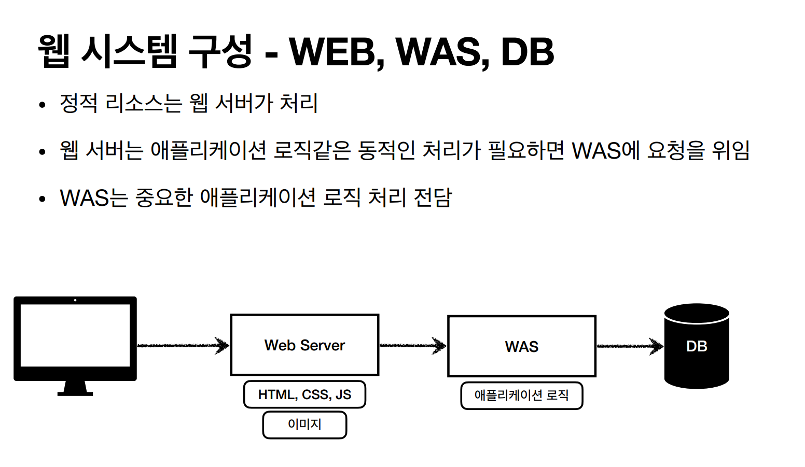
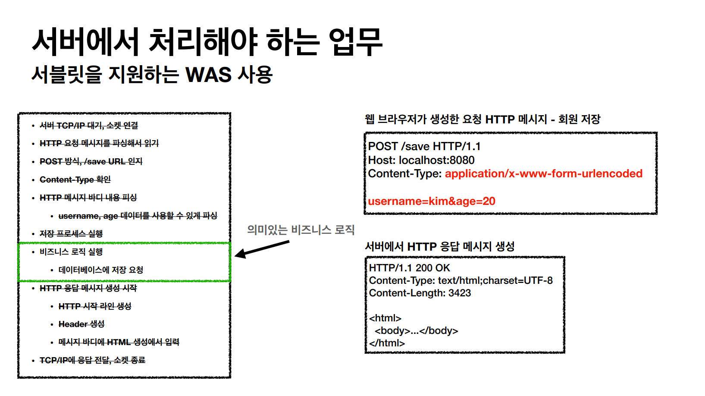
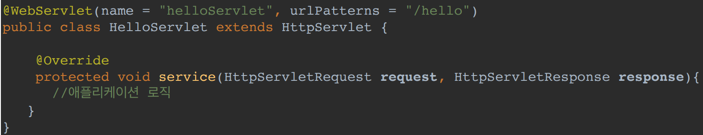
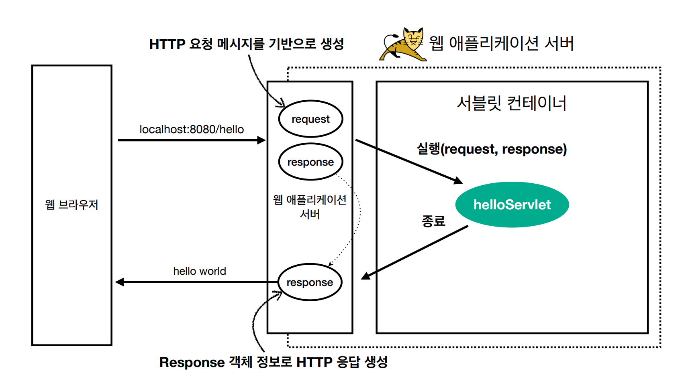
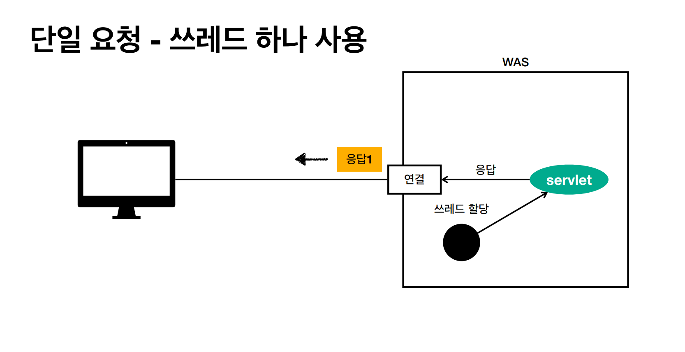
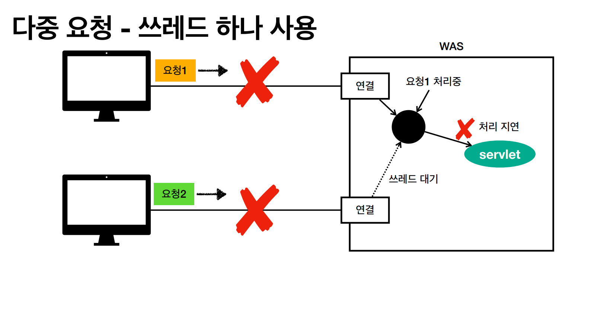
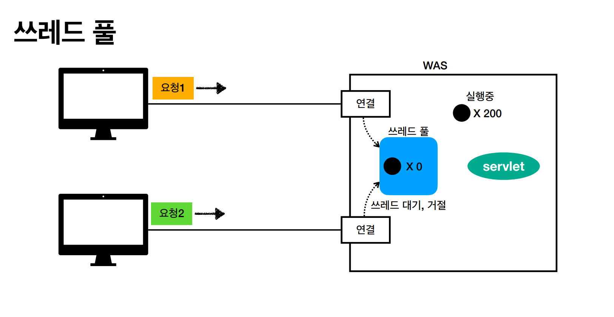
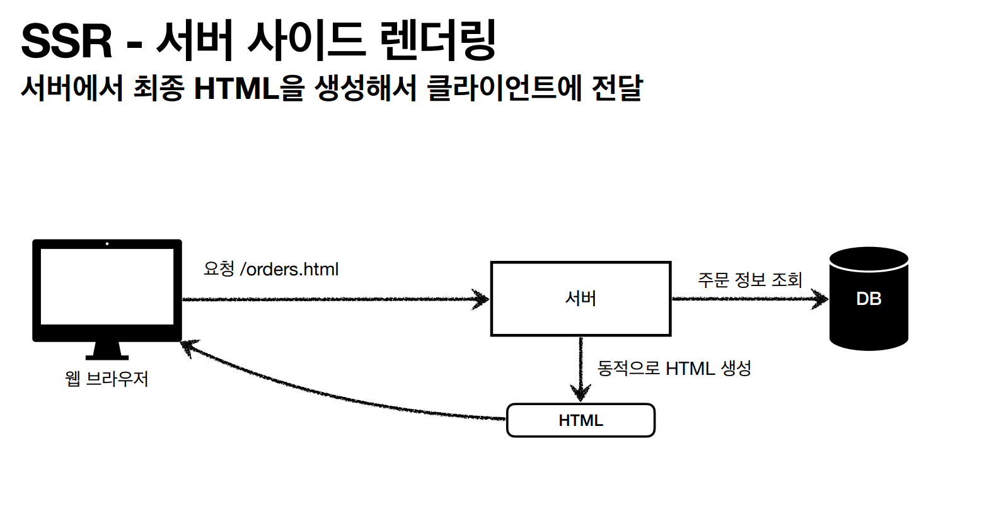

# Web Application

## 웹 서버(Web Server)
> HTTP 기반으로 동작하며, HTML이나 CSS, JS 같은 정적 리소스나 기타 부가 기능을 제공해준다.

NGINX, APACHE 등

## 웹 애플리케이션 서버(WAS - Web Application Server)
> 웹 서버 기능에 프로그램 코드를 실행해서 애플리케이션 로직을 수행한다. 
> 동적 HTML, HTTP API(JSON), 서블릿, JSP, 스프링 mvc 등을 WAS에서 제공

톰캣(Tomcat), Jetty, Undertow 등

WAS는 애플리케이션 코드를 실행하는 데 더 특화돼있다.

자바는 보통 서블릿 컨테이너 기능을 제공하면 WAS라고 부른다.

WAS에게 애플리케이션 로직과 함께 정적 리소스를 전달하는 역할까지 갖게 되면 너무 많은 역할이 있어 쉽게 부하가 생길 수 있다.

그래서 보통은 WAS 앞에 Web Server를 두어 WAS는 중요한 애플리케이션 로직만 처리하고 정적인 리소스만 응답하는 것은 Web Server에 맡긴다.

이러한 구조는 효율적으로 리소스 관리가 가능하다.

예를 들어 정적 리소스가 많이 사용되면 Web Server를 증설하고,
애플리케이션 리소스가 많이 사용되면 WAS를 증설하면 된다.

또한 Web Server는 정적 리소스만 제공하기 때문에 쉽게 죽지 않는다. 그래서 WAS에서 장애가 일어났을 때 Web Server에서 오류 화면을 제공해줄 수 있다.

 

## 서블릿(Servlet)
만약 HTML Form으로 회원가입 요청이 오면 서블릿이 의미있는 비즈니스 로직을 제외하고 모든 부가 작업을 해준다.

**특징**
- urlPatterns의 URL이 호출되면 서블릿 코드가 실행된다.
- HTTP 요청과 응답 정보를 편리하게 사용하고 제공할 수 있는 ``HttpServletRequest``, ``HttpServletResponse``를 파라미터로 받을 수 있다.
- 개발자는 HTTP 스펙을 매우 편리하게 사용할 수 있다.

HTTP 요청 시
- WAS는 Request, Response 객체를 새로 만들어서 서블릿 객체를 호출한다.
- 개발자는 Request 객체에서 HTTP 요청 정보를 편리하게 꺼내서 사용할 수 있다.
- 또한 개발자는 Response 객체에서 HTTP 응답 정보를 편리하게 입력할 수 있다.
- WAS는 Response 객체에 담겨 있는 내용으로 HTTP 응답 정보를 생성해준다.

 

## 서블릿 컨테이너
> 톰캣처럼 서블릿을 지원하는 WAS를 서블릿 컨테이너라고 한다.
- 서블릿 객체를 생성, 초기화, 호출, 종료하는 생명주기를 관리한다.
- **서블릿 객체는 싱글톤으로 관리된다.**
  - 요청이 올 때마다 객체를 생성하는 것은 비효율적이다.
  - 최초 로딩 시점에 서블릿 객체를 미리 만들어두고 재활용한다.
  - 모든 고객 요청은 동일한 서블릿 객체 인스턴스에 접근한다.
  - **공유 변수 사용에 주의해야 한다.**
  - 서블릿 컨테이너 종료시 함께 종료된다.
- 동시 요청을 위한 멀티 쓰레드 처리를 지원한다.

 

## 동시 요청 - 멀티 쓰레드
- 쓰레드
  - 애플리케이션 코드를 하나하나 순차적으로 실행하는 것
  - 자바 main 메서드를 처음 실행하면 main이라는 이름의 쓰레드가 실행된다.
  - 쓰레드가 없다면 자바 애플리케이션 실행이 불가능하다.
  - 쓰레드는 한번에 하나의 코드 라인만 수행한다.
  - 동시 처리가 필요하면 쓰레드를 추가로 생성해줘야 한다.

만약 쓰레드를 하나 사용했을 때 단일 요청이 온다면 단순히 쓰레드를 할당하고 서블릿 호출 후 응답을 보내주면 될 것이다.

그런데 만약 쓰레드는 하나고 다중 요청이 왔을 때 처리1에서 처리 지연이 난다면 결국 두 개의 처리 모두 처리를 못 할 것이다.

대안은 요청마다 쓰레드를 생성해 주는 것이다. 당연히 장단점이 있다.

- 장점
  - 동시 요청 처리 가능
  - 리소스(CPU, 메모리)가 허용할 때까지 처리가 가능하다.
  - 하나의 쓰레드가 지연되어도, 나머지 쓰레드는 정상 동작한다.
- 단점
  - 쓰레드 생성 비용은 매우 비싸다.
    - 응답 속도가 늦어진다.
  - 쓰레드는 컨텍스트 스위칭 비용이 발생한다.
  - 쓰레드 생성에 제한이 없다.
    - 요청이 너무 많이 오면 CPU, 메모리 임계점을 넘어서 서버가 죽을 수 있다.

그래서 **쓰레드 풀**이라는 곳에 미리 쓰레드를 생성해 놓고 사용하고 반납하는 방식으로 이루어진다. 설정해 둔 쓰레드의 개수보다 많은 동시 요청이 온다면
특정 숫자만큼만 대기를 시킬지 거절을 할지 정할 수 있다.

쓰레드 풀의 장점
- 쓰레드가 미리 생성되어 있어 쓰레드를 생성하고 종료하는 비용(CPU)이 절약되고 응답 시간이 빠르다.
- 생성 가능한 쓰레드의 최대치가 있으므로 너무 많은 요청이 들어와도 기존 요청은 안전하게 처리할 수 있다.

쓰레드 풀의 최대 쓰레드 설정은 성능에 있어서 매우 중요하다.

너무 낮게 설정하면 서버 리소스는 여유롭지만, 클라이언트는 금방 응답이 지연된다.

너무 높게 설정하면 CPU, 메모리 리소스 임계점 초과로 서버가 다운될 수 있다.

> 멀티 쓰레드에 대한 부분은 WAS가 처리를 해주기 때문에 개발자는 멀티 쓰레드 관련 코드를 신경쓰지 않아도 된다. 
> 마치 싱글 쓰레드 프로그래밍을 하듯이 개발하면 되는데 주의할 점은 싱글톤 객체(공유 변수 등)는 주의해서 사용해야 한다.

 

## HTML, HTTP API, CSR, SSR

### HTML
> 서버에서 HTML 파일을 전송할 때는 정적 리소스인 경우에는 Web Server에서 이미 생성된 리소스 파일을 그대로 보내주면 되고, DB에서 나온 결과로
> 동적인 화면을 응답할 때에는 WAS에서 JSP, 타임리프 등을 이용하여 HTML파일을 생성해서 전달해준다.

### HTTP API
> HTML이 아니라 데이터를 주로 JSON 형식을 사용하여 전달한다. 데이터만 주고 받으며 UI 화면이 필요하면 클라이언트가 별도로 처리한다.
> 앱, 웹, 서버to서버 등 다양한 시스템에서 호출한다.

백엔드 개발자는 주로 정적 리소스, 동적 리소스, HTTP API 제공에 대해 고민해야 한다.

### SSR - Server Side Rendering
> 서버에서 최종 HTML을 생성해서 클라이언트에 전달한다.

### CSR - Client Side Rendering
> HTML 결과를 자바스크립트를 사용해 웹 브라우저에서 동적으로 생성해서 적용한다.

