# ExceptionHandlerExceptionResolver

- `ExceptionHandlerExceptionResolver`는 스프링 MVC의 예외 처리 메커니즘 중 가장 널리 사용되는 구현체로 컨트롤러 내부 또는 전역에서
`@ExceptionHandler`로 정의된 메서드를 호출하여 예외를 처리한다.
- REST API 에서는 요청 데이터나 비즈니스 로직에 따라 오류 정보를 세밀하게 제어해야 하는 경우가 많은데 이런 동적이고 유연한
예외가 처리가 가능하다.
- 특정 컨트롤러와 밀접하게 연결된 예외 처리 뿐 아니라 `@ControllerAdvice`를 사용하여 모든 컨트롤러에서 공통적인 예외 처리 로직을
적용할 수 있다.

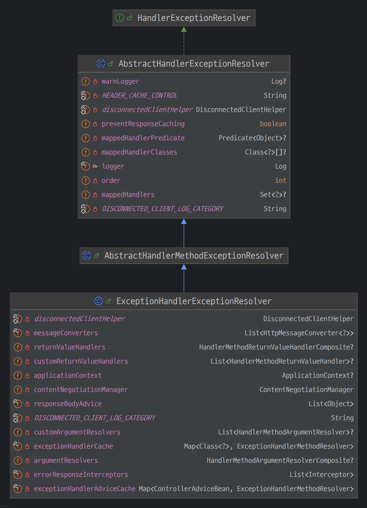

---

## @ExceptionHandler

- `@ExceptionHandler`는 컨트롤러에 특정 예외를 처리하기 위한 메서드를 정의할 때 사용하는 어노테이션이다.
- `ExceptionHandlerExceptionResolver` 클래스를 통해 실행되며 컨트롤러 클래스에서만 작동하거나 `@ControllerAdvice`와 함께 사용하여
애플리케이션 전역적으로 동작하도록 설정할 수 있다.

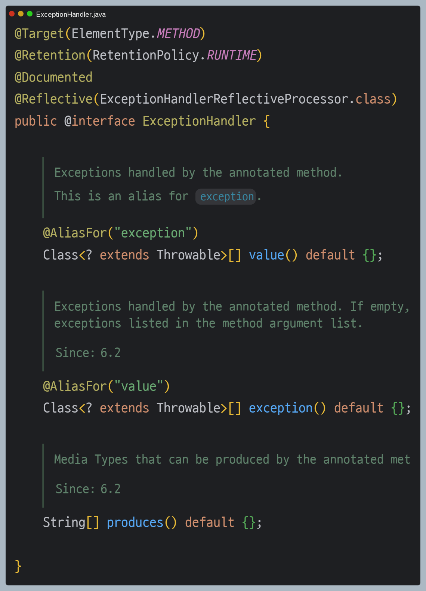

> 어떤 예외를 처리할 지 한 개 이상 지정할 수 있으며, 지정하지 않으면 메서드 매개변수에 지정된 예외를 기본적으로 처리한다.

컨트롤러
```java
@RestController
@Slf4j
public class ApiExceptionV2Controller {

    @ResponseStatus(HttpStatus.BAD_REQUEST)
    @ExceptionHandler(IllegalArgumentException.class)
    public ErrorResult illegalExHandler(IllegalArgumentException e) {
        log.error("[exceptionHandler] ex", e);
        return new ErrorResult("BAD", e.getMessage());
    }
    
    @ExceptionHandler
    public ResponseEntity<ErrorResult> userExHandler(UserException e) {
        log.error("[exceptionHandler] ex", e);
        ErrorResult errorResult = new ErrorResult("USER-EX", e.getMessage());
        return new ResponseEntity<>(errorResult, HttpStatus.BAD_REQUEST);
    }

    @ResponseStatus(HttpStatus.INTERNAL_SERVER_ERROR)
    @ExceptionHandler
    public ErrorResult exHandler(Exception e) {
        log.error("[exceptionHandler] ex", e);
        return new ErrorResult("EX", "내부 오류");
    }

    @GetMapping("/api2/members/{id}")
    public MemberDto getMember(@PathVariable("id") String id) {

        switch (id) {
            case "ex" -> throw new RuntimeException("잘못된 사용자");
            case "bad" -> throw new IllegalArgumentException("잘못된 입력 값");
            case "user-ex" -> throw new UserException("사용자 오류");
        }

        return new MemberDto(id, "hello " + id);
    }

    @Data
    @AllArgsConstructor
    public static class ErrorResult {
        private String code;
        private String message;
    }

    @Data
    @AllArgsConstructor
    public static class MemberDto {
        private String memberId;
        private String name;
    }
}
```
`@ExceptionHandler` 어노테이션을 선언하고 해당 컨트롤러에서 처리하고 싶은 예외를 지정한다. 해당 컨트롤러에서 예외가 발생하면 이 메서드가 호출된다.
지정한 예외 또는 그 예외의 자식 클래스는 모두 잡을 수 있다. 당연히 항상 자세한 것이 우선권을 가진다. 
예를 들어 컨트롤러에서 `RuntimeException` 예외가 발생하면 `RuntimeException`은 `Exception`의 자식 클래스 이기 때문에 `exHandler` 메서드가 호출된다.

다음과 같이 다양한 예외를 한 번에 처리할 수도 있다.
```java
@ExceptionHandler({AException.class, BException.class}) 
public String ex(Exception e) {
    log.info("exception e", e); 
}
```

- `@ExceptionHandler`에 예외를 생략하면 메서드 파라미터의 예외가 지정된다. (`UserException`같은 경우)
- `@ExceptionHandler`는 다양한 파라미터와 응답을 지정할 수 있다. ([참고 - 공식 매뉴얼](https://docs.spring.io/spring-framework/reference/web/webmvc/mvc-controller/ann-exceptionhandler.html#mvc-ann-exceptionhandler-args))

예를 들어 `/api2/members/bad`를 호출 했을 때 실행 흐름
1. 컨트롤러를 호출한 결과 `IllegalArgumentException` 예외가 컨트롤러 밖으로 던져진다.
2. 예외가 발생했으므로 `ExceptionResovler`가 작동한다. 이 때 가장 우선순위가 높은 `ExceptionHandlerExceptionResolver`가 실행된다.
3. `ExceptionHandlerExceptionResolver`는 해당 컨트롤러에 `IllegalArgumentException`를 처리할 수 있는 `@ExceptionHandler`가 있는지 확인한다.
4. `illegalExHandler()`를 실행한다. `@RestController`이므로 HTTP 컨버터가 사용돼 응답이 JSON으로 반환된다.
   - `@ResponseStatsu`를 지정했으므로 HTTP 상태 코드 400으로 응답한다.

---

## ExceptionHandlerMethodResolver

- 주어진 클래스와 해당 클래스의 모든 상위 클래스에서 `@ExceptionHandler` 메서드를 찾아내어 선언된 예외와 메서드를 매핑하는 역할을 한다.
- `ExceptionHandlerExceptionResolver`는 **ExceptionHandlerMethodResolver**에서 찾아낸 메서드를 호출하는 구조로 되어 있다.

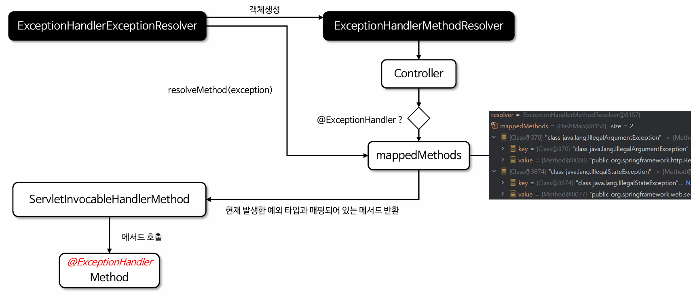

### 주요 내부 코드

`ExceptionHandlerMethodResolver` 클래스의 생성자에서 특정 핸들러를 받아서 `@ExceptionHandler` 어노테이션이 선언된
메서드를 찾아서 보관한다.

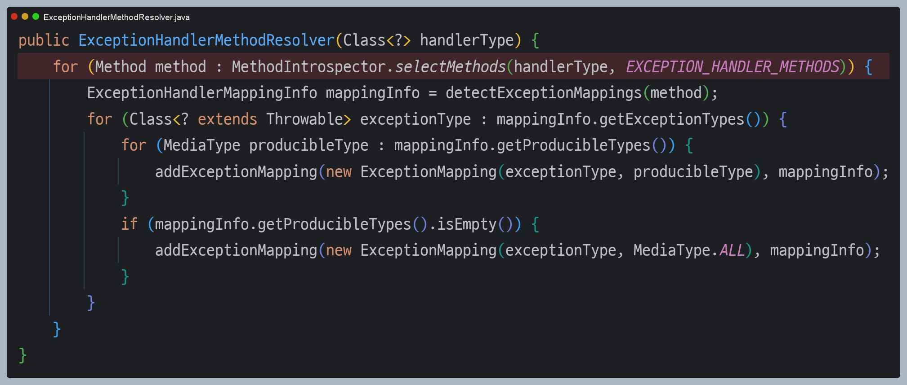

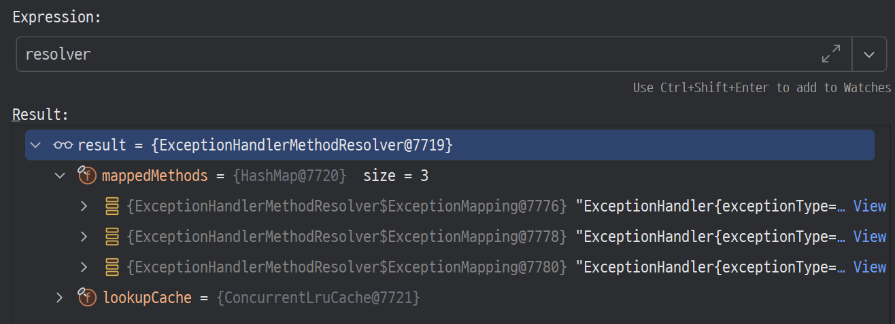

---

## ExceptionHandlerExceptionResolver 구조

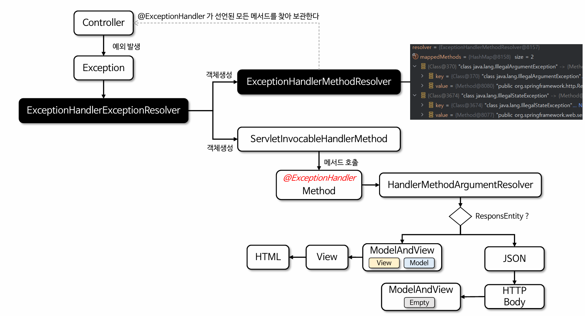

### 주요 내부 코드

1. `ExceptionHandlerMethodResolver` 객체를 생성하고, 이 객체를 사용해 예외를 처리할 메서드를 호출할 수 있는 
`ServletInvocableHandlerMethod` 객체를 생성한다.
   - 해당 메서드의 파라미터와 반환 값을 처리할 수 있어야 하기 때문에 `ArguementResolver`와 `ReturnValueHandler`를 설정한다. 

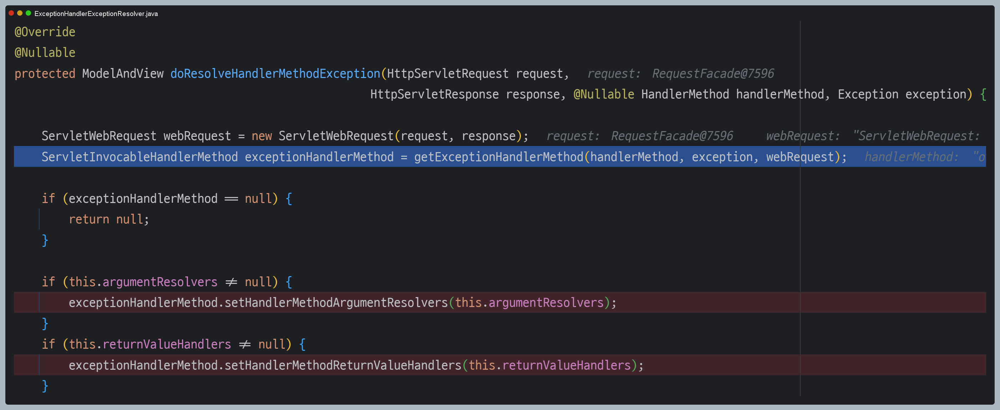

- 다음은 `getExceptionHandlerMethod()` 메서드의 코드 일부이다.
- `ExceptionHandlerMethodResolver` 객체를 생성하는 작업은 최초 예외 시 한번만 호출된다. 이후 같은 예외는 내부 캐시에
저장되어 있는 객체를 사용한다.
- 그리고 위 부분은 핸들러 내부의 `@ExceptionHandler`를 적용하는 것이고, 밑 부분은 `@ControllerAdvice`의 `@ExceptionHandler`를
적용하는 것이다.
- 즉 핸들러 내부가 우선 순위가 더 높은 것을 확인할 수 있다.

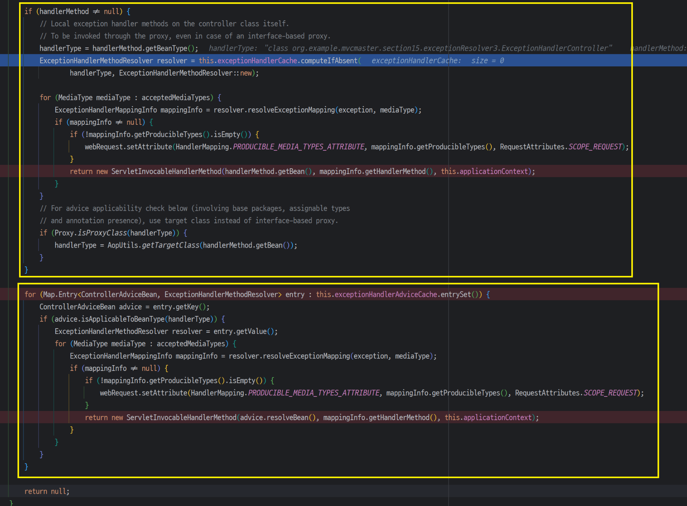

2. 리플렉션을 사용해 실제 `@ExceptionHandler` 메서드를 호출한다.

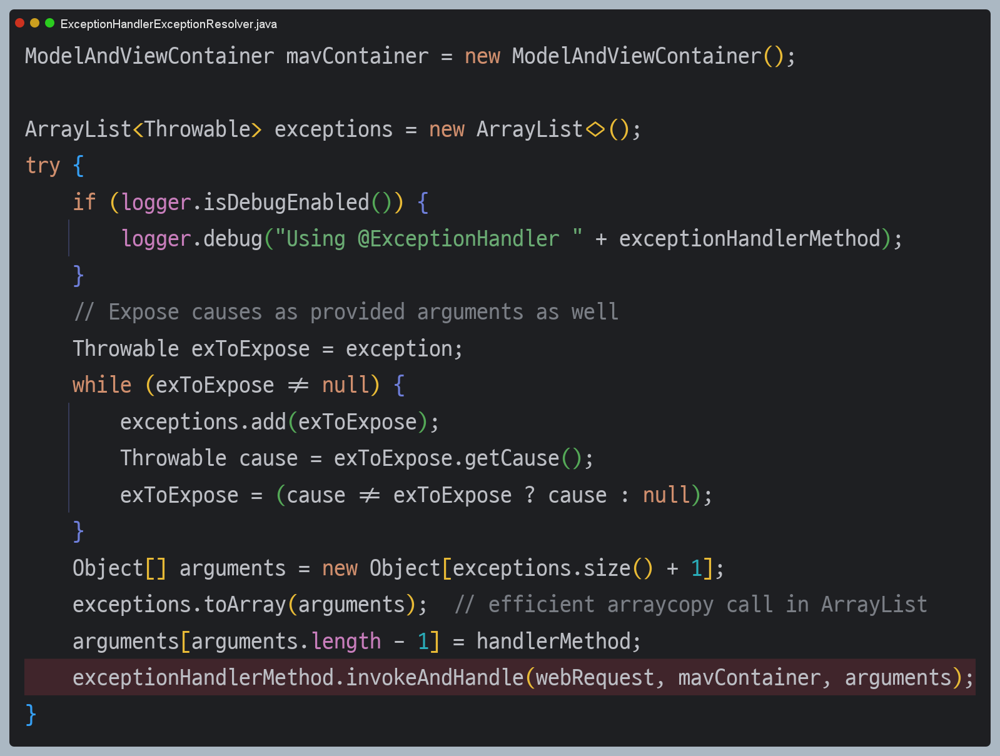

3. `@ExceptionHandler` 메서드의 반환 결과에 따라 HTTP 본문 응답 또는 뷰 응답 정보를 반환한다.

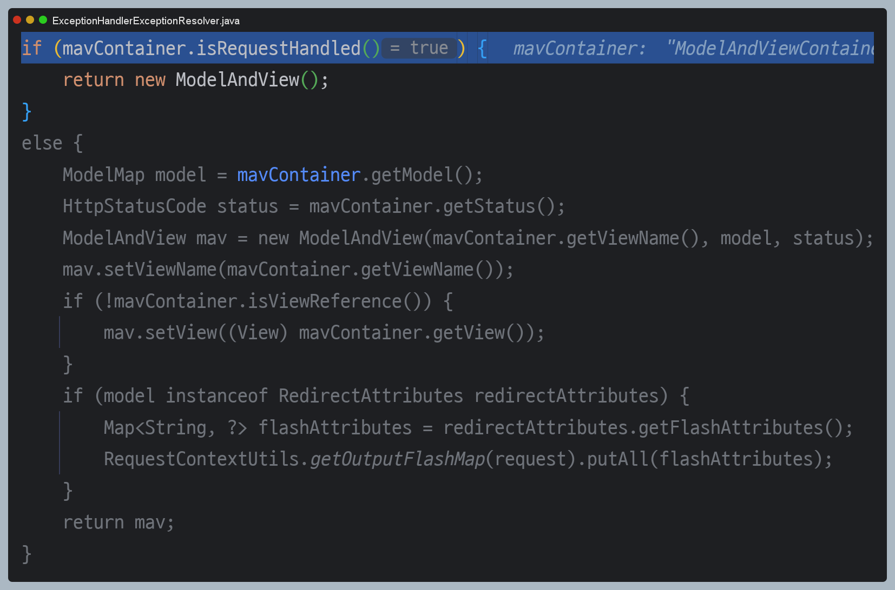

---

# @ControllerAdvice

- `@ControllerAdvice`는 여러 컨트롤러에서 발생하는 예외를 전역적으로 처리할 수 있는 어노테이션으로, `ExceptionHandlerExceptionResolver` 클래스와
결합하여 작동한다.
- `@ControllerAdvice`를 사용하면 애플리케이션의 모든 컨트롤러에서 발생하는 예외를 하나의 클래스에서 통합적으로 처리할 수 있으며
이를 통해 중복 코드를 제거하고 예외 흐름을 컨트롤러로부터 분리할 수 있어 유지보수에도 유리하다.

**@ControllerAdvice 사용 예**
```java
@Slf4j
@RestControllerAdvice
public class ExControllerAdvice {

    @ResponseStatus(HttpStatus.BAD_REQUEST)
    @ExceptionHandler(IllegalArgumentException.class)
    public ErrorResult illegalExHandler(IllegalArgumentException e) {
        log.error("[exceptionHandler] ex", e);
        return new ErrorResult("BAD", e.getMessage());
    }

    @ExceptionHandler
    public ResponseEntity<ErrorResult> userExHandler(UserException e) {
        log.error("[exceptionHandler] ex", e);
        ErrorResult errorResult = new ErrorResult("USER-EX", e.getMessage());
        return new ResponseEntity<>(errorResult, HttpStatus.BAD_REQUEST);
    }

    @ResponseStatus(HttpStatus.INTERNAL_SERVER_ERROR)
    @ExceptionHandler
    public ErrorResult exHandler(Exception e) {
        log.error("[exceptionHandler] ex", e);
        return new ErrorResult("EX", "내부 오류");
    }
}
```

> - `@ControllerAdvice`는 예외 처리 외에도 `@ModelAttribute`나 `@InitBinder`와 함께 사용할 수 있다.
> - 이 어노테이션을 `@ControllerAdvice`와 함께 사용하면 항상 메서드 실행 전에 컨트롤러의 모든 요청에 공통적으로 피룡한 데이터를 추가하거나,
> 요청 파라미터를 특정 형식으로 변환하거나 검증 로직을 적용할 수 있다.
> - 그리고 여러 개의 `@ControllerAdvice`가 선언된 클래스에서 동일한 예외 타입이 선언되어 있을 경우 어떤 클래스가 더 우선 순위가 높은지
>   명시하기 위해 `@Order` 어노테이션을 사용할 수 있다. (숫자가 낮을수록 높은 우선 순위)

**컨트롤러**
```java
@RestController
@Slf4j
public class ApiExceptionV2Controller {

    @GetMapping("/api2/members/{id}")
    public MemberDto getMember(@PathVariable("id") String id) {

        switch (id) {
            case "ex" -> throw new RuntimeException("잘못된 사용자");
            case "bad" -> throw new IllegalArgumentException("잘못된 입력 값");
            case "user-ex" -> throw new UserException("사용자 오류");
        }

        return new MemberDto(id, "hello " + id);
    }

    @Data
    @AllArgsConstructor
    public static class MemberDto {
        private String memberId;
        private String name;
    }
}
```

`@ControllerAdvice`의 속성을 사용해 대상 컨트롤러를 적절하게 선택할 수 있다.

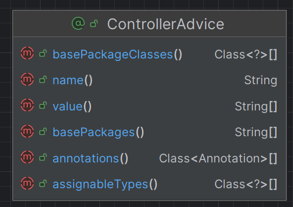

```java
// Target all Controllers annotated with @RestController
@ControllerAdvice(annotations = RestController.class)
public class ExampleAdvice1 {}

// Target all Controllers within specific packages
@ControllerAdvice("org.example.controllers")
public class ExampleAdvice2 {}

// Target all Controllers assignable to specific classes
@ControllerAdvice(assignableTypes = {ControllerInterface.class, AbstractController.class})
public class ExampleAdvice3 {}
```
- 특정 어노테이션이 있는 컨트롤러 지정, 특정 패키지를 직접 지정(해당 패키지와 그 하위에 있는 컨트롤러가 대상이 된다.), 특정 클래스를 지정할 수도 있다.
- 대상 컨트롤러 지정을 생략하면 모든 컨트롤러에 글로벌 하게 적용된다.

## @ControllerAdvice 초기화 및 처리 과정

### @ModelAttribute , @InitBinder 초기화

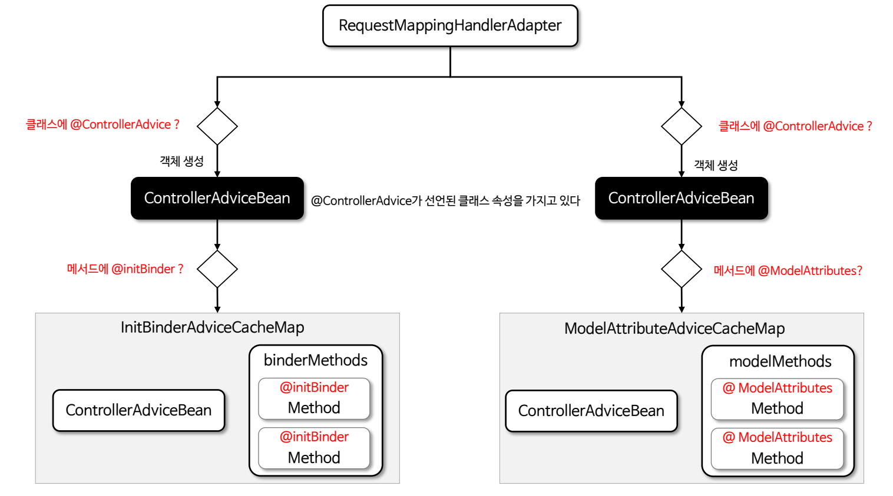

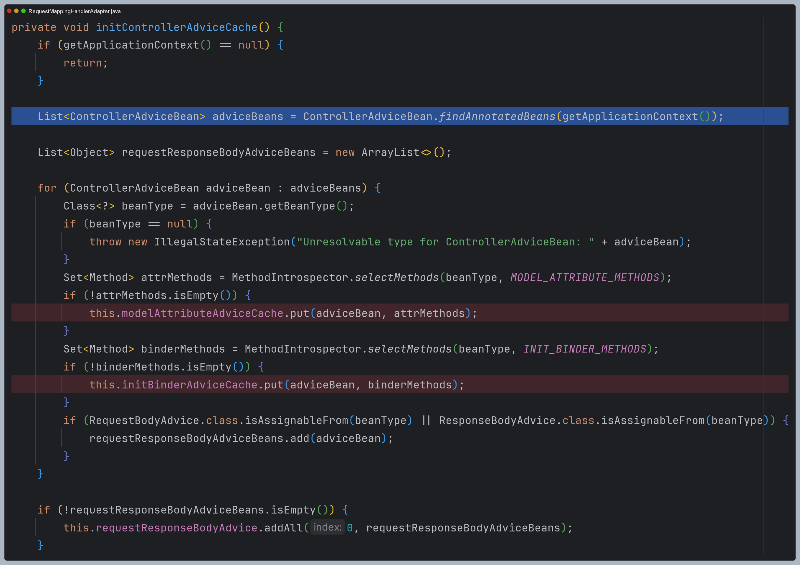

### @ModelAttribute , @InitBinder 처리

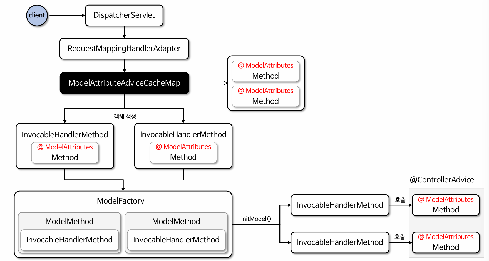

### @ExceptionHandler 초기화

`ExceptionHandlerExceptionResolver` 클래스는 초기화 시 `@ControllerAdvice` 대상 컨트롤러를 탐색하고 **ControllerAdviceBean** 객체와
**ExceptionHandlerMethodResolver** 객체를 매핑한다.

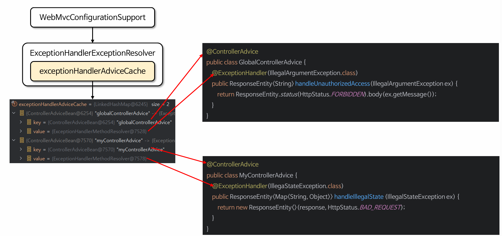

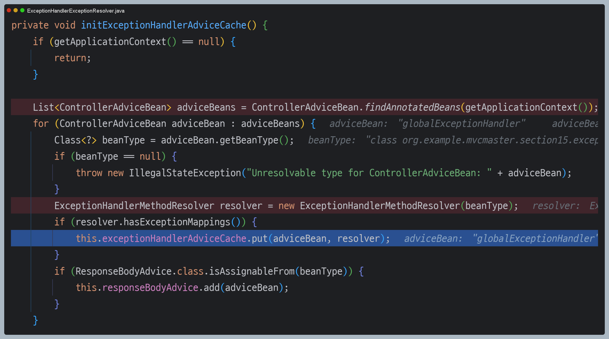

### @ExceptionHandler 처리

앞선 초기화 과정에서 `exceptionHandlerAdviceCache`에 매핑된 **ControllerAdviceBean** 객체와
**ExceptionHandlerMethodResolver** 객체를 참조해서 예외 메서드를 호출한다.

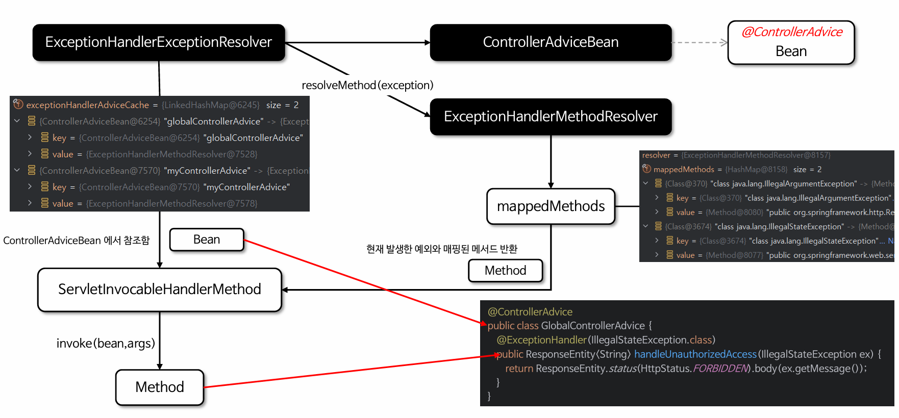

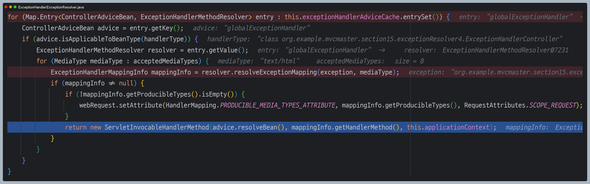