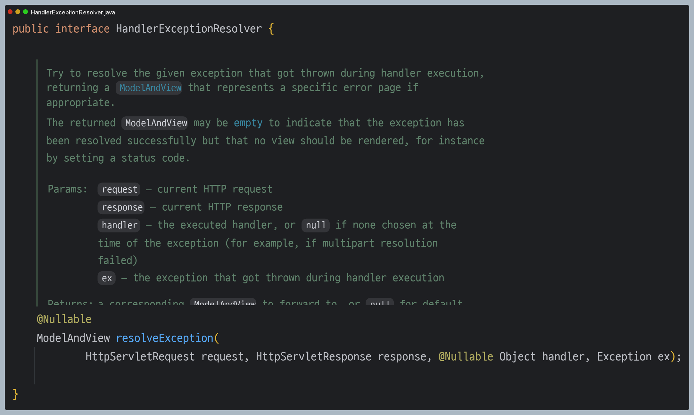
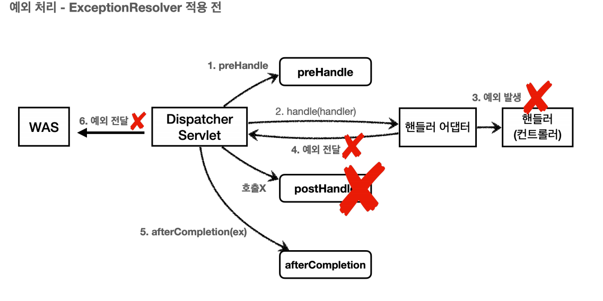
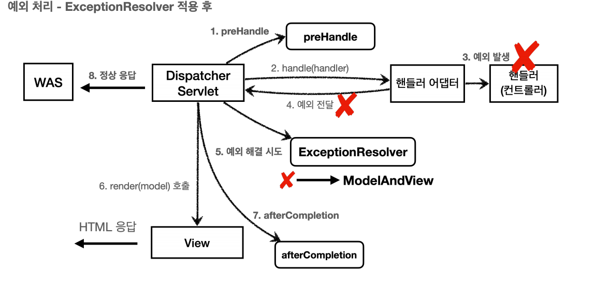
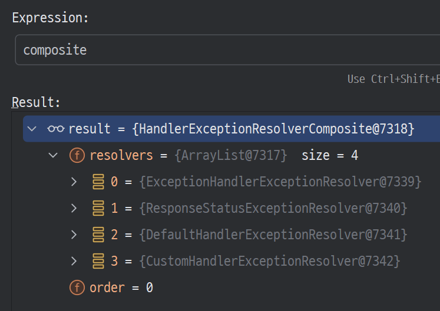
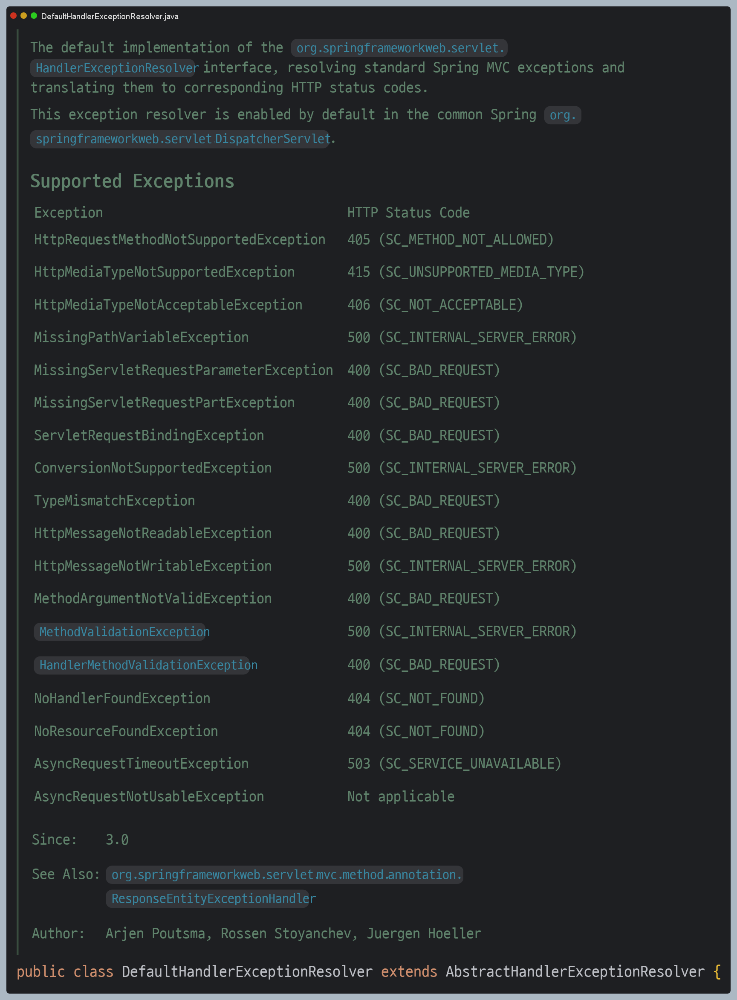

# API 예외 처리 - HandlerExceptionResolver
- 예외가 발생해서 서블릿을 넘어 WAS까지 예외가 전달되면 HTTP 상태 코드가 `500`으로 처리된다. 
- 발생하는 예외에 따라서 `400`, `404` 등 다른 상태 코드도 처리하고 싶고, 오류 메시지, 형식들을 API마다 다르게 처리하고 싶다

```java
@RestController
public class ApiExceptionController {

    @GetMapping("/api/members/{id}")
    public MemberDto getMember(@PathVariable("id") String id) {
        if (id.equals("ex")) {
            throw new RuntimeException("잘못된 사용자");
        }

        if (id.equals("bad")) {
            throw new IllegalArgumentException("잘못된 입력 값");
        }
        return new MemberDto(id, "hello " + id);
    }
    
    @Data
    @AllArgsConstructor
    public static class MemberDto {
        private String memberId;
        private String name;
    }
}
```

- WAS는 오류를 받으면 기본적으로 500 에러를 응답해서 500 에러가 응답이 나간다.
- 스프링 MVC는 컨트롤러(핸들러) 밖으로 예외가 던져진 경우 예외를 해결하고, `HandlerExceptionResolver` 인터페이스로 동작을 새로 정의할 수 있는 방법을 제공한다.



- `handler` : 핸들러(컨트롤러) 정보
- `Exception ex` : 핸들러(컨트롤러)에서 발생한 예외





> `HandlerExceptionResolver`로 예외를 해결해도 `postHandle()`은 호출되지 않는다.

**HandlerExceptionResolver 구현 예**
```java
@Slf4j
public class MyHandlerExceptionResolver implements HandlerExceptionResolver {
    
    @Override
    public ModelAndView resolveException(HttpServletRequest request, HttpServletResponse response,
                                         Object handler, Exception ex) {
        try {
            if (ex instanceof IllegalArgumentException) {
                log.info("IllegalArgumentException resolver to 400");
                response.sendError(HttpServletResponse.SC_BAD_REQUEST, ex.getMessage());
                return new ModelAndView();
            }
        } catch (IOException e) {
            log.error("resolver ex", e);
        }
        return null;
    }
}
```

**WebConfig**
```java
@Configuration
public class WebConfig implements WebMvcConfigurer {

    @Override
    public void addInterceptors(InterceptorRegistry registry) {
        registry.addInterceptor(new LogInterceptor())
                .order(1)
                .addPathPatterns("/**")
                .excludePathPatterns("/css/**", "*.ico", "/error", "/error-page/**");
    }

    @Override
    public void extendHandlerExceptionResolvers(List<HandlerExceptionResolver> resolvers) {
        resolvers.add(new MyHandlerExceptionResolver());
    }
}
```

**`HandlerExceptionResolver`의 반환 값에 따라 `DispatcherServlet`의 동작 방식이 다르다.**
- **빈 ModelAndView** : `new ModelAndView()`처럼 빈 `ModelAndView`를 반환하면 뷰를 렌더링 하지 않고 정상 흐름으로 서블릿이 리턴된다.
- **ModelAndView 지정** : `ModelAndView`에 `Model`, `View` 등의 정보를 지정해서 반환하면 뷰를 렌더링한다.
- **null** : 다음 `ExcpetionResolver`를 찾아서 실행한다. 처리할 수 있는 `ExceptionResolver`가 없으면 예외 처리가 안 되고 기존에 발생한 예외를 서블릿 밖으로 던진다.

## HandlerExceptionResolver 활용

- 예외가 발생하면 WAS까지 예외가 던져지고 WAS에서 오류 페이지 정보를 다시 `/error`를 호출하는 과정은 너무 복잡하다. 
- `HandlerExceptionResolver`를 활용하여 예외가 발생했을 때 복잡한 과정 없이 여기에서 문제를 해결할 수 있다.

**커스텀 예외**
```java
public class UserException extends RuntimeException {

    public UserException() {
        super();
    }

    public UserException(String message) {
        super(message);
    }

    public UserException(String message, Throwable cause) {
        super(message, cause);
    }

    public UserException(Throwable cause) {
        super(cause);
    }

    protected UserException(String message, Throwable cause, boolean enableSuppression, boolean writableStackTrace) {
        super(message, cause, enableSuppression, writableStackTrace);
    }
}
```

**ApiExceptionController**
```java
@RestController
public class ApiExceptionController {

    @GetMapping("/api/members/{id}")
    public MemberDto getMember(@PathVariable("id") String id) {
        switch (id) {
            case "ex" -> throw new RuntimeException("잘못된 사용자");
            case "bad" -> throw new IllegalArgumentException("잘못된 입력 값");
            case "user-ex" -> throw new UserException("사용자 오류");
        }

        return new MemberDto(id, "hello " + id);
    }
    
    @Data
    @AllArgsConstructor
    public static class MemberDto {
        private String memberId;
        private String name;
    }
}
```

**UserHandlerExceptionResolver**
```java
@Slf4j
public class UserHandlerExceptionResolver implements HandlerExceptionResolver {

    private static final String APPLICATION_JSON = "application/json";
    private final ObjectMapper objectMapper = new ObjectMapper();

    @Override
    public ModelAndView resolveException(HttpServletRequest request, HttpServletResponse response, Object handler, Exception ex) {
        try {
            if (ex instanceof UserException) {
                log.info("UserException resolver to 400");
                String acceptHeader = request.getHeader("accept");
                response.setStatus(HttpServletResponse.SC_BAD_REQUEST);

                if (acceptHeader.equals(APPLICATION_JSON)) {
                    Map<String, Object> errorResult = new HashMap<>();
                    errorResult.put("ex", ex.getClass());
                    errorResult.put("message", ex.getMessage());

                    String result = objectMapper.writeValueAsString(errorResult);

                    response.setContentType(APPLICATION_JSON);
                    response.setCharacterEncoding("UTF-8");
                    response.getWriter().write(result);

                    return new ModelAndView(); //JSON 형태로 응답

                } else {
                    return new ModelAndView("error/500"); //오류 화면으로 응답
                }
            }
        } catch (IOException e) {
            log.error("resolver ex", e);
        }

        return null; //WAS로 예외 전달
    }
}
```

**WebConfig**
```java
@Configuration
public class WebConfig implements WebMvcConfigurer {

    @Override
    public void extendHandlerExceptionResolvers(List<HandlerExceptionResolver> resolvers) {
        resolvers.add(new MyHandlerExceptionResolver());
        resolvers.add(new UserHandlerExceptionResolver());
    }
}
```
`HandlerExceptionResolver`를 사용하면 컨트롤러에서 예외가 발생해도 `HandlerExceptionResolver` 에서 예외를 처리해버렸기 때문에 서블릿 컨테이너까지 예외가 전달되지 않고
스프링 MVC에서 예외 처리는 끝이 난다. 결과적으로 WAS 입장에서는 정상 처리가 된 것이다. **예외를 이 곳에서 모두 처리할 수 있다.**

서블릿 컨테이너까지 예외가 올라가면 복잡하고 불필요한 추가 프로세스가 진행되는 것을 `HandlerExceptionResolver`를 사용하여 깔끔하게 예외 처리를 할 수 있다. 

##  HandlerExceptionResolver 기본 구현체들

스프링은 기본적으로 예외 처리에 사용할 수 있는 `HandlerExceptionResolver` 구현체를 제공하며 각 구현체는 특정 시나리오에 따라
예외를 처리하도록 설계되어 있다.

`WebMvcConfigurationSupport`클래스의 초기화 과정 후에 `HandlerExceptionResolverComposite` 클래스에 다음 순서로 등록된다.



1. `ExceptionHandlerExceptionResolver`
   - `@ExceptionHandler`를 처리한다. 
   - **API 예외 처리는 대부분 이 기능으로 해결한다.**
2. `ResponseStatusExceptionResolver`
   - HTTP 상태 코드를 지정해준다.
3. `DefaultHandlerExceptionResolver`
   - 스프링 내부 기본 예외를 처리한다.

### ResponseStatusExceptionResolver

`ResponseStatusExceptionResolver`는 예외에 대해 HTTP 상태 코드와 메시지를 매핑하여 클라이언트에게 반환할 수 있도록 
설계되었으며 두 가지 방식으로 예외 및 HTTP 상태 코드를 처리한다.

1. **`@ResponseStatus`가 달려있는 예외**

`@ResponseStatus` 어노테이션 적용
```java
@ResponseStatus(code = HttpStatus.BAD_REQUEST, reason = "잘못된 요청 오류")
public class BadRequestException extends RuntimeException { }
```

컨트롤러
```java
@GetMapping("/api/response-status-ex1")
public String responseStatusEx1() {
   throw new BadRequestException();
}
```
`BadRequestException`예외가 컨트롤러 밖으로 넘어가면 `ResponseStatusExceptionResolver`가 해당 어노테이션을 확인해서 오류 코드를 변경하고 메시지도 담는다.

`ResponseStatusExceptionResolver` 내부적으로 `response.sendError(statusCode, resolvedReason)`을 호출한다. 
`sendError(400)`을 호출했기 때문에 WAS에서 다시 오류 페이지 `/error`를 내부 요청한다.

추가로 `reason`을 `MessageSource`에서 찾는 기능도 제공한다.
```java
@ResponseStatus(code = HttpStatus.BAD_REQUEST, reason = "error.bad")
public class BadRequestException extends RuntimeException { }
```

messages.properties
```properties
error.bad=잘못된 요청 입니다.
```

2. **`ResponseStatusException` 예외**

- `@ResponseStatus`는 정적으로 예외와 상태 코드를 매핑하기 때문에 런타임에 다른 값을 설정할 수 없다.
- `ResponseStatusException`는 동적으로 상태 코드와 메시지를 설정할 수 있어 다양한 상황에서 재사용이 가능하다.

컨트롤러
```java
@GetMapping("/api/response-status-ex2")
public String responseStatusEx2() {
    throw new ResponseStatusException(HttpStatus.NOT_FOUND, "error.bad", new IllegalArgumentException());
}
```

### DefaultHandlerExceptionResolver

- `DefaultHandlerExceptionResolver`는 스프링의 표준 예외와 HTTP 상태 코드를 자동으로 매핑하여 처리하는 클래스이다.
- 주로 스프링 MVC 내부에서 발생하는 예외들을 처리하며 특정 예외를 HTTP 상태 코드에 매핑시켜 클라이언트로 반환하는 역할을 한다.
- 이 클래스는 예외를 `sendError(code, message)`로 처리하기 때문에 뷰 렌더링 없이 WAS의 ErrorPage 전략에 의해 예외 처리가 이루어진다.

다음과 같이 예외에 적절한 상태 코드를 설정하여 REST API 응답을 손쉽게 지원하며, 스프링 표준 예외를 자동으로 처리하기 때문에
기본 예외가 필요한 경우 추가 설정을 할 필요가 없다.



```java
@GetMapping("/api/default-handler-ex")
public String defaultException(@RequestParam("data") Integer data) {
    return "ok";
}
```
`data`에 문자를 입력하면 내부에서 `TypeMissmatchException`이 발생한다. 우리가 직접 예외 처리를 하지 않아도 스프링이 400 오류를 응답해준다.

> 파라미터 바인딩 시점에 타입이 맞지 않으면 내부에서 `TypeMissmatchException`이 발생하는데 예외가 발생했기 때문에 그냥 두면 서블릿 컨테이너까지
> 오류가 올라가고, 결과적으로 500 오류가 발생한다. 그런데 파라미터 바인딩은 대부분 클라이언트가 HTTP 요청 정보를 잘못 호출해서 발생하는 문제이다.
> `DefaultHandlerExceptionResolver`는 이것을 500 오류가 아니라 HTTP 상태 코드 400 오류로 변경한다.

