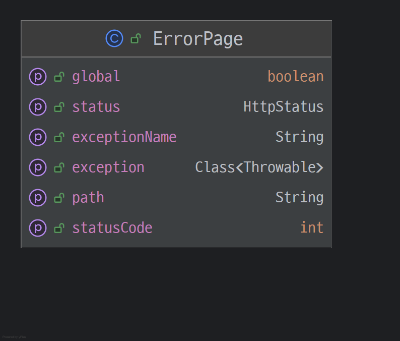
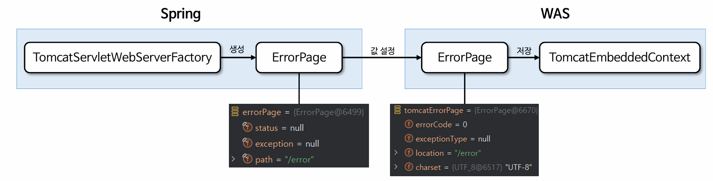
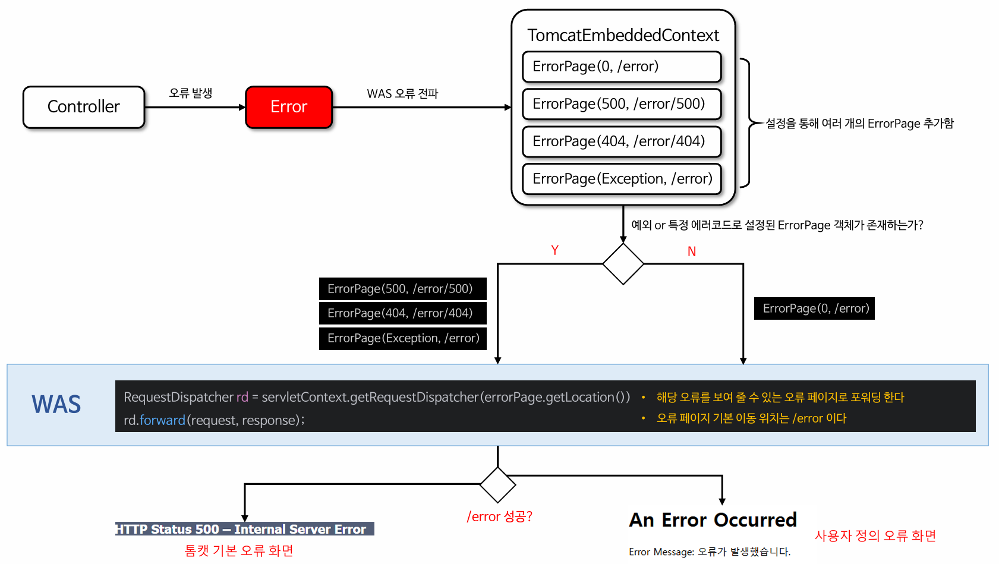

# 서블릿 예외 처리
> **스프링이 아닌 순수 서블릿 컨테이너가 예외 처리 하는 방법**

서블릿은 두 가지 방식으로 예외 처리를 지원한다.
- `Exception` (예외)
- `response.sendError(HTTP 상태 코드, 오류 메시지)`

### Exception(예외)
**자바**의 메인 메서드를 직접 실행하는 경우 `main`이라는 이름의 쓰레드가 실행된다.
실행 도중에 예외를 잡지 못하는 경우 처음 실행한 `main()`메서드를 넘어서 예외가 던져지면 예외 정보를 남기고 해당 쓰레드는 종료된다.

**웹 애플리케이션**은 사용자 요청별로 별도의 쓰레드가 할당되고 서블릿 컨테이너 안에서 실행된다.
애플리케이션에서 예외가 발생했는데 `try - catch`로 예외를 잡아서 처리하면 문제가 없다. 그런데 예외를 잡지 못하고 서블릿 밖으로 예외가 전달되면 어떻게 동작할까?

- `WAS(여기까지 전파)` ← `필터` ← `서블릿` ← `인터셉터` ← `컨트롤러(예외발생)`
- 결국 톰캣 같은 `WAS`까지 예외가 전달된다.

#### WAS가 예외를 처리하는 방법

```properties
server.error.whitelabel.enabled=false
#스프링 부트가 제공하는 기본 예외 페이지는 꺼 둔다.
```

컨트롤러
```java
@Controller
public class ServletExceptionController {

    @GetMapping("/error-ex")
    public void errorEx() {
        throw new RuntimeException("예외 발생!");
    }
}
```

- `/error-ex`로 요청해보면 Whitelabel Error Page 대신 tomcat이 기본으로 제공하는 오류 화면이 나온다.
- `Exception`의 경우 서버 내부에서 처리할 수 없는 오류가 발생한 것으로 생각해서 HTTP 상태 코드 500을 반환한다.

### response.sendError(HTTP 상태 코드, 오류 메시지)
- 오류가 발생했을 때 `HttpServletResponse`가 제공하는 `sendError()`라는 메서드를 사용할 수 있다. 
- 이것을 호출한다고 당장 예외가 발생하는 것은 아니지만 서블릿 컨테이너에게 오류가 발생했다는 점을 전달할 수 있다. 
- HTTP 상태 코드와 오류 메시지도 추가할 수 있다.

컨트롤러
```java
@GetMapping("/error-404")
public void error404(HttpServletResponse response) throws IOException {
    response.sendError(404, "404 오류!!");
}

@GetMapping("/error-400")
public void error400(HttpServletResponse response) throws IOException {
    response.sendError(400, "404 오류!!");
}

@GetMapping("/error-500")
public void error500(HttpServletResponse response) throws IOException {
    response.sendError(500);
}
```

**sendError 흐름**
- `WAS(sendError 호출 기록 확인)` ←  `필터` ← `서블릿` ← `인터셉터` ← `컨트롤러 (response.sendError())`
- `response.sendError()`를 호출하면 `response` 내부에 오류가 발생했다는 상태를 저장한다.
- 서블릿 컨테이너는 고객에게 응답 전에 `response`에 `sendError()`가 호출되었는지 확인한다.
- 호출되었다면 설정한 오류 코드에 맞추어 기본 오류 페이지를 보여준다.

---

## 서블릿 예외 처리 - 오류 화면 제공

> 서블릿 컨테이너가 제공하는 기본 예외 처리 화면은 고객 친화적이지 못하다. 서블릿이 제공하는 오류 화면 기능을 사용할 수 있다.
> 서블릿은 `Exception` (예외)이 발생해서 서블릿 밖으로 전달되거나 `response.sendError()`가 호출 되었을 때 각각의 상황에 맞춘 오류 처리 기능을 제공한다.

### ErrorPage

- `ErrorPage` 클래스는 WAS에서 발생하는 예외나 특정 HTTP 상태 코드에 대해 오류 페이지를 설정하고 렌더링하는 기능을 제공한다.
- `ErrorPage` 클래스는 클라이언트에게 서버의 오류 상황을 명확히 전달하고 사용자 친화적인 메시지를 제공하기 위한 표준적인 방법이다.



- 애플리케이션이 초기화 되면 **스프링**의 `ErrorPage`와 **WAS**의 `ErrorPage`를 각각 생성하고 기본값들로 채우게 되며 WAS에는 기본 오류 페이지 한 개가 생성된다.
- `ErrorPage`는 설정을 통해 여러 개 추가할 수 있으며 `application.properties` 설정 파일에 `server.error.xxx`로 `ErrorPage`의 기본 속성 값들을 변경할 수 있다.



**서블릿 오류 페이지 등록**
```java
@Component
public class WebServerCustomizer implements WebServerFactoryCustomizer<ConfigurableWebServerFactory> {

    @Override
    public void customize(ConfigurableWebServerFactory factory) {
        //404 에러 사용자 정의 페이지 설정
        ErrorPage errorPage404 = new ErrorPage(HttpStatus.NOT_FOUND, "/error-page/404");
        //500에러 사용자 정의 페이지 설정
        ErrorPage errorPage500 = new ErrorPage(HttpStatus.INTERNAL_SERVER_ERROR, "/error-page/500");
        //RuntimeException 발생 시 사용자 정의 페이지 설정
        ErrorPage errorPageEx = new ErrorPage(RuntimeException.class,"/error-page/500");

        factory.addErrorPages(errorPage404, errorPage500, errorPageEx);
    }
}
```
> 오류 페이지는 예외를 다룰 때 해당 예외와 그 자식 타입의 오류를 함께 처리한다. 
> 즉 `RuntimeException`을 포함한 자식 예외도 함께 처리된다.

**해당 오류를 처리할 컨트롤러** (`WAS`에서 다시 컨트롤러로 넘어온다.)
```java
@Slf4j
@Controller
public class ErrorPageController {
    
    @RequestMapping("/error-page/404")
    public String errorPage404(HttpServletRequest request, HttpServletResponse response) {
        log.info("errorPage 404");
        return "error-page/404";
    }

    @RequestMapping("/error-page/500")
    public String errorPage500(HttpServletRequest request, HttpServletResponse response) {
        log.info("errorPage 500");
        return "error-page/500";
    }
}
```

**error-page/404.html**
```html
<!DOCTYPE HTML>
<html xmlns:th="http://www.thymeleaf.org">
<head>
    <meta charset="utf-8">
</head>
<body>
<div class="container" style="max-width: 600px">
    <div class="py-5 text-center">
        <h2>404 오류 화면</h2>
    </div>
    <div>
        <p>오류 화면 입니다.</p>
    </div>
    <hr class="my-4">
</div> <!-- /container -->
</body>
</html>
```

**error-page/500.html**
```html
<!DOCTYPE html>
<html xmlns:th="http://www.thymeleaf.org">
<head>
    <meta charset="UTF-8">
    <title>Title</title>
</head>
<body>
<div class="container" style="max-width: 600px">
    <div class="py-5 text-center">
        <h2>500 오류 화면</h2>
    </div>
    <div>
        <p>오류 화면 입니다.</p>
    </div>
    <hr class="my-4">
</div> <!-- /container -->
</body>
</html>
```

---

## 서블릿 예외 처리 - 오류 페이지 작동 원리



서블릿은 기본적으로 **예외** 또는 `response.sendError()`가 호출 되어을 때 오류 페이지를 찾기 위해 처음부터 다시 요청한다.

**요청 흐름**
1. `WAS(여기까지 전파)` ← `필터` ← `서블릿` ← `인터셉터` ← `컨트롤러(예외발생)`
2. `WAS /error-page/500 다시 요청` → `필터` → `서블릿` → `인터셉터` → `컨트롤러(/error-page/500)` → `View`

**중요한 점은 웹 브라우저(클라이언트)는 서버 내부에서 이런 일이 일어나는지 전혀 모른다. 오직 서버 내부에서 오류 페이지를 찾기 위해 추가적인 호출을 한다.**

WAS는 오류 페이지를 단순히 요청만 하는 것이 아니라 오류 정보를 `request`의 `attribute`에 추가해서 넘겨준다. 필요하면 오류 페이지에서 전달된 오류 정보를 사용할 수 있다.

```java
@Slf4j
@Controller
public class ErrorPageController {

    @RequestMapping("/error-page/404")
    public String errorPage404(HttpServletRequest request, HttpServletResponse response) {
        log.info("errorPage 404");
        printErrorInfo(request);
        return "error-page/404";
    }

    @RequestMapping("/error-page/500")
    public String errorPage500(HttpServletRequest request, HttpServletResponse response) {
        log.info("errorPage 500");
        printErrorInfo(request);
        return "error-page/500";
    }

    private void printErrorInfo(HttpServletRequest request) {
        //RequestDispatcher 인터페이스에 상수로 정의되어 있음
        log.info("ERROR_EXCEPTION: ex= {}", request.getAttribute(RequestDispatcher.ERROR_EXCEPTION));
        log.info("ERROR_EXCEPTION_TYPE: {}", request.getAttribute(RequestDispatcher.ERROR_EXCEPTION_TYPE));
        log.info("ERROR_MESSAGE: {}", request.getAttribute(RequestDispatcher.ERROR_MESSAGE)); //ex의 경우 NestedServletException 스프링이 한번 감싸서 반환
        log.info("ERROR_REQUEST_URI: {}", request.getAttribute(RequestDispatcher.ERROR_REQUEST_URI));
        log.info("ERROR_SERVLET_NAME: {}", request.getAttribute(RequestDispatcher.ERROR_SERVLET_NAME));
        log.info("ERROR_STATUS_CODE: {}", request.getAttribute(RequestDispatcher.ERROR_STATUS_CODE));
        log.info("dispatchType={}", request.getDispatcherType());
    }
}
```
- `request.attribute`에 서버가 담아준 정보
  - `exception` : 예외
  - `exception_type` : 예외 타입
  - `message` : 오류 메시지
  - `request_uri` : 클라이언트 요청 URI
  - `servlet_name` : 오류가 발생한 서블릿 이름
  - `status_code` : HTTP 상태 코드