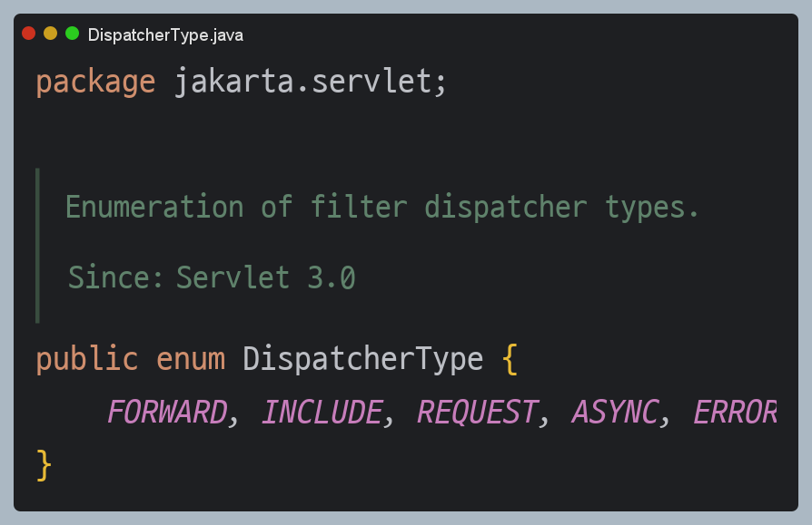

# 서블릿 예외 처리 - 필터

> 오류가 발생하면 오류 페이지를 출력하기 위해 WAS 내부에서 다시 한번 호출이 발생한다. 이 때 **필터**, **서블릿**, **인터셉터도** 모두 다시 호출된다.
> 서버 내부에서 오류 페이지를 호출한다고 해서 필터나 인터셉터가 한번 더 호출되는 것은 당연히 비효율적이다. 결국 클라이언트로부터 발생한 정상 요청인지
> 아니면 오류 페이지를 출력하기 위한 내부 요청인지 구분할 수 있어야 하는데 서블릿은 `DispatcherType`이라는 추가 정보를 제공한다.



예를 들어 클라이언트가 처음 요청하면 `REQUEST`, WAS에서 오류가 발생해서 내부 호출한 경우는 `ERROR` 방식으로 서블릿은 `DispatcherType`으로 구분할 수 있는 방법을 제공한다.

### 필터 DispatcherType 로그 추가

**LogFilter**
```java
@Slf4j
public class LogFilter implements Filter {
    
    @Override
    public void init(FilterConfig filterConfig) throws ServletException {
        log.info("log filter init");
    }

    @Override
    public void doFilter(ServletRequest request, ServletResponse response,
                         FilterChain chain) throws IOException, ServletException {
        HttpServletRequest httpRequest = (HttpServletRequest) request;
        String requestURI = httpRequest.getRequestURI();
        String uuid = UUID.randomUUID().toString();
        try {
            log.info("REQUEST  [{}][{}][{}]", uuid, request.getDispatcherType(), requestURI);
            chain.doFilter(request, response);
        } catch (Exception e) {
            throw e;
        } finally {
            log.info("RESPONSE [{}][{}][{}]", uuid, request.getDispatcherType(), requestURI);
        }
    }

    @Override
    public void destroy() {
        log.info("log filter destroy");
    }
}
```

**WebConfig**
```java
@Configuration
public class WebConfig {
    
    @Bean
    public FilterRegistrationBean logFiler() {
        FilterRegistrationBean<Filter> bean = new FilterRegistrationBean<>();
        bean.setFilter(new LogFilter());
        bean.setOrder(1);
        bean.addUrlPatterns("/*");
        bean.setDispatcherTypes(DispatcherType.REQUEST, DispatcherType.ERROR);
        return bean;
    }
}
```
- `bean.setDispatcherTypes(DispatcherType.REQUEST, DispatcherType.ERROR)`
  - `REQUEST`와 `ERROR` 모두 넣으면 클라이언트 요청, 오류 페이지 요청에서도 필터가 호출된다. 기본 값이 `REQUEST`이므로 설정을 안 해도 클라이언트의
  요청이 있는 경우에만 필터가 적용된다. 오류 페이지 요청 전용 필터를 적용할려면 `ERROR`만 지정하면 된다.

---

# 서블릿 예외 처리 - 인터셉터

**LogInterceptor**
```java
@Slf4j
public class LogInterceptor implements HandlerInterceptor {

    public static final String LOG_ID = "logId";

    @Override
    public boolean preHandle(HttpServletRequest request, HttpServletResponse
                            response, Object handler) throws Exception {

        String requestURI = request.getRequestURI();
        String uuid = UUID.randomUUID().toString();
        request.setAttribute(LOG_ID, uuid);
        log.info("REQUEST  [{}][{}][{}][{}]", uuid, request.getDispatcherType(), requestURI, handler);
        return true;
    }

    @Override
    public void postHandle(HttpServletRequest request, HttpServletResponse response,
                           Object handler, ModelAndView modelAndView) throws Exception {
        log.info("postHandle [{}]", modelAndView);
    }

    @Override
    public void afterCompletion(HttpServletRequest request, HttpServletResponse
                                response, Object handler, Exception ex) throws Exception {
        String requestURI = request.getRequestURI();
        String logId = (String)request.getAttribute(LOG_ID);
        log.info("RESPONSE [{}][{}][{}]", logId, request.getDispatcherType(),
                requestURI);
        if (ex != null) {
            log.error("afterCompletion error!!", ex);
        }
    }
}
```

**WebConfig**
```java
@Configuration
public class WebConfig implements WebMvcConfigurer {

    @Override
    public void addInterceptors(InterceptorRegistry registry) {
        registry.addInterceptor(new LogInterceptor())
                .order(1)
                .addPathPatterns("/**")
                .excludePathPatterns("/css/**", "*.ico", "/error", "/error-page/**");
    }
}
```
필터의 경우에는 필터를 등록할 때 `DispathcerTpye`을 지정해서 필터를 적용할 수 있었다. 그런데 인터셉터는 서블릿이 제공하는 기능이 아니라 스프링이
제공하는 기능이기 때문에 `DispathcerTpye`과 무관하게 항상 호출한다.

대신에 인터셉터는 요청 경로에 따라서 추가하거나 제외하기 쉽게 되어 있기 때문에 `excludePathPatterns`를 사용해서 빼주면 된다.

## 전체 흐름 정리
**정상 요청**
- `WAS(dispatchType=REQUEST)` → `필터` → `서블릿` → `인터셉터` → `컨트롤러` → `View`

**오류 요청**
- **필터**는 `DispatchType`으로 중복 호출 제거
- **인터셉터**는 경로 정보로 중복 호출 제거
1. `WAS(dispatchType=REQUEST)` → `필터` → `서블릿` → `인터셉터` → `컨트롤러` → `View`
2. `WAS(여기까지 전파)` ← `필터` ← `서블릿` ← `인터셉터` ← `컨트롤러(예외발생)`
3. `WAS` 오류 페이지 확인
4. `WAS(/error-page/500, dispatchType=ERROR)` → `필터(x)` → `서블릿` → `인터셉터(x)` → `컨트롤러(/error-page/500)` → `View`