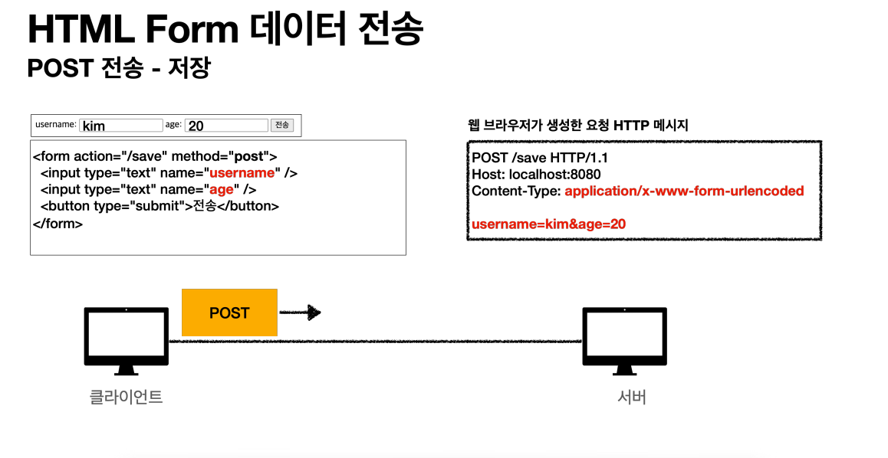
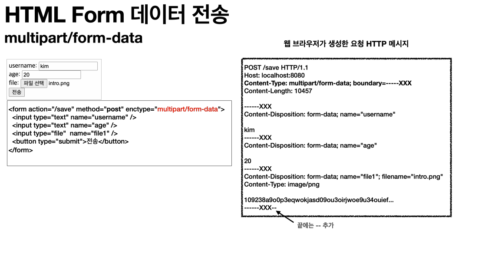

# 파일 업로드
일반적으로 폼을 전송하는 방식은 두 가지가 있다.
- `application/x-www-form-urlencoded`
- `multipart/form-data`

### `application/x-www-form-urlencoded` 방식

HTML 폼 데이터를 서버로 전송하는 가장 기본적인 방법으로 Form 태그에 별도의 `enctpye` 옵션이 없으면 웹 브라우저는 요청 HTTP 메시지 헤더에 
`Content-Type : application/x-www-form-urlencoded`를 추가한다.

파일을 업로드 하려면 바이너리 데이터를 전송해야 한다. 그리고 보통 파일만 전송하는 것이 아닌 다른 정보도 동시에 전송해야 하는 경우가 많은데 결국 문자와
바이너리를 동시에 전송해야 하는 상황이다. HTTP는 `multipart/form-data` 전송 방식을 제공한다.

 

### `multipart/form-data` 방식

Form 태그에 별도의 `enctype`을 지정해야 한다. 다른 종류의 여러 파일과 폼의 내용을 함께 전송할 수 있다.

폼의 입력 결과로 생성된 HTTP 메시지가 각각의 전송 항목이 구분 되어있다. `Content-Disposition`이라는 항목별 헤더가 추가되었고 여기에 부가 정보가 있다.

- [서블릿]()
- [스프링]()