# 스프링 파일 업로드
> 스프링은 `MultipartFile`이라는 인터페이스로 멀티파트 파일을 매우 편리하게 지원한다.

**주요 클래스**
- **MultipartAutoConfiguration**
  - 스프링 부트에서 `multipart/form-data` 요청 처리를 자동으로 구성해주는 설정 클래스 
  - 추가적인 설정 없이도 `@RequestParam("file") MultipartFile file`과 같이 사용하면 자동으로 멀티파트 요청을 처리하도록 구성된다.
- **MultipartHttpServletRequest**
  - `HttpServletRequest`를 상속하여 멀티파트 폼 데이터를 처리할 수 있는 추가 메서드를 제공하는 인터페이스
  - 기본 구현체로 `StandardMultipartHttpServletRequest` 클래스가 제공된다.
- **MultipartResolver**
  - `multipart/form-data` 요청을 해석하여 `MultipartHttpServletRequest`를 만들어주는 인터페이스
  - 기본 구현체로 `StandardServletMultipartResolver` 클래스가 제공된다.
- **MultipartFile**
  - 업로드된 파일을 다루기 위한 인터페이스
  - 기본 구현체로 `StandardMultipartFile` 클래스가 제공된다.
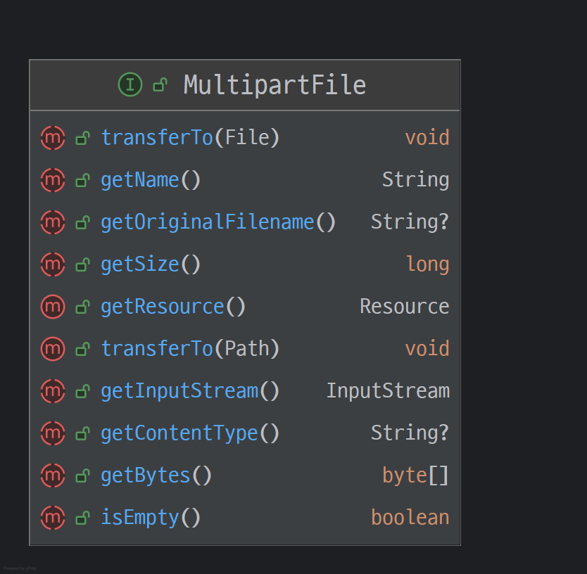
- **MultipartProperties**
  - 스프링 부트에서 멀티파트 설정을 위한 구성 설정 클래스
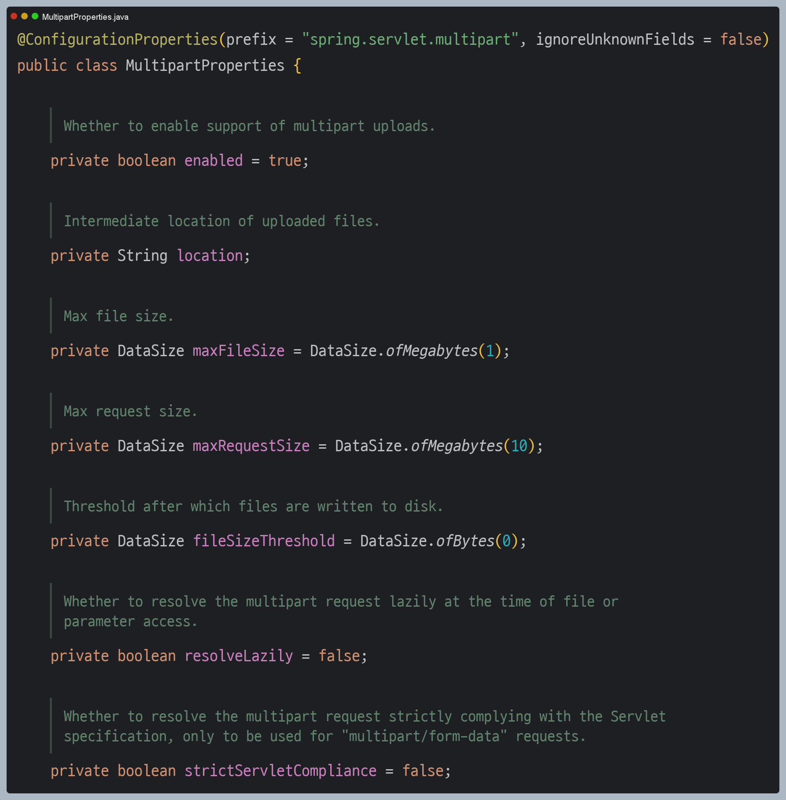
- **@RequestPart**
  - `multipart/form-data` 요청의 특정 파트를 직접 바인딩하기 위한 어노테이션
  - `@RequestParama`보다 좀 더 확장된 기능을 제공한다.

**MultipartFile 사용 예 - 컨트롤러**
```java
@Slf4j
@Controller
@RequestMapping("/spring")
public class SpringUploadController {

    @Value("${file.dir}")
    private String fileDir;

    @GetMapping("/upload")
    public String newFile() {
        return "upload-form";
    }

    @PostMapping("/upload")
    public String saveFile(@RequestParam("itemName") String itemName,
                           @RequestParam("file") MultipartFile file,
                           HttpServletRequest request) throws IOException {
        
        log.info("request ={}", request);
        log.info("itemName={}", itemName);
        log.info("multipartFile={}", file);
        
        if (!file.isEmpty()) {
            String fullPath = fileDir + file.getOriginalFilename();
            log.info("파일 저장 fullPath={}", fullPath);
            file.transferTo(new File(fullPath));
        }

        return "upload-form";
    }
}
```
업로드 하는 HTML Form의 name에 맞춰 `@RequestParam`을 적용하면 된다. `@ModelAttribute`에서도 `MultipartFile`을 동일하게 사용할 수 있다.
- `file.getOriginalFilename()` : 업로드 파일 명
- `file.transferTo()` : 파일 저장

### 파일 업로드, 다운로드 예제

**Item 상품 도메인**
```java
@Data
public class Item {
    private Long id;
    private String itemName;
    private UploadFile attachFile;
    private List<UploadFile> imageFiles;
}
```

**UploadFile - 업로드 파일 정보 보관**
```java
@Data
@AllArgsConstructor
public class UploadFile {
    private String uploadFileName; //고객이 업로드한 파일명
    private String storeFileName;  //서버 내부에서 관리하는 파일명
}
```

> 고객이 업로드한 파일명 그대로 서버 내부에 파일을 저장하면 안 된다. 왜냐하면 서로 다른 고객이 같은 파일이름을 업로드 한 경우 기존 파일 이름과 충돌이 날 수 있다.
> 서버에서는 저장할 파일명이 겹치지 않도록 내부에서 관리하는 별도의 파일명이 필요하다.

**ItemRepository**
```java
@Repository
public class ItemRepository {

    private final Map<Long, Item> store = new HashMap<>();
    private long sequence = 0L;

    public Item save(Item item) {
        item.setId(++sequence);
        store.put(item.getId(), item);
        return item;
    }

    public Item findById(Long id) {
        return store.get(id);
    }
}
```

**FileStore - 파일 저장과 관련된 로직**
```java
@Component
public class FileStore {

    @Value("${file.dir}")
    private String fileDir;

    public String getFullPath(String fileName) {
        return fileDir + fileName;
    }

    public List<UploadFile> storeFiles(List<MultipartFile> files) throws IOException {
        List<UploadFile> storeFileResult = new ArrayList<>();
        for (MultipartFile file : files) {
            if (!file.isEmpty()) {
                storeFileResult.add(storeFile(file));
            }
        }
        return storeFileResult;
    }

    public UploadFile storeFile(MultipartFile file) throws IOException {
        if (file.isEmpty()) {
            return null;
        }

        String originalFilename = file.getOriginalFilename();
        String storeFileName = createStoreFileName(originalFilename);

        file.transferTo(new File(getFullPath(storeFileName)));

        return new UploadFile(originalFilename, storeFileName);

    }

    private String createStoreFileName(String filename) {
        String uuid = UUID.randomUUID().toString();
        String ext = extractExt(filename);//확장자 추출 "png"

       return uuid + "." + ext;
    }

    private String extractExt(String filename) {
        int pos = filename.lastIndexOf(".");
        return filename.substring(pos + 1);
    }
}
```

**ItemForm**
```java
@Data
public class ItemForm {
    private Long itemId;
    private String itemName;
    private MultipartFile attachFile;
    private List<MultipartFile> imageFiles;
}
```
- 이미지를 다중 업로드 하기 위해 `MultipartFile`을 `List`로 사용한다.
- 멀티파트(`attachFile`)는 `@ModelAttribute`에서 사용할 수 있다.

**컨트롤러**
```java
@Slf4j
@Controller
@RequiredArgsConstructor
public class ItemController {

    private final ItemRepository itemRepository;
    private final FileStore fileStore;

    /**
     * 등록 폼을 보여준다.
     */
    @GetMapping("/items/new")
    public String newItem(@ModelAttribute ItemForm form) {
        return "item-form";
    }

    /**
     * 폼의 데이터를 저장하고 보여주는 화면으로 리다이렉트
     */
    @PostMapping("/items/new")
    public String saveItem(@ModelAttribute ItemForm form, RedirectAttributes redirectAttributes) throws IOException {
        UploadFile attachFile = fileStore.storeFile(form.getAttachFile());
        List<UploadFile> storeImageFiles = fileStore.storeFiles(form.getImageFiles());

        Item item = new Item();
        item.setItemName(form.getItemName());
        item.setAttachFile(attachFile);
        item.setImageFiles(storeImageFiles);
        itemRepository.save(item);

        redirectAttributes.addAttribute("itemId", item.getId());

        return "redirect:/items/{itemId}";
    }

    /**
     * 상품을 보여준다.
     */
    @GetMapping("/items/{id}")
    public String items(@PathVariable("id") Long id, Model model) {
        Item item = itemRepository.findById(id);
        model.addAttribute("item", item);

        return "item-view";
    }

    /**
     *  태그로 이미지를 조회할 때 사용
     * urlResource로 이미지 파일을 읽어서 이미지 바이너리를 반환
     */
    @ResponseBody
    @GetMapping("/images/{fileName}")
    public Resource downloadImage(@PathVariable("fileName") String fileName) throws MalformedURLException {
        return new UrlResource("file:" + fileStore.getFullPath(fileName));
    }

    /**
     * 파일을 다운로드할 때 사용
     * 파일 다운로드 시 권한 체크와 같은 상황을 가정하고 이미지 id를 요청
     * 파일 다운로드 시에 고객이 업로드한 파일 이름으로 다운로드 하는 게 좋은데 이때
     * Content-Disposition 헤더에 attach; filename="업로드 파일명" 값을 주면 된다.
     */
    @GetMapping("/attach/{itemId}")
    public ResponseEntity<Resource> downloadAttach(@PathVariable("itemId") Long itemId) throws MalformedURLException {
        Item item = itemRepository.findById(itemId);
        String storeFileName = item.getAttachFile().getStoreFileName();
        String uploadFileName = item.getAttachFile().getUploadFileName();

        UrlResource resource = new UrlResource("file:" + fileStore.getFullPath(storeFileName));

        log.info("uploadFileName={}",uploadFileName);
        String encodedUploadFileName = UriUtils.encode(uploadFileName, StandardCharsets.UTF_8);
        String contentDisposition = "attachment; filename=\"" + encodedUploadFileName + "\"";

        return ResponseEntity.ok()
                             .header(HttpHeaders.CONTENT_DISPOSITION, contentDisposition)
                             .body(resource);

    }
}
```

**Item-form.html**
```html
<!DOCTYPE HTML>
<html xmlns:th="http://www.thymeleaf.org">
<head>
    <meta charset="utf-8">
</head>
<body>
<div class="container">
    <div class="py-5 text-center">
        <h2>상품 등록</h2>
    </div>
    <form th:action method="post" enctype="multipart/form-data">
        <ul>
            <li>상품명 <input type="text" name="itemName"></li>
            <li>첨부파일<input type="file" name="attachFile" ></li>
            <li>이미지 파일들<input type="file" multiple="multiple" name="imageFiles" ></li>
        </ul>
        <input type="submit"/>
    </form>
</div> <!-- /container -->
</body>
</html>
```
다중 파일 업로드를 하려면 `multiple="multiple"` 옵션을 주면 된다.

**Item-view.html**
```html
<!DOCTYPE HTML>
<html xmlns:th="http://www.thymeleaf.org">
<head>
    <meta charset="utf-8">
</head>
<body>
<div class="container">
    <div class="py-5 text-center">
        <h2>상품 조회</h2>
    </div>
    상품명: <span th:text="${item.itemName}">상품명</span><br/>
    첨부파일: <a th:if="${item.attachFile}" th:href="|/attach/${item.id}|"
             th:text="${item.getAttachFile().getUploadFileName()}" /><br/>

    
</div> <!-- /container -->
</body>
</html>
```
첨부 파일은 링크를 걸어두고 이미지는 ``태그를 반복해서 출력한다.

---

## Multipart 처리 과정

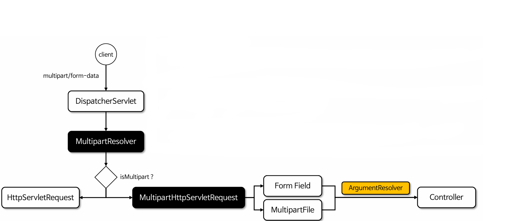

1. **멀티파트 요청 체크** - 사용자가 `multipart/form-data` 형식으로 파일을 업로드하면 `MultipartResolver`를 통해 멀티파트 형태인지 판단한다.

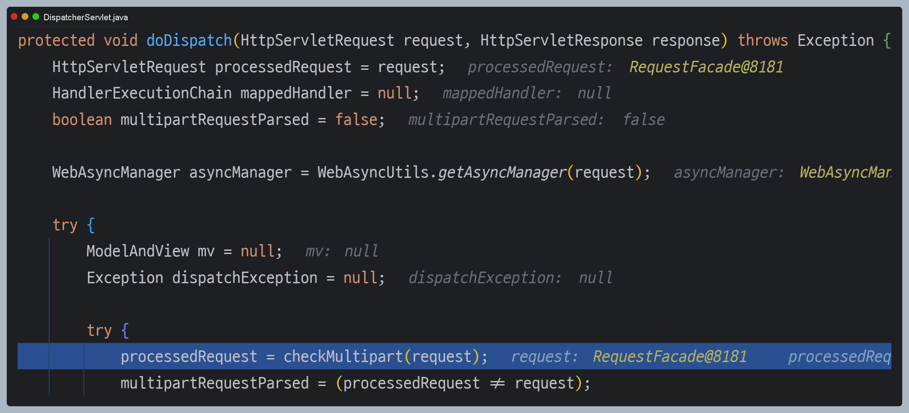

일반 요청이면 `HttpServletRequest`를 그대로 다시 반환하고, 멀티파트 요청이면 `StandardMultipartHttpServletRequest` 객체로 감싸서 반환한다.

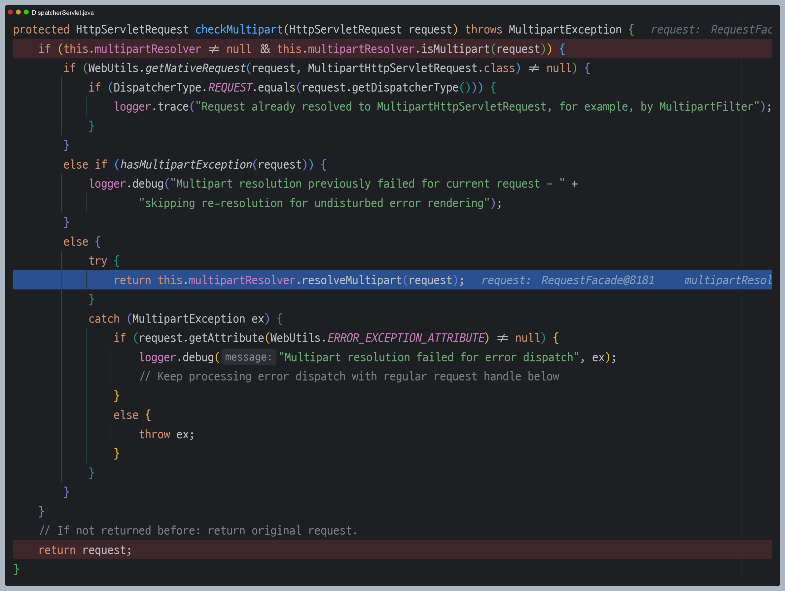

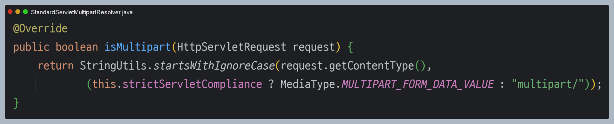

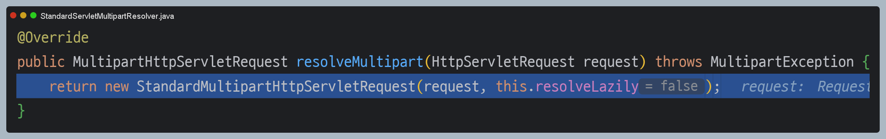

2. **MultipartResolver 파싱** - `MultipartResolver`가 `MultipartHttpServletRequest`를 생성하고 이 클래스는 요청 바디를 분석하여 각 파일 파트(바이너리 데이터)와
일반 폼 필드를 분리하고 파일 파트는 `MultipartFile` 맵에 저장한다.

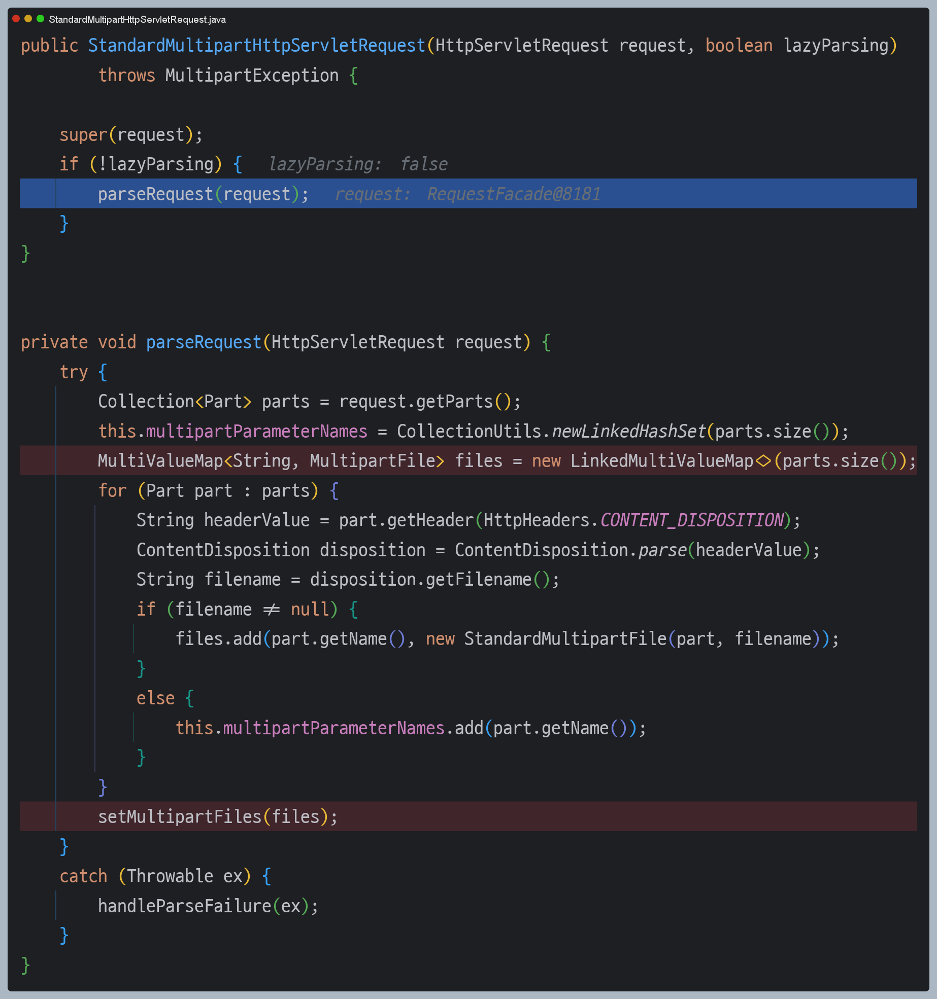

3. **ArgumentResolver 요청 처리** - 각 `ArgumentResolver` 클래스는 `MultipartHttpServletRequest`의 `MultipartFile` 맵으로부터 `MultipartFile` 객체를
가져와서 반환한다.


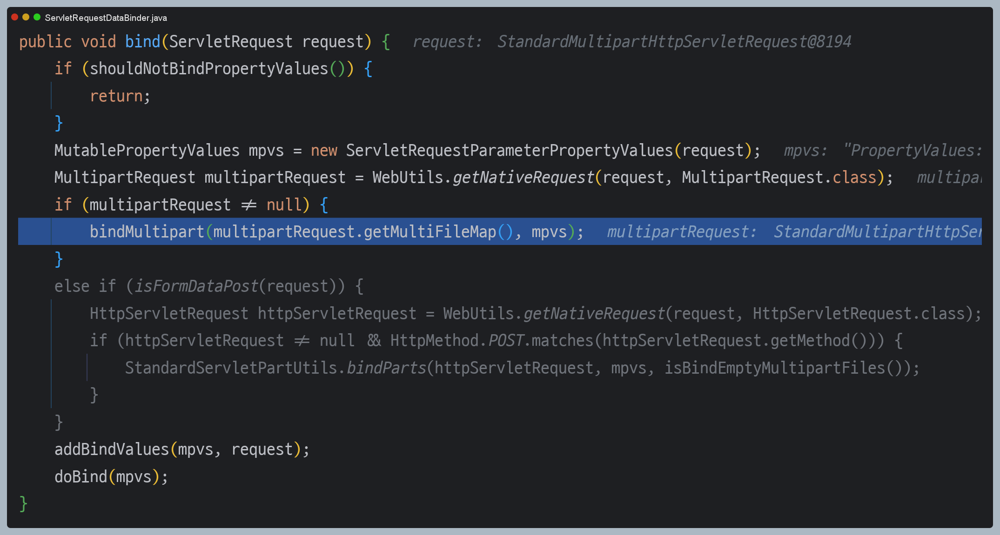

4. **컨트롤러에서 MultipartFile 접근**

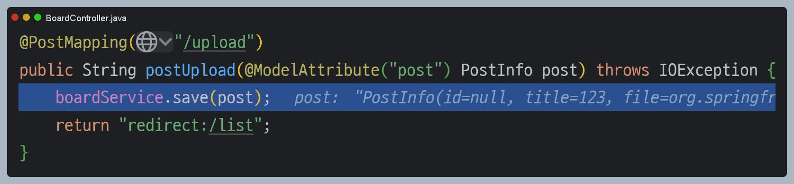

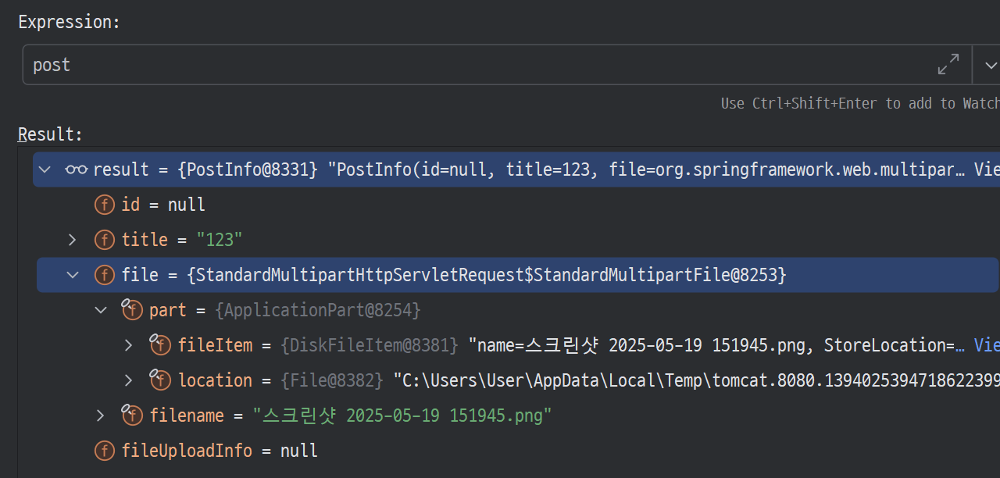

---

## @RequestPart

- `@RequestPart` 어노테이션은 멀티파트 요청에서 특정 파트를 매핑하여 컨트롤러의 파라미터로 바인딩하는 어노테이션으로, JSON 요청 처리 및
파일 업로드를 동시에 처리 가능하다.
- `@RequestParam`과 다르게 파일 뿐만 아니라 JSON 객체로 받을 수 있다.

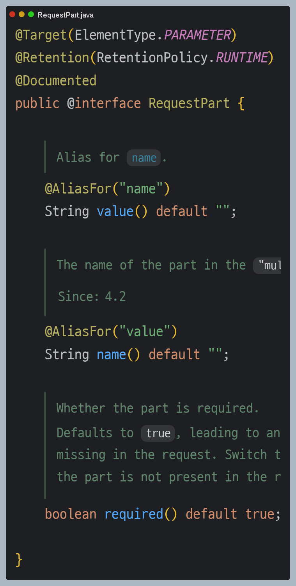

### 구현 예제

**도메인**
```java
@Data
@NoArgsConstructor
@AllArgsConstructor
public class PostInfo {
    private Long id;
    private String title;   // 게시글 제목
    private String content; // 게시글 내용
    private String userId;  // 사용자 ID
    private String comment; // 댓글

    private List<FileUploadInfo> files = new ArrayList<>(); // 업로드된 파일 리스트 (DB 저장용)
    private List<MultipartFile> uploadFiles;                // 클라이언트에서 받은 파일들
}
```

**컨트롤러**
```java
@PostMapping("/upload")
public ResponseEntity<PostInfo> postUpload(@RequestPart("post") PostInfo post,
                                           @RequestPart(value = "files", required = false) List<MultipartFile> files) throws IOException {
    PostInfo postInfo = boardService.save(post, files);
    return ResponseEntity.ok().body(postInfo);
}
```

**HTML**
```html
<script>
    document.addEventListener('DOMContentLoaded', function () {
        const uploadForm = document.getElementById('uploadForm');
        
        uploadForm.addEventListener('submit', function (event) {
            event.preventDefault(); // 기본 폼 제출 방지
          
            const formData = new FormData();
            const titleInput = document.getElementById('title');
            const contentInput = document.getElementById('content');
            const userIdInput = document.getElementById('userId');
            const commentInput = document.getElementById('comment');
            const fileInput = document.getElementById('files');
            
            // 파일 추가
            for (let i = 0; i < fileInput.files.length; i++) {
                formData.append("files", fileInput.files[i]);
            }
            
            // 게시글 데이터 (JSON)
            const metaData = {
                title: titleInput.value,
                content: contentInput.value,
                userId: userIdInput.value,
                comment: commentInput.value
            };
            
            formData.append("post", new Blob([JSON.stringify(metaData)], {
                type: "application/json"
            }));
            
            fetch("/upload", {
                method: 'POST',
                body: formData
            })
                .then(response => response.json())
                .then(result => {
                    alert("업로드 성공: " + result.title);
                    window.location.href = "/listForm";
                })
                .catch(error => {
                    console.error("업로드 실패:", error);
                    alert("업로드 중 오류가 발생했습니다.");
                });
        });
    });
</script>

.............................

<form id="uploadForm">
  <label>게시글 제목:</label>
  <input type="text" id="title" required>
  
  <label>게시글 내용:</label>
  <input type="text" id="content" required>
  
  <label>사용자:</label>
  <input type="text" id="userId" required>
  
  <label>댓글:</label>
  <input type="text" id="comment">
  
  <label>파일 선택:</label>
  <div class="file-input">
    <input type="file" id="files" multiple>
  </div>
  
  <button type="submit">업로드</button>
</form>
```

> 👆 **참고 - 요청 방식에 따른 사용 가능한 어노테이션**
> 
> | 요청 방식                             | 사용 가능 애노테이션                                  |
> |-----------------------------------|----------------------------------------------|
> | application/json                  | @RequestBody, @RequestPart                   |
> | application/x-www-form-urlencoded | @RequestParam, @ModelAttribute               |
> | multipart/form-data               | @RequestParam, @ModelAttribute, @RequestPart |

> 👆 **참고**
> 
> `@RequestPart`는 **RequestPartMethodArgumentResolver** 클래스가 처리한다.