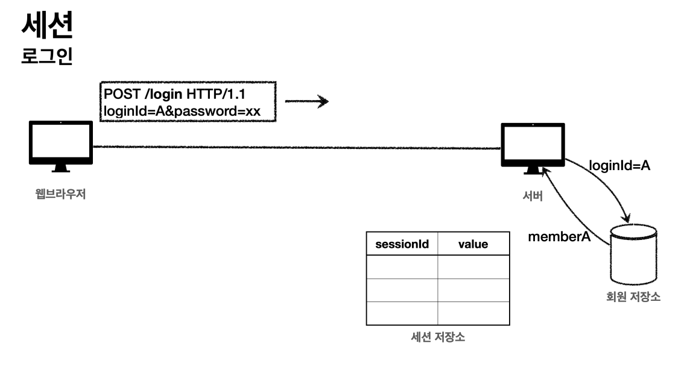
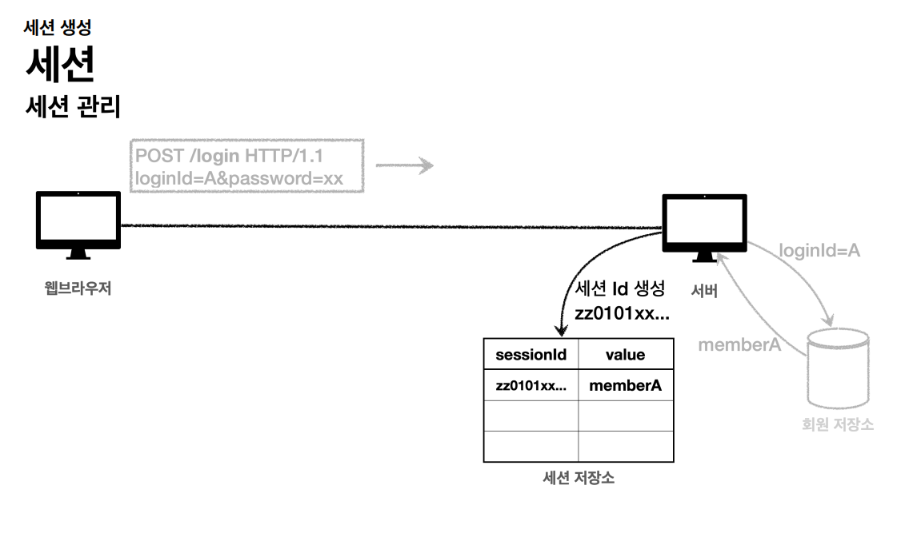
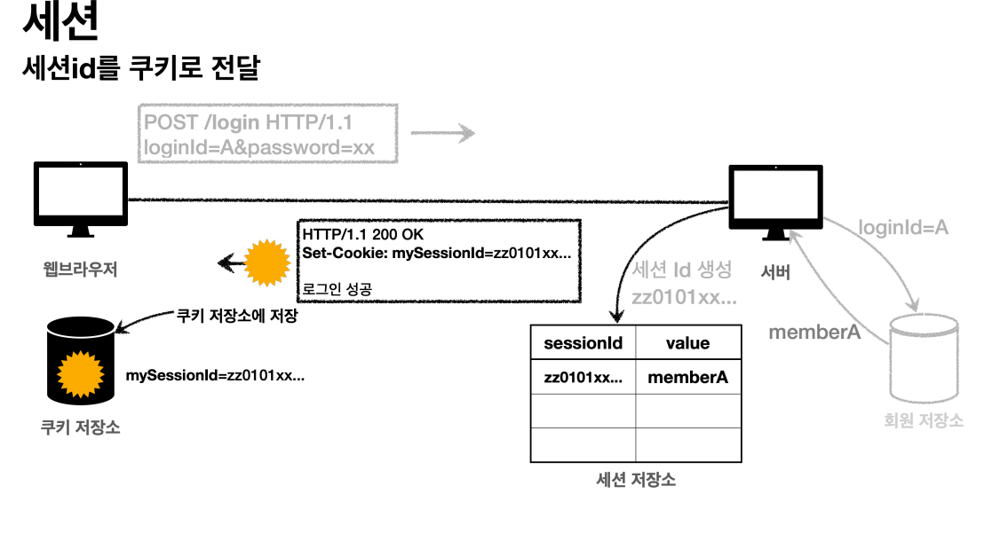
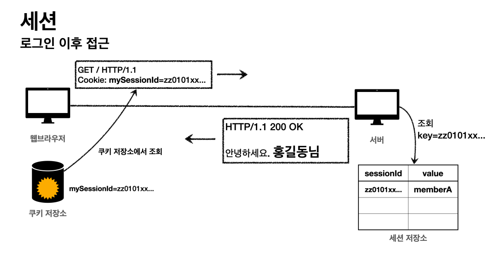

# 세션을 사용하여 로그인 처리하기
> 쿠키에 중요한 정보를 보관하는 방법은 여러가지 보안 이슈가 있다. 해결하기 위해서는 중요한 정보를 모두 서버에 저장해야 한다. 그리고 클라이언트와 서버는
> 추정 불가능한 임의의 식별자 값으로 연결해야 한다.

## 세션 동작 방식

- 사용자가 `logindId`, `password` 정보를 전달하면 서버에서 해당 사용자가 맞는지 확인한다.


- 세션 ID를 생성하는데 절대 추정 불가능해야 한다.(예: `UUID`)
- 생성된 세션 ID와 세션에 보관할 값을 서버의 세션 저장소에 보관한다.


- 서버는 클라이언트에 세션 ID만 쿠키에 담아서 전달한다.
- 클라이언트는 쿠키 저장소에 쿠키를 보관한다.

**회원과 관련된 정보는 전혀 클라이언트에 전달하지 않고 오직 추적 불가능한 세션 ID만 쿠키를 통해 클라이언트에게 전달한다.**


- 클라이언트는 요청 시 항상 세션 ID 쿠키를 전달한다.
- 서버에서는 클라이언트가 전달한 쿠키 정보로 세션 저장소를 조회해서 로그인시 보관한 세션 정보를 사용한다.

**이제 쿠키가 털려도 세션 ID에는 중요한 정보가 전혀 없다.**

<br>

## 세션 적용하기 V1

### 세션 직접 만들기
> 세션 관리는 크게 3가지 기능을 제공해야 한다.
> - 세션 생성
> - 세션 조회
> - 세션 만료

- SessionManager
```java
@Component
public class SessionManager {

    public static final String SESSION_COOKIE_NAME = "mySessionId";
    private final Map<String, Object> sessionStore = new ConcurrentHashMap<>();

    /**
     * 세션 생성
     */
    public void createSession(Object value, HttpServletResponse response) {

        //세션 id를 생성하고, 값을 세션에 저장
        String sessionId = UUID.randomUUID().toString();
        sessionStore.put(sessionId, value);

        //쿠키 생성
        Cookie mySessionCookie = new Cookie(SESSION_COOKIE_NAME, sessionId);
        response.addCookie(mySessionCookie);
    }

    /**
     * 세션 조회
     */
    public Object getSession(HttpServletRequest request) {
        Cookie sessionCookie = findCookie(request, SESSION_COOKIE_NAME);
        if (sessionCookie == null) {
            return null;
        }
        return sessionStore.get(sessionCookie.getValue());
    }

    /**
     * 세션 만료
     */
    public void expire(HttpServletRequest request) {
        Cookie sessionCookie = findCookie(request, SESSION_COOKIE_NAME);
        if (sessionCookie != null) {
            sessionStore.remove(sessionCookie.getValue());
        }
    }


    public Cookie findCookie(HttpServletRequest request, String cookieName) {
        if (request.getCookies() == null) {
            return null;
        }
        return Arrays.stream(request.getCookies())
                .filter(cookie -> cookie.getName().equals(cookieName))
                .findAny()
                .orElse(null);
    }

}
```
- 테스트 코드
```java
class SessionManagerTest {

    SessionManager sessionManager = new SessionManager();

    @Test
    void sessionTest() {

        //세션 생성
        MockHttpServletResponse response = new MockHttpServletResponse();
        Member member = new Member();
        sessionManager.createSession(member, response);

        //요청에 응답 쿠키 저장
        MockHttpServletRequest request = new MockHttpServletRequest();
        request.setCookies(response.getCookies());

        //세션 조회
        Object result = sessionManager.getSession(request);
        assertThat(result).isEqualTo(member);

        //세션 만료
        sessionManager.expire(request);
        Object expired = sessionManager.getSession(request);
        assertThat(expired).isNull();
    }
}
```

### 세션 적용
- 컨트롤러
```java
@PostMapping("/login")
public String loginV2(@Valid @ModelAttribute LoginForm form, BindingResult bindingResult, HttpServletResponse response) {
        if (bindingResult.hasErrors()) {
            return "login/loginForm";
        }

        Member loginMember = loginService.login(form.getLoginId(), form.getPassword());
        if (loginMember == null) {
            bindingResult.reject("loginFail", "아이디 또는 비밀번호가 맞지 않습니다.");
            return "login/loginForm";
        }

        //로그인 성공 처리
        //세션 관리자를 통해 세션을 생성하고, 회원 데이터 보관
        sessionManager.createSession(loginMember, response);
        return "redirect:/";
}

@PostMapping("/logout")
public String logoutV2(HttpServletRequest request) {
        sessionManager.expire(request);
        return "redirect:/";
}

@GetMapping("/")
public String homeLoginV2(HttpServletRequest request, Model model) {

        //세션 관리자에 저장된 회원 정보 조회
        Member member = (Member)sessionManager.getSession(request);

        //로그인
        if (member == null) {
            return "home";
        }

        model.addAttribute("member", member);
        return "loginHome";
}
```

<br>

## 세션 적용하기 V2
> 서블릿에서 세션을 위해 `HttpSession`이라는 기능을 제공한다. 직접 만든 것과 동작방식이 거의 같고 추가로 세션을 일정시간 사용하지 않으면 해당 세션을
> 삭제하는 기능을 제공한다. 서블릿을 통해 `HttpSession`을 생성하면 쿠키 이름=`JSESSIONID`로 추정 불가능한 랜덤 값으로 값을 만들어준다.

### HttpSession 사용

- SessionConst
```java
public abstract class SessionConst {
    public static final String LOGIN_MEMBER = "loginMember";
}
```
`HttpSession`에 데이터를 보관하고 조회할 때 같은 이름이 중복되어 사용되서 상수를 하나 정의한다. 추상 클래스로 불필요한 객체 생성을 방지한다.

- 컨트롤러
```java
@PostMapping("/login")
public String loginV3(@Valid @ModelAttribute LoginForm form, BindingResult bindingResult, HttpServletRequest request) {
        if (bindingResult.hasErrors()) {
            return "login/loginForm";
        }

        Member loginMember = loginService.login(form.getLoginId(), form.getPassword());

        if (loginMember == null) {
            bindingResult.reject("loginFail", "아이디 또는 비밀번호가 맞지 않습니다.");
            return "login/loginForm";
        }

        //로그인 성공 처리
        //세션이 있으면 있는 세션 반환, 없으면 신규 세션을 생성
        HttpSession session = request.getSession();
        //세션에 로그인 회원 정보 보관
        session.setAttribute(SessionConst.LOGIN_MEMBER, loginMember);

        return "redirect:/";
}

@PostMapping("/logout")
public String logoutV3(HttpServletRequest request) {
        HttpSession session = request.getSession(false);
        if (session != null) {
            session.invalidate(); // 세션을 제거한다.
        }
        return "redirect:/";
}

@GetMapping("/")
public String homeLoginV3(HttpServletRequest request, Model model) {
        // 로그인하지 않은 사용자의 의미 없는 세션 생성 방지를 위해 false
        HttpSession session = request.getSession(false);
        if (session == null) {
            return "home";
        }

        Member loginMember = (Member)session.getAttribute(SessionConst.LOGIN_MEMBER);

        //세션에 회원 데이터가 없으면 home
        if (loginMember == null) {
            return "home";
        }

        //세션이 유지되면 로그인으로 이동
        model.addAttribute("member", loginMember);
        return "loginHome";
}
```
세션을 생성하려면 `request.getSession()`을 사용한다.<br>
`public HttpSession getSession(boolean create);`

- `request.getSession(true)` : default
  - 세션이 있으면 기존 세션을 반환한다.
  - 세션이 없으면 새로운 세션을 생성해서 반환한다.
- `request.getSession(false)`
  - 세션이 있으면 기존 세션을 반환한다.
  - 세션이 없으면 새로운 세션을 생성하지 않고 `null`을 반환한다.

<br>

## 세션 적용하기 V3
> 스프링은 세션을 더 편리하게 사용할 수 있도록 `@SessionAttribute`를 지원한다.

- 컨트롤러
```java
@GetMapping("/")
public String homeLoginV3Spring(
            @SessionAttribute(name = SessionConst.LOGIN_MEMBER, required = false) Member loginMember, Model model) {

        //세션에 회원 데이터가 없으면 home
        if (loginMember == null) {
            return "home";
        }

        //세션이 유지되면 로그인으로 이동
        model.addAttribute("member", loginMember);
        return "loginHome";
}
```
세션을 찾고 세션에 들어있는 데이터를 찾는 과정을 스프링이 한 번에 처리해준다.

### TrackingModes

로그인을 처음 시도하면 URL에 `jsessionid`를 포함한다.(`http://localhost:8080/;jsessionid=F59911518B921DF62D09F0DF8F83F872`)

이것은 웹 브라우저가 쿠키를 지원하지 않을 때 쿠키 대신 URL을 통해서 세션을 유지하는 방법인데 이 방법을 사용하려면 URL에 이 값을 계속 포함해서
전달해야 한다. 서버 이장에서 웹 브라우저가 쿠키를 지원하는지 하지 않는지 최초에는 판단하지 못하기 때문에 쿠키 값도 전달하고 URL에 `jsessionid`도 함께 전달한다.

URL 전달 방식을 끄고 항상 쿠키를 통해서만 세션을 유지하려면 옵션을 넣어주면 된다.
```properties
server.servlet.session.tracking-modes=cookie
```
만약 URL 전달 방식을 사용하려면 이 옵션을 추가한다.
```properties
spring.mvc.pathmatch.matching-strategy=ant_path_matcher
```

### 세션 정보와 타임아웃 설정
> 세션이 제공하는 정보들 확인

- 컨트롤러
```java
@Slf4j
@RestController
public class SessionInfoController {

    @GetMapping("/session-info")
    public String sessionInfo(HttpServletRequest request) {
        HttpSession session = request.getSession(false);
        if (session == null) {
            return "세션이 없습니다.";
        }

        //세션 데이터 출력
        session.getAttributeNames().asIterator()
                .forEachRemaining(name -> log.info("session name={}, value={}", name, session.getAttribute(name)));

        log.info("sessionId={}", session.getId());
        log.info("getMaxInactiveInterval={}", session.getMaxInactiveInterval());
        log.info("creationTime={}", new Date(session.getCreationTime()));
        log.info("lastAccessedTime={}", new Date(session.getLastAccessedTime()));
        log.info("isNew={}", session.isNew());

        return "세션 출력";
    }
}
```
- `sessionId` : 세션Id, `JSESSIONID`의 값
- `maxInactiveInterval` : 세션의 유효 시간(초 단위)
- `creationTime` : 세션 생성일시
- `lastAccessedTiem` : 세션과 연결된 사용자가 최근에 서버에 접근한 시간, 클라이언트에서 서버로 `sessionId`를 요청한 경우에 갱신된다.
- `isNew` : 새로 생성된 세션인지, 아니면 이미 과거에 만들어졌고, 클라이언트에서 서버로 `sessionId`를 요청해서 조회된 세션인지 여부

<br>

세션은 사용자가 로그아웃을 직접 호출해서 `session.invalidate()`를 호출 되는 경우에 삭제된다. 그런데 대부분의 사용자는 보통 로그아웃을 직접 누르지 않고
그냥 웹 브라우저를 종료한다. 문제는 HTTP가 비연결성이므로 서버 입장에서는 해당 사용자가 웹 브라우저를 종료한 것인지 아닌지를 판단할 수 없다. 따라서 서버에서
세션 데이터를 언제 삭제해야 하는지 판단하기가 어렵다.

남아 있는 세션을 무한정 보관하면 문제가 발생할 수 있다.
- 세션과 관련된 쿠키를 탈취 당했을 경우 오랜 시간이 지나도 해당 쿠키로 악의적인 요청을 할 수 있다.
- 세션은 기본적으로 메모리에 생성 되는데 메모리의 크기는 무한하지 않기 때문에 꼭 필요한 경우만 생성해서 사용해야 한다.

이제 세션의 종료 시점을 정해야 하는데 단순한 방법은 세션 생성 시점으로부터 30분 정도로 잡을 수 있다. 하지만 문제는 30분이 지나면 세션이 삭제되기 때문에
사용자가 30분마다 계속 로그인을 해야 하는 상황이 발생한다.

더 나은 대안은 세션 생성 시점이 아니라 **사용자가 서버에 최근에 요청한 시간을 기준으로 30분 정도를 유지해주는 것이다.** 이렇게 하면 사용자가 서비스를
사용하고 있으면 세션의 생존 시간이 30분으로 계속 늘어나게 된다. `HttpSession`은 이 방식을 사용한다.

- 스프링 부트로 글로벌 설정
```properties
server.servlet.session.timeout=60
```
- 특정 세션 단위로 시간 설정
```properties
session.setMaxInactiveInterval(1800);
```

세션의 타임아웃 시간은 해당 세션과 관련된 `JSESSIONID`를 전달하는 HTTP 요청이 있으면 현재 시간으로 다시 초기화 된다. 초기화 되면 세션 타임아웃으로
설정한 시간동안 세션을 추가로 사용할 수 있다.

`session.getLastAccessedTime()` 이후로 타임아웃 시간이 지나면, WAS가 내부에서 해당 세션을 제거한다.