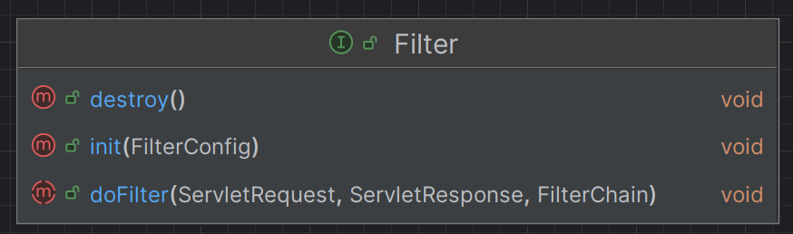

# 로그인 처리 - 필터
> 로그인 하지 않은 사용자를 걸러 내기 위해 모든 컨트롤러에 체크하는 로직을 만들 수 있겠지만 당연히 비효율적이다.
> 
> 이렇게 애플리케이션 여러 로직에서 공통으로 관심이 있는 것을 **공통 관심사(cross-cutting concern)** 라고 한다. 이러한 공통 관심사는
> 스프링의 AOP로도 해결할 수 있지만 웹과 관련된 공통 관심사는 **서블릿 필터** 또는 **스프링 인터셉터**를 사용하는 것이 좋다. 웹과 관련된 공통 관심사를 처리할 때는
> HTTP의 헤더나 URL의 정보들이 필요한데 **서블릿 필터**나 **스프링 인터셉터**는 `HttpServletRequest`를 제공한다.

### 서블릿 필터

- **필터 흐름**
  - `HTTP 요청` → `WAS` → `필터` → `서블릿` → `컨트롤러`

필터가 호출 된 다음에 서블릿이 호출이 되며, 특정 URL 패턴에 적용할 수 있다. (`/*`으로 하면 모든 요청에 필터 적용)<br>
필터에서 적절하지 않은 요청이라고 판단하면 컨트롤러까지 가지 않고 필터에서 끝을 낼 수도 있다.

- **필터 체인**
  - `HTTP 요청` → `WAS` → `필터1` → `필터2` → `필터3` → `서블릿` → `컨트롤러`

중간에 필터를 자유롭게 추가할 수 있다. 로그를 남기는 필터를 먼저 적용하고 로그인 여부를 체크하는 필터를 만들 수 있다.

- **Filter 인터페이스**



필터 인터페이스를 구현하고 등록하면 서블릿 컨테이너가 필터를 **싱글톤 객체**로 생성하고 관리한다.
- `init()` : 필터 초기화 메서드, 서블릿 컨테이너가 생성될 때 호출된다.
- `doFilter()` : 요청이 올 때마다 해당 메서드가 호출된다. 필터의 로직을 구현하면 된다.
- `destroy()` : 필터 종료 메서드, 서블릿 컨테이너가 종료될 때 호출된다.

### 요청 로그 필터 구현

로그 필터
```java
@Slf4j
public class LogFilter implements Filter {

    @Override
    public void init(FilterConfig filterConfig) throws ServletException {
        log.info("log filter init");
    }

    @Override
    public void doFilter(ServletRequest request, ServletResponse response, FilterChain chain) throws IOException, ServletException {
        log.info("log filter doFilter");

        HttpServletRequest httpRequest = (HttpServletRequest) request;
        String requestURI = httpRequest.getRequestURI();

        String uuid = UUID.randomUUID().toString();

        try {
            log.info("REQUEST [{}][{}]", uuid, requestURI);
            chain.doFilter(request, response);
        } catch (Exception e) {
            throw e;
        } finally {
            log.info("RESPONSE [{}][{}]", uuid, requestURI);
        }
    }

    @Override
    public void destroy() {
        log.info("log filter destroy");
    }
}
```
- `doFilter(ServletRequest request, ServletResponse response, FilterChain chain)`
  - HTTP 요청이 오면 `doFilter`가 호출된다.
  - `ServletRequest`는 HTTP 요청이 아닌 경우까지 고려해서 만든 인터페이스이다. HTTP를 사용하면 다운 캐스팅 하면 된다.
  - HTTP 요청을 구분하기 위해 `UUID`를 생성하고 `requestURI`와 같이 로그를 출력한다.
- `chain.doFilter(request, response)`
  - 가장 중요한 부분이다. 다음 필터가 있으면 필터를 호출하고 없으면 서블릿을 호출한다. **이 로직이 없으면 다음 단계로 진행하지 않는다.**

WebConfig 필터 설정
```java
@Configuration
public class WebConfig {
    
    @Bean
    public FilterRegistrationBean logFilter() {
        FilterRegistrationBean<Filter> filterRegistrationBean = new FilterRegistrationBean<>();
        filterRegistrationBean.setFilter(new LogFilter());
        filterRegistrationBean.setOrder(1); // 순서
        filterRegistrationBean.addUrlPatterns("/*"); // 모든 URL 적용
    
        return filterRegistrationBean;
    }
}
```

### 인증 체크 필터 구현

LoginCheckFilter
```java
@Slf4j
public class LoginCheckFilter implements Filter {

    private static final String[] whitelist = {"/", "/members/add", "/login", "/logout", "/css/*"};

    @Override
    public void doFilter(ServletRequest request, ServletResponse response, FilterChain chain) throws IOException, ServletException {

        HttpServletRequest httpRequest = (HttpServletRequest) request;
        String requestURI = httpRequest.getRequestURI();

        HttpServletResponse httpResponse = (HttpServletResponse) response;

        try {
            log.info("인증 체크 필터 시작 {}", requestURI);

            if (isLoginCheckPath(requestURI)) {
                log.info("인증 체크 로직 실행 {}", requestURI);
                HttpSession session = httpRequest.getSession(false);
                if (session == null || session.getAttribute(SessionConst.LOGIN_MEMBER) == null) {

                    log.info("미인증 사용자 요청 {}", requestURI);
                    //로그인으로 redirect
                    httpResponse.sendRedirect("/login?redirectURL=" + requestURI);
                    return;
                }
            }
            chain.doFilter(request, response);
        } catch (Exception e) {
            throw e; //예외 로깅 가능 하지만, 톰캣까지 예외를 보내주어야 함
        } finally {
            log.info("인증 체크 필터 종료 {} ", requestURI);
        }
    }

    /**
     * 화이트 리스트의 경우 인증 체크X
     */
    private boolean isLoginCheckPath(String requestURI) {
        return !PatternMatchUtils.simpleMatch(whitelist, requestURI);
    }
}
```

WebConfig
```java
@Configuration
public class WebConfig {
    
  @Bean
  public FilterRegistrationBean logFilter() {
      FilterRegistrationBean<Filter> filterRegistrationBean = new FilterRegistrationBean<>();
      filterRegistrationBean.setFilter(new LogFilter());
      filterRegistrationBean.setOrder(1); // 순서
      filterRegistrationBean.addUrlPatterns("/*"); // 모든 URL 적용
  
      return filterRegistrationBean;
  }

  @Bean
  public FilterRegistrationBean loginCheckFilter() {
      FilterRegistrationBean<Filter> filterRegistrationBean = new FilterRegistrationBean<>();
      filterRegistrationBean.setFilter(new LoginCheckFilter());
      filterRegistrationBean.setOrder(2);
      filterRegistrationBean.addUrlPatterns("/*");
  
      return filterRegistrationBean;
  }
}
```

컨트롤러 (로그인에 성공하면 처음 요청한 URL로 이동)
```java
@PostMapping("/login")
public String loginV4(@Valid @ModelAttribute("loginForm") LoginForm form, BindingResult bindingResult,
                      @RequestParam(defaultValue = "/") String redirectURL,
                      HttpServletRequest request) {

    if (bindingResult.hasErrors()) {
        return "login/loginForm";
    }

    Member loginMember = loginService.login(form.getLoginId(), form.getPassword());

    if (loginMember == null) {
        bindingResult.reject("loginFail", "아이디 또는 비밀번호가 맞지 않습니다.");
        return "login/loginForm";
    }
    
    //로그인 성공 처리
    //세션이 있으면 있는 세션 반환, 없으면 신규 세션을 생성
    HttpSession session = request.getSession();
    
    //세션에 로그인 회원 정보 보관
    session.setAttribute(SessionConst.LOGIN_MEMBER, loginMember);

    return "redirect:" + redirectURL;
}
```

공통 관심사를 서블릿 필터를 사용해서 해결한 덕분에 향후 로그인 정책이 변경되어도 필터 부분만 변경하면 된다.