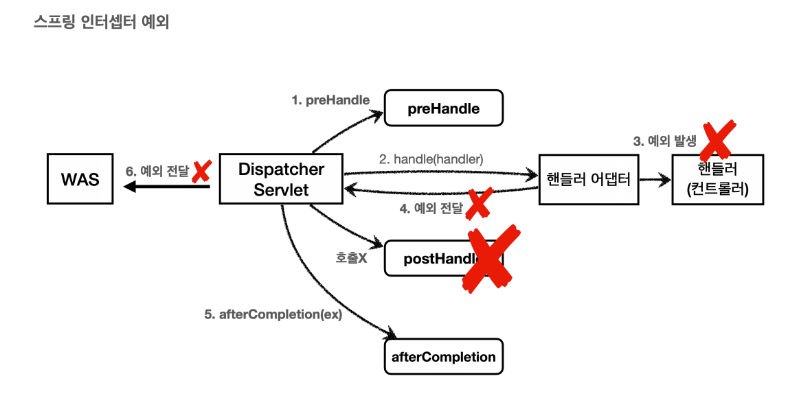
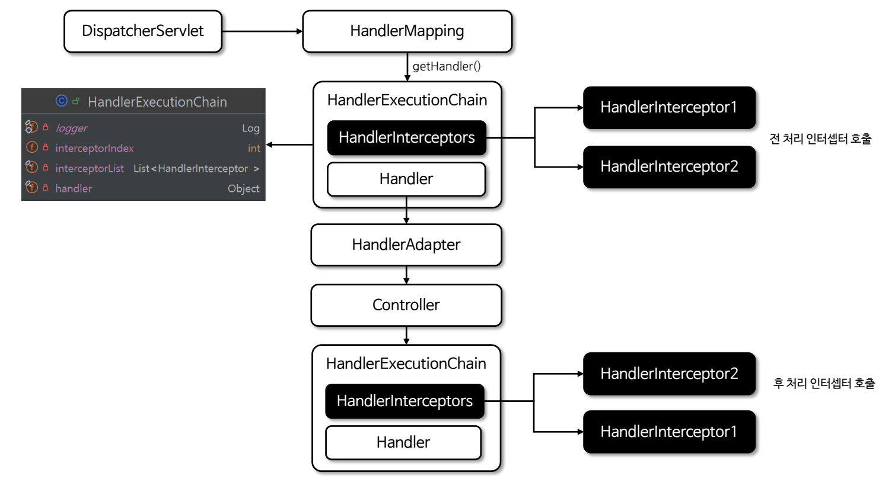
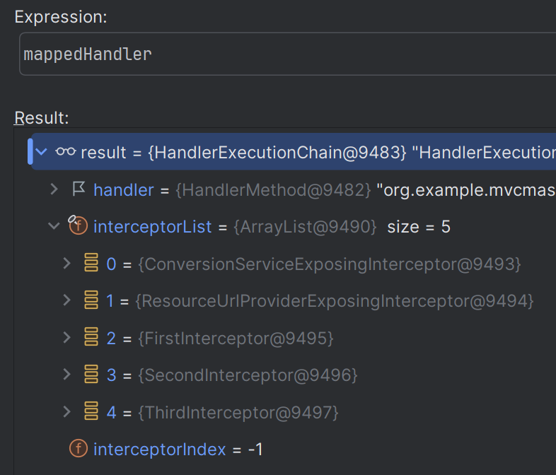
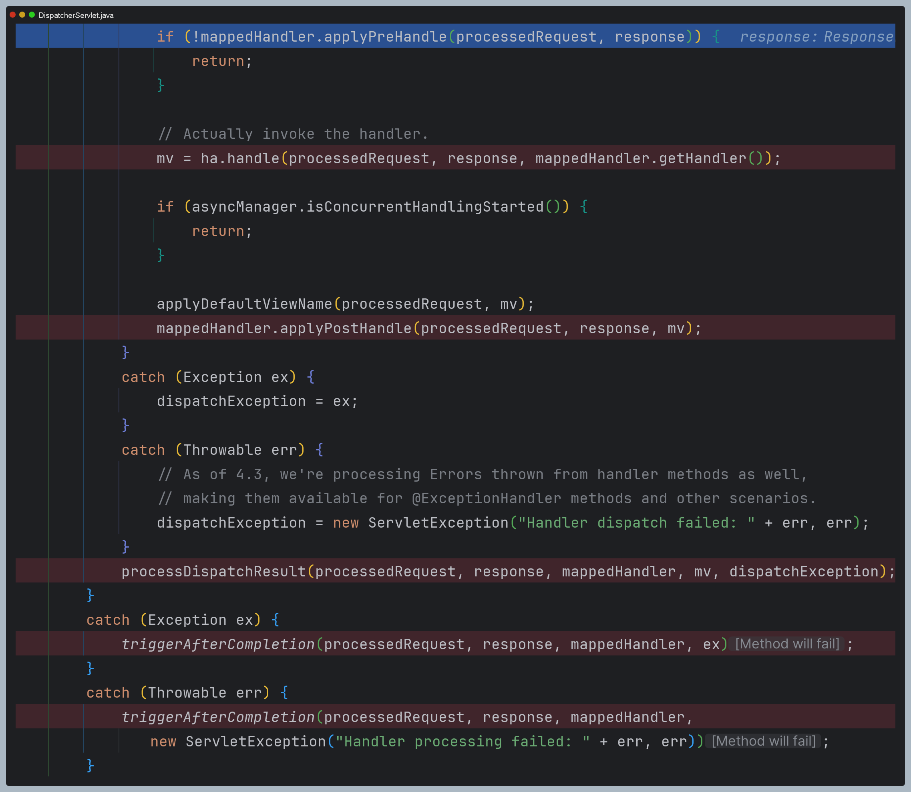
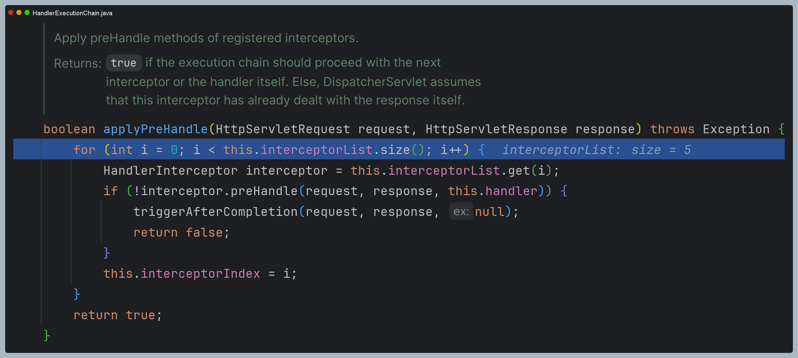
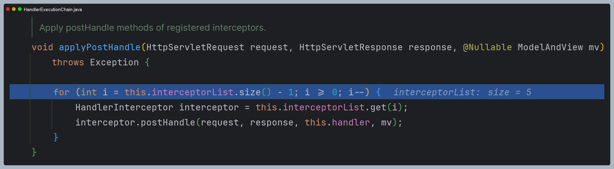
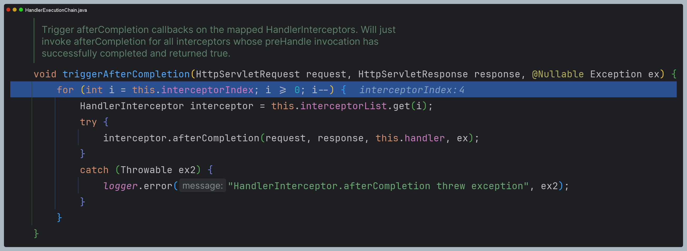
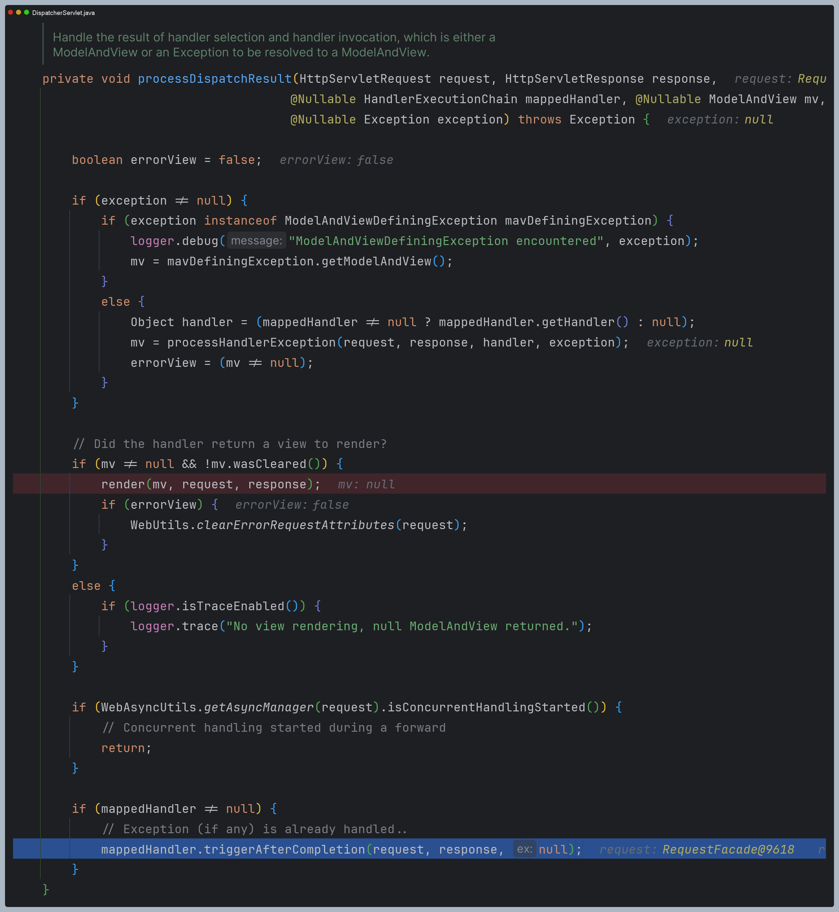

# 로그인 처리 - 인터셉터

### 스프링 인터셉터
> 서블릿 필터와 같이 웹 관련 공통 관심 사항을 효율적으로 해결할 수 있는 기술이다.<br>
> 서블릿 필터가 서블릿이 제공하는 기술이라면, 스프링 인터셉터는 스프링 MVC가 제공하는 기술이다. 
> **서블릿 필터**와 **스프링 인터셉터**는 적용되는 순서와 범위, 사용 방법이 다르다.

**스프링 인터셉터 흐름**
- `HTTP 요청` → `WAS` → `필터` → `서블릿` → `스프링 인터셉터` → `컨트롤러`
- 스프링 인터셉터는 **디스패처 서블릿과 컨트롤러 사이**에서 **컨트롤러 호출 직전에** 호출 된다.
- 스프링 인터셉터는 스프링 MVC가 제공하는 기능이기 때문에 결국 **디스패처 서블릿 이후에** 등장하게 된다. 스프링 MVC의 시작점이 디스패처 서블릿이라고 생각하면 이해하기 쉽다.
- 스프링 인터셉터에도 URL 패턴을 적용할 수 있는데, 서블릿 URL 패턴과는 다르고 매우 정밀하게 설정할 수 있다.
- 서블릿 필터와 똑같이 인터셉터에서 적절하지 않은 요청이라고 판단하면 컨트롤러까지 가지 않고 인터셉터에서 끝을 낼 수도 있다.

**스프링 인터셉터 체인**
- `HTTP 요청` → `WAS` → `필터` → `서블릿` →  `인터셉터1` → `인터셉터2` → `인터셉터3` → `컨트롤러`
- 중간에 인터셉터를 자유롭게 추가할 수 있다. 로그 인터셉터를 먼저 적용하고 그 다음에 로그인 여부 인터셉터를 만들 수 있다.
- 이 경우 등록된 순서대로 `preHandle`이 호출되고, 등록된 역순으로 `postHandle` 및 `afterCompletion`이 호출된다는 것을 알아두자.


**스프링 인터셉터 인터페이스**


- `preHandle` : 컨트롤러 호출 전
- `postHandle` : 컨트롤러 호출 후
- `afterCompletion` : 요청 완료 이후
> 서블릿 필터의 경우 단순히 `request`,`response`만 제공했지만, 인터셉터는 어떤 컨트롤러(`handler`)가 호출되는지 정보도 받을 수 있다. 그리고 어떤
> `modelAndView`가 반환되는지 응답 정보도 받을 수 있다.


- **정상 흐름**
  - `preHandle` : 컨트롤로 호출 전에 호출 (더 정확히는 핸들러 어댑터 호출 전에 호출)
    - `preHandle`에서 `true`를 반환하면 다음으로 진행하고 `false`를 반환하면 더는 진행하지 않는다. `false`인 경우 나머지 인터셉터를 포함해서 핸들러 
    어댑터도 호출되지 않는다. (그림 1번에서 끝이난다.)
  - `postHandle` : 컨트롤러 호출 후에 호출 (더 정확히는 핸들러 어댑터 호출 후에 호출)
  - `afterCompletion` : 뷰가 렌더링 된 이후에 호출



- **예외 발생 시**
  - `preHandle` : 컨트롤러 호출 전에 호출
  - `postHandle` : 컨트롤러에서 예외가 발생하면 호출되지 않는다.
  - `afterCompletion` : 항상 호출된다. 예외를 파라미터로 받아서 어떤 예외가 발생했는지 로그로 출력할 수 있다.
    - 예외가 발생하면 `postHandle()`은 호출되지 않으므로 예외와 무관하게 공통 처리를 하려면 `afterCompletion()`을 사용해야 한다.
    - 예외가 발생하면 `afterCompletion()`에 예외 정보(`ex`)를 포함해서 호출된다,

## 스프링 인터셉터 - 요청 로그
LogInterceptor
```java
@Slf4j
public class LogInterceptor implements HandlerInterceptor {

    public static final String LOG_ID = "logId";

    @Override
    public boolean preHandle(HttpServletRequest request, HttpServletResponse response, Object handler) throws Exception {

        String requestURI = request.getRequestURI();
        String uuid = UUID.randomUUID().toString();

        request.setAttribute(LOG_ID, uuid);

        //@RequestMapping: HandlerMethod
        //정적 리소스: ResourceHttpRequestHandler
        if (handler instanceof HandlerMethod) {
            HandlerMethod hm = (HandlerMethod) handler;//호출할 컨트롤러 메서드의 모든 정보가 포함되어 있다.
        }

        log.info("REQUEST [{}][{}][{}]", uuid, requestURI, handler);
        return true;
    }

    @Override
    public void postHandle(HttpServletRequest request, HttpServletResponse response, Object handler, ModelAndView modelAndView) throws Exception {
        log.info("postHandle [{}]", modelAndView);
    }

    @Override
    public void afterCompletion(HttpServletRequest request, HttpServletResponse response, Object handler, Exception ex) throws Exception {
        String requestURI = request.getRequestURI();
        String logId = (String) request.getAttribute(LOG_ID);
        log.info("RESPONSE [{}][{}][{}]", logId, requestURI, handler);
        if (ex != null) {
            log.error("afterCompletion error!!", ex);
        }
    }
}
```

- `request.setAttribute(LOG_ID, uuid);`
  - 서블릿 필터의 경우 지역변수로 해결이 가능하지만 스프링 인터셉터는 호출 시점이 완전히 분리되어 있기 때문에 `preHandle`에서 지정한 값을 `postHandle`, `afterCompletion`
    에서 함께 사용하려면 어딘가에 담아두어야 한다. 인터셉터 역시 싱글톤처럼 사용되기 때문에 멤버 변수를 사용하면 위험하다.
  - `ThreadLocal`을 사용할 수도 있다.
- `afterCompletion`은 예외가 발생해도 호출이 보장되기 때문에 종료 로그를 `afterCompletion`에서 실행한다.
- 필터와 비교해보면 인터셉터는 매우 정밀하게 URL 패턴을 지정할 수 있다. ([PathPattern 공식 문서](https://docs.spring.io/spring-framework/docs/current/javadoc-api/org/springframework/web/util/pattern/PathPattern.html))

> - `preHandle` 메서드에는 `RequestMappingHandlerMapping` 클래스로부터 생성된 `HandlerMethod` 객체가 전달된다.
> - 이 객체를 활용해서 다양한 전처리 작업을 공통으로 수행할 수 있다.
>
> ```java
> public class MyInterceptor implements HandlerInterceptor {
>
>    @Override
>    public boolean preHandle(HttpServletRequest request, HttpServletResponse response, Object handler) throws Exception {
>
>        if (handler instanceof HandlerMethod handlerMethod) {
>            String controllerName = handlerMethod.getBeanType().getSimpleName();
>            String methodName = handlerMethod.getMethod().getName();
>
>            //핸들러에 특정 어노테이션 확인
>            AdminOnly adminOnly = handlerMethod.getMethodAnnotation(AdminOnly.class);
>
>            if (adminOnly != null) {
>                String userRole = request.getHeader("Role");
>                //권한 불만족시 요청 거부
>                if (userRole == null || !userRole.equals("ADMIN")) {
>                    response.setStatus(HttpServletResponse.SC_FORBIDDEN);
>                    response.getWriter().write("Access Denied: Admin only");
>                    return false;
>                }
>            }
>
>            System.out.println("Controller Name: " + controllerName + ", Method: " + methodName);
>        }
>
>        return true;
>    }
> }
> ```
> 
> 다만 위 예제와 같은 경우 인터셉터를 보안 계층으로 사용했는데 이러한 보안 작업은 **Spring Security** 또는 **서블릿 필터**를
> 사용하는 것이 좋다.

> - `postHandle` 메서드에는 `RequestMappingHandlerAdapter` 클래스 실행 후 반환된 `ModelAndView` 객체가 전달된다.
> - 이 객체를 활용해서 다양한 후처리 작업을 공통으로 수행할 수 있다.
> ```java
> public class MyInterceptor implements HandlerInterceptor {
> 
>     @Override
>     public void postHandle(HttpServletRequest request, HttpServletResponse response, Object handler, ModelAndView modelAndView) {
>         if (modelAndView != null) {
>             String viewName = modelAndView.getViewName();
>             
>             if ("userProfile".equals(viewName)) {
>                 //컨트롤러에서 넘긴 데이터 확인
>                 Map<String, Object> model = modelAndView.getModel();
> 
>                 if (model.containsKey("username")) {
>                     //사용자 이름에 따라 모델에 권한 정보 추가
>                     String username = (String) model.get("username");
>                     String role = getRole(username);
>                     modelAndView.addObject("role", role);
>                 }
>             }
>         }
>     }
> 
>     private String getRole(String username) {
>         return switch (username) {
>             case "admin" -> "Administrator";
>             case "guest" -> "Guest";
>             default -> "User";
>         };
>     }
> }
> ```

WebConfig (인터셉터 등록)
```java
@Configuration
public class WebConfig implements WebMvcConfigurer {
    @Override
    public void addInterceptors(InterceptorRegistry registry) {
        registry.addInterceptor(new LogInterceptor())
                .order(1)
                .addPathPatterns("/**")
                .excludePathPatterns("/css/**", "/*.ico", "/error");
    }
}
```

## 스프링 인터셉터 - 인증 체크

LoginCheckInterceptor
```java
@Slf4j
public class LoginCheckInterceptor implements HandlerInterceptor {

    @Override
    public boolean preHandle(HttpServletRequest request, HttpServletResponse response, Object handler) throws Exception {

        String requestURI = request.getRequestURI();

        log.info("인증 체크 인터셉터 실행 {}", requestURI);

        HttpSession session = request.getSession();

        if (session == null || session.getAttribute(SessionConst.LOGIN_MEMBER) == null) {
            log.info("미인증 사용자 요청");
            //로그인으로 redirect
            response.sendRedirect("/login?redirectURL=" + requestURI);
            return false;
        }

        return true;
    }
}
```

WebConfig
```java
@Configuration
public class WebConfig implements WebMvcConfigurer {
    @Override
    public void addInterceptors(InterceptorRegistry registry) {
        registry.addInterceptor(new LogInterceptor())
                .order(1)
                .addPathPatterns("/**")
                .excludePathPatterns("/css/**", "/*.ico", "/error");

        registry.addInterceptor(new LoginCheckInterceptor())
                .order(2)
                .addPathPatterns("/**")
                .excludePathPatterns("/", "/members/add", "/login", "/logout",
                        "/css/**", "/*.ico", "/error");
    }
}
```
인증은 컨트롤러 호출 전에만 호출되면 되기 때문에 `preHander`만 구현하면 된다.

## ArgumentResolver 활용

@Login 어노테이션 
```java
@Target(ElementType.PARAMETER)
@Retention(RetentionPolicy.RUNTIME)
public @interface Login {
}
```
- `@Target(ElementType.PARAMETER)` : 파라미터에만 사용
- `@Retention(RetentionPolicy.RUNTIME)` : 런타임까지 어노테이션 정보가 남아있음  

LoginMemberArgumentResolver
```java
@Slf4j
public class LoginMemberArgumentResolver implements HandlerMethodArgumentResolver {

    @Override
    public boolean supportsParameter(MethodParameter parameter) {
        log.info("supportsParameter 실행");

        boolean hasLoginAnnotation = parameter.hasParameterAnnotation(Login.class);
        boolean hasMemberType = Member.class.isAssignableFrom(parameter.getParameterType());

        return hasLoginAnnotation && hasMemberType;
    }

    @Override
    public Object resolveArgument(MethodParameter parameter, ModelAndViewContainer mavContainer, NativeWebRequest webRequest, WebDataBinderFactory binderFactory) throws Exception {

        log.info("resolveArgument 실행");

        HttpServletRequest request = (HttpServletRequest) webRequest.getNativeRequest();
        HttpSession session = request.getSession(false);
        if (session == null) {
            return null;
        }

        return session.getAttribute(SessionConst.LOGIN_MEMBER);
    }
}
```
- `supportsParameter()` : `@Login` 어노테이션이 있으면서 `Member`타입이면 해당 `ArgumentResolver`가 사용된다.
- `resolveArgument()` : 컨트롤러 호출 직전에 호출 되어서 필요한 파라미터 정보를 생성해준다. 스프링 MVC는 컨트롤러의 메서드를 호출하면서 반환된 객체를
파라미터에 전달해준다.

WebConfig
```java
@Configuration
public class WebConfig implements WebMvcConfigurer {

    @Override
    public void addArgumentResolvers(List<HandlerMethodArgumentResolver> resolvers) {
        resolvers.add(new LoginMemberArgumentResolver());
    }
}
```

컨트롤러
```java
@GetMapping("/")
public String homeLoginV3ArgumentResolver(@Login Member loginMember, Model model) {

    //세션에 회원 데이터가 없으면 home
    if (loginMember == null) {
        return "home";
    }

    //세션이 유지되면 로그인으로 이동
    model.addAttribute("member", loginMember);
    return "loginHome";
}
```

---

# 인터셉터 내부 호출 과정



- `RequestMappingHandlerMapping`클래스를 통해 핸들러를 가져올 때 `HandlerExecutionChain` 객체로 받는데, 이 객체 안에는
  핸들러 정보와 인터셉터 정보가 모두 가지고 있다. ([참고](https://github.com/geun-00/TIL/blob/main/Spring/springmvc_1/handlerMapping/HandlerMapping.md#requestmappinghandlermapping))
- `HandlerExecutionChain` 객체는 등록된 인터셉터들의 각 메서드를 호출하는 역할을 가지고 있다.




- 이후 호출 순서를 보면 `HandlerAdapter`에게 요청을 넘기기 전에 인터셉터의 `preHandle`을 호출한다. 하나의 인터셉터라도 `preHandle`에서 `false`를
반환하면 이후 아무것도 진행되지 않는다.
- `HandlerAdapter`의 요청 처리가 끝나고 나면 인터셉터의 `postHandle`을 호출한다.
- `afterCompletion`은 예외가 발생하더라도 항상 호출하는 것을 확인할 수 있다.



- `applyPreHandle` 메서드를 보면 등록된 인터셉터 순서대로 `preHandle`을 호출한다.
- 여기서 하나의 인터셉터에서 `false`를 반환하더라도 항상 `afterCompletion`을 호출한다.



- `applyPostHandle` 메서드를 보면 등록된 인터셉터의 역순으로 `postHandle`을 호출한다.



- `triggerAfterCompletion` 메서드를 보면 `preHandle`에서 마지막으로 `true`를 반환한 인터셉터부터 역순으로
`afterCompletion`을 호출한다.



- 뷰의 렌더링 과정이 모두 끝나고 나서도 위 메서드는 호출된다.


