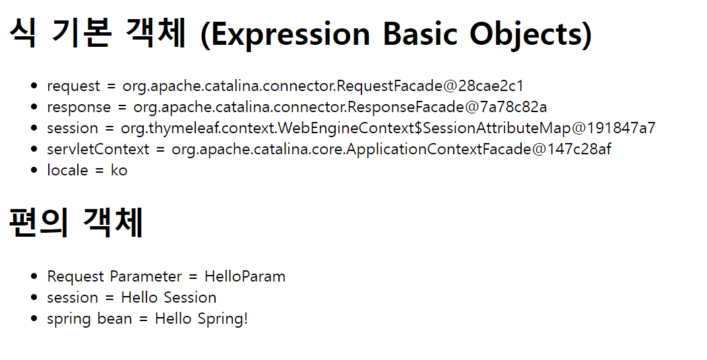

# 기본 객체들

- 컨트롤러
```java
@GetMapping("/basic-objects")
    public String basicObjects(Model model, HttpServletRequest request,
                               HttpServletResponse response, HttpSession session) {
        session.setAttribute("sessionData", "Hello Session");
        model.addAttribute("request", request);
        model.addAttribute("response", response);
        model.addAttribute("servletContext", request.getServletContext());
        return "basic/basic-objects";
    }

    @Component("helloBean")
    static class HelloBean {
        public String hello(String data) {
            return "Hello " + data;
        }
    }
```

- HTML
```html
<!DOCTYPE html>
<html xmlns:th="http://www.thymeleaf.org">
<head>
    <meta charset="UTF-8">
    <title>Title</title>
</head>
<body>
<h1>식 기본 객체 (Expression Basic Objects)</h1>
<ul>
    <li>request = <span th:text="${request}"></span></li>
    <li>response = <span th:text="${response}"></span></li>
    <li>session = <span th:text="${session}"></span></li>
    <li>servletContext = <span th:text="${servletContext}"></span></li>
    <li>locale = <span th:text="${#locale}"></span></li>
</ul>
<h1>편의 객체</h1>
<ul>
    <li>Request Parameter = <span th:text="${param.paramData}"></span></li>
    <li>session = <span th:text="${session.sessionData}"></span></li>
    <li>spring bean = <span th:text="${@helloBean.hello('Spring!')}"></span></li>
</ul>
</body>
</html>
```

요청 : http://localhost:8080/basic/basic-objects?paramData=HelloParam



타임리프는 편의 객체를 제공한다.
- HTTP 요청 파라미터 접근 : ``${param.**}``
- HTTP 세션 접근 : ``${session.**}``
- 스프링 빈 접근 ``${@BeanName.**}``