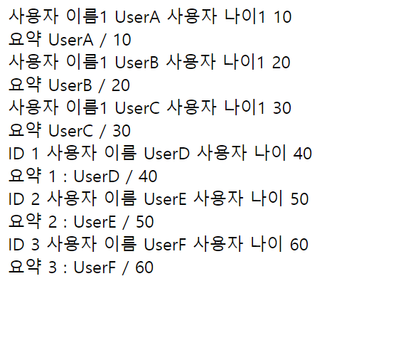

# 블록
> ``th:block`` , HTML 태그가 아닌 타임리프의 유일한 자체 태그

- 컨트롤러
```java
 @GetMapping("/block")
    public String block(Model model) {
        addUsers(model);
        return "basic/block";
    }
private void addUsers(Model model) {
        List<User> list = new ArrayList<>();
        list.add(new User("UserA", 10));
        list.add(new User("UserB", 20));
        list.add(new User("UserC", 30));

        model.addAttribute("users", list);

        Map<Long, User> map = new HashMap<>();
        map.put(1L, new User("UserD", 40));
        map.put(2L, new User("UserE", 50));
        map.put(3L, new User("UserF", 60));

        model.addAttribute("userMap", map);
}
```

- HTML
```html
<!DOCTYPE html>
<html xmlns:th="http://www.thymeleaf.org">
<head>
    <meta charset="UTF-8">
    <title>Title</title>
</head>
<body>
<th:block th:each="user : ${users}">
    <div>
        사용자 이름1 <span th:text="${user.username}"></span>
        사용자 나이1 <span th:text="${user.age}"></span>
    </div>
    <div>
        요약 <span th:text="${user.username} + ' / ' + ${user.age}"></span>
    </div>
</th:block>

<th:block th:each="user : ${userMap.entrySet()}">
    <div>
        ID <span th:text="${user.key}"></span>
        사용자 이름 <span th:text="${user.value.username}"></span>
        사용자 나이 <span th:text="${user.value.age}"></span>
    </div>
    <div>
        요약 <span th:text="|${user.key} : ${user.value.username} / ${user.value.age}|"></span>
    </div>
</th:block>
</body>
</html>
```

