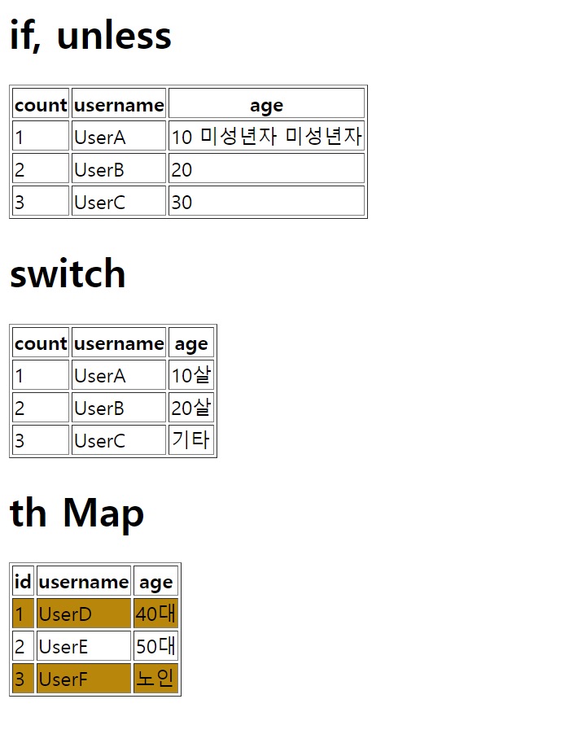

# 조건부 평가
> ``if``, ``unless``

- 컨트롤러
```java
@GetMapping("/condition")
    public String condition(Model model) {
        addUsers(model);
        return "basic/condition";
    }

private void addUsers(Model model) {
        List<User> list = new ArrayList<>();
        list.add(new User("UserA", 10));
        list.add(new User("UserB", 20));
        list.add(new User("UserC", 30));

        model.addAttribute("users", list);

        Map<Long, User> map = new HashMap<>();
        map.put(1L, new User("UserD", 40));
        map.put(2L, new User("UserE", 50));
        map.put(3L, new User("UserF", 60));

        model.addAttribute("userMap", map);
}
```

- HTML
```html
<!DOCTYPE html>
<html xmlns:th="http://www.thymeleaf.org" xmlns="">
<head>
    <meta charset="UTF-8">
    <title>Title</title>
</head>
<style>
    .odd-row{
        background-color: darkgoldenrod;
    }
</style>
<body>
<h1>if, unless</h1>
<table border="1">
    <tr>
        <th>count</th>
        <th>username</th>
        <th>age</th>
    </tr>
    <tr th:each="user, userStat : ${users}">
        <td th:text="${userStat.count}">1</td>
        <td th:text="${user.username}">username</td>
        <td>
            <span th:text="${user.age}">0</span>
            <span th:text="'미성년자'" th:if="${user.age < 20}"></span>
            <span th:text="'미성년자'" th:unless="${user.age >= 20}"></span>
        </td>
    </tr>
</table>
<h1>switch</h1>
<table border="1">
    <tr>
        <th>count</th>
        <th>username</th>
        <th>age</th>
    </tr>
    <tr th:each="user, userStat : ${users}">
        <td th:text="${userStat.count}">1</td>
        <td th:text="${user.username}">username</td>
        <td th:switch="${user.age}">
            <span th:case="10">10살</span>
            <span th:case="20">20살</span>
            <span th:case="*">기타</span>
        </td>
    </tr>
</table>
<h1>th Map</h1>
<table border="1">
    <tr>
        <th>id</th>
        <th>username</th>
        <th>age</th>
    </tr>
    <tr th:each="user, userStat : ${userMap.entrySet()}" th:class="${userStat.odd} ? 'odd-row' : ''">
        <td th:text="${user.key}"></td>
        <td th:text="${user.value.username}"></td>
        <td th:switch="${user.value.age}">
            <span th:case="40">40대</span>
            <span th:case="50">50대</span>
            <span th:case="*">노인</span>
        </td>
    </tr>
</table>
</body>
</html>
```



타임리프는 ``th:if``안에 조건이 false인 경우 해당 태그를 아예 렌더링 하지 않는다.

``switch``에 ``*``은 디폴트 값이다.