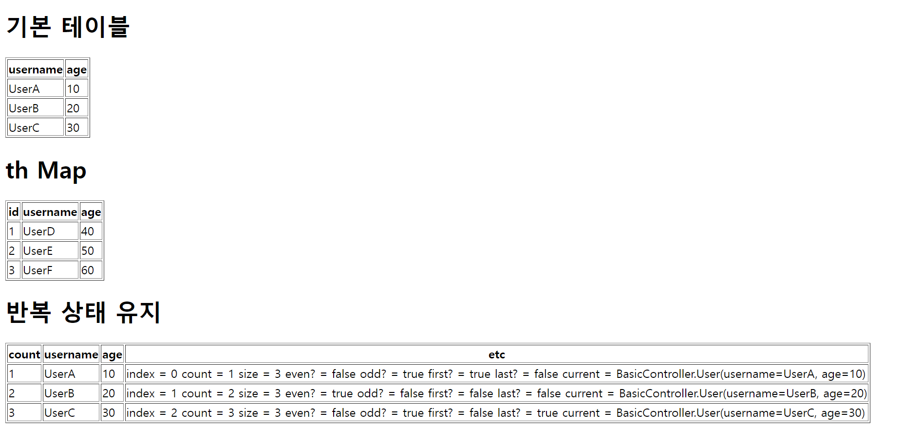

# 반복
> 타임리프에서 반복은 ``th:each``를 사용한다.

- 컨트롤러
```java
@GetMapping("/each")
    public String each(Model model) {
        addUsers(model);
        return "basic/each";
    }

private void addUsers(Model model){
        List<User> list=new ArrayList<>();
        list.add(new User("UserA",10));
        list.add(new User("UserB",20));
        list.add(new User("UserC",30));

        model.addAttribute("users",list);

        Map<Long, User> map=new HashMap<>();
        map.put(1L,new User("UserD",40));
        map.put(2L,new User("UserE",50));
        map.put(3L,new User("UserF",60));

        model.addAttribute("userMap",map);
}
```

- HTML
```html
<!DOCTYPE html>
<html xmlns:th="http://www.thymeleaf.org">
<head>
    <meta charset="UTF-8">
    <title>Title</title>
</head>
<body>
<h1>기본 테이블</h1>
<table border="1">
    <tr>
        <th>username</th>
        <th>age</th>
    </tr>
    <tr th:each="user : ${users}">
        <td th:text="${user.username}">username</td>
        <td th:text="${user.age}">0</td>
    </tr>
</table>
<h1>th Map</h1>
<table border="1">
    <tr>
        <th>id</th>
        <th>username</th>
        <th>age</th>
    </tr>
    <tr th:each="entry : ${userMap.entrySet()}">
        <td th:text="${entry.key}"></td>
        <td th:text="${entry.value.username}"></td>
        <td th:text="${entry.value.age}"></td>
    </tr>
</table>
<h1>반복 상태 유지</h1>
<table border="1">
    <tr>
        <th>count</th>
        <th>username</th>
        <th>age</th>
        <th>etc</th>
    </tr>
    <tr th:each="user, userStat : ${users}">
        <td th:text="${userStat.count}">username</td>
        <td th:text="${user.username}">username</td>
        <td th:text="${user.age}">0</td>
        <td>
            index = <span th:text="${userStat.index}"></span>
            count = <span th:text="${userStat.count}"></span>
            size = <span th:text="${userStat.size}"></span>
            even? = <span th:text="${userStat.even}"></span>
            odd? = <span th:text="${userStat.odd}"></span>
            first? = <span th:text="${userStat.first}"></span>
            last? = <span th:text="${userStat.last}"></span>
            current = <span th:text="${userStat.current}"></span>
        </td>
    </tr>
</table>
</body>
</html>
```



- `` <tr th:each="user : ${users}">``
  - 오른쪽 컬렉션의 값을 하나씩 꺼내서 왼쪽 변수(``user``)에 담아서 태그를 반복 실행한다.
  - 루프를 돌수 있는 모든 객체 사용 가능하다. Map 같은 경우 변수에 담기는 값은 ``Map.entry``이다.

- ``<tr th:each="user, userStat : ${users}">``
  - 반복의 두 번째 파라미터를 설정해서 반복의 상태를 확인 할 수 있다.
  - 생략 가능한데 생략하면 지정한 변수명 + ``Stat``이 된다.

- 반복 상태 유지 기능
  - **index** : 0부터 시작하는 값
  - **count** : 1부터 시작하는 값
  - **size** : 전체 사이즈
  - **even, odd** : 홀수, 짝수 여부(boolean)
  - **first, last** : 처음, 마지막 여부(boolean)
  - **current** : 현재 객체