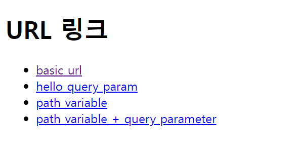

# URL 링크
> ``@{...}``문법을 사용한다.

- 컨트롤러
```java
 @GetMapping("/link")
    public String link(Model model) {
        model.addAttribute("param1", "data1");
        model.addAttribute("param2", "data2");
        return "basic/link";
    }
```

- HTML
```html
<!DOCTYPE html>
<html xmlns:th="http://www.thymeleaf.org">
<head>
    <meta charset="UTF-8">
    <title>Title</title>
</head>
<body>
<h1>URL 링크</h1>
<ul>
    <li><a th:href="@{/hello}">basic url</a></li>
    <li><a th:href="@{/hello(param1=${param1}, param2=${param2})}">hello query param</a></li>
    <li><a th:href="@{/hello/{param1}/{param2}(param1=${param1}, param2=${param2})}">path variable</a></li>
    <li><a th:href="@{/hello/{param1}(param1=${param1}, param2=${param2})}">path variable + query parameter</a></li>
</ul>
</body>
</html>
```



- ``@{/hello}`` -> **/hello**
- ``@{/hello(param1=${param1}, param2=${param2})}`` -> **/hello?param1=data1&param2=data2**
- ``@{/hello/{param1}/{param2}(param1=${param1}, param2=${param2})}`` -> **/hello/data1/data2**
- ``@{/hello/{param1}(param1=${param1}, param2=${param2})}`` -> **/hello/data1?param2=data2**