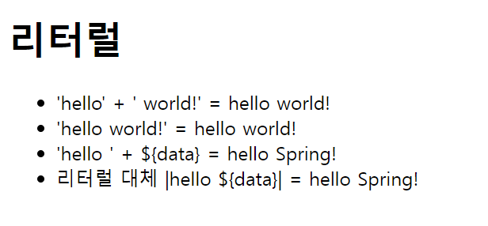

# 리터럴

- 컨트롤러
```java
@GetMapping("/literal")
    public String literal(Model model) {
        model.addAttribute("data", "Spring!");
        return "basic/literal";
    }
```

- HTML
```html
<!DOCTYPE html>
<html xmlns:th="http://www.thymeleaf.org">
<head>
    <meta charset="UTF-8">
    <title>Title</title>
</head>
<body>
<h1>리터럴</h1>
<ul>
    <!--주의! 다음 주석을 풀면 예외가 발생함-->
<!--        <li>"hello world!" = <span th:text="hello world!"></span></li>-->
    <li>'hello' + ' world!' = <span th:text="'hello' + ' world!'"></span></li>
    <li>'hello world!' = <span th:text="'hello world!'"></span></li>
    <li>'hello ' + ${data} = <span th:text="'hello ' + ${data}"></span></li>
    <li>리터럴 대체 |hello ${data}| = <span th:text="|hello ${data}|"></span></li>
</ul>
</body>
</html>
```



타임리프에서 문자 리터럴은 항상 ``'``(작은 따옴표)로 감싸야 하는데 룰에 따라서 공백 없이 쭉 이어진다면 하나의 의미있는 토큰으로 인지해서 생략할 수 있다.

룰: ``A-Z``, ``a-z``, ``0-9``, ``[]``, ``.``, ``-``, ``_``

주석 라인은 가운데 공백이 있기 때문에 가운데에서 ``+``로 연결해줘야 한다.

**리터럴 대체**문법을 사용하여 편리하게 한 문자로 처리할 수 있다.