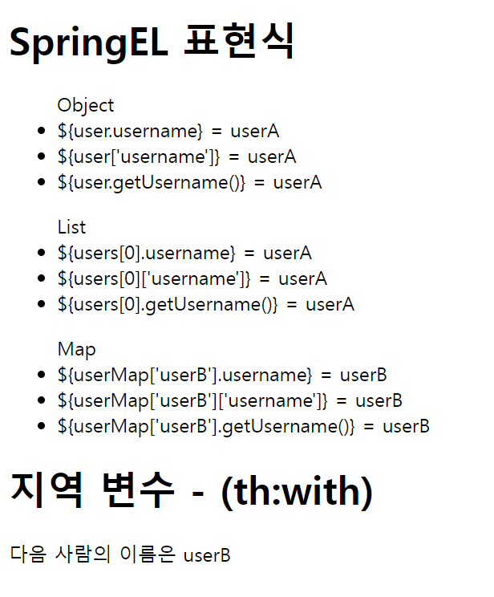

# 변수 - SpringEL
> 변수를 사용할 때는 변수 표현식을 사용한다. ``${...}``

- 컨트롤러
```java
@GetMapping("/variable")
    public String variable(Model model) {
        User userA = new User("userA", 20);
        User userB = new User("userB", 30);

        List<User> list = new ArrayList<>();
        list.add(userA);
        list.add(userB);

        Map<String, User> map = new HashMap<>();

        map.put("userA", userA);
        map.put("userB", userB);

        model.addAttribute("user", userA);
        model.addAttribute("users", list);
        model.addAttribute("userMap", map);

        return "basic/variable";
    }

@Data
static class User{
    private String username;
    private int age;

    public User(String username, int age) {
        this.username = username;
        this.age = age;
    }
}
```

- HTML
```html
<!DOCTYPE html>
<html xmlns:th="http://www.thymeleaf.org">
<head>
    <meta charset="UTF-8">
    <title>Title</title>
</head>
<body>
<h1>SpringEL 표현식</h1>
<ul>Object
    <li>${user.username} =    <span th:text="${user.username}"></span></li>
    <li>${user['username']} = <span th:text="${user['username']}"></span></li>
    <li>${user.getUsername()} = <span th:text="${user.getUsername()}"></span></li>
</ul>
<ul>List
    <li>${users[0].username}    = <span th:text="${users[0].username}"></span></li>
    <li>${users[0]['username']} = <span th:text="${users[0]['username']}"></span></li>
    <li>${users[0].getUsername()} = <span th:text="${users[0].getUsername()}"></span></li>
</ul>
<ul>Map
    <li>${userMap['userB'].username} =  <span th:text="${userMap['userB'].username}"></span></li>
    <li>${userMap['userB']['username']} = <span th:text="${userMap['userB']['username']}"></span></li>
    <li>${userMap['userB'].getUsername()} = <span th:text="${userMap['userB'].getUsername()}"></span>
</ul>

<h1>지역 변수 - (th:with)</h1>
<div th:with="first=${users[1]}">
    <p>다음 사람의 이름은 <span th:text="${first.username}"></span></p>
</div>
<div>
</div>
</body>
</html>
```



기본적으로 프로퍼티 접근법을 사용하여 데이터를 조회한다.

``th:with``를 사용하여 지역 변수로 선언할 수 있다. 선언한 태그 안에서만 사용할 수 있다.


