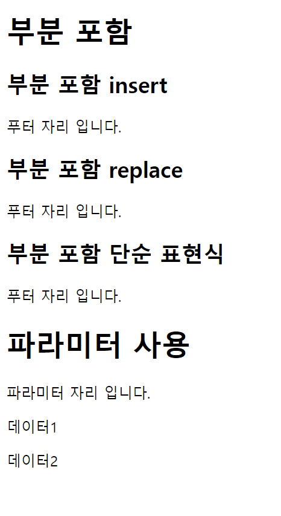

# 템플릿 조각
> 웹 페이지를 개발할 때는 상단 영역, 하단 영역 등 여러 페이지에서 사용하는 영역들이 있다. 타임리프는 편리하게 사용할 수 있도록 템플릿 조각과 
> 레이아웃 기능을 제공한다.

- 컨트롤러
```java
 @GetMapping("/fragment")
    public String template() {
        return "template/fragment/fragmentMain";
    }
```

- footer.html
```html
<!DOCTYPE html>
<html xmlns:th="http://www.thymeleaf.org">
<body>
<footer th:fragment="copy">
    푸터 자리 입니다.
</footer>
<footer th:fragment="copyParam (param1, param2)">
    <p>파라미터 자리 입니다.</p>
    <p th:text="${param1}"></p>
    <p th:text="${param2}"></p>
</footer>
</body>
</html>
```
``th:fragment``가 있는 태그는 다른 곳에 포함되는 코드 조각으로 볼 수 있다.

사용하는 곳에서 ``copy``, ``copyParam``을 호출하는 식으로 사용할 수 있다.

- fragmentMain.html
```html
<!DOCTYPE html>
<html xmlns:th="http://www.thymeleaf.org">
<head>
    <meta charset="UTF-8">
    <title>Title</title>
</head>
<body>
<h1>부분 포함</h1>
<h2>부분 포함 insert</h2>
<div th:insert="~{template/fragment/footer :: copy}"></div>

<h2>부분 포함 replace</h2>
<div th:replace="~{template/fragment/footer :: copy}"></div>

<h2>부분 포함 단순 표현식</h2>
<div th:replace="template/fragment/footer :: copy"></div>

<h1>파라미터 사용</h1>
<div th:replace="~{template/fragment/footer :: copyParam ('데이터1', '데이터2')}"></div>

</body>
</html>
```



- 렌더링 된 HTML
```html
<!DOCTYPE html>
<html>
<head>
    <meta charset="UTF-8">
    <title>Title</title>
</head>
<body>
<h1>부분 포함</h1>
<h2>부분 포함 insert</h2>
<div><footer>
    푸터 자리 입니다.
</footer></div>

<h2>부분 포함 replace</h2>
<footer>
    푸터 자리 입니다.
</footer>

<h2>부분 포함 단순 표현식</h2>
<footer>
    푸터 자리 입니다.
</footer>

<h1>파라미터 사용</h1>
<footer>
    <p>파라미터 자리 입니다.</p>
    <p>데이터1</p>
    <p>데이터2</p>
</footer>

</body>
</html>
```

- ``th:insert``를 사용하면 현재 태그 내부에 추가한다.
- ``th:replace``를 사용하면 현재 태그를 대체한다.