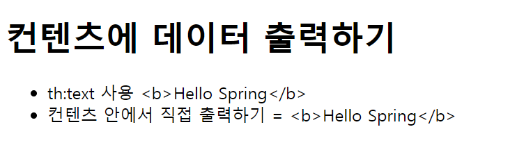
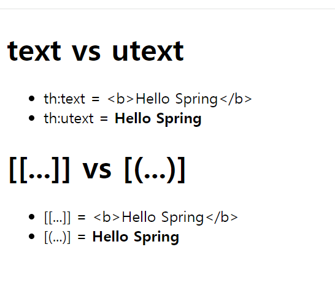

# text, utext
> HTML 콘텐츠에 데이터를 출력할 때는 ``th:text``를 사용한다.<br>
> HTML 태그 속성이 아닌 콘텐츠 영역 안에서 출력을 하려면 ``[[...]]``을 사용한다.


- 컨트롤러
```java
@RequestMapping("text-basic")
    public String textBasic(Model model) {
        model.addAttribute("data", "<b>Hello Spring</b>");
        return "basic/text-basic";
    }
```

- HTML
```html
<!DOCTYPE html>
<html xmlns:th="http://www.thymeleaf.org">
<head>
    <meta charset="UTF-8">
    <title>Title</title>
</head>
<body>
<h1>컨텐츠에 데이터 출력하기</h1>
<ul>
    <li>th:text 사용 <span th:text="${data}"></span></li>
    <li>컨텐츠 안에서 직접 출력하기 = [[${data}]]</li>
</ul>
</body>
</html>
```



``<b>`` 태그를 사용하려고 했는데 그대로 나와버렸다.

웹 브라우저는 ``<``를 HTML 태그의 시작으로 인식하기 때문에 문자로 표현할 수 있는 방법이 필요한데 이것을 [HTML 엔티티](https://www.freeformatter.com/html-entities.html)라고 한다.

이렇게 HTML에서 사용하는 특수 문자를 HTML 엔티티로 변경하는 것을 ``이스케이프(escape)``라고 한다. 타임리프의 ``th:text``, ``[[...]]``는 기본적으로 
이스케이프를 제공한다.

## Unescape

타임리프는 두 기능을 제공한다.
- **th:text -> th:utext**
- **[[...]] -> [(...)]**


unescape.html
```html
<!DOCTYPE html>
<html xmlns:th="http://www.thymeleaf.org">
<head>
    <meta charset="UTF-8">
    <title>Title</title>
</head>
<body>
<h1>text vs utext</h1>
<ul>
    <li>th:text = <span th:text="${data}"></span></li>
    <li>th:utext = <span th:utext="${data}"></span></li>
</ul>
<h1><span th:inline="none">[[...]] vs [(...)]</span></h1>
<ul>
    <li><span th:inline="none">[[...]] = </span>[[${data}]]</li>
    <li><span th:inline="none">[(...)] = </span>[(${data})]</li>
</ul>
</body>
</html>
```




- ``th:inline="none"``
  - 이 태그 안에서는 타임리프가 해석하지 말라는 뜻이다. 타임리프는 ``[[...]]``를 해석하기 때문에 ``th:inline="none"``을 설정해 주지 않으면 화면에 `...`만 나온다.