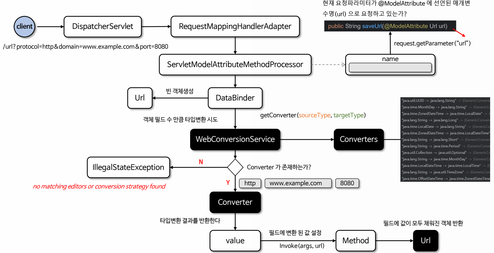

# 바인딩과 타입 변환

- **`DataBinder`의 역할** : `DataBinder`는 요청 데이터를 객체로 바인딩하는 클래스로써 HTTP 요청 파라미터(쿼리 파라미터, 폼 데이터 등)를
자바 객체의 속성에 매핑한다.
- **`ConversionService`의 역할** : `ConversionService`는 타입 변환에 특화된 서비스로써 바인딩 중 필요한 경우 `Converter`를 호출하여
특정 필드 값을 변환한다.
- `DataBinder`는 필요한 경우 `ConversionService`를 통해 요청 데이터를 변환하고 변환된 데이터를 객체 필드에 할당한다.
- 바인딩 중 타입 변환에 실패하게 되면 예외가 발생해 바인딩을 더 이상 진행하지 않거나 `BindingResult`를 사용해 오류를 남기고
계속 바인딩을 진행할 수 있다.


---

# @RequestParam 동작 방식 예

1. 클라이언트가 보낸 요청 파라미터를 문자열 형태로 가져온다. (기본적으로 모든 요청 파라미터는 문자열 형태로 전달된다.)
2. 가져온 문자열을 `@RequestParam`에 지정한 매개변수에 저장하기 위해 `ConversionService`를 사용하여 타입 변환을 수행한 후 저장한다.
3. 타입 변환에 실패하면 `TypeMismatchException` 예외를 발생시키며 오류 응답을 반환하거나 별도로 설정된 예외 처리 로직이 수행된다.


- 일반적으로 `@RequestParam`에 지정된 매개변수가 객체인 경우 컨버터가 등록 되어 있지 않기 때문에 오류가 발생한다.
- 객체를 지정해서 사용할 경우 `@ModelAttribute`를 사용하거나 또는 객체 타입으로 변환할 수 있는 컨버터를 만들어서 사용해야 한다.

---

# @ModelAttribute 동작 방식 예

- `@ModelAttribute`는 클라이언트의 요청 유형에 따라 **객체 바인딩 방식** 또는 **타입 변환 방식**으로 객체가 생성되어 메서드에 전달된다.
- 예를 들어 다음과 같은 클래스가 있을 때 요청 유형에 따른 차이를 알아보자.

```java
@Data
@AllArgsConstructor
@NoArgsConstructor
public class Url {
    private String protocol;
    private String domain;
    private int port;
}

/*----------------------------------------*/

@PostMapping("/url")
public Url saveUrl(@ModelAttribute("url") Url url) {
    return url;
}
```

### 1. 객체 바인딩 방식

클라이언트의 요청 파라미터가 `@ModelAttribute`에 지정된 매개변수명과 다른 경우 **객체 바인딩 방식**으로 객체가 생성된다.

```http request
POST http://localhost:8080/url
Content-Type: application/x-www-form-urlencoded
protocol=http&domain=www.example.com&port=8080
```

- 요청 파라미터명 : `protocol`, `domain`, `port`
- `@ModelAttribute` 매개변수명 : `url`
- 객체를 만들고 객체의 필드명과 동일한 요청 파라미터의 값을 설정한다.
- 필드 타입과 요청 파라미터 타입이 다를 경우 타입 변환을 거쳐 설정한다.



### 2. 타입 변환 방식

클라이언트의 요청 파라미터가 `@ModelAttribute`에 지정된 매개변수명과 같은 경우 **타입 변환 방식**으로 객체가 생성된다.

```http request
POST http://localhost:8080/url
Content-Type: application/x-www-form-urlencoded
url=http://www.example.com:8080
```

- 요청 파라미터명 : `url`
- `@ModelAttribute` 매개변수명 : `url`
- `StringToUrlConverter`와 같은 컨버터가 정의되어 있으면 이 컨버터를 통해 객체를 생성 후 메서드에 전달한다.
- 컨터버가 존재하지 않으면 빈 객체 생성 후 메서드에 전달한다.

