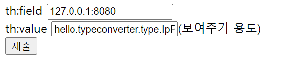

# 스프링 타입 컨버터란
> 문자를 숫자로 변환하거나, 숫자를 문자로 변환해야 하는 것처럼 애플리케이션을 개발하다 보면 타입을 변환해야 하는 경우가 많다.

```java
@RestController
public class HelloController {

    @GetMapping("/hello-v1")
    public String helloV1(HttpServletRequest request) {
        String data = request.getParameter("data"); // 문자 타입
        Integer integer = Integer.valueOf(data); // 숫자 타입으로 변경
        System.out.println("integer = " + integer);
        return "OK";
    }
}
```
HTTP 요청 파라미터는 모두 문자로 처리되기 때문에 요청 파라미터를 다른 타입으로 변환해서 사용하고 싶으면 직접 변환하는 과정을 거쳐야 한다.

스프링 MVC가 제공하는 `@RequestParam`
```java
@GetMapping("/hello-v2")
public String helloV2(@RequestParam("data") Integer data) {
        System.out.println("integer = " + data);
        return "OK";
}
```
HTTP 쿼리 스트링으로 전달하는 파라미터는 숫자가 아니라 문자 10이다. `@RequestParam`은 중간에서 타입 변환을 해주기 때문에 문자 10을 `Integer`타입으로
숫자 10을 편리하게 받을 수 있다.

- 스프링의 타입 변환 적용 예
  - `@RequestParam`, `@ModelAttribute`, `@PathVariable`
  - `@Value`등으로 yml 정보 읽기
  - 뷰를 렌더링 할 때

이렇게 타입을 변환해야 하는 경우가 많은데 스프링은 확장 가능한 컨터버 인터페이스를 제공한다. 추가적인 타입 변환이 필요하면 이 컨버터 인터페이스를 구현해서 등록하면 된다.
```java
@FunctionalInterface
public interface Converter<S, T> {
    @Nullable
    T convert(S source);
}
```
`S` -> `T`로 변환

- StringToIntegerConverter
```java
@Slf4j
public class StringToIntegerConverter implements Converter<String, Integer> {
    @Override
    public Integer convert(String source) {
        log.info("convert source={}", source);
        return Integer.valueOf(source);
    }
}
```
- IntegerToStringConverter
```java
@Slf4j
public class IntegerToStringConverter implements Converter<Integer, String> {
    @Override
    public String convert(Integer source) {
        log.info("convert source={}", source);
        return String.valueOf(source);
    }
}
```
- 테스트 코드
```java
@Test
void StringToInteger() {
        StringToIntegerConverter converter = new StringToIntegerConverter();
        Integer result = converter.convert("10");
        assertThat(result).isEqualTo(10);
}

@Test
void IntegerToString() {
        IntegerToStringConverter converter = new IntegerToStringConverter();
        String result = converter.convert(10);
        assertThat(result).isEqualTo("10");
}
```

### 사용자 정의 타입 컨터버
```java
@Getter
@EqualsAndHashCode
@AllArgsConstructor
public class IpPort {
    private String ip;
    private int port;
}
```
`@EqualsAndHashCode`는 모든 필드를 사용해서 `equals()`, `hashcode()`를 생성한다. 모든 필드의 값이 같다면 `a.equals(b) == true`가 된다.

- StringToIpPortConverter
```java
@Slf4j
public class StringToIpPortConverter implements Converter<String, IpPort> {

    @Override
    public IpPort convert(String source) {
        log.info("convert source={}", source);
        // "127.0.0.0:8080"
        String[] split = source.split(":");
        String ip = split[0];
        int port = Integer.parseInt(split[1]);

        return new IpPort(ip, port);
    }
}
```
- IpPortToStringConverter
```java
@Slf4j
public class IpPortToStringConverter implements Converter<IpPort,String> {

    @Override
    public String convert(IpPort source) {
        log.info("convert source={}", source);
        return source.getIp() + ":" + source.getPort();
    }
}
```
- 테스트 코드
```java
@Test
void StringToIpPort() {
    IpPortToStringConverter converter = new IpPortToStringConverter();
    IpPort ipPort = new IpPort("127.0.0.1", 8080);
    String result = converter.convert(ipPort);
    assertThat(result).isEqualTo("127.0.0.1:8080");
}

@Test
void IpPortToString() {
    StringToIpPortConverter converter = new StringToIpPortConverter();
    IpPort result = converter.convert("127.0.0.1:8080");
    assertThat(result).isEqualTo(new IpPort("127.0.0.1", 8080));
}
```

타입 컨버터 인터페이스가 단순하긴 하지만 이렇게 하나하나 직접 사용하면 개발자가 직접 컨버팅 하는 것과 차이가 없다. 그래서 스프링은 개별 컨버터를 모아두고
그것들을 묶어서 편리하게 사용할 수 있는 `컨버전 서비스(ConversionService)`라는 기능을 제공한다.

## 컨버전 서비스 - ConversionService
- ConversionService 인터페이스
```java
public interface ConversionService {
	boolean canConvert(@Nullable Class<?> sourceType, Class<?> targetType);
    
	boolean canConvert(@Nullable TypeDescriptor sourceType, TypeDescriptor targetType);
    
	@Nullable
	<T> T convert(@Nullable Object source, Class<T> targetType);
    
	@Nullable
	default Object convert(@Nullable Object source, TypeDescriptor targetType) {
		return convert(source, TypeDescriptor.forObject(source), targetType);
	}
    
	@Nullable
	Object convert(@Nullable Object source, @Nullable TypeDescriptor sourceType, TypeDescriptor targetType);

}
```
단순히 컨버팅이 가능한가 확인하는 기능과 컨버팅 기능을 제공한다.

- 테스트 코드
```java
 @Test
void conversionService() {
    DefaultConversionService service = new DefaultConversionService();
    service.addConverter(new StringToIntegerConverter());
    service.addConverter(new IntegerToStringConverter());
    service.addConverter(new StringToIpPortConverter());
    service.addConverter(new IpPortToStringConverter());


    assertThat(service.convert("10", Integer.class)).isEqualTo(10);
    assertThat(service.convert(10, String.class)).isEqualTo("10");
    assertThat(service.convert("127.0.0.1:8080", IpPort.class))
            .isEqualTo(new IpPort("127.0.0.1", 8080));
    assertThat(service.convert(new IpPort("127.0.0.1", 8080), String.class))
            .isEqualTo("127.0.0.1:8080");
}
```
**등록과 사용 분리**<br>
컨버터를 등록할 때는 타입 컨버터를 명확하게 알아야 한다. 반면 컨버터를 사용하는 입장에서는 타입 컨버터를 전혀 몰라도 된다. 타입 컨버터들은 모두 컨버전 서비스
내부에 숨어서 제공된다. 따라서 타입 변환을 원하는 사용자는 컨버전 서비스 인터페이스에만 의존하면 된다. 물론 의존관계 주입이 필요하다.

이를 **인터페이스 분리 원칙(ISP)** 이라고 한다. *클라이언트는 자신이 이용하지 않는 메서드에 의존하지 않아야 한다.*

`ConversionService` 인터페이스를 구현한 `DefaultConversionService`는 두 인터페이스를 구현했다.
- `ConversionService` : 컨버터 사용에 초점
- `ConversionRegistry` : 컨버터 등록에 초점

## 스프링에 컨버터 적용하기
- WebConfg
```java
@Configuration
public class WebConfig implements WebMvcConfigurer {

    @Override
    public void addFormatters(FormatterRegistry registry) {
        registry.addConverter(new StringToIntegerConverter());
        registry.addConverter(new IntegerToStringConverter());
        registry.addConverter(new StringToIpPortConverter());
        registry.addConverter(new IpPortToStringConverter());
    }
}
```
스프링은 내부에서 `ConversionService`를 제공한다. 우리는 `WebMvcConfigurer`가 제공하는 `addFormatters()`를 사용해서 추가하고 싶은 컨버터를 등록하면 된다.

- 컨트롤러
```java
@GetMapping("/hello-v2")
public String helloV2(@RequestParam("data") Integer data) {
    System.out.println("integer = " + data);
    return "OK";
}
```
실행해보면 직접 등록한 `StringToIntegerConverter`가 작동한다. 그런데 이 컨버터를 등록하기 전에도 이 코드는 잘 수행이 됐다. 스프링이 내부에서 
수 많은 기본 컨버터들을 제공하기 때문이다. 컨버터를 추가하면 기본 컨버터보다 높은 우선순위를 가지게 된다.

- 컨트롤러
```java
@GetMapping("/ip-port")
public String ipPort(@RequestParam("ipPort") IpPort ipPort) {
    System.out.println("ipPort.getIp() = " + ipPort.getIp());
    System.out.println("ipPort.getPort() = " + ipPort.getPort());
    return "OK";
}
```
`?ipPort=127.0.0.1:8080` 쿼리 스트링이 `@RequestParam`에서 객체 타입으로 변환 된다.

`@RequestParam`을 처리하는 `ArgumentResolver`인 `RequestParamMethodArgumentResolver`에서 `ConversionService`를 사용해서 타입을 변환한다.

## 뷰 템플릿에 컨버터 적용
> 타임리프는 렌더링 시에 컨터버를 적용해서 렌더링 하는 방법을 편리하게 지원한다.
- 컨트롤러
```java
@GetMapping("/converter-view")
public String converterView(Model model) {
    model.addAttribute("number", 10000);
    model.addAttribute("ipPort", new IpPort("127.0.0.1", 8080));
    return "converter-view";
}
```
- HTML
```java
<!DOCTYPE html>
<html xmlns:th="http://www.thymeleaf.org">
<head>
    <meta charset="UTF-8">
    <title>Title</title>
</head>
<body>
<ul>
    <li>${number}: <span th:text="${number}" ></span></li>
    <li>${{number}}: <span th:text="${{number}}" ></span></li>
    <li>${ipPort}: <span th:text="${ipPort}" ></span></li>
    <li>${{ipPort}}: <span th:text="${{ipPort}}" ></span></li>
</ul>
</body>
</html>
```
```properties
${number}: 10000
${{number}}: 10000
${ipPort}: hello.typeconverter.type.IpPort@59cb0946
${{ipPort}}: 127.0.0.1:808
```

**변수 표현식** : `${...}`<br>
**컨버전 서비스 적용** : `${{...}}`

### 폼에 적용하기
- 컨트롤러
```java
@GetMapping("/converter/edit")
    public String converterForm(Model model) {
        IpPort ipPort = new IpPort("127.0.0.1", 8080);
        Form form = new Form(ipPort);
        model.addAttribute("form", form);
        return "converter-form";
    }

    @PostMapping("/converter/edit")
    public String converterEdit(@ModelAttribute("form") Form form, Model model) {
        IpPort ipPort = form.getIpPort();
        model.addAttribute("ipPort", ipPort);
        return "converter-view";
    }

    @Data
    static class Form {
        private IpPort ipPort;

        public Form(IpPort ipPort) {
            this.ipPort = ipPort;
        }
    }
```
- Converter-form.html
```html
<!DOCTYPE html>
<html xmlns:th="http://www.thymeleaf.org">
<head>
    <meta charset="UTF-8">
    <title>Title</title>
</head>
<body>

<form th:object="${form}" th:method="post">
    th:field <input type="text" th:field="*{ipPort}"><br/>
    th:value <input type="text" th:value="*{ipPort}">(보여주기 용도)<br/>
    <input type="submit">
</form>

</body>
</html>
```


타임리프의 `th:field`는 `id`,`name`,`value`를 출력하는 등 다양한 기능이 있는데 여기에 컨버전 서비스도 함께 적용된다.

- `GET /converter/edit`
  - `th:field`가 자동으로 컨버전 서비스를 적용해 주어서 `${{ipPort}}`처럼 적용이 되었다.
  - `ipPort` -> `String`으로 변환
- `POST /converter/edit`
  - `@ModelAttribute`를 사용해서 `String` -> `IpPort`로 변환