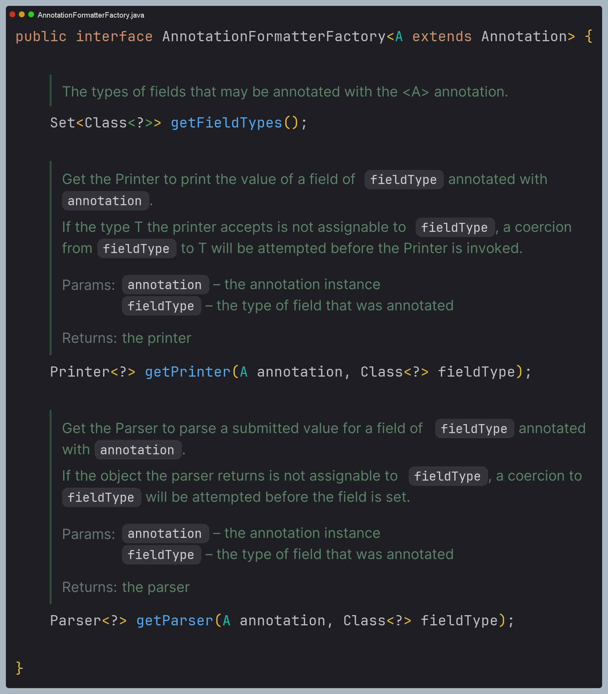

# Formatter
> 객체를 특정한 포맷에 맞추어 문자로 출력하거나 또는 그 반대의 역할을 하는 것에 특화된 기능으로 컨버터의 특별한 버전이라고 볼 수 있다.

- `Convertere`는 주로 범용 타입 변환 시스템으로, 타입에 제한 없이 데이터 타입 간 일반적인 변환을 다루는데 목적이 있다.
- `Formatter`는 특정 환경(웹 애플리케이션 등)에서 데이터를 **특정 형식**에 맞게 변환하거나 **특정 형식**에서 객체로 변환하는 것에 목적이 있다.
- `Converter`는 로컬화를 고려하지 않지만 `Formatter`는 지역(`Locale`)에 따라 데이터 표현 방식을 다르게 처리할 수 있다.
- `Converter`가 주로 서버 내부 데이터 변환에 사용된다면 `Formatter`는 뷰와 클라이언트 간 데이터 변환에 사용된다고 볼 수 있다.


### 사용 예제

```java
@Slf4j
public class MyNumberFormatter implements Formatter<Number> {

    @Override
    public Number parse(String text, Locale locale) throws ParseException {
        log.info("text={}, locale={}", text, locale);
        //"1,000" -> 1000
        return NumberFormat.getInstance(locale).parse(text);
    }

    @Override
    public String print(Number object, Locale locale) {
        log.info("object={}, locale={}", object, locale);
        return NumberFormat.getInstance(locale).format(object);
    }
}
```
> 나라별로 다른 숫자 포맷을 만들어준다.

```java
class MyNumberFormatterTest {

    MyNumberFormatter formatter = new MyNumberFormatter();

    @Test
    void parse() throws ParseException {
        Number result = formatter.parse("1,000", Locale.KOREA);
        assertThat(result).isEqualTo(1000L);
    }

    @Test
    void print() {
        String result = formatter.print(1000, Locale.KOREA);
        assertThat(result).isEqualTo("1,000");
    }
}
```

---

# FormattingConversionService

- `ConversionService`에는 **컨버터만 등록**할 수 있고 `Formatter`는 등록할 수 없다. 그런데 `Formatter`는 단순히 생각하면 **특별한 컨버터**일 뿐이다.
- `Formatter`를 지원하는 `ConversionService`를 사용하면 `ConversionService`에 `Formatter`를 추가할 수 있다. 
내부에서 어댑터 패턴을 사용해서 `Formatter`가 컨버터처럼 동작하도록 지원한다.
- `FormattingConversionService`는 `Formatter`를 지원하는 `ConversionService`이다.
- `DefaultFormattingConversionService`는 `FormattingConversionService`에 기본적인 통화, 숫자 관련 몇 가지 기본 `Formatter`를 추가해서 제공한다.


```java
@Test
void formattingConversionService() {
    DefaultFormattingConversionService service = new DefaultFormattingConversionService();
    service.addConverter(new StringToIpPortConverter());
    service.addConverter(new IpPortToStringConverter());

    service.addFormatter(new MyNumberFormatter());

    assertThat(service.convert("127.0.0.1:8080", IpPort.class)).isEqualTo(new IpPort("127.0.0.1", 8080));

    assertThat(service.convert(1000, String.class)).isEqualTo("1,000");
    assertThat(service.convert("1,000", Long.class)).isEqualTo(1000L);
}
```
`FormattingConversionService`는 `ConversionService` 관련 기능을 상속 받기 때문에 결과적으로 컨버터, 포맷터 모두 등록할 수 있다. 사용할 때는
`ConversionService`가 제공하는 `convert`를 사용하면 된다. 스프링 부트는 `DefaultFormattingConversionService`를 상속 받은 `WebConversionService`를 내부에서 사용한다.

---

# 스프링 Formatter 적용

```java
@Configuration
public class WebConfig implements WebMvcConfigurer {

    @Override
    public void addFormatters(FormatterRegistry registry) {
        // 우선순위 주석처리
//        registry.addConverter(new StringToIntegerConverter());
//        registry.addConverter(new IntegerToStringConverter());
        registry.addConverter(new StringToIpPortConverter());
        registry.addConverter(new IpPortToStringConverter());

        registry.addFormatter(new MyNumberFormatter());
    }
}
```
> `MyNumberFormatter`를 적용하기 위해 기존 컨버터는 주석처리한다. (컨버터가 우선하다.)


- `fieldType` : 변환 대상인 T 타입을 의미
- `formatter` : 실제 포맷팅을 적용하는 객체
- `this` : `FormattingConversionService` 객체

**PrintConverter**


**ParserConverter**


- 구조를 보면 `Formatter`는 두 개의 **컨버터**로 나누어지고 등록된다. (`PrintConverter`와 `ParserConverter`는 `FormattingConversionService`의 내부 클래스)
- 즉 한 개의 `Formatter`는 두 개의 **컨버터**로부터 출력(print) 및 파싱(parse) 메서드가 호출되어 실행된다.
- 실행 관점에서 보면 타입 변환은 항상 **컨버터**가 최초 진입점이 되고 `Formatter`는 **컨버터** 내에서 실행되는 어댑터 패턴 구조라고 볼 수 있다.

컨트롤러
```java
@Controller
public class FormatterController {

    @GetMapping("/formatter/edit")
    public String formatterForm(Model model) {
        Form form = new Form();
        form.setNumber(10000);
        form.setLocalDateTime(LocalDateTime.now());
        model.addAttribute("form", form);

        return "formatter-form";
    }

    @PostMapping("/formatter/edit")
    public String formatterEdit(@ModelAttribute("form") Form form) {
        return "formatter-view";
    }

    @Data
    static class Form {

        @NumberFormat(pattern = "###,###")
        private Integer number;

        @DateTimeFormat(pattern = "yyyy-MM-dd HH:mm:ss")
        private LocalDateTime localDateTime;
    }
}
```

formatter-form.html
```html
<!DOCTYPE html>
<html xmlns:th="http://www.thymeleaf.org">
<head>
    <meta charset="UTF-8">
    <title>Title</title>
</head>
<body>
<form th:object="${form}" th:method="post">
    number <input type="text" th:field="*{number}"><br/>
    localDateTime <input type="text" th:field="*{localDateTime}"><br/>
    <input type="submit"/>
</form>
</body>
</html>
```

formatter-view.html
```html
<!DOCTYPE html>
<html xmlns:th="http://www.thymeleaf.org">
<head>
    <meta charset="UTF-8">
    <title>Title</title>
</head>
<body>
<ul>
    <li>${form.number}: <span th:text="${form.number}" ></span></li>
    <li>${{form.number}}: <span th:text="${{form.number}}" ></span></li>
    <li>${form.localDateTime}: <span th:text="${form.localDateTime}" ></span></li>
    <li>${{form.localDateTime}}: <span th:text="${{form.localDateTime}}" ></span></li>
</ul>
</body>
</html>
```


> - 타임리프는 모델 데이터에 타입 변환 표현식을 사용하여 뷰 렌더링 시점에 `ConversionService`가 자동적으로 타입 변환 시스템을 가동시킨다.
> - 타입 변환 표현식은 `${{...}}`이며 모델 데이터를 표현식에 입력하면 된다. 
> - 일반 변수 표현식은 `${...}`인 것과 구분해서 사용한다.

### Print 흐름도


### Parse 흐름도


---

# 어노테이션 기반 포맷터

어노테이션 기반의 포맷터를 사용하여 각 필드마다 다른 형식을 지정할 수 있다.

### AnnotationFormatterFactory

- `AnnotationFormatterFactory`는 특정 어노테이션이 붙은 필드의 값을 지정된 형식으로 변환해 주는 `Formatter`를 생성하는 팩토리 클래스이다.
- 예를 들어 `Jsr310DateTimeFormatAnnotationFormatterFactory`는 `@DateTimeFormatter` 어노테이션이 붙은 필드에서 날짜 값을 지정된 형식으로 변환해주는 `Formatter`를 만들어 사용할 수 있다.



- `getFieldTypes()` : 어노테이션이 적용될 수 있는 필드의 타입 목록을 반환한다.
- `getPrinter()` : 어노테이션이 적용된 필드 값을 출력하기 위한 `Printer` 객체를 반환한다.
- `getParser()` : 어노테이션이 적용된 필드 값을 파싱하기 위한 `Parser` 객체를 반환한다.

주요 구현체는 다음과 같다.

- `DateTimeFormatAnnotationFormatterFactory`
  - `java.util.Date`와 `java.util.Calendar` 같은 레거시 날짜 및 시간 API를 사용하여 `@DateTimeFormat` 어노테이션이 지정된 필드를 포맷한다.
- `Jsr310DateTimeFormatAnnotationFormatterFactory`
  - JDK 8의 `LocalDateTime`과 `ZonedDateTime`과 같은 날짜 및 시간 API를 사용하여 `@DateTimeFormat` 어노테이션이 지정된 필드를 포맷한다.
- `NumberFormatAnnotationFormatterFactory`
  - `@NumberFormatter` 어노테이션이 붙은 필드에서 숫자 값을 지정된 형식으로 포맷한다.

### 응용 커스텀 구현

```java
/*-----------커스텀 어노테이션-----------*/
@Target(ElementType.FIELD)
@Retention(RetentionPolicy.RUNTIME)
public @interface CustomCurrencyFormat {
    String pattern() default "#,###.##";
    int decimalPlaces() default 2;
}

/*-----------커스텀 포맷터-----------*/
@RequiredArgsConstructor
public class CustomCurrencyFormatter implements Formatter<BigDecimal> {

    private final String pattern;       //통화 형식
    private final int decimalPlaces;    //소수점 자리수

    @Override
    public BigDecimal parse(String text, Locale locale) throws ParseException {
        DecimalFormat decimalFormat = new DecimalFormat(pattern);
        Number number = decimalFormat.parse(text);

        return BigDecimal.valueOf(number.doubleValue())
                         .setScale(decimalPlaces, RoundingMode.HALF_UP); //반올림
    }

    @Override
    public String print(BigDecimal object, Locale locale) {
        NumberFormat formatter = NumberFormat.getCurrencyInstance(locale);
        formatter.setMaximumFractionDigits(decimalPlaces);
        return formatter.format(object);
    }
}

/*-----------커스텀 포맷터 팩토리-----------*/
public class CustomCurrencyFormatterFactory implements AnnotationFormatterFactory<CustomCurrencyFormat> {

    @Override
    public Set<Class<?>> getFieldTypes() {
        return Set.of(BigDecimal.class);
    }

    @Override
    public Printer<?> getPrinter(CustomCurrencyFormat annotation, Class<?> fieldType) {
        return new CustomCurrencyFormatter(annotation.pattern(), annotation.decimalPlaces());
    }

    @Override
    public Parser<?> getParser(CustomCurrencyFormat annotation, Class<?> fieldType) {
        return new CustomCurrencyFormatter(annotation.pattern(), annotation.decimalPlaces());
    }
}

/*-----------커스텀 포맷터 팩토리 등록-----------*/
@Configuration
public class WebConfig implements WebMvcConfigurer {

    @Override
    public void addFormatters(FormatterRegistry registry) {
        registry.addFormatterForFieldAnnotation(new CustomCurrencyFormatterFactory());
    }
}
```

어노테이션 기반의 포맷팅은 대략 다음과 같은 흐름으로 처리된다.

