# 검증 V2

## V1

- 스프링의 검증은 데이터 바인딩 과정과 밀접하게 연관되어 있다. 데이터 바인딩은 요청 데이터를 객체로 변환화는 과정인데
이 과정에서 데이터를 검증함으로써 애플리케이션의 안정성과 데이터 무결성을 보장하게 된다.
- 스프링에서는 크게 두 가지로 구분해서 검증이 이루어진다.
1. 스프링은 데이터 바인딩 시 검증 로직을 자동으로 실행하도록 설계되었으며 `BindingResult`를 통해 오류 정보 및 검증 결과를 저장하고 관리한다.
   - `DataBinder` → **Error** 발생 → `BindingResult` → **Error** 추가
2. 컨트롤러에서 사용자가 직접 `BindingResult`를 통해 오류 데이터를 추가하고 검증을 진행할 수 있다.
   - `Controller` → `BindingResult` → 오류 검증 → **Error** 추가

컨트롤러
```java
@PostMapping("/add")
public String addItemV1(@ModelAttribute Item item, BindingResult bindingResult, RedirectAttributes redirectAttributes, Model model) {

    //검증 로직
    //필드 오류
    if (!StringUtils.hasText(item.getItemName())) {
        bindingResult.addError(new FieldError("item", "itemName", "상품 이름은 필수 입니다."));
    }
    if (item.getPrice() == null || item.getPrice() < 1000 || item.getPrice() > 1_000_000) {
        bindingResult.addError(new FieldError("item", "price", "가격은 1,000 ~ 1,000,000 까지 허용합니다."));
    }
    if (item.getQuantity() == null || item.getQuantity() >= 9999) {
        bindingResult.addError(new FieldError("item", "quantity", "수량은 최대 9,999 까지 허용합니다."));
    }

    //특정 필드가 아닌 복합 룰 검증
    //객체 오류
    if (item.getPrice() != null && item.getQuantity() != null) {
        int resultPrice = item.getPrice() * item.getQuantity();
        if (resultPrice < 10000) {
            bindingResult.addError(new ObjectError("item", "가격 * 수량의 합은 10,000원 이상이어야 합니다. 현재 값 = " + resultPrice));
        }
    }

    //검증에 실패하면 다시 입력 폼으로
    if (bindingResult.hasErrors()) {
        log.info("errors={} ", bindingResult);
        return "validation/v2/addForm";
    }

    //성공 로직
    Item savedItem = itemRepository.save(item);
    redirectAttributes.addAttribute("itemId", savedItem.getId());
    redirectAttributes.addAttribute("status", true);
    return "redirect:/validation/v2/items/{itemId}";
}
```
- `BindingResult bindingResult`의 위치가 중요하다. `@ModelAttribute Item item` 다음에 와야 한다.
- `model.addAttribute()`를 해주지 않아도 뷰에 넘어간다.
- `FieldError(objectName, field, defaultMessage)`, `ObjectError(objectName, defaultMessage)`
  - `objectName`은 `@ModelAttribute`의 이름이다. ("item")

> - `addError(ObjectError error)` API는 필수 값 누락, 길이 제한 등 어떤 조건이 맞지 않을 경우 오류를 추가할 수 있는 API로써 인자 값으로 `ObjectError`와 `FieldError` 객체를 받을 수 있다.
> - 스프링은 바인딩 오류 시 내부적으로 `BindingResult`의 `addError(ObjectError error)` API를 사용해서 오류 정보를 저장하고 있으며 이때 `FieldError` 객체를 생성해서 전달한다.
> - 이렇게 추가된 `FieldError`, `ObjectError`는 `BindingResult`의 **errors** 속성에 저장된다.
> 
> **객체 오류와 필드 오류**
> 
> - 스프링은 오류를 추가할 때 **객체 오류**(또는 글로벌 오류)와 **필드 오류**로 구분하도록 API를 설계했다.
> - **객체 오류**는 말 그대로 객체 수준에서 오류를 표현한다는 의미이고, **필드 오류**는 객체보다 좀 더 구체적인 필드 수준에서 오류를 표현한다는 의미이다.
> - 오류는 사용자 또는 클라이언트에게 이해하기 쉬운 문장으로 설명해야 하며 상황에 맞게 구체적인 오류와 종합적인 오류를 잘 조합해서 표현해야 한다.
> 
> 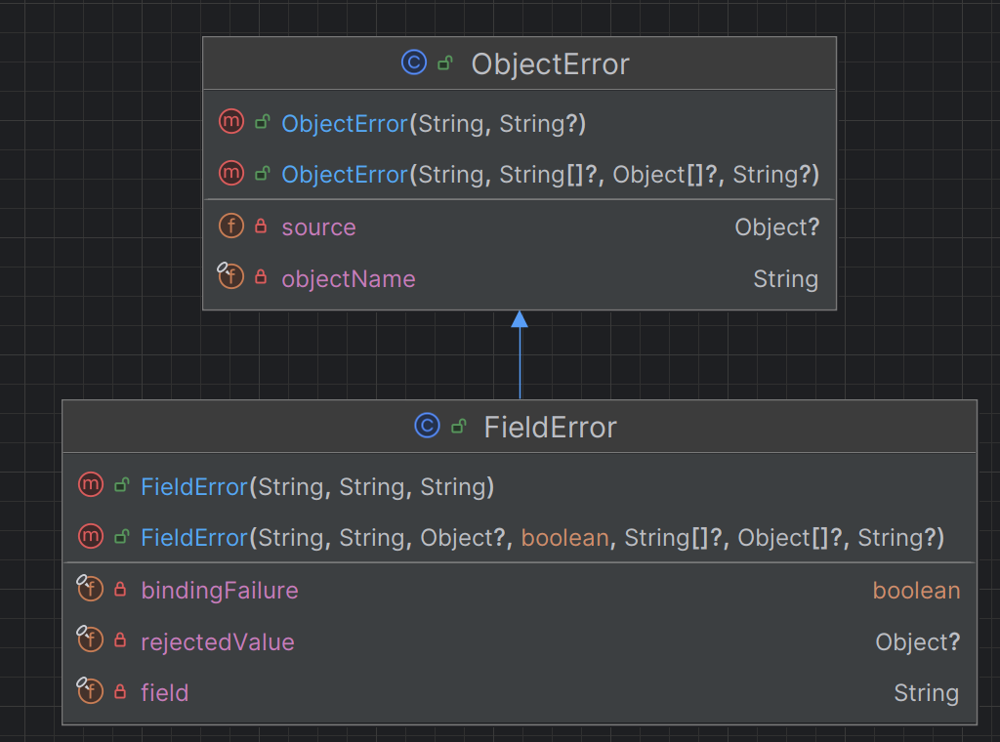

HTML
```html
<!DOCTYPE HTML>
<html xmlns:th="http://www.thymeleaf.org">
<head>
    <meta charset="utf-8">
    <link th:href="@{/css/bootstrap.min.css}"
          href="../css/bootstrap.min.css" rel="stylesheet">
    <style>
        .container {
            max-width: 560px;
        }
        .field-error {
            border-color: #dc3545;
            color: #dc3545;
        }
    </style>
</head>
<body>

<div class="container">

    <div class="py-5 text-center">
        <h2 th:text="#{page.addItem}">상품 등록</h2>
    </div>

    <form action="item.html" th:action th:object="${item}" method="post">

        <div th:if="${#fields.hasGlobalErrors()}">
            <p class="field-error" th:each="err : ${#fields.globalErrors()}" th:text="${err}">글로벌 오류 메시지</p>
        </div>

        <div>
            <label for="itemName" th:text="#{label.item.itemName}">상품명</label>
            <input type="text" id="itemName" th:field="*{itemName}"
                   th:errorclass="field-error" class="form-control" placeholder="이름을 입력하세요">
            <div class="field-error" th:errors="*{itemName}">
                상품명 오류
            </div>
        </div>
        <div>
            <label for="price" th:text="#{label.item.price}">가격</label>
            <input type="text" id="price" th:field="*{price}"
                   th:errorclass="field-error" class="form-control" placeholder="가격을 입력하세요">
            <div class="field-error" th:errors="*{price}">
                가격 오류
            </div>
        </div>

        <div>
            <label for="quantity" th:text="#{label.item.quantity}">수량</label>
            <input type="text" id="quantity" th:field="*{quantity}"
                   th:errorclass="field-error" class="form-control" placeholder="수량을 입력하세요">
            <div class="field-error" th:errors="*{quantity}">
                수량 오류
            </div>

        </div>

        <hr class="my-4">

        <div class="row">
            <div class="col">
                <button class="w-100 btn btn-primary btn-lg" type="submit" th:text="#{button.save}">상품 등록</button>
            </div>
            <div class="col">
                <button class="w-100 btn btn-secondary btn-lg"
                        onclick="location.href='items.html'"
                        th:onclick="|location.href='@{/validation/v2/items}'|"
                        type="button" th:text="#{button.cancel}">취소</button>
            </div>
        </div>

    </form>

</div> <!-- /container -->
</body>
</html>
```

타임리프는 스프링의 `BindingResult`를 활용해서 편리하게 검증 오류를 표현할 수 있는 기능을 제공한다.
- `#fields`
  - `BindingResult`가 제공하는 검증 오류에 접근할 수 있다.
- `th:errors`
  - 해당 필드에 오류가 있는 경우 태그를 출력한다. (`th:if`의 편의 버전)
- `th:errorclass`
  - `th:field`에서 지정한 필드에 오류가 있으면 class 정보를 추가한다.

---

## V2
- `BindingResult`는 스프링이 제공하는 검증 오류를 보관하는 객체다. `@ModelAttribute`에 데이터 바인딩 시 오류가 발생해도 컨트롤러는 호출되기 때문에
화이트라벨 에러 화면을 보여주지 않는다.
- `BindingResult`와 `Errors`가 있는데 둘 다 인터페이스이고 `BindingResult`가 `Errors`를 상속받고 있다.<br>
- `Errors` 인터페이스는 단순한 오류 저장과 조회 기능을 제공하고 `BindingResult`는 메시지 코드 해석과 세부적인 오류 관리 기능 등 추가적인 기능들을 제공하며,
컨트롤러에서 데이터 바인딩과 검증을 동시에 처리해야 하는 상황에서 주로 사용된다.

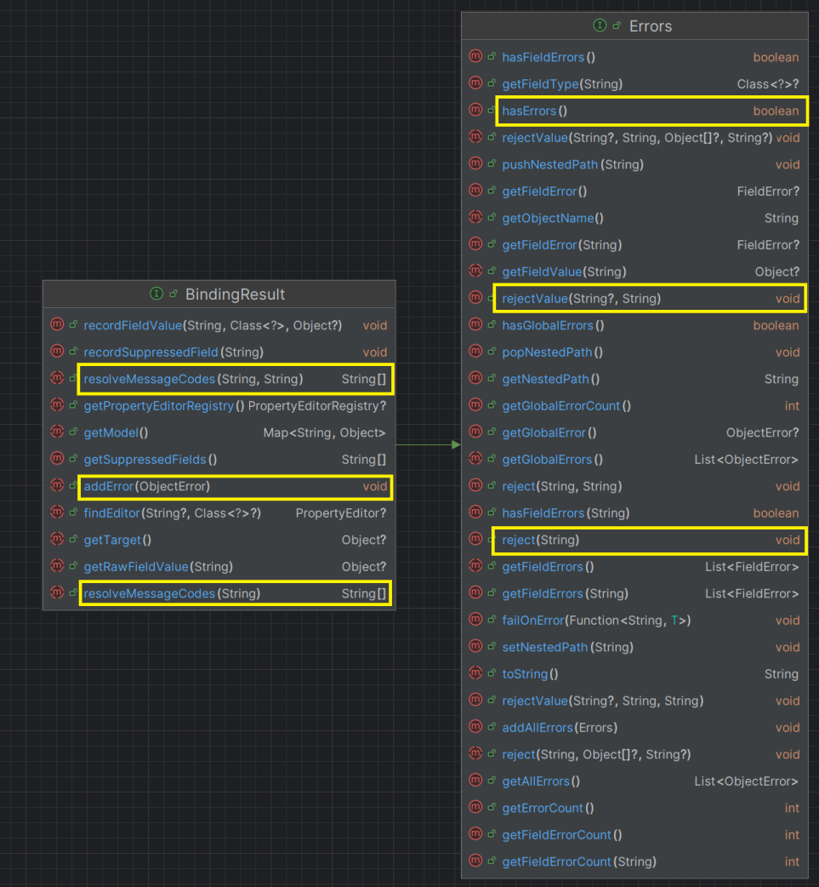

컨트롤러
```java
@PostMapping("/add")
public String addItemV2(@ModelAttribute Item item, BindingResult bindingResult, RedirectAttributes redirectAttributes, Model model) {

    //검증 로직
    if (!StringUtils.hasText(item.getItemName())) {
        bindingResult.addError(new FieldError("item", "itemName", item.getItemName(), false, null, null, "상품 이름은 필수 입니다."));
    }
    if (item.getPrice() == null || item.getPrice() < 1000 || item.getPrice() > 1000000) {
        bindingResult.addError(new FieldError("item", "price", item.getPrice(), false, null, null, "가격은 1,000 ~ 1,000,000 까지 허용합니다."));
    }
    if (item.getQuantity() == null || item.getQuantity() >= 9999) {
        bindingResult.addError(new FieldError("item", "quantity", item.getQuantity(), false, null ,null, "수량은 최대 9,999 까지 허용합니다."));
    }

    //특정 필드가 아닌 복합 룰 검증
    if (item.getPrice() != null && item.getQuantity() != null) {
        int resultPrice = item.getPrice() * item.getQuantity();
        if (resultPrice < 10000) {
            bindingResult.addError(new ObjectError("item",null ,null, "가격 * 수량의 합은 10,000원 이상이어야 합니다. 현재 값 = " + resultPrice));
        }
    }

    //검증에 실패하면 다시 입력 폼으로
    if (bindingResult.hasErrors()) {
        log.info("errors={} ", bindingResult);
        return "validation/v2/addForm";
    }

    //성공 로직
    Item savedItem = itemRepository.save(item);
    redirectAttributes.addAttribute("itemId", savedItem.getId());
    redirectAttributes.addAttribute("status", true);
    return "redirect:/validation/v2/items/{itemId}";
}
```

`FieldError`는 두 가지 생성자가 있다.

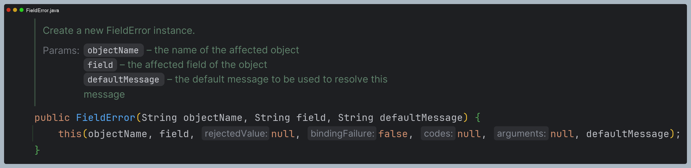

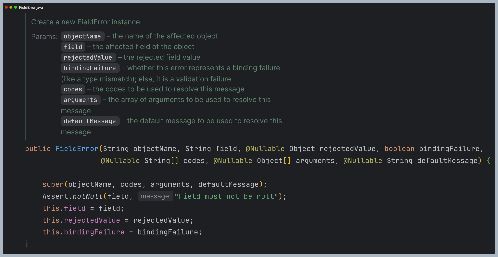

파라미터 목록
- `objectName` : 오류가 발생한 객체 이름
- `field` : 오류가 발생한 필드 이름
- `rejectedValue` : 사용자가 입력한 값 (거절된 값)
- `bindingFailure` : 타입 오류 같은 바인딩 실패인지, 검증 실패인지 구분 값
- `codes` : 메시지 코드 (`MessageSource`에서 사용)
- `arguments` : 메시지에서 사용하는 인자 (`MessageSource`에서 사용)
- `defaultMessage` : 기본 오류 메시지

> `FieldError`의 `rejectedValue`에 오류 발생 시 사용자가 입력한 값을 저장하는데 `th:field=*{...}`에서 정상 상황이면 모델 객체의 값을 사용하고
> 오류가 발생하면 `FieldError`에 보관한 값을 사용해서 값을 출력해준다.

**스프링의 `BindingResult`는 세 가지 기본 전략을 가진다.**
1. 스프링은 데이터 바인딩 시 발생하는 모든 오류 정보를 자동으로 `BindingResult`의 `errors` 속성에 저장한다.
2. 사용자가 `BindingResult`의 오류 정보를 활용하기 위해서는 컨트롤러 메서드 매개변수로 지정해야 한다.
   - `@ModelAttribute` **객체 바로 뒤에 위치**해야 하며, 매개변수로 지정하게 되면 객체 바인딩 오류가 나더라도 컨트롤러는 정상적으로 실행된다.
   - 만약 바인딩 오류가 발생했고, `BindingResult`를 메서드에 선언하지 않으면 스프링은 `MethodArgumentNotValidException` 예외를 발생시키고 컨트롤러는 실행되지 않는다.
   - 가장 기본이 되는 바인딩 오류는 타입 불일치 오류이다. 즉 요청 데이터와 필드 타입이 서로 맞지 않아 바인딩이 실패하는데 이때 내부적으로
        `TypeMismatchException` 예외가 발생한다.
3. `BindingResult` 인터페이스의 API를 사용해서 추가적인 검증을 진행하거나 검증 결과를 클라이언트에게 전달할 수 있다.

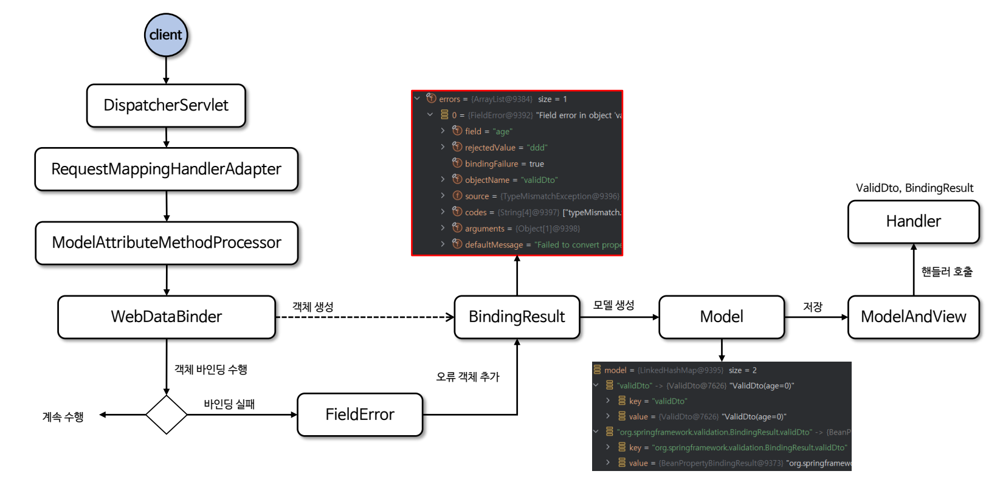

---

## V3

- `DataBinder`의 바인딩시 발생한 오류나 `BindingResult`의 유효성 검증 오류가 발생했을 때 `MessageSource`를 사용해서 오류 메시지를 사용자에게 제공할 수 있다.
- 이 방식은 유효성 검증에 필요한 오류 메시지를 외부 파일에서 검색 및 관리할 수 있다. 즉 오류 메시지를 `MessageSource`에게 위임하는 것이다.

application.properties
```properties
spring.messages.basename=messages,errors
```

errors.properties
```properties
required.item.itemName=상품 이름은 필수입니다.
range.item.price=가격은 {0} ~ {1} 까지 허용합니다.
max.item.quantity=수량은 최대 {0} 까지 허용합니다.
totalPriceMin=가격 * 수량의 합은 {0}원 이상이어야 합니다. 현재 값 = {1}
```

컨트롤러
```java
@PostMapping("/add")
public String addItemV3(@ModelAttribute Item item, BindingResult bindingResult, RedirectAttributes redirectAttributes, Model model) {

    //검증 로직
    if (!StringUtils.hasText(item.getItemName())) {
        bindingResult.addError(new FieldError("item", "itemName", item.getItemName(), false, new String[]{"required.item.itemName"}, null, null));
    }
    if (item.getPrice() == null || item.getPrice() < 1000 || item.getPrice() > 1_000_000) {
        bindingResult.addError(new FieldError("item", "price", item.getPrice(), false, new String[]{"range.item.price"}, new Object[]{1000, 1_000_000}, null));
    }
    if (item.getQuantity() == null || item.getQuantity() >= 9999) {
        bindingResult.addError(new FieldError("item", "quantity", item.getQuantity(), false, new String[]{"max.item.quantity"} ,new Object[]{9999}, null));
    }

    //특정 필드가 아닌 복합 룰 검증
    if (item.getPrice() != null && item.getQuantity() != null) {
        int resultPrice = item.getPrice() * item.getQuantity();
        if (resultPrice < 10000) {
            bindingResult.addError(new ObjectError("item",new String[]{"totalPriceMin"} ,new Object[]{10000, resultPrice}, null));
        }
    }

    //검증에 실패하면 다시 입력 폼으로
    if (bindingResult.hasErrors()) {
        log.info("errors={} ", bindingResult);
        return "validation/v2/addForm";
    }

    //성공 로직
    Item savedItem = itemRepository.save(item);
    redirectAttributes.addAttribute("itemId", savedItem.getId());
    redirectAttributes.addAttribute("status", true);
    return "redirect:/validation/v2/items/{itemId}";
}
```

---

## V4
- `BindingResult`가 제공하는 `rejectValue()`와 `reject()`를 사용하여 더욱 단순화할 수 있다.

컨트롤러
```java
@PostMapping("/add")
public String addItemV4(@ModelAttribute Item item, BindingResult bindingResult, RedirectAttributes redirectAttributes, Model model) {

    log.info("objectName={}", bindingResult.getObjectName());
    log.info("target={}", bindingResult.getTarget());

    if (!StringUtils.hasText(item.getItemName())) {
        bindingResult.rejectValue("itemName", "required");
    }
    if (item.getPrice() == null || item.getPrice() < 1000 || item.getPrice() > 1000000) {
        bindingResult.rejectValue("price", "range", new Object[]{1000, 10000000}, null);
    }
    if (item.getQuantity() == null || item.getQuantity() >= 9999) {
        bindingResult.rejectValue("quantity", "max", new Object[]{9999}, null);
    }

    //특정 필드가 아닌 복합 룰 검증
    if (item.getPrice() != null && item.getQuantity() != null) {
        int resultPrice = item.getPrice() * item.getQuantity();
        if (resultPrice < 10000) {
            bindingResult.reject("totalPriceMin", new Object[]{10000, resultPrice}, null);
        }
    }

    //검증에 실패하면 다시 입력 폼으로
    if (bindingResult.hasErrors()) {
        log.info("errors={} ", bindingResult);
        return "validation/v2/addForm";
    }

    //성공 로직
    Item savedItem = itemRepository.save(item);
    redirectAttributes.addAttribute("itemId", savedItem.getId());
    redirectAttributes.addAttribute("status", true);
    return "redirect:/validation/v2/items/{itemId}";
}
```

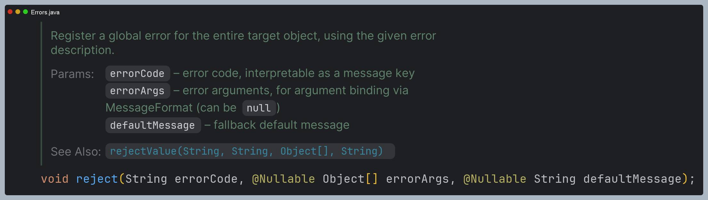
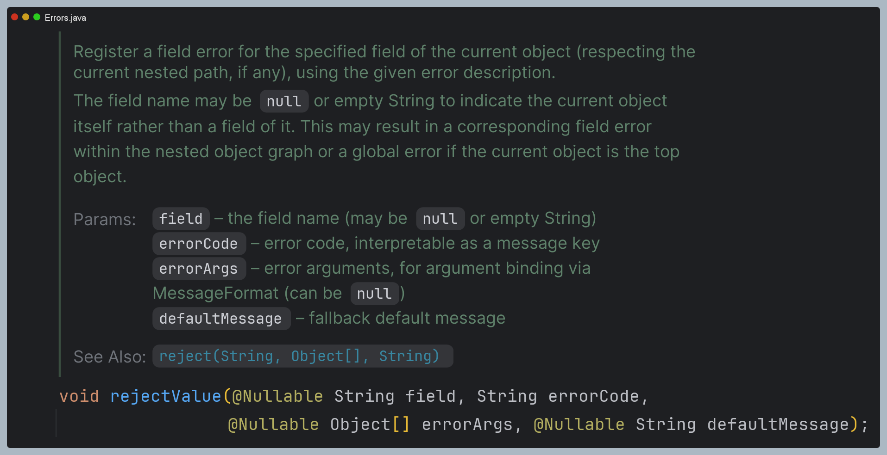

- `reject()` - 객체 오류, `rejectValue()` : 필드 오류
- `field` : 오류 필드 이름
- `errorCode` : 오류 코드
- `errorArgs` : 메시지에 사용될 인자 목록
- `defaultMessgae` : 기본 오류 메시지

`BindingResult`는 `@ModelAttribute`바로 뒤에 오기 때문에 어떤 객체를 대상으로 검증하는지 `target`을 이미 알고 있다. 
그래서 `target`에 대한 정보는 없어도 된다.

`rejectValue()`를 사용하고 부터는 errorCode를 `range`만으로 해결됐다. 비밀은 `MessageCodesResolver`에 있다.

### MessageCodesResolver

- `MessageCodesResolver`는 검증 오류 발생 시 오류 메시지의 메시지 코드를 생성하는 인터페이스이다.
- 유효성 검증 시 필드 오류 또는 글로벌 오류가 발생하면 이 오류들을 `MessageSource`와 연동하여 해당 오류 메시지를 찾기 위한 메시지 코드 목록을 생성한다.
- 오류 코드를 만들 때는 객체명과 필드명까지 생각해서 자세하게 만들 수도 있고 범용적으로 쓸 수 있게 단순하게 만들 수도 있다.
- `reject()` 또는 `rejectValue()` API가 실행되면 내부적으로 `MessageCodesResolver`가 오류 코드를 생성하고 그 오류 코드를
`MessageSource`가 참조해서 오류 메시지를 검색한다.

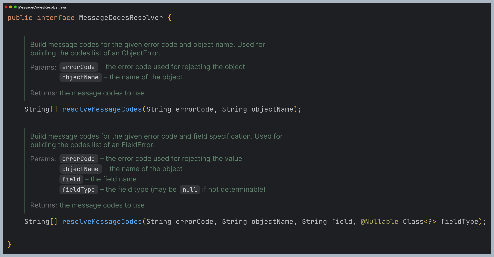

스프링은 기본 구현체인 `DefaultMessageCodesResolver`를 제공하며 메시지 생성 규칙이 있다.

**객체 오류** (예: 오류 코드: `required`, object name: `item`)
  1. code + `.` + object name -> required.item
  2. code → required

**필드 오류** (예: 오류 코드: `typeMissMatch`, object name: `"user"`, field: `"age"`, field type: `int`)
  1. code + `.` + object name + field → `"typeMissMatch.user.age"`
  2. code + `.` + field → `"typeMissMatch.age"`
  3. code + `.` + field type → `"typeMissMatch.int"`
  4. code → `"typeMissMatch`

**동작 방식**
- ``rejectValue()``, ``reject()``는 내부에서 ``MessageCodesResolver``를 사용하는데 여기에서 메시지 코드들을 생성한다.
- ``FieldError``, ``ObjectError``의 생성자는 오류 코드를 하나가 아니라 여러 오류 코드를 가질 수 있고 ``MessageCodesResolver``를 통해서 생성된 순서대로
오류 코드를 보관한다.

타임리프 화면이 렌더링 될 때 `th:errors`가 실행되는데 이 때 오류가 있다면 생성된 오류 메시지 코드를 순서대로 돌아가면서 메시지를 찾는다. 
없으면 기본 오류 메시지를 적용한다.

errors.properties 추가
```properties
#==ObjectError==
#Level1
totalPriceMin.item=상품의 가격 * 수량의 합은 {0}원 이상이어야 합니다. 현재 값 = {1}

#Level2 - 생략
totalPriceMin=전체 가격은 {0}원 이상이어야 합니다. 현재 값 = {1}


#==FieldError==
#Level1
required.item.itemName=상품 이름은 필수입니다.
range.item.price=가격은 {0} ~ {1} 까지 허용합니다.
max.item.quantity=수량은 최대 {0} 까지 허용합니다.

#Level2 - 생략

#Level3
required.java.lang.String = 필수 문자입니다.
required.java.lang.Integer = 필수 숫자입니다.
min.java.lang.String = {0} 이상의 문자를 입력해주세요.
min.java.lang.Integer = {0} 이상의 숫자를 입력해주세요.
range.java.lang.String = {0} ~ {1} 까지의 문자를 입력해주세요.
range.java.lang.Integer = {0} ~ {1} 까지의 숫자를 입력해주세요.
max.java.lang.String = {0} 까지의 숫자를 허용합니다.
max.java.lang.Integer = {0} 까지의 숫자를 허용합니다.

#Level4
required = 필수 값 입니다.
min= {0} 이상이어야 합니다.
range= {0} ~ {1} 범위를 허용합니다.
max= {0} 까지 허용합니다.
```

Level이 낮을수록 덜 구체적인 것이고 높을수록 구체적인 것이다. 메시지에 1번이 없으면 2번을 찾고, 2번이 없으면 3번을 찾는다. 
**크게 중요하지 않은 오류 메시지는 재활용할 수 있다.**

> **DefaultBindingErrorProcessor**
> - 검증 오류 코드는 **개발자가 직접 설정한 오류 코드(`rejectValue()`를 직접 호출)** 와 **스프링이 직접 검증 오류에 추가한 경우**로 나뉜다.
> - 만약 **price** 필드에 문자를 입력하면 스프링은 타입 오류가 발생하는데 `DefaultBindingErrorProcessor` 클래스에 의해  `MessageCodesResolver`를 통하면서 `typeMissMatch`라는 오류 코드로 4가지 메시지 코드가 입력된다.
> 
> errors.properties 추가
> ```properties
> #추가
> typeMismatch.java.lang.Integer=숫자를 입력해주세요.
> typeMismatch=타입 오류입니다.
> ```
> 위 설정이 없다면 스프링이 직접 만든 사용자 친화적이지 못한 기본 생성된 메시지가 나온다. 설정을 하면 지정한 메시지가 그대로 출력된다.
> 
> **MessageSourceResolvable**
> 
> 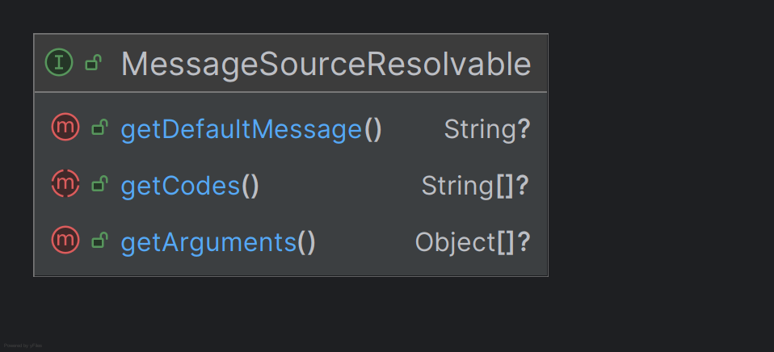
> 
> - `MessageSource`가 메시지를 찾을 때 오류 코드를 제공하는 인터페이스로, 순차적으로 메시지를 탐색하고 적절한 메시지를 찾아 반환한다.
> - 기본 구현체로 `DefaultMessageSourceResolvable` 클래스가 있으며 `ObjectError` 클래스의 부모 클래스이다.
> - `ObjectError`로부터 오류 코드, 메시지 인자, 기본 메시지를 전달 받는다.

오류 메시지가 처리되는 전체적인 과정은 대략 다음과 같다.

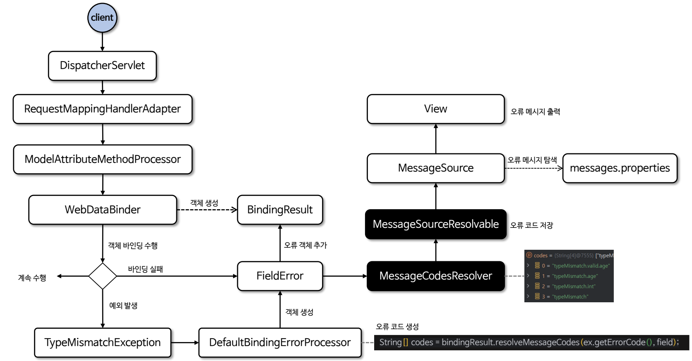

---

## V5

> **검증 로직 분리**: 스프링은 검증을 체계적으로 제공하기 위해 `Validator` 인터페이스를 제공한다.

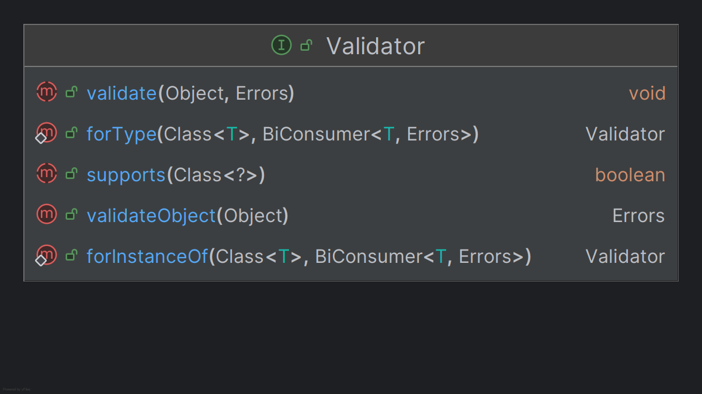

- `supports()` : 해당 `Validator`가 특정 객체 타입을 지원하는지 확인하는 메서드
- `validate()` 
  - 실제 유효성 검사를 수행하는 메서드이며 유효성 검사에 실패한 경우 `Errors` 객체를 사용하여 오류를 추가한다.
  - 주어진 대상 객체가 `supports()` 메서드에서 `true`를 반환하는 클래스여야만 검증할 수 있다.

사용 예 - ItemValidator
```java
@Component
public class ItemValidator implements Validator {

    @Override
    public boolean supports(Class<?> clazz) {
        return Item.class.isAssignableFrom(clazz);
    }

    @Override
    public void validate(Object target, Errors errors) {
        Item item = (Item) target;

        if (!StringUtils.hasText(item.getItemName())) {
            errors.rejectValue("itemName", "required");
        }
        if (item.getPrice() == null || item.getPrice() < 1000 || item.getPrice() > 1_000_000) {
            errors.rejectValue("price", "range", new Object[]{1000, 10_000_000}, null);
        }
        if (item.getQuantity() == null || item.getQuantity() >= 9999) {
            errors.rejectValue("quantity", "max", new Object[]{9999}, null);
        }

        //특정 필드가 아닌 복합 룰 검증
        if (item.getPrice() != null && item.getQuantity() != null) {
            int resultPrice = item.getPrice() * item.getQuantity();
            if (resultPrice < 10000) {
                errors.reject("totalPriceMin", new Object[]{10000, resultPrice}, null);
            }
        }
    }
}
```

사용 예 - 컨트롤러
```java
//....
@Autowired
private final ItemValidator itemValidator;
//....

@PostMapping("/add")
public String addItemV5(@ModelAttribute Item item, BindingResult bindingResult, RedirectAttributes redirectAttributes, Model model) {

    if (itemValidator.supports(item.getClass())) {
        itemValidator.validate(item, bindingResult);
    }

    //검증에 실패하면 다시 입력 폼으로
    if (bindingResult.hasErrors()) {
        log.info("errors={} ", bindingResult);
        return "validation/v2/addForm";
    }

    //성공 로직
    Item savedItem = itemRepository.save(item);
    redirectAttributes.addAttribute("itemId", savedItem.getId());
    redirectAttributes.addAttribute("status", true);
    return "redirect:/validation/v2/items/{itemId}";
}
```

---

## V6

> `Validator` 인터페이스를 사용해서 검증기를 만들면 스프링의 추가적인 도움을 받을 수 있다.

컨트롤러
```java
//....
@Autowired
private final ItemValidator itemValidator;
//....

@InitBinder
public void init(WebDataBinder dataBinder) {
    dataBinder.addValidators(itemValidator);
}

@PostMapping("/add")
public String addItemV6(@Validated @ModelAttribute Item item, BindingResult bindingResult, RedirectAttributes redirectAttributes, Model model) {

    //검증에 실패하면 다시 입력 폼으로
    if (bindingResult.hasErrors()) {
        log.info("errors={} ", bindingResult);
        return "validation/v2/addForm";
    }

    //성공 로직
    Item savedItem = itemRepository.save(item);
    redirectAttributes.addAttribute("itemId", savedItem.getId());
    redirectAttributes.addAttribute("status", true);
    return "redirect:/validation/v2/items/{itemId}";
} 
```

- `WebDataBinder`에 검증기를 추가하면 해당 컨트롤러에서 검증기를 자동으로 적용할 수 있다.
- `@InitBinder`는 해당 컨트롤러에만 영향을 준다.

**동작 방식**
- `@Validated`는 검증기를 실행하라는 뜻의 어노테이션이다.
- `WebDataBinder`에 등록된 검증기를 찾아서 실행하는데 여러 검증기를 등록한다면 구분이 필요한데 이때 `supports()`가 사용된다.