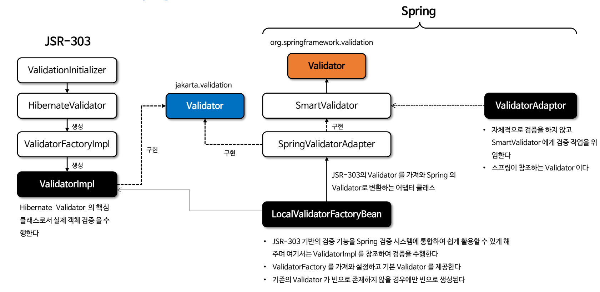
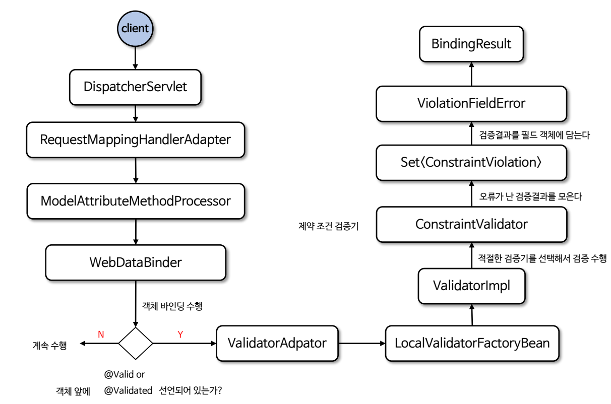
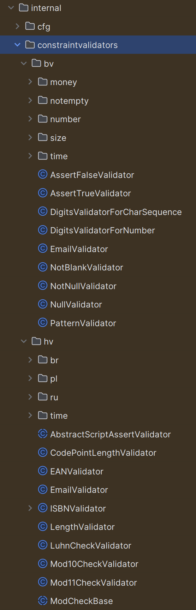
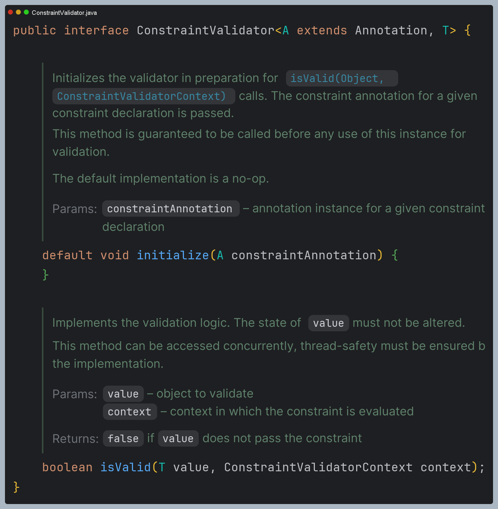

# V4
> 저장용과 수정용 DTO를 각각 만든다.

Item
```java
import lombok.Data;
import org.hibernate.validator.constraints.Range;

import jakarta.validation.constraints.Max;
import jakarta.validation.constraints.NotBlank;
import jakarta.validation.constraints.NotNull;

@Data
public class Item {

    private Long id;
    private String itemName;
    private Integer price;
    private Integer quantity;

    public Item() { }

    public Item(String itemName, Integer price, Integer quantity) {
        this.itemName = itemName;
        this.price = price;
        this.quantity = quantity;
    }
}
```

저장용 객체
```java
@Data
public class ItemSaveForm {

    @NotBlank
    private String itemName;

    @NotNull
    @Range(min = 1000, max = 1000000)
    private Integer price;

    @NotNull
    @Max(value = 9999)
    private Integer quantity;
}
```

수정용 객체
```java
@Data
public class ItemUpdateForm {

    @NotNull
    private Long id;

    @NotBlank
    private String itemName;

    @NotNull
    @Range(min = 1000, max = 1_000_000)
    private Integer price;

    //수정에서는 수량은 자유롭게 변경할 수 있다.
    private Integer quantity;
}
```

컨트롤러
```java
@PostMapping("/add")
public String addItem(@Validated @ModelAttribute("item") ItemSaveForm form, BindingResult bindingResult, RedirectAttributes redirectAttributes) {

    //특정 필드가 아닌 복합 룰 검증
    if (form.getPrice() != null && form.getQuantity() != null) {
        int resultPrice = form.getPrice() * form.getQuantity();
        if (resultPrice < 10000) {
            bindingResult.reject("totalPriceMin", new Object[]{10000, resultPrice}, null);
        }
    }

    //검증에 실패하면 다시 입력 폼으로
    if (bindingResult.hasErrors()) {
        log.info("errors={} ", bindingResult);
        return "validation/v4/addForm";
    }

    //성공 로직
    Item item = new Item();
    item.setItemName(form.getItemName());
    item.setPrice(form.getPrice());
    item.setQuantity(form.getQuantity());

    Item savedItem = itemRepository.save(item);
    redirectAttributes.addAttribute("itemId", savedItem.getId());
    redirectAttributes.addAttribute("status", true);
    return "redirect:/validation/v4/items/{itemId}";
}

@PostMapping("/{itemId}/edit")
public String edit(@PathVariable("itemId") Long itemId, @Validated @ModelAttribute("item") ItemUpdateForm form, BindingResult bindingResult) {

    //특정 필드가 아닌 복합 룰 검증
    if (form.getPrice() != null && form.getQuantity() != null) {
        int resultPrice = form.getPrice() * form.getQuantity();
        if (resultPrice < 10000) {
            bindingResult.reject("totalPriceMin", new Object[]{10000, resultPrice}, null);
        }
    }

    if (bindingResult.hasErrors()) {
         log.info("errors={}", bindingResult);
         return "validation/v4/editForm";
    }

    Item itemParam = new Item();
    itemParam.setItemName(form.getItemName());
    itemParam.setPrice(form.getPrice());
    itemParam.setQuantity(form.getQuantity());

    itemRepository.update(itemId, itemParam);
    return "redirect:/validation/v4/items/{itemId}";
}
```

---

## Bean Validation - HTTP 메시지 컨버터
> `@Valid`, `@Validated`는 `HttpMessageConverter`(`@RequestBody`)에도 적용할 수 있다.

컨트롤러
```java
@Slf4j
@RestController
@RequestMapping("/validation/api/items")
public class ValidationItemApiController {

    @PostMapping("/add")
    public Object addItem(@RequestBody @Validated ItemSaveForm form, BindingResult bindingResult) {

        log.info("API 컨트롤러 호출");

        if (bindingResult.hasErrors()) {
            log.info("검증 오류 발생 errors={}", bindingResult);
            return bindingResult.getAllErrors();
        }

        log.info("성공 로직 실행");
        return form;
    }
}
```
- API의 경우 3가지 경우를 생각해야 한다.
  - **성공 요청** (성공)
  - **실패 요청** : JSON을 객체로 생성하는 것 실패 (JSON parser error)
  - **검증 오류 요청** : JSON을 객체로 생성하는 것은 성공했으나 검증에서 실패

**실패 요청** : price에 문자를 입력했을 때
```json
{
    "timestamp": "2024-01-20T15:52:55.588+00:00",
    "status": 400,
    "error": "Bad Request",
    "path": "/validation/api/items/add"
}
```

**검증 오류 요청** : `@Max`의 범위를 초과했을 때
```json
[
    {
        "codes": [
            "Max.itemSaveForm.quantity",
            "Max.quantity",
            "Max.java.lang.Integer",
            "Max"
        ],
        "arguments": [
            {
                "codes": [
                    "itemSaveForm.quantity",
                    "quantity"
                ],
                "arguments": null,
                "defaultMessage": "quantity",
                "code": "quantity"
            },
            9999
        ],
        "defaultMessage": "9999 이하여야 합니다",
        "objectName": "itemSaveForm",
        "field": "quantity",
        "rejectedValue": 10000,
        "bindingFailure": false,
        "code": "Max"
    }
]
```

`bindingResult.getAllErrors()`는 `objectError`와 `FieldError`를 반환한다. 스프링은 이 객체를 JSON으로 변환해서 클라이언트에게 전달한다.
실제 개발할 때는 이 객체들을 그대로 사용하지 말고 필요한 데이터만 뽑아서 별도의 API 스펙을 정의해야 한다.

> **@ModelAttribute** vs **@RequestBody**
> 
> HTTP 요청 파라미터를 처리하는 `@ModelAttribute`는 필드 단위로 정교하게 바인딩이 적용되기 때문에 특정 필드가 바인딩 되지 않아도 나머지 필드는 
> 정상 바인딩 되고 `Validator`를 사용한 검증도 적용할 수 있다.
> 
> `@RequestBody`는 `HttpMessageConverter` 단계에서 JSON 데이터를 객체로 변경하지 못하면 컨트롤러를 호출하지 못하고 예외가 발생하기 때문에
> `Validator`도 적용할 수 없다.

---

## 스프링과 Bean Validation

- 스프링에서는 어노테이션 기반 검증을 위해 `@Valid`와 `@Validated` 어노테이션을 사용할 수 있으며 사용 방식에 있어 약간 차이가 있다.
- `@Valid`는 `jakarta.validation`에 포함되어 있고, `@Validated`는 `org.springframework.validation.annotation`에 포함되어 있으며
`@Valid`를 사용하기 위해서는 `spring-boot-starter-validation` 의존성이 필요하다.
- 두 어노테이션 모두 객체 타입에만 사용할 수 있다. 또한 검증할 객체 바로 앞에 위치해야 하며 검증된 결과는 `BindingResult`에 담긴다.
- 검증은 바인딩의 가장 마지막 처리 과정이며 기본적으로 바인딩에 성공한 필드는 검증이 이루어진다.
- 만약 필드의 타입 변환이 실패하면 실패 결과가 `FieldError` 객체에 담기고 `BindingResult`에 보관된다.
- 타입 변환에 실패한 필드는 기본 값이 저장된 상태에서 검증이 이루어지지만 `Validator` 구현체에 따라 예외가 발생할 수도 있고 기본 검증이
이루어질 수 있다.

**클래스 구조**



**검증 처리 흐름도**



여기서 `ConstraintValidator`에는 다양한 검증기들이 정의되어 있다.



---

## 커스텀 검증 애노테이션 만들기

`ConstraintValidator` 인터페이스를 구현하여 커스텀 검증 애노테이션을 만들 수 있다.



주어진 제약 조건 `A`에 대해 검증 대상 타입 `T`를 검증하는 인터페이스이다.

- `isValid()` : 검증 작업을 수행한다. 검증 대상 객체 `T`는 변경하지 않고 그대로 유지해야 한다.
- `initialize()` : 검증기의 `isValid()` 호출을 준비하기 위해 초기화한다. 검증에 사용되기 전에 먼저 호출 된다.

```java
/*--------------커스텀 어노테이션--------------*/
@Documented
@Constraint(validatedBy = PasswordValidator.class) //검증기를 지정
@Target({ElementType.FIELD, ElementType.METHOD})
@Retention(RetentionPolicy.RUNTIME)
public @interface ValidPassword {
    String message() default "잘못된 비밀번호 입니다. 비밀번호는 최소 8자 이상이어야 하고, 대문자, 소문자, 숫자를 포함해야 합니다.";
    int minLength() default 8;
    Class<?>[] groups() default {}; //필수
    Class<? extends Payload>[] payload() default {}; //필수
}

/*--------------커스텀 검증기--------------*/
public class PasswordValidator implements ConstraintValidator<ValidPassword, String> {

    private int minLength;
    
    @Override
    public void initialize(ValidPassword constraintAnnotation) {
        this.minLength = constraintAnnotation.minLength();
    }
    
    @Override
    public boolean isValid(String password, ConstraintValidatorContext context) {
        if (!StringUtils.hasText(password)) {
            return false;
        }
        
        boolean length = password.length() >= minLength;
        boolean upperCase = password.chars().anyMatch(Character::isUpperCase);
        boolean lowerCase = password.chars().anyMatch(Character::isLowerCase);
        boolean digit = password.chars().anyMatch(Character::isDigit);
        
        //최소 길이, 대문자, 소문자, 숫자를 포함하는지 검사
        return length && upperCase && lowerCase && digit;
    }
}
```