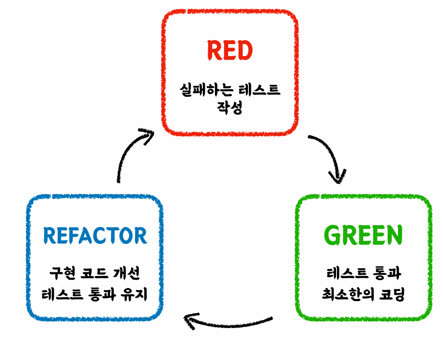

# 단위 테스트

- **단위 테스트**는 작은 코드 단위(클래스 or 메서드)를 **독립적으로** 검증하는 테스트를 의미한다.
- **단위 테스트**는 검증 속도가 빠르고, 안정적이다.

### 예제 코드

```java
/*==========음료 인터페이스==========*/
public interface Beverage {
    String getName();
    int gerPrice();
}

/*==========음료 구현체==========*/
public class Americano implements Beverage {
    @Override
    public String getName() {
        return "아메리카노";
    }

    @Override
    public int gerPrice() {
        return 4000;
    }
}

/*==========음료 구현체==========*/
public class Latte implements Beverage {

    @Override
    public String getName() {
        return "라떼";
    }

    @Override
    public int gerPrice() {
        return 4500;
    }
}

/*==========주문 객체==========*/
@Getter
@AllArgsConstructor
public class Order {
    private LocalDateTime orderDateTime;
    private List<Beverage> beverages;
}
```
```java
@Getter
public class CafeKiosk {

    private final List<Beverage> beverages = new ArrayList<>();

    public void add(Beverage beverage) {
        beverages.add(beverage);
    }

    public void remove(Beverage beverage) {
        beverages.remove(beverage);
    }

    public void clear() {
        beverages.clear();
    }

    public Order createOrder() {
        return new Order(LocalDateTime.now(), beverages);
    }

    public int calculateTotalPrice() {
        return beverages.stream()
                        .mapToInt(Beverage::gerPrice)
                        .sum();
    }
}
```

---

## 1. 수동테스트 vs 자동화 테스트

```java
@Test
void add_manual_test() {
    CafeKiosk cafeKiosk = new CafeKiosk();
    cafeKiosk.add(new Americano(), 1);

    System.out.println(">>> 담긴 음료 수 : " + cafeKiosk.getBeverages().size());
    System.out.println(">>> 담긴 음료 : " + cafeKiosk.getBeverages().getFirst().getName());
}
```
**실행 결과**
```text
>>> 담긴 음료 수 : 1
>>> 담긴 음료 : 아메리카노
```

- 위와 같이 콘솔을 통해 개발자가 직접 눈으로 확인하는 테스트 방식이 수동테스트이다.
- 수동테스트는 최종 단계에서 사람이 개입한다는 점과 다른 개발자가 이 테스트 코드는 무엇을 검증하는지 파악하기 어렵다는 점 등
많은 단점이 있다.
- 심지어 항상 성공하는 테스트 케이스이기 때문에 자동화된 테스트를 통해 기계의 힘으로 정확한 테스트가 이루어지도록 해야한다.

## 2. JUnit5로 테스트하기

- 자바 및 스프링에서는 **JUnit**과 **AssertJ**를 통해 편리하게 테스트 코드를 작성할 수 있다.
- [JUnit5](https://junit.org/junit5/)
  -  단위 테스트를 위한 **프레임워크**
- [AssertJ](https://joel-costigliola.github.io/assertj/index.html)
  - 테스트 코드 작성을 원할하게 돕는 테스트 **라이브러리**
  - 풍부한 API를 지원하며, 메서드 체이닝으로 코드를 깔끔하게 작성할 수 있다.

**사용 예시**
```java
import org.junit.jupiter.api.Test;
import static org.assertj.core.api.Assertions.assertThat;

class AmericanoTest {

    @Test
    void getName() {
        Americano americano = new Americano();
        assertThat(americano.getName()).isEqualTo("아메리카노");
    }

    @Test
    void getPrice() {
        Americano americano = new Americano();
        assertThat(americano.gerPrice()).isEqualTo(4000);
    }
}
```

**자동화 테스트로 수정**
```java
@Test
void add() {
    CafeKiosk cafeKiosk = new CafeKiosk();
    cafeKiosk.add(new Americano());
    
    assertThat(cafeKiosk.getBeverages().size()).isEqualTo(1);
    assertThat(cafeKiosk.getBeverages()).hasSize(1);
    assertThat(cafeKiosk.getBeverages().getFirst().getName()).isEqualTo("아메리카노");
}

@Test
void remove() {
    CafeKiosk cafeKiosk = new CafeKiosk();
    Americano americano = new Americano();
    
    cafeKiosk.add(americano);
    assertThat(cafeKiosk.getBeverages()).hasSize(1);
    
    cafeKiosk.remove(americano);
    assertThat(cafeKiosk.getBeverages()).isEmpty();
}

@Test
void clear() {
    CafeKiosk cafeKiosk = new CafeKiosk();
    Americano americano = new Americano();
    Latte latte = new Latte();
    
    cafeKiosk.add(americano);
    cafeKiosk.add(latte);
    assertThat(cafeKiosk.getBeverages()).hasSize(2);
    
    cafeKiosk.clear();
    assertThat(cafeKiosk.getBeverages()).isEmpty();
}
```

자동화된 테스트를 통해 실제 구현 내용이 변경되더라도 사람의 개입 없이 지속적인 테스트 코드로 프로덕션 코드가 정상적으로 동작하고 있는지
수시로 확인해볼 수 있게 되었다.

## 3. 테스트 케이스 세분화하기

예를 들어 한 종류의 음료를 여러 번 담는 요구사항이 추가되었다고 해보자. 그러면 다음과 같이 코드를 만들 수 있을 것이다.

```java
public void add(Beverage beverage, int count) {
    for (int i = 0; i < count; i++) {
        beverages.add(beverage);
    }
}
```

하지만 보통 요구사항은 있는 그대로가 다가 아니다. 예를 들어 0개 이하를 담으려는 경우 어떻게 대처할 것인가 정의가 필요할 수 있다.
이렇게 테스트 케이스에는 요구사항을 그대로 만족하는 **해피 케이스**와 그 외의 상황들인 **예외 케이스**로 분류할 수 있다.

이런 케이스들을 다 막아야 꼼꼼한 테스트와 프로덕션 코드를 완성할 수 있고, 이런 케이스들을 테스트할 때는 **경계값 테스트**를 하는 것이
중요하다. 여기서 경계는 범위(이상, 이하, 초과, 미만), 구간 날짜 등을 의미한다. 예를 들어 **정수가 3 이상**일 때 특정 조건을 만족해야 한다고 가정할 때,
해피 케이스는 4나 5보다는 `3`에 대한 테스트를 작성하는 것이 좋고, 반대로 예외 케이스는 1이나 0 이하보다는 `2`에 대한 검증을 하는 것이 좋다.

따라서 상식적으로 주문은 최소 한 개 이상이 되어야 한다는 것이 암묵적인 요구사항이라고 볼 수 있고, 
다음과 같이 코드를 수정할 수 있다.

```java
public void add(Beverage beverage, int count) {
    // 추가!
    if (count <= 0) {
        throw new IllegalArgumentException("음료는 1잔 이상 주문할 수 있습니다.");
    }
    for (int i = 0; i < count; i++) {
        beverages.add(beverage);
    }
}
```

**테스트 코드**
```java
@Test
void addSeveralBeverages() {
    CafeKiosk cafeKiosk = new CafeKiosk();
    Americano americano = new Americano();
    
    //해피케이스, 경계값 2
    cafeKiosk.add(americano, 2);
    
    assertThat(cafeKiosk.getBeverages().getFirst()).isEqualTo(americano);
    assertThat(cafeKiosk.getBeverages().get(1)).isEqualTo(americano);
}
@Test
void addZeroBeverages() {
    CafeKiosk cafeKiosk = new CafeKiosk();
    Americano americano = new Americano();
    
    //예외케이스, 경계값 0 이하
    assertThatThrownBy(() -> cafeKiosk.add(americano, 0))
            .isInstanceOf(IllegalArgumentException.class)
            .hasMessage("음료는 1잔 이상 주문할 수 있습니다.");
}
```

## 4. 테스트하기 어려운 영역을 분리하기

운영 시간 외에는 주문을 할 수 없다는 요구사항이 추가되었다고 해보자. 그래서 다음과 같이 코드를 작성했다.

```java
@Getter
public class CafeKiosk {

    //추가!
    private static final LocalTime SHOP_OPEN_TIME = LocalTime.of(10, 0);
    private static final LocalTime SHOP_CLOSE_TIME = LocalTime.of(23, 0);

    private final List<Beverage> beverages = new ArrayList<>();
    
    //...
  
    //추가!
    public Order createOrder() {
        LocalDateTime currentDateTime = LocalDateTime.now();
        LocalTime currentTime = currentDateTime.toLocalTime();
        
        if (currentTime.isBefore(SHOP_OPEN_TIME) || currentTime.isAfter(SHOP_CLOSE_TIME)) {
            throw new IllegalArgumentException("주문 시간이 아닙니다. 관리자에게 문의하세요.");
        }
        
        return new Order(currentDateTime, beverages);
    }
}
```

**테스트 코드**
```java
@Test
void createOrder() {
    CafeKiosk cafeKiosk = new CafeKiosk();
    Americano americano = new Americano();
    cafeKiosk.add(americano);
    
    Order order = cafeKiosk.createOrder();
    
    assertThat(order.getBeverages()).hasSize(1);
    assertThat(order.getBeverages().getFirst().getName()).isEqualTo("아메리카노");
}
```

이 테스트 코드는 항상 성공하는 테스트일까? 그렇지 않다. 왜냐하면 `createOrder()` 메서드가 호출되는 시점에 `LocalDateTime.now()`를
호출한다. 즉 실행할 때마다 변경되는 값이기 때문에 테스트를 언제 실행하느냐에 따라 테스트 성공 여부가 결정된다.

따라서 다음과 같이 날짜를 외부에서 받도록 코드를 수정해야 한다. 이러면 프로덕션 코드에서는 `LocalDateTime.now()`를 매개변수로
사용할 수 있고, 테스트 코드에서는 날짜를 변경해가면서 테스트를 실행할 수 있다.

```java
//외부에서 받도록 수정!
public Order createOrder(LocalDateTime currentDateTime) {
    LocalTime currentTime = currentDateTime.toLocalTime();
    
    if (currentTime.isBefore(SHOP_OPEN_TIME) || currentTime.isAfter(SHOP_CLOSE_TIME)) {
        throw new IllegalArgumentException("주문 시간이 아닙니다. 관리자에게 문의하세요.");
    }
    return new Order(currentDateTime, beverages);
}
```
**테스트 코드**
```java
@Test
void createOrderWithCurrentTime() {
    CafeKiosk cafeKiosk = new CafeKiosk();
    Americano americano = new Americano();
    cafeKiosk.add(americano);
    
    //해피케이스, 경계값 - 시작 시각
    Order order = cafeKiosk.createOrder(LocalDateTime.of(2024, 3, 30, 10, 0));
    
    assertThat(order.getBeverages()).hasSize(1);
    assertThat(order.getBeverages().getFirst().getName()).isEqualTo("아메리카노");
}

@Test
void createOrderOutsideOpenTime() {
    CafeKiosk cafeKiosk = new CafeKiosk();
    Americano americano = new Americano();
    cafeKiosk.add(americano);
    
    //예외 케이스, 경계값 - 종료 시각
    assertThatThrownBy(() -> cafeKiosk.createOrder(LocalDateTime.of(2024, 3, 30, 9, 59)))
            .isInstanceOf(IllegalArgumentException.class)
            .hasMessage("주문 시간이 아닙니다. 관리자에게 문의하세요.");
}
```

이렇게 **테스트하기 어려운 영역을 구분하고 분리하는 것**은 중요하다. 예를 들어 `LocalDateTime.now()`가 중요한 요소가 아니라
어떤 시간이 주어졌을 때 이 시간을 가지고 특정 조건을 판단하는 것이 중요한 것이다. 그래서 날짜를 외부에서 받도록 수정했다.
**외부로 분리할수록 테스트 가능한 코드는 많아진다.**

**테스트하기 어려운 영역**
- **관측할 때마다 다른 값에 의존하는 코드**
  - 현재 날짜/시간, 랜덤 값, 전역 변수/함수, 사용자 입력 등
- **외부 세계에 영향을 주는 코드**
  - 표준 출력, 메시지 발송, 데이터베이스에 기록하기 등

반대로 **테스트하기 쉬운 영역**은 외부 세계와 단절된 형태인 **순수 함수**이다. 즉 **같은 입력에는 항상 같은 결과**가 나오는 코드는
테스트하기 쉬운 코드라고 할 수 있다.

## 5. TDD

- **TDD : Test Driven Development**
  - 프로덕션 코드보다 테스트 코드를 먼저 작성하여 테스트가 구현 과정을 주도하도록 하는 방법론
- TDD는 주로 **Red - Green - Refactor** 단계로 이루어진다.



**1. Red 단계**

예를 들어 주문서에 담긴 음료의 총합을 구하는 메서드를 테스트할 때 우선 컴파일이 되는 정도까지만 코드를 작성한다. 
이때는 당연히 테스트에 실패하기 때문에 **Red** 단계이다.

```java
/*============테스트 코드============*/
@Test
void calculateTotalPrice() {
    CafeKiosk cafeKiosk = new CafeKiosk();
    cafeKiosk.add(new Americano());
    cafeKiosk.add(new Latte());
    
    int totalPrice = cafeKiosk.calculateTotalPrice();

    assertThat(totalPrice).isEqualTo(8500);
}

/*============프로덕션 코드============*/
public int calculateTotalPrice() {
  return 0;
}
```

**2. Green 단계**

그리고 테스트가 통과될 수 있도록 최소한의 코딩을 통해 코드를 수정한다. 이러면 테스트가 통과될 것이고, 이 단계가 **Green** 단계이다. 

```java
/*============프로덕션 코드============*/
public int calculateTotalPrice() {
  return 8500;
}
```

**3. Refactor 단계**

그리고 나서 테스트 통과가 유지될 수 있도록 구현부를 리팩토링을 진행한다. 이 단계가 **Refactor** 단계이다.

```java
/*============리팩토링 1============*/
public int calculateTotalPrice() {
    int totalPrice = 0;
    for (Beverage beverage : beverages) {
        totalPrice += beverage.gerPrice();
    }
    return totalPrice;
}

/*============리팩토링 2============*/
public int calculateTotalPrice() {
  return beverages.stream()
                  .mapToInt(Beverage::gerPrice)
                  .sum();
}
```

테스트 코드가 기능을 보장해주고 있기 때문에 구현부 코드의 과감한 리팩토링이 가능해지는 것이다.

1. **선 기능 구현, 후 테스트 작성**
   - 테스트 자체가 누락될 수 있다.
   - 특정 테스트 케이스(해피 케이스)만 검증할 수 있다.
   - 잘못된 구현을 늦게 발견할 수 있다.
   - 테스트는 구현부 검증을 위한 보조 수단일 뿐인 존재가 된다.
2. **선 테스트 작성, 후 기능 구현**
   - 복잡도가 낮은(유연하며 유지보수가 쉬운) 테스트 가능한 코드로 구현할 수 있게 한다.
   - 쉽게 발견하기 어려운 엣지 케이스를 놓치지 않게 해준다.
   - 구현에 대한 빠른 피드백을 얻을 수 있다.
   - 과감한 리팩토링이 가능해진다.
   - 테스트와 상호 작용하며 발전하는 구현부를 만들 수 있다.

## 6. DisplayName을 섬세하게

테스트 코드는 프로덕션 기능을 설명하는 하나의 **문서**가 될 수 있다. 팀원이 테스트 코드를 보고 직관적으로 이해하기 위해
테스트 코드 설명을 섬세하게 적어주는 것이 좋은데, 다음 예시들을 통해 **베스트 프랙티스**를 알아보자.

```java
//@DisplayName("음료 1개 추가 테스트")
@DisplayName("음료 1개를 추가하면 주문 목록에 담긴다.") //베스트 프랙티스
@Test
void add() {
    CafeKiosk cafeKiosk = new CafeKiosk();
    
    cafeKiosk.add(new Americano());
    
    assertThat(cafeKiosk.getBeverages().size()).isEqualTo(1);
    assertThat(cafeKiosk.getBeverages()).hasSize(1);
    assertThat(cafeKiosk.getBeverages().getFirst().getName()).isEqualTo("아메리카노");
}
```
```java
//@DisplayName("특정 시간 이전에 주문을 생성하면 실패한다.")
@DisplayName("영업 시작 시간 이전에는 주문을 생성할 수 없다.") //베스트 프랙티스
@Test
void createOrderOutsideOpenTime() {
   CafeKiosk cafeKiosk = new CafeKiosk();
   
   Americano americano = new Americano();
   cafeKiosk.add(americano);
   
   //예외 케이스, 경계값 - 종료 시각
   assertThatThrownBy(() -> cafeKiosk.createOrder(LocalDateTime.of(2024, 3, 30, 9,
           .isInstanceOf(IllegalArgumentException.class)
           .hasMessage("주문 시간이 아닙니다. 관리자에게 문의하세요.");
}
```

**정리**
1. "~ 테스트"는 지양한다.
2. 명사의 나열보다 문장으로 작성한다.
   - ex) A이면 B이다.
   - ex) A이면 B가 아니고 C다.
3. 테스트 행위에 대한 결과까지 기술한다.
4. 도메인 용어를 사용하여 한층 추상화된 내용을 담는다.
   - 메서드 자체의 관점보다 도메인 정책 관점으로
5. 테스트의 현상을 중점으로 기술하지 않는다.

## 7. BDD 스타일로 작성하기

- **BDD : Behavior Driven Development**, TDD에서 파생된 개발 방법론
- 함수 단위의 테스트에 집중하기보다, 시나리오에 기반한 테스트케이스 자체에 집중하여 테스트한다.
- 개발자가 아닌 사람이 봐도 이해할 수 있을 정도의 추상화 수준을 권장한다.

### Given / When / Then 패턴

1. **Given** : 시나리오 진행에 필요한 모든 준비 과정 (객체, 값, 상태 등)
2. **When** : 시나리오 행동 진행
3. **Then** : 시나리오 진행에 대한 결과 명시 및 검증

정리하면 "어떤 환경에서(`Given`), 어떤 행동을 진행했을 때(`When`), 어떤 상태 변화가 일어난다.(`Then`)" 라고 할 수 있으며,
이는 **DisplayName**을 명확하게 작성할 수 있는 기반이 된다.

**코드 예시**
```java
@DisplayName("주문 목록에 담긴 상품들의 총 금액을 계산할 수 있다.")
@Test
void calculateTotalPrice() {
    //given
    CafeKiosk cafeKiosk = new CafeKiosk();
    cafeKiosk.add(new Americano());
    cafeKiosk.add(new Latte());
    
    //when
    int totalPrice = cafeKiosk.calculateTotalPrice();
    
    //then
    assertThat(totalPrice).isEqualTo(8500);
}

@DisplayName("영업 시작 시간 이전에는 주문을 생성할 수 없다.")
@Test
void createOrderOutsideOpenTime() {
    //given
    CafeKiosk cafeKiosk = new CafeKiosk();
    Americano americano = new Americano();
    
    //when
    cafeKiosk.add(americano);
    
    //then
    assertThatThrownBy(() -> cafeKiosk.createOrder(LocalDateTime.of(2024, 3, 30, 9, 59)))
            .isInstanceOf(IllegalArgumentException.class)
            .hasMessage("주문 시간이 아닙니다. 관리자에게 문의하세요.");
}
```