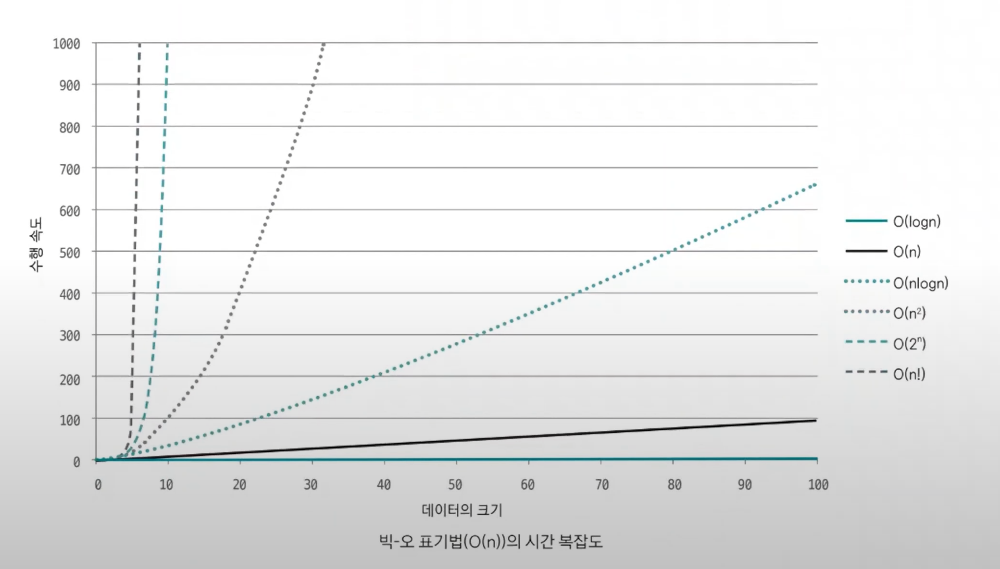

# 시간 복잡도 표기법

- 알고리즘에서 시간 복잡도는 주어진 문제를 해결하기 위한 연산 횟수를 말한다.
- 일반적으로 약 1억 번의 연산을 1초의 수행 시간으로 예측할 수 있다.(파이썬은 약 2,000만번 ~ 1억 번)

**시간 복잡도를 정의하는 3가지 유형**
- 빅-오메가(`Ω(n)`) : 최선일 때(base case)의 연산 횟수를 나타내는 표기법
- 빅-세타(`θ(n)`) : 보통일 때(average case)의 연산 횟수를 나타내는 표기법
- 빅-오(`O(n)`) : 최악일 때(worst case)의 연산 횟수를 나타내는 표기법

예를 들어 1~100 사이의 무작위 값을 찾아 출력하는 코드가 있다고 보자.
```python
import random

findNumber = random.randrange(1, 101)

for i in range(1, 101):
    if i == findNumber:
        print(i)
        break
```
- 빅-오메가(`Ω(n)`) 표기법의 시간 복잡도 : 1번
- 빅-세타(`θ(n)`) 표기법의 시간 복잡도 : N/2번
- 빅-오(`O(n)`) 표기법의 시간 복잡도 : N번

### 코딩 테스트에서는 어떤 시간 복잡도 유형을 사용해야 할까?

- **코딩 테스트에서는 빅-오(`O(n)`) 표기법을 기준으로 수행 시간을 계산하는 것이 좋다.**
- 실제 테스트에서는 다양한 테스트 케이스를 수행해 모든 케이스를 통과해야만 합격으로 판단하므로 시간 복잡도를 판단할 때는 **최악일 때**를 염두에 둬야 한다.



- 빅-오(`O(n)`) 표기법으로 표현한 시간 복잡도 그래프다.
- 각각의 시간 복잡도는 데이터 크기(`N`)의 증가에 따라 성능(수행 시간)이 다른 걸 볼 수 있다.

# 시간 복잡도 활용

[문제 예 - 백준(수 정렬하기)](https://www.acmicpc.net/problem/2751)

- 문제의 시간 제한이 2초이므로 이 조건을 만족하려면 4,000만 번 이하(1초에 2,000만 번 연산 기준)의 연산 횟수로 문제를 해결해야 한다.
- 문제에서 최대 데이터 크기는 1,000,000이다.
- 문제에서 주어진 시간 제한과 데이터 크기를 바탕으로 어떤 정렬 알고리즘을 사용할지 판단할 수 있다.

> **연산 횟수 계산 방법** : 알고리즘 시간 복잡도 `n`값에 데이터의 최대 크기를 대입

위 공식으로 알고리즘을 평가해보면
- `버블 정렬` : (1,000,000)^2 = 1,000,000,000,000 > 40,000,000 -> 부적합
- `병합 정렬` : 1,000,000 log₂(1,000,000) = 약 20,000,000 < 40,000,000 ->  **적합**
: 이렇게 시간 복잡도 분석으로 문제에서 사용할 수 있는 알고리즘을 선택할 수 있다. 즉, 데이터의 크기(`N`)를 단서로 사용해야 하는 알고리즘을 추측할 수 있다.

**시간 복잡도는 작성한 코드의 비효율적인 로직을 개선하는 바탕으로도 사용할 수 있다.**
> **시간 복잡도 도출 기준**
> 1. 상수는 시간 복잡도 계산에서 제외한다.
> 2. 가장 많이 중첩된 반복문의 수행 횟수가 시간 복잡도의 기준이 된다.

- 예제1 : 연산 횟수 = `N`
```python
N = 100_000
count = 1

for i in range(N):
    print("연산 횟수 " + str(count))
    count += 1
```

- 예제2 : 연산 횟수 = `3N`
```python
N = 100_000
count = 1

for i in range(N):
    print("연산 횟수 " + str(count))
    count += 1

for i in range(N):
    print("연산 횟수 " + str(count))
    count += 1

for i in range(N):
    print("연산 횟수 " + str(count))
    count += 1
```
- 두 예제의 연산 횟수는 3배 차이다.
- 하지만 **코딩 테스트에서는 일반적으로 상수를 무시하므로** 두 코드 모두 시간복잡도는 `O(n)`으로 같다.

<br>

- 예제3 : 연산 횟수 = `N^2`
```python
N = 100_000
count = 1

for i in range(N):
    for j in range(N):
        print("연산 횟수 " + str(count))
        count += 1
```
- **시간 복잡도는 가장 많이 중첩된 반복문을 기준으로 도출한다.**
- 일반 for문이 10개 더 있어도 시간 복잡도는 `O(n^2)`으로 유지된다.