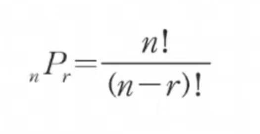
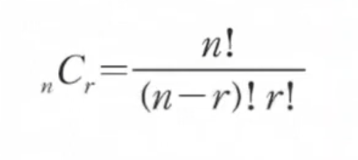
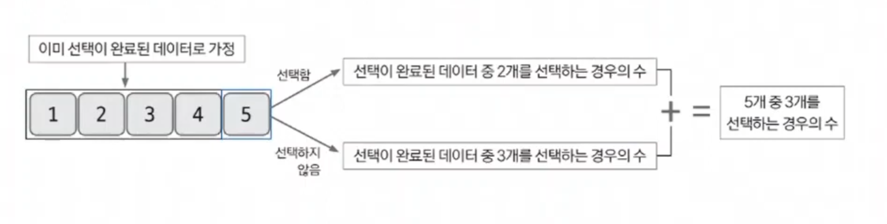

# 조합

- 조합(`combination`) `ₙCᵣ`로 표현하고, 이는 `n`개의 숫자에서 `r`개를 뽑는 경우의 수를 뜻한다.
- 조합과 비교되는 순열은 `ₙPᵣ`로 표현되고, `n`개의 숫자 중 `r`개를 뽑아 순서를 고려해 나열할 경우의 수를 말한다.
- 순열과 조합의 차이는 순서의 고려 유무이다.
- 즉, 조합에서는 데이터 1, 2, 3과 3, 2, 1을 같은 경우로 판단하고, 순열은 다른 경우로 판단한다.

## 순열과 조합 핵심 이론

**순열의 수학적 공식**

- 예를 들어 5개 중 2개를 순서대로 선택하는 경우의 수
- 1번째 선택은 5개 데이터를 선택할 수 있으므로 5가지를 선택할 수 있다.
- 2번째 선택은 1번째에서 선택한 데이터를 제외한 4가지를 선택할 수 있다.
- 따라서 5개 중 2개를 고르는 경우의 수는 총 5 * 4 = 20가지가 된다. 

**조합의 수학적 공식**

- 순열과 매우 비슷하며 분모에 `r!`만 추가돼 있다.
- `r!`이 의미하는 것은 순서가 다른 경우의 수를 제거하는 역할을 한다.
- 예를 들어 5개 중 2개를 선택하는 경우의 수는 기존 순열의 경우의 수(20)에 2!로 나눠 20 / 2 = 10가지 경우의 수가 된다.
- 즉, `1, 2`와 `2, 1`을 1가지 경우의 수로 만들기 위해 2로 나눈 것이다.

**일반적으로 조합은 동적 계획법을 해결하는 데 중요한 핵심사항이 된다.**

### 1. 특정 문제를 가정하기

- 5개의 데이터에서 3개를 선택하는 조합의 경우의 수를 푸는 문제로 가정한다.(5C3)

### 2. 모든 부분 문제가 해결된 상황이라고 가정하고 지금 문제 생각하기

- 5개의 데이터 중 4개가 이미 선택 여부가 결정된 데이터라고 가정해본다.
- 그리고 5번째 데이터의 선택 여부에 따른 경우의 수를 계산한다.
- 만약 5번째 데이터를 포함해 총 3개의 데이터를 선택하려면 선택이 완료됐다고 가정한 4개의 데이터에서 2개가 선택되어 있어야 한다.
- 5번째 데이터를 포함하지 않고 총 3개의 데이터를 선택하려면 이전 데이터 4개 중 3개가 선택되어 있어야 한다.
- 이 2가지 경우의 수를 합치면 데이터 5개 중 3개를 선택하는 경우의 수가 나온다.(`4C2` + `4C3`)

- **5개 중 3개를 선택하는 경우의 수 점화식**
  - `D[5][3]` = `D[4][3]` + `D[4][2]`

### 3. 특정 문제를 해결한 내용을 바탕으로 일반 점화식 도출하기

- **조합 점화식**
  - `D[i][j]` = `D[i - 1][j]` + `D[j - 1][j - 1]`

### [예제 문제(이항 계수 1)](https://github.com/genesis12345678/TIL/blob/main/algorithm/combination/Example_1.md#%EC%A1%B0%ED%95%A9-%EC%98%88%EC%A0%9C---1)

### [예제 문제(이항 계수 2)](https://github.com/genesis12345678/TIL/blob/main/algorithm/combination/Example_2.md#%EC%A1%B0%ED%95%A9-%EC%98%88%EC%A0%9C---2)

### [예제 문제(부녀회장이 될테야)](https://github.com/genesis12345678/TIL/blob/main/algorithm/combination/Example_3.md#%EC%A1%B0%ED%95%A9-%EC%98%88%EC%A0%9C---3)

### [예제 문제(다리 놓기)](https://github.com/genesis12345678/TIL/blob/main/algorithm/combination/Example_4.md#%EC%A1%B0%ED%95%A9-%EC%98%88%EC%A0%9C---4)

### [예제 문제(조약돌 꺼내기)](https://github.com/genesis12345678/TIL/blob/main/algorithm/combination/Example_5.md#%EC%A1%B0%ED%95%A9-%EC%98%88%EC%A0%9C---5)

### [예제 문제(순열의 순서)](https://github.com/genesis12345678/TIL/blob/main/algorithm/combination/Example_6.md#%EC%A1%B0%ED%95%A9-%EC%98%88%EC%A0%9C---6)

### [예제 문제(사전)](https://github.com/genesis12345678/TIL/blob/main/algorithm/combination/Example_7.md)

### [예제 문제(선물 전달)](https://github.com/genesis12345678/TIL/blob/main/algorithm/combination/Example_8.md#%EC%A1%B0%ED%95%A9-%EC%98%88%EC%A0%9C---8)

