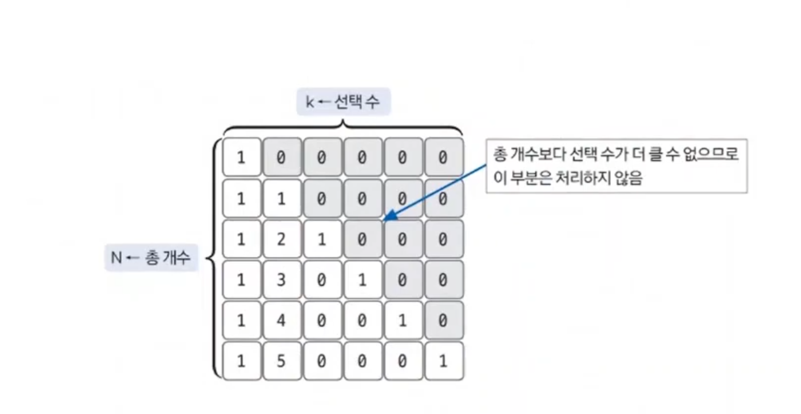
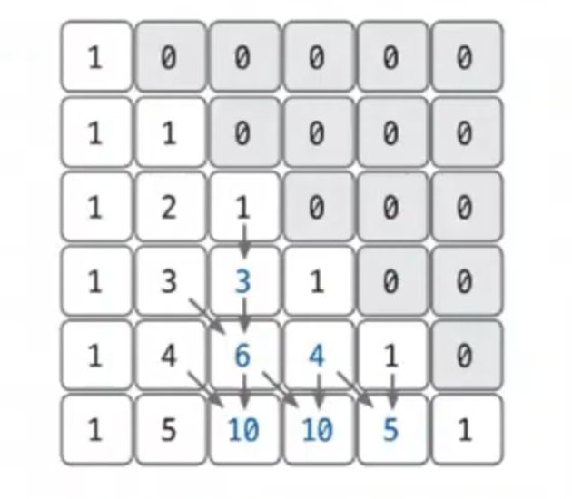

# 조합 예제 - 1

### [문제(백준(11050번 - 이항 계수 1))](https://www.acmicpc.net/problem/11050)

### 문제 분석
- 조합에서 가장 기본이 되는 문제이다.
- nCk로 해결하면 된다.

### 손으로 풀어보기
1. **N과 K 값을 입력받고 DP 배열을 선언한다. 그리고 DP 배열의 값을 초기화한다.**
   - **DP 배열 초기화**
   - `D[i][j]`일 떄, `i` = 총 숫자 개수, `j` = 선택 수 개수 (`i`개 중 `j`개를 뽑는 경우의 수)
     - `D[i][1]` = `i` => `i`개 중 1개를 뽑는 경우의 수는 `i`개
     - `D[i][0]` = 1 => `i`개 중 1개도 선택하지 않는 경우의 수는 1개
     - `D[i][i]` = 1 => `i`개 중 `i`개를 선택하는 경우의 수는 1개



2. **점화식으로 DP 배열의 값을 채운다.**
   - **조합 점화식**
     - `D[i][j]` = `D[i - 1][j]` + `D[i - 1][j - 1]`



3. **D[N][K]의 값을 출력한다.**


### 슈도코드
```text
n(총 개수) k(선택 수)
DP 리스트 

for n 반복:
    D[i][1] = i
    D[i][0] = 1
    D[i][i] = 1

for i n 반복:
    for k i만큼 반복:   # 고르는 수의 개수가 전체 개수를 넘을 수 없음
        DP[i][j] = DP[i - 1][j] + DP[i - 1][j - 1]

D[n][k] 출력
```

### 코드 구현 - 파이썬
```python
n, k = map(int, input().split())
DP = [[0 for _ in range(n + 1)] for _ in range(n + 1)]

for i in range(n + 1):
    DP[i][1] = i
    DP[i][0] = 1
    DP[i][i] = 1

for i in range(2, n + 1):
    for j in range(1, i):
        DP[i][j] = DP[i - 1][j] + DP[i - 1][j - 1]

print(DP[n][k])
```

### 코드 구현 - 자바
```java
import java.io.*;
import java.util.*;

public class Main {

    public static void main(String[] args) throws IOException {
        BufferedReader br = new BufferedReader(new InputStreamReader(System.in));
        StringTokenizer st = new StringTokenizer(br.readLine());
        int n = Integer.parseInt(st.nextToken());
        int k = Integer.parseInt(st.nextToken());

        int[][] dp = new int[n + 1][n + 1];

        for (int i = 0; i < n + 1; i++) {
            dp[i][1] = i;
            dp[i][0] = 1;
            dp[i][i] = 1;
        }

        for (int i = 2; i < n + 1; i++) {
            for (int j = 1; j < i; j++) {
                dp[i][j] = dp[i - 1][j] + dp[i - 1][j - 1];
            }
        }
        System.out.println(dp[n][k]);
    }
}
```