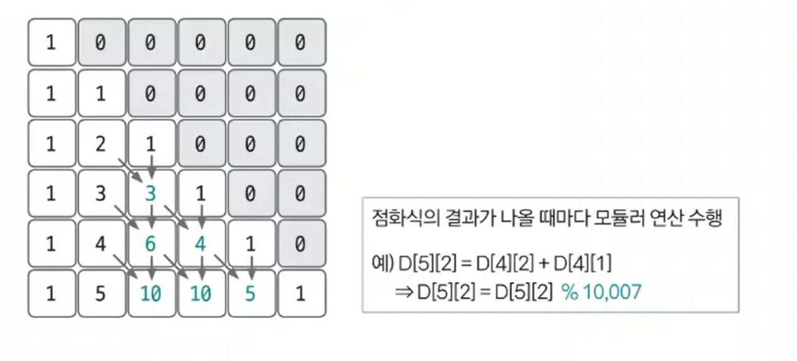

# 조합 예제 - 2

### [문제(백준(11051번 - 이항 계수 2))](https://www.acmicpc.net/problem/11051)

### 문제 분석
- 일반적인 이항계수 문제와 동일하다. 단지 N의 범위가 커지고, 결괏값을 10,007로 나눈 나머지를 출력하라는 요구사항이 늘어났다.
- 다음 모듈러 연산의 특성을 이용해 문제를 해결한다.
- **모듈러 연산의 특성**
  - `(A % N + B % N) % N` = `(A + B) % N`
  - 모듈러 연산은 덧셈에 관해 위와 같이 각각 모듈러를 하고 모듈러 연산을 수행한 것과
  - 두 수를 더한 후 수행한 것의 값이 동일하다.
- DP 배열에 결괏값이 나올 때마다 모듈러 연산을 수행하는 로직을 추가하면 이 문제를 해결할 수 있다.

### 손으로 풀어보기
1. **N과 K값을 입력 받고 DP 베열을 선언한다. 그리고 DP 배열의 값을 초기화한다.**
    - **DP 배열 초기화**
    - `D[i][j]`일 떄, `i` = 총 숫자 개수, `j` = 선택 수 개수 (`i`개 중 `j`개를 뽑는 경우의 수)
        - `D[i][1]` = `i` => `i`개 중 1개를 뽑는 경우의 수는 `i`개
        - `D[i][0]` = 1 => `i`개 중 1개도 선택하지 않는 경우의 수는 1개
        - `D[i][i]` = 1 => `i`개 중 `i`개를 선택하는 경우의 수는 1개

2. **점화식으로 DP 배열의 값을 채운다. 이때 점화식의 결괏값이 나올 때마다 MOD 연산을 수행한다.**
   - **조합 점화식**
     - `D[i][j]` = `D[i - 1][j]` + `D[i - 1][j - 1]`



3. **D[N][K]의 값을 출력한다.**

### 슈도코드
```text
n(총 개수) k(선택 수)
DP 리스트 

for n 반복:
    D[i][1] = i
    D[i][0] = 1
    D[i][i] = 1

for i n 반복:
    for k i만큼 반복:   # 고르는 수의 개수가 전체 개수를 넘을 수 없음
        DP[i][j] = DP[i - 1][j] + DP[i - 1][j - 1]
        DP[i][j] 값을 10,007로 mod 연산한 값으로 업데이트

D[n][k] 출력
```

### 코드 구현 - 파이썬
```python
n, k = map(int, input().split())
DP = [[0 for _ in range(n + 1)] for _ in range(n + 1)]

for i in range(n + 1):
    DP[i][1] = i
    DP[i][0] = 1
    DP[i][i] = 1

for i in range(2, n + 1):
    for j in range(1, i):
        DP[i][j] = DP[i - 1][j] + DP[i - 1][j - 1]
        DP[i][j] %= 10_007

print(DP[n][k])
```

### 코드 구현 - 자바
```java
import java.io.*;
import java.util.*;

public class Main {

    public static void main(String[] args) throws IOException {
        BufferedReader br = new BufferedReader(new InputStreamReader(System.in));
        StringTokenizer st = new StringTokenizer(br.readLine());
        int n = Integer.parseInt(st.nextToken());
        int k = Integer.parseInt(st.nextToken());

        int[][] dp = new int[n + 1][n + 1];

        for (int i = 0; i < n + 1; i++) {
            dp[i][1] = i;
            dp[i][0] = 1;
            dp[i][i] = 1;
        }

        for (int i = 2; i < n + 1; i++) {
            for (int j = 1; j < i; j++) {
                dp[i][j] = dp[i - 1][j] + dp[i - 1][j - 1];
                dp[i][j] %= 10_007;
            }
        }
        System.out.println(dp[n][k]);
    }
}
```