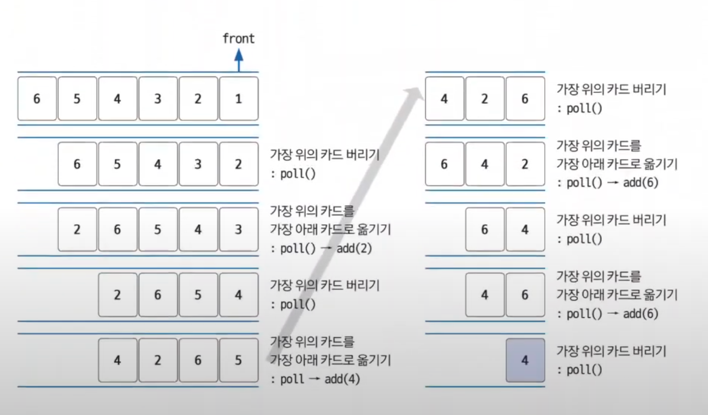

# 큐 예제 - 1

### [예제 문제(백준(2164번 - 카드2))](https://www.acmicpc.net/problem/2164)

### 문제 분석
- 큐를 잘 이해하고 있는지 묻는 문제이다.
- 가장 위의 카드를 가장 아래에 있는 카드 밑으로 옮기는 동작은 큐의 섭인선출 성질을 이용하면 쉽게 구현할 수 있다.
- 최대 개수가 500,000이므로 시간 복잡도의 제약도 크지 않다.

### 손으로 풀어보기
1. **`popleft`를 수행하여 맨 앞의 카드를 버린다.**
2. **바로 `append`를 수행해 맨 앞에 있는 카드를 가장 아래로 옮긴다.**
3. **큐의 크기가 1이 될 때까지 과정 1~2를 반복한 후 큐에 남은 원소를 출력한다.**



### 슈도코드
```text
n(카드 개수)
myQueue(카드 저장 자료구조)

for n :
    큐에 카드 저장
    
while 카드가 1장 남을 때까지:
    맨 위의 카드를 버린다: popleft()
    맨 위의 카드를 가장 아래의 카드 밑으로 이동: append(popleft())

마지막으로 남은 카드 출력
```

### 코드 구현 - 파이썬
```python
from collections import deque

n = int(input())
myQueue = deque()

for i in range(1, n+1):
    myQueue.append(i)

while len(myQueue) > 1:
    myQueue.popleft()
    myQueue.append(myQueue.popleft())

print(myQueue[0])
```

### 코드 구현 - 자바
```java
import java.io.BufferedReader;
import java.io.IOException;
import java.io.InputStreamReader;
import java.util.LinkedList;
import java.util.Queue;

public class Main {
    public static void main(String[] args) throws IOException {
        BufferedReader br = new BufferedReader(new InputStreamReader(System.in));

        int n = Integer.parseInt(br.readLine());

        Queue<Integer> qu = new LinkedList<>();
        for (int i = 1; i <= n; i++) {
            qu.offer(i);
        }

        while (qu.size() > 1) {
            qu.poll();
            qu.offer(qu.poll());
        }

        System.out.println(qu.poll());
    }
}

```