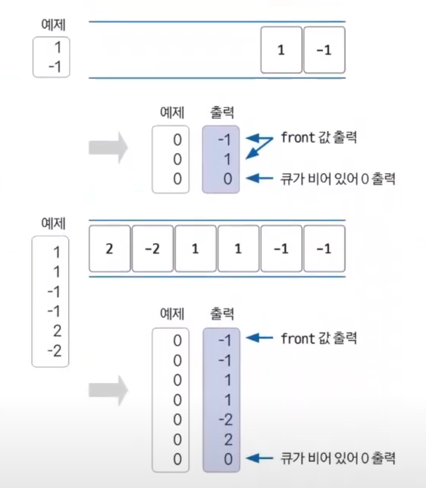

# 큐 예제 - 2

### [문제(백준(11286번 - 절댓값 힙))](https://www.acmicpc.net/problem/11286)

### 문제 분석
- `N`의 최대 범위가 100,000으로 `O(nlogn)` 시간 복잡도를 가진 알고리즘으로 풀 수 있다.
- 데이터가 새로 삽입될 때마다 절댓값과 관련된 정렬이 필요하므로 우선순위 큐를 사용하면 된다.
- 단, 절댓값 정렬이 필요하므로 우선순위 큐의 정렬 기준을 직접 정의해야 한다.

### 손으로 풀어보기
1. **`x = 0`일 때**
   - 큐가 비어 있을 때는 `0`을 출력하고 비어있지 않을 때는 절댓값이 최소인 값을 출력한다. 단, 절댓값이 같다면 음수를 우선 출력한다.
2. **`x = 1`일 때**
   - 큐에 새로운 값을 추가하고 우선순위 큐 정렬 기준으로 자동 정렬한다.



### 슈도코드
```text
n(질의 개수)
우선순위 큐 선언
- 절댓값 기준으로 정렬되도록 설정
- 단, 절댓값이 같으면 음수 우선 정렬

for n 반복:
    요청이 0일 때: 큐가 비어 있으면 0, 비어 있지 않으면 큐의 front값 출력
    요청이 1일 때: 새로운 데이터를 우선순위 큐에 더하기
```

### 코드 구현 - 파이썬
```python
import sys
from queue import PriorityQueue

input = sys.stdin.readline

n = int(input())
myQueue = PriorityQueue()

result = []

for i in range(n):
    request = int(input())  # 요청 숫자
    if request == 0:  # 요청 숫자가 0이면
        if myQueue.empty():  # 큐가 비어있으면 0 출력
            result.append("0")
        else:  # 큐가 비어있지 않으면
            temp = myQueue.get()  # 튜플 get
            result.append(str((temp[1])))  # 절댓값이 아닌 request 값 출력
    else:
        myQueue.put((abs(request), request))

print("\n".join(result))

```
> **파이썬에서는 데이터의 순서가 정렬의 우선순위가 된다.**<br>
> - `myQueue.put((abs(request), request))`
>   - 파이썬에서는 우선순위 큐에 데이터를 추가할 때 순서가 정렬 우선순위의 기준이 된다.
>   - `abs(request)`가 절댓값을 나타내므로 먼저 절댓값을 기준으로 정렬한다.
>   - 그 다음으로 `request`를 기준으로 정렬하므로 절댓값이 같다면 음수 우선으로 정렬한다.

### 코드 구현 - 자바
```java
import java.io.BufferedReader;
import java.io.IOException;
import java.io.InputStreamReader;
import java.util.PriorityQueue;
import java.util.Queue;

public class Main {
    public static void main(String[] args) throws IOException {
        BufferedReader br = new BufferedReader(new InputStreamReader(System.in));

        int n = Integer.parseInt(br.readLine());

        /**
         * 1. 절댓값이 작은 데이터 우선
         * 2. 절댓값이 같다면 음수 우선
         */
        Queue<Integer> qu = new PriorityQueue<>((o1, o2) -> {

            /**
             * compare(T o1, T o2)
             * o1이 o2보다 앞에 오게 하려면 음수를 리턴 -> o1이 우선순위 높게
             * o1이 o2보다 뒤에 오게 하려면 양수를 리턴 -> o2가 우선순위 높게
             * o1 = -1(음수), o2 = 1(양수)로 외워보자.
             */

            int n1 = Math.abs(o1);
            int n2 = Math.abs(o2);

            //2. 절댓값이 같다면 음수 우선
            //만약 절댓값으로 바꾸기 전 o1이 o2보다 크다면 o1=양수, o2=음수 -> o2가 우선순위가 높아야 하므로 양수 리턴
            //만약 절댓값으로 바꾸기 전 o1이 o2보다 크지 않다면 o1=음수, o2=양수 -> o1이 우선순위가 높아야 하므로 음수 리턴
            if (n1 == n2) {
                return o1 > o2 ? 1 : -1;
            }

            //1. 절댓값이 작은 데이터 우선
            //만약 n1 - n2 > 0 라면(양수), n1이 더 크다. 즉, o2의 절댓값이 o1의 절댓값보다 작다. -> o1, o2 중 o2가 우선
            //만약 n1 - n2 < 0 라면(음수), n2가 더 크다. 즉, o1의 절댓값이 o2의 절댓값보다 작다. -> o1, o2 중 o1이 우선
            return n1 - n2;
        });

        StringBuilder sb = new StringBuilder();

        for (int i = 0; i < n; i++) {
            int request = Integer.parseInt(br.readLine());
            if (request == 0) { //요청 숫자가 0이면
                if (qu.isEmpty()) { //큐가 비어있는지 확인
                    sb.append(0).append("\n");//비어있다면 0을 출력
                } else {//비어있지 않으면 값을 제거하고 출력
                    sb.append(qu.poll()).append("\n");
                }
            } else { //요청 숫자가 0이 아니면 요청 숫자를 우선순위 큐에 저장
                qu.add(request);
            }
        }
        System.out.println(sb);
    }
}
```