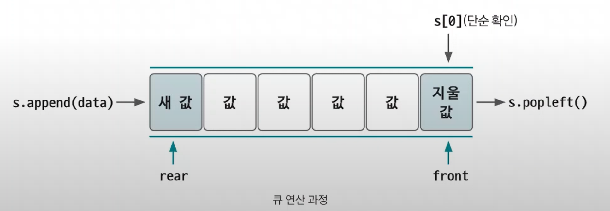

# 큐

- 리스트에서 조금 더 발전한 형태의 자료구조

- 삽입과 삭제 연산이 선입선출(`FIFO`)로 이뤄지는 자료구조이다.
- `스택`과 다르게 먼저 들어온 데이터가 먼저 나간다.
- 삽입과 삭제가 양방향에서 이뤄진다.

> **파이선의 큐** 
> - `rear` : 큐에서 가장 끝 데이터를 가리키는 영역
> - `front` : 큐에서 가장 앞의 데이터를 가리키는 영역
> - `queue.append(data)` : `rear` 부분에 새로운 데이터를 삽입하는 연산
> - `queue.popleft()` : `front` 부분에 있는 데이터를 삭제하고 확인하는 연산
> - `queue[0]` : 큐의 맨 앞(`front`)에 있는 데이터를 확인할 때 사용하는 연산

- 큐는 너비 우선 탐색(`BFS`)에서 자주 사용한다.

### [예제 문제(백준 - 카드2)](https://github.com/genesis12345678/TIL/blob/main/algorithm/dataStructure/queue/Example_1.md#%ED%81%90-%EC%98%88%EC%A0%9C---1)

### [예제 문제(백준 - 절댓값 힙)](https://github.com/genesis12345678/TIL/blob/main/algorithm/dataStructure/queue/Example_2.md#%ED%81%90-%EC%98%88%EC%A0%9C---2)