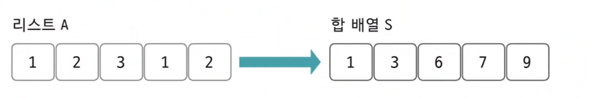
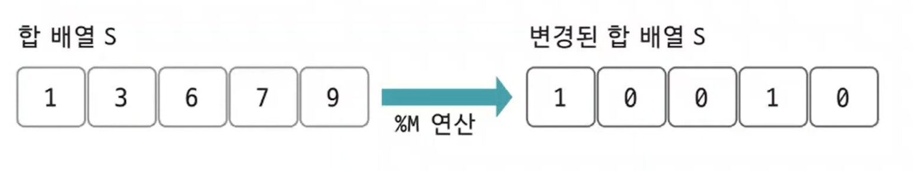

# 구간 합 예제 - 3

### [문제(백준(10986번 - 나머지 합))](https://www.acmicpc.net/problem/10986)

### 문제 분석
- `N`의 최댓값이 10^6으로 연산량이 작게 느껴질 수 있지만, 10^6개의 수에 대해 모든 구간 합을 구해야 하므로 제한 시간(`1초`)안에 연산하기는 어렵다.

**핵심 아이디어**
- `(A + B) % C`는 `((A % C) + (B % C)) % C`와 같다.
  - 특정 구간 수들의 나머지 연산을 더해 나머지 연산을 한 값과 이 구간 합의 나머지 연산을 한 값은 동일하다.
- 구간 합 배열을 이용한 식 `S[j] - S[i]`는 원본 리스트의 `i + 1`부터 `j`까지의 구간 합이다.
- `S[j] % M`의 값과 `S[i] % M`의 값이 같다면 `(S[j] - S[i]) % M`은 `0`이다.
  - 구간 합 배열의 원소를 `M`으로 나눈 나머지로 업데이트하고 `S[j]`와 `S[i]`가 같은 `(i,j)`쌍을 찾으면 원본 리스트에서 `i + 1`부터 `j`까지의 
    구간 합이 `M`으로 나누어 떨어진다는 것을 알 수 있다.

### 손으로 풀어보기
**1. 원본 리스트 `A`의 합 배열 `S`를 생성한다.**

<<<<<<< HEAD


2. **합 배열 `S`의 모든 값을 `M(3)`으로 나머지 연산한 값을 업데이트 한다.**


=======


2. **합 배열 `S`의 모든 값을 `M(3)`으로 나머지 연산한 값을 업데이트 한다.**


>>>>>>> d6baa23 (algorithm_dataStructure_sectionSum)

3. **우선 변경된 합 배열에서 값이 `0`인 개수만 세어 정답 개수에 더한다.**
- 변경된 합 배열의 값이 `0`이라는 뜻은 원본 리스트의 `0`부터 `i`까지의 구간 합이 이미 `M`으로 나누어 떨어진다는 뜻이기 때문이다.
- **경우의 수 += 3**

4. **이제 변경된 합 배열에서 값이 같은 인덱스의 개수, 즉 나머지 값이 같은 합 배열의 개수를 센다. 변경된 합 배열에서 원소 값이 같은 **2개의 원소**를 뽑는 모든 경우의
    수를 구해서 정답에 더하면 된다. 위의 예에서는 0이 3개, 1이 2개이므로 ₃C₂, ₂C₂로 경우의 수를 구해서 더하면 된다.**
- 핵심 아이디어에서 변경된 합 배열에서 `S[i]`와 `S[j]`의 값이 같으면 원본 리스트에서 `i + 1`부터 `j`까지의 구간 합이 `M`으로 나누어 떨어지는 구간이라고 되어 있다.

### 슈도코드
```text
n(수의 개수), m(나누어 떨어져야 하는 수)
A(원본 리스트)
S(합 배열)
C(같은 나머지의 인덱스를 카운트하는 리스트)
result(정답 변수)

for 1 ~ n-1 반복:
    S[i] = S[i-1] + A[i]

for 0 ~ n-1 반복:
    remainder = S[i] % m
    if(remainder == 0) 정답 1 증가
    C[remainder] 값 1 증가

for 0 ~ m-1 반복:
    C[i]에서 2가지를 뽑는 경우의 수를 정답에 더하기
    
result 출력
```

### 코드 구현
```python
import sys

input = sys.stdin.readline

n, m = map(int, input().split())
A = list(map(int, input().split()))
S = [0] * n
C = [0] * m
result = 0

S[0] = A[0]

for i in range(1, n):
    S[i] = S[i - 1] + A[i]

for i in range(n):
    remainder = S[i] % m
    if remainder == 0:
        result += 1
    C[remainder] += 1

for i in range(m):
    if C[i] >= 2:
        result += (C[i] * (C[i] - 1)) // 2

print(result)
```
- `C = [0] * m` : 나머지는 `m`이상 나올 수 없기 때문에 `m`크기 만큼 선언한다.(최대 인덱스 : `m-1`)
- `S[0] = A[0]` : 처음은 그대로이다.
- `result += (C[i] * (C[i] - 1)) // 2` : 뽑는 경우의 수는 `2`로 고정이기 때문에 2로만 나누면 된다.
  - `/` 연산은 `float` 형으로 반환한다. `//`연산을 해야 `int`형으로 반환한다.