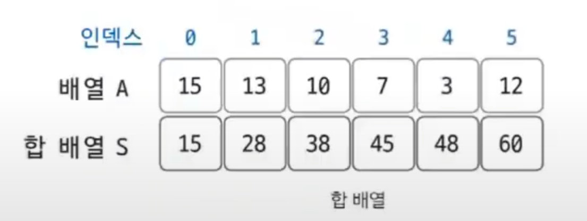
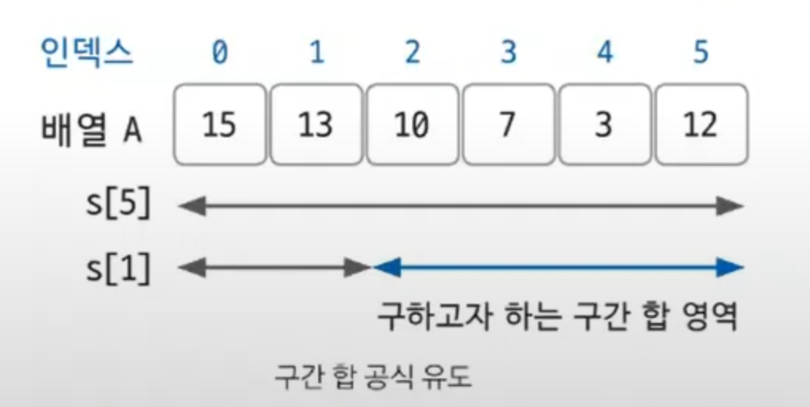

# 구간 합

- 구간 합은 합 배열을 이용하여 시간 복잡도를 더 줄이기 위해 사용하는 특수한 목적의 알고리즘이다.

### 구간 합 핵심 이론

**합 배열 `S` 정의**
- `S[i]` = `A[0] + A[1] + A[2] + ... + A[i-1] + A[i]` 
- `A[0]`부터 `A[i]`까지의 합
- 합 배열은 기존의 리스트 데이터를 전처리한 배열이라 생각하면 된다.
- 이렇게 합 배열을 미리 구해 놓으면 기존 리스트의 일정 범위의 합을 구하는 시간 복잡도가 `O(N)`에서 `O(1)`로 감소한다.

<<<<<<< HEAD

=======

>>>>>>> d6baa23 (algorithm_dataStructure_sectionSum)
- `A[i]`부터 `A[j]`까지의 리스트 합을 합 배열 없이 구하는 경우, 최악의 경우는 `i = 0`이고 `j = N`인 경우로 시간 복잡도는 `O(N)`이다.
- 합 배열을 사용하면 `O(1)` 안에 구할 수 있다.

**합 배열 `S`를 만드는 공식**
- `S[i]` = `S[i-1] + A[i]`

**`i`에서  `j`까지 구간 합을 구하는 공식**
- `S[j]` - `S[i-1]`

<<<<<<< HEAD

=======

>>>>>>> d6baa23 (algorithm_dataStructure_sectionSum)

- `A[2]` ~ `A[5]`구간 합을 합 배열로 구하는 과정
  - `S[5]` = `A[0]` + `A[1]` + `A[2]` + `A[3]` + `A[4]` +  `A[5]`
  - `S[1]` = `A[0]` + `A[1]`
  - `S[5]` - `S[1]` = `A[2]` + `A[3]` + `A[4]` +  `A[5]`
- 합 배열만 한번 미리 구해 두면 구간 합은 한 번의 계산으로 구할 수 있다.

<<<<<<< HEAD
### [예제 문제(백준 - 구간 합 구하기 4)](https://github.com/genesis12345678/TIL/blob/main/algorithm/dataStructure/sectionSum/Example_1.md#%EA%B5%AC%EA%B0%84-%ED%95%A9-%EC%98%88%EC%A0%9C---1)
### [예제 문제(백준 - 구간 합 구하기 5)](https://github.com/genesis12345678/TIL/blob/main/algorithm/dataStructure/sectionSum/Example_2.md#%EA%B5%AC%EA%B0%84-%ED%95%A9-%EC%98%88%EC%A0%9C---2)
### [예제 문제(백준 - 나머지 합)](https://github.com/genesis12345678/TIL/blob/main/algorithm/dataStructure/sectionSum/Example_3.md#%EA%B5%AC%EA%B0%84-%ED%95%A9-%EC%98%88%EC%A0%9C---3)
=======
### [예제 문제(백준 - 구간 합 구하기 4)]()
### [예제 문제(백준 - 구간 합 구하기 5)]()
>>>>>>> d6baa23 (algorithm_dataStructure_sectionSum)
