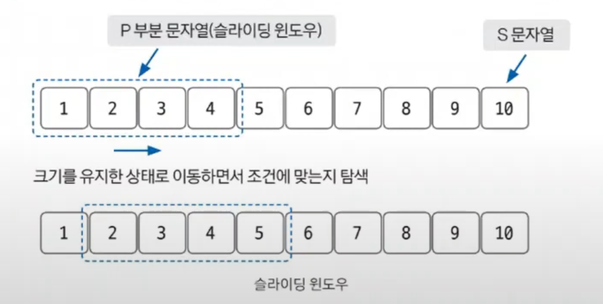
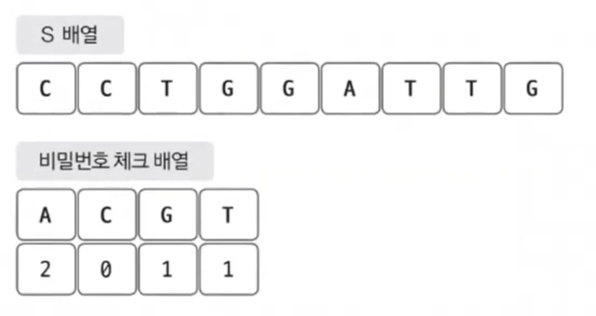
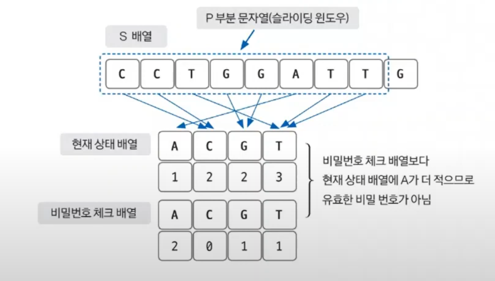
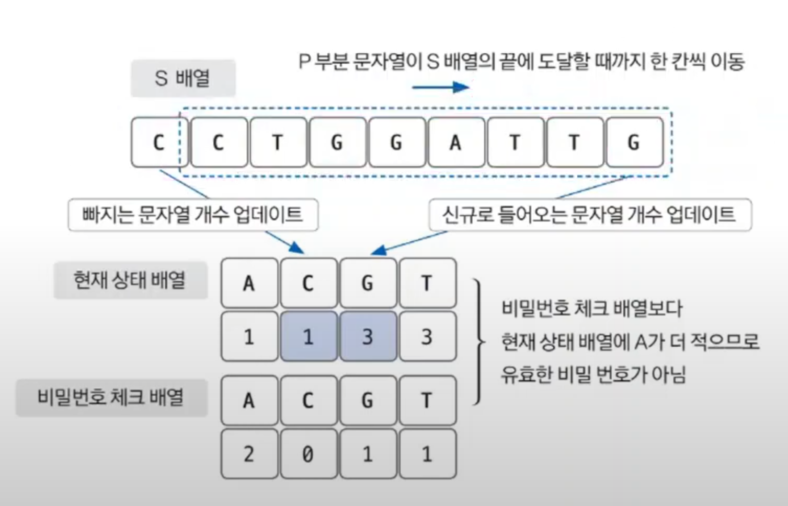

# 슬라이딩 윈도우 예제 - 1

### [문제(백준(12891번 - DNA 비밀번호))](https://www.acmicpc.net/problem/12891)

### 문제 분석
- `P`와 `S`의 길이가 1,000,000으로 매우 크기 때문에 `O(n)`의 시간 복잡도 알고리즘으로 문제를 해결해야 한다.
- 이때 부분 문자열의 길이가 `P`이므로 슬라이딩 윈도우의 개념을 이용하여 문제를 쉽게 해결할 수 있다.



- 그림을 보면 `P`의 길이를 갖는 윈도우를 지정하여 리스트 `S`의 시작점에 놓는다.
- 그런 다음, 윈도우를 오른쪽으로 밀면서 윈도우에 잡힌 값들이 조건에 맞는지 탐색한다.
- 리스트 `S`의 길이만큼만 탐색을 진행하면 되므로 `O(n)`의 시간 복잡도가 걸린다.

### 손으로 풀어보기

1. **리스트 `S`와 비밀번호 체크 리스트를 저장한다.**



2. **윈도우에 포함된 문자로 현재 상태 리스트를 만든다. 그런 다음 현재 상태 리스트와 비밀번호 체크 리스트를 비교하여 유효한지 판단한다.**



3. **윈도우를 한 칸씩 이동하며 현재 상태 리스트를 업데이트한다. 현재 상태 리스트를 업데이트한 이후에는 비밀번호 체크 리스트와 비교하여 유효한지 판단한다.
    현재 상태 리스트를 업데이트할 때는 빠지는 문자열, 신규 문자열만 보고 업데이트하는 방식으로 진행한다.**



### 슈도코드
```text
# 전역 변수
checkList(비밀번호 체크 리스트)
curList(현재 상태 리스트)
checkNum(몇 개의 문자와 관련된 개수를 충족했는지 판단하는 변수)

# 함수
myAdd(문자 더하기 함수):
    curList에 새로운 값을 더하고 조건에 따라 checkNum값 업데이트

myRemove(문자 빼기 함수):
    curList에 새로운 값을 제거하고 조건에 따라 checkNum값 업데이트

# 메인 코드
s(문자열 크기), p(부분 문자열 크기)
a(문자열 데이터)
checkList 데이터 받기
checkList를 탐색하여 값이 0인 데이터의 개수만큼 checkNum 값 증가 # 값이 0이라는 것은 비밀번호 개수가 이미 만족되었다는 뜻
p범위 만큼 curList 및 checkNum에 적용하고, 유효한 비밀번호인지 판단

for i  p ~ s 반복:
    j 선언(i - p)
    # myAdd, myRemove 구현
    한 칸씩 이동하면서 제거되는 문자열과 새로 들어오는 문자열 처리
    유효한 비밀번호(checkNum == 4)인지 판단해 결괏값 업데이트

결과 출력
```
- **유효한 비밀번호를 검사할 때 기존 검사 결과에 새로 들어온 문자열, 제거되는 문자열만 반영하여 확인하는 것이 핵심**

### 코드 구현 - 파이썬
```python
checkList = [0] * 4
curList = [0] * 4
checkNum = 0

# 함수
def myAdd(c):  # 새로 들어온 문자를 처리하는 함수
    global checkList, curList, checkNum
    if c == 'A':
        curList[0] += 1
        if curList[0] == checkList[0]:
            checkNum += 1
    elif c == 'C':
        curList[1] += 1
        if curList[1] == checkList[1]:
            checkNum += 1
    elif c == 'G':
        curList[2] += 1
        if curList[2] == checkList[2]:
            checkNum += 1
    elif c == 'T':
        curList[3] += 1
        if curList[3] == checkList[3]:
            checkNum += 1


def myRemove(c):  # 제거되는 문자를 처리하는 함수
    global checkList, curList, checkNum
    if c == 'A':
        if curList[0] == checkList[0]:
            checkNum -= 1
        curList[0] -= 1
    elif c == 'C':
        if curList[1] == checkList[1]:
            checkNum -= 1
        curList[1] -= 1
    elif c == 'G':
        if curList[2] == checkList[2]:
            checkNum -= 1
        curList[2] -= 1
    elif c == 'T':
        if curList[3] == checkList[3]:
            checkNum -= 1
        curList[3] -= 1


s, p = map(int, input().split())
result = 0
a = list(input())
checkList = list(map(int, input().split()))

for i in range(4):  
    if checkList[i] == 0:  # 0이면 아무 조건 없이 조건에 만족한다.
        checkNum += 1

for i in range(p):  # 초기 p 부분 문자열 처리 부분
    myAdd(a[i])

if checkNum == 4:  # 처음부터 비밀번호 조건을 만족할 수도 있다.
    result += 1

for i in range(p, s):
    j = i - p  # j = 첫 칸, i = 끝 칸
    
    # 인덱스(첫 번째가 0)를 기준으로 계산하면 추가될 칸과 지워질 칸이 나온다.
    # 초기 부분은 이미 해결했으니 그 다음 칸부터 해결하면 된다.
    myAdd(a[i])  # 추가될 칸(끝에서 다음 칸)
    myRemove(a[j])  # 지워킬 칸(처음보다 전 칸)
    
    if checkNum == 4: 
        result += 1

print(result)
```

### 코드 구현 - 자바
```java
import java.io.BufferedReader;
import java.io.IOException;
import java.io.InputStreamReader;
import java.util.StringTokenizer;

public class Main {

    static int[] curList = new int[4];
    static int[] checkList = new int[4];
    static  int checkNum = 0;

    public static void main(String[] args) throws IOException {
        BufferedReader br = new BufferedReader(new InputStreamReader(System.in));
        StringTokenizer st = new StringTokenizer(br.readLine());
        int s = Integer.parseInt(st.nextToken());
        int p = Integer.parseInt(st.nextToken());
        int result = 0;

        char[] a = br.readLine().toCharArray();

        st = new StringTokenizer(br.readLine());

        for (int i = 0; i < 4; i++) {
            checkList[i] = Integer.parseInt(st.nextToken());
            if (checkList[i] == 0) {
                checkNum++;
            }
        }

        for (int i = 0; i < p; i++) {
            add(a[i]);
        }

        if (checkNum == 4) {
            result++;
        }

        //슬라이딩 윈도우
        for (int i = p; i < s; i++) {
            int j = i - p; //j가 첫 칸, i가 끝 칸
            add(a[i]);
            remove(a[j]);
            if (checkNum == 4) {
                result++;
            }
        }
        System.out.println(result);
        br.close();
    }

    private static void remove(char ch) {
        switch (ch) {
            case 'A':
                if (curList[0] == checkList[0]) {
                    checkNum--;
                }
                curList[0]--;
                break;
            case 'C':
                if (curList[1] == checkList[1]) {
                    checkNum--;
                }
                curList[1]--;
                break;
            case 'G':
                if (curList[2] == checkList[2]) {
                    checkNum--;
                }
                curList[2]--;
                break;
            case 'T':
                if (curList[3] == checkList[3]) {
                    checkNum--;
                }
                curList[3]--;
                break;
        }
    }

    private static void add(char ch) {
        switch (ch) {
            case 'A':
                curList[0]++;
                if (curList[0] == checkList[0]) {
                    checkNum++;
                }
                break;
            case 'C':
                curList[1]++;
                if (curList[1] == checkList[1]) {
                    checkNum++;
                }
                break;
            case 'G':
                curList[2]++;
                if (curList[2] == checkList[2]) {
                    checkNum++;
                }
                break;
            case 'T':
                curList[3]++;
                if (curList[3] == checkList[3]) {
                    checkNum++;
                }
                break;
        }
    }
}
```