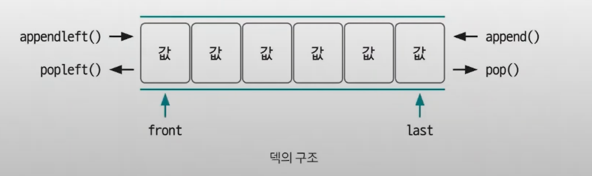
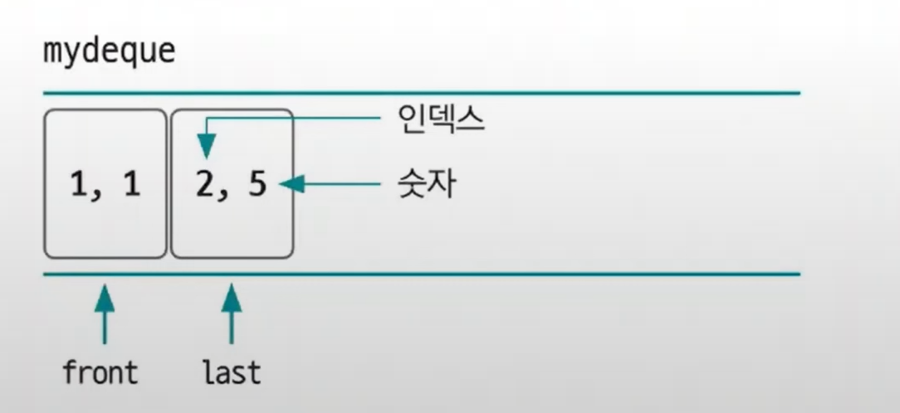
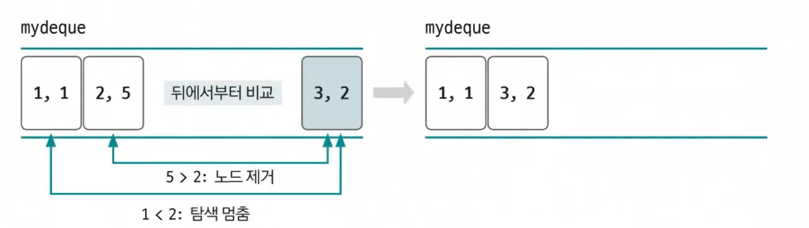
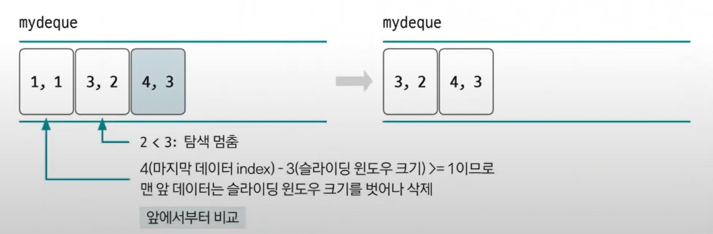
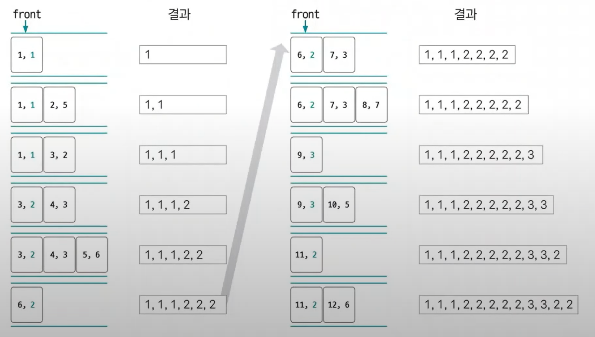

# 슬라이딩 윈도우 예제 - 2

### [문제(백준(11003번 - 최솟값 찾기))](https://www.acmicpc.net/problem/11003)

### 문제 분석
- 일정 범위 안에서 최솟값을 구하는 문제이므로 슬라이딩 윈도우와 정렬을 사용하면 될 것 같다.
- 윈도우의 크기는 범위가 `i-L+1`부터 `i`까지이므로 `L`로 생각하면 된다.
- 일반적으로 정렬은 `O(nlogn)`의 시간 복잡도를 가지므로 `N`과 `L`의 최대 범위가 5,000,000인 이 문제에서는 적합하지 않다.
- `O(n)`의 시간 복잡도로 해결해야 하는데, 덱(`Deque`)으로 구현하여 정렬 효과를 볼 수 있다.



### 손으로 풀어보기
1. **덱(`Deque`)에서는 `(인덱스, 숫자)`형태의 노드를 클래스로 구현하여 저장한다.**



2. **위 상태에서 새 노드(`(3, 2)`)가 저장된다. 여기부터 기존 덱에 있던 노드가 제거된다.**



- 새 노드가 저장될 때 뒤에서부터 비교를 시작한다.
- 숫자가 크면 덱에서 제거하고, 숫자가 작으면 탐색을 멈추고 덱에 저장한다.
- 그래서 결과를 보면 정렬을 하지 않아도 오름차순으로 정렬이 되어 있게 된다.
  - 이렇게 덱을 이용하여 정렬 효과를 볼 수 있다.
- 정리를 마친 상태의 덱을 보면 인덱스 범위는 `1~3`으로 윈도우의 크기인 `K(3)`과 같다.
- 최솟값은 덱 처음에 있는 노드의 숫자가 된다.
- **이것으로 알 수 있는 핵심 아이디어**
  - **최솟값 가능성 없는 데이터 삭제**
  - **윈도우 크기 밖 데이터 삭제**

3. **계속해서 새 노드를 추가하면서 인덱스 범위가 윈도우를 벗어날 때를 확인한다.**



- 새 노드가 들어왔는데 덱 뒤에서부터 비교했을 때 숫자가 크므로 덱에 저장된다.
- 여기서 인덱스 범위에 의해 덱 앞쪽의 노드가 제거된다.
- 최솟값은 윈도우 범위 내에서 찾아야 하므로 앞쪽 노드를 제거한 후, 최솟값을 출력하면 된다.(위에서는 `2`)

4. **숫자 비교, 윈도우 범위 계산을 반복하면서 맨 앞에 있는 노드의 숫자를 출력하면 정답이 된다.**



### 슈도코드
```text
n(데이터 개수), l(최솟값을 구하는 범위)
myDeque(데이터를 담을 덱 자료구조)
now(주어진 숫자 데이터를 가지는 리스트)

for n 반복: # now 리스트를 탐색(now[i]를 현재 값으로 세팅)
    덱의 마지막 위치에서부터 현재 값보다 큰 값은 덱에서 제거
    덱의 마지막 위치에 현재 값 저장
    덱의 1번째 위치에서부터 l의 범위를 벗어난 값(now index - l <= index)을 덱에서 제거
    덱의 1번쨰 데이터 출력
```

### 코드 구현 - 파이썬
```python
import sys
from collections import deque

class Node:
    def __init__(self, index, value):
        self.index = index
        self.value = value

input = sys.stdin.readline

n, l = map(int, input().split())

myDeque = deque()
now = list(map(int, input().split()))

result_list = []

# 새로운 값이 들어올 때마다 정렬 대신 현재 수보다 큰 값을 덱에서 제거해 시간 복잡도를 줄인다.
for i in range(n):
    while myDeque and myDeque[-1].value > now[i]: # 뒤에서 앞으로 가면서 현재 값보다 큰 값을 제거한다.(가장 작은 수가 될 가능성이 없다.)
        myDeque.pop()

    myDeque.append(Node(i, now[i])) # 노드 추가

    if myDeque[0].index <= i - l: # 가장 앞의 index가 범위(l)를 벗어나면 가장 앞의 노드를 제거한다.
        myDeque.popleft()

    result_list.append(str(myDeque[0].value))

print(" ".join(result_list))
```
- `myDeque[-1]` : 파이썬 음수 인덱싱, 가장 마지막 위치에 접근할 수 있다.
- **핵심은 정렬 알고리즘을 사용하지 않고도 슬라이딩 윈도우와 덱을 이용해 정렬 효과를 보는 것이다.**

### 코드 구현 - 자바
```java
import java.io.BufferedReader;
import java.io.IOException;
import java.io.InputStreamReader;
import java.util.Deque;
import java.util.LinkedList;
import java.util.StringTokenizer;

public class Main {
    static class Node {
        int index;
        int num;

        public Node(int index, int num) {
            this.index = index;
            this.num = num;
        }
    }

    public static void main(String[] args) throws IOException {
        BufferedReader br = new BufferedReader(new InputStreamReader(System.in));
        StringTokenizer st = new StringTokenizer(br.readLine());

        Deque<Node> myDeque = new LinkedList<>();
        int n = Integer.parseInt(st.nextToken());
        int l = Integer.parseInt(st.nextToken());

        int[] now = new int[n];
        st = new StringTokenizer(br.readLine());
        for (int i = 0; i < n; i++) {
            now[i] = Integer.parseInt(st.nextToken());
        }

        StringBuilder sb = new StringBuilder();
        for (int i = 0; i < n; i++) {
            while (!myDeque.isEmpty() && myDeque.peekLast().num > now[i]) {
                myDeque.pollLast();
            }
            
            myDeque.offer(new Node(i, now[i]));
            
            if (myDeque.peekFirst().index <= i - l) {
                myDeque.pop();
            }
            
            sb.append(myDeque.peekFirst().num).append(" ");
        }
        
        System.out.println(sb);
    }
}
```