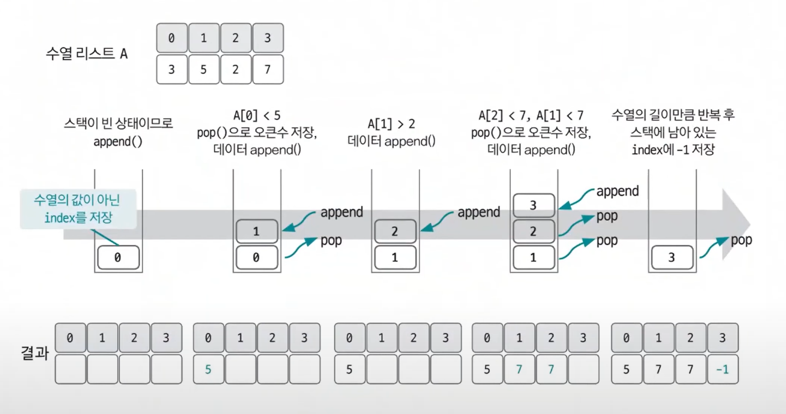
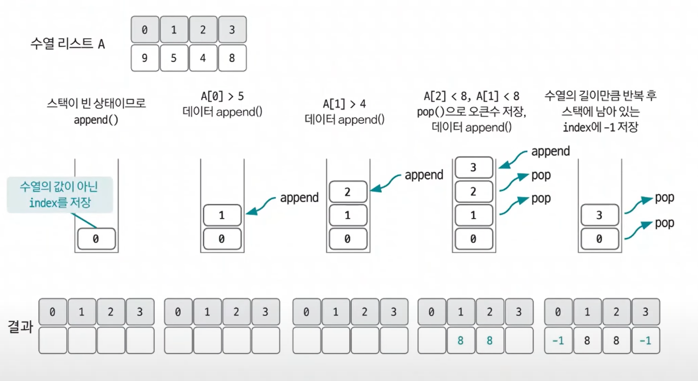

# 스택 예제 - 2

### [문제(백준(17298번 - 오큰수))](https://www.acmicpc.net/problem/17298)

### 문제 분석
- `N`의 최대 크기가 100,000이므로 모든 수를 반복문으로 오큰수를 찾으면 제한 시간을 초과한다.
- 스택을 사용해 해결할 수 있다.

> **핵심 아이디어**<br>
> - 스택에 새로 들어오는 수가 `top`에 존재하는 수보다 크면 그 수는 오큰수가 된다.
> - 오큰수를 구한 후 수열에서 오큰수가 존재하지 않는 숫자에 -1을 출력한다. 

### 손으로 풀어보기
1. **스택이 채워져 있고, `A[index] > A[top]`인 경우 `pop`한 인덱스를 이용하여 정답 수열에 오큰수를 저장한다. `pop`은 조건을 만족하는 동안 반복한다.**
2. **현재 인덱스를 스택에 `push`하고 다음 인덱스로 넘어간다.**
3. **과정 1~2를 수열 길이만큼 반복한 다음 현재 스택에 남아있는 인덱스에 -1을 저장한다.**





### 슈도코드
```text
n(수열 개수), a(수열 리스트), result(정답 리스트)
a 수열 리스트 채우기
myStack(스택 선언)

for n 반복:
    while 스택이 비지 않고, 현재 수열값이 top에 해당하는 수열보다 클 때까지:
        스택에서 pop한 값을 index로 하는 정답 리스트 부분을 리스트의 현재 값 a[i]으로 저장
    스택에 i의 값을 저장

while 스택이 빌 때까지:
    스택에 있는 index의 정답 리스트에 -1 저장

정답 리스트 출력
```

### 코드 구현 - 파이썬
```python
n = int(input())
a = list(map(int, input().split()))
result = [0] * n
myStack = []

for i in range(n):
    while myStack and a[i] > a[myStack[-1]]:  # 스택이 비어있지 않으면서, 들어올 값과 스택의 top에 있는 값을 비교
        # 새로 들어올 값이 더 크다면 스택 구조상 오큰수가 된다.
        result[myStack.pop()] = a[i]  # top 인덱스에 오큰수는 새로 들어올 값이 된다.
    myStack.append(i)  # 값이 아닌 index를 push한다.

while myStack:
    result[myStack.pop()] = -1

ans = []

for i in range(n):
    ans.append(str(result[i]))

print(" ".join(ans))

```

### 코드 구현 - 자바
```java
import java.io.BufferedReader;
import java.io.IOException;
import java.io.InputStreamReader;
import java.util.Stack;
import java.util.StringTokenizer;

public class Main {
    public static void main(String[] args) throws IOException {
        BufferedReader br = new BufferedReader(new InputStreamReader(System.in));

        int n = Integer.parseInt(br.readLine());
        int[] arr = new int[n];
        int[] result = new int[n];

        StringTokenizer st = new StringTokenizer(br.readLine());
        for (int i = 0; i < n; i++) {
            arr[i] = Integer.parseInt(st.nextToken());
        }

        Stack<Integer> stack = new Stack<>();
        for (int i = 0; i < n; i++) {
            //들어올 값이 스택의 top 인덱스의 값보다 크다면 들어올 값은 오큰수가 된다.
            while (!stack.isEmpty() && arr[i] > arr[stack.peek()]) {
                result[stack.pop()] = arr[i];//오큰수 저장
            }
            stack.push(i);//인덱스 push
        }

        //오큰수를 구한 후 오큰수가 존재하지 않는 숫자에는 -1 저장
        while (!stack.isEmpty()) {
            result[stack.pop()] = -1;
        }

        StringBuilder sb = new StringBuilder();
        for (int num : result) {
            sb.append(num).append(" ");
        }

        System.out.println(sb);
    }
}
```