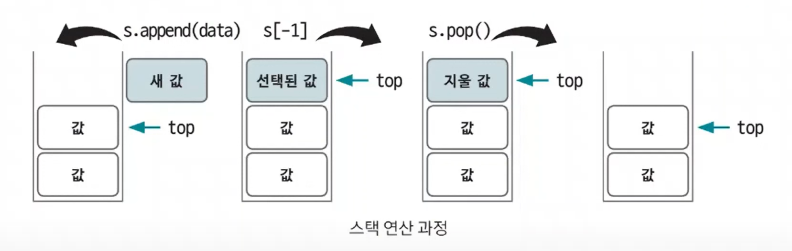

# 스택

- 리스트에서 조금 더 발전한 형태의 자료구조

- 삽입과 삭제 연산이 후입선출(`LIFO`)로 이뤄지는 자료구조이다.
- 삽입과 삭제가 한 쪽에서만 일어나는 특징이 있다.

> **파이썬의 스택** 
> - `top` : 삽입과 삭제가 일어나는 위치를 뜻한다.
> - `stack.append(data)` : `top` 위치에 새로운 데이터를 삽입하는 연산
> - `stack.pop()` : `top` 위치에 현재 있는 데이터를 삭제하고 확인하는 연산
> - `stack[-1]` : `top` 위치에 현재 있는 데이터를 단순 확인하는 연산

- 스택의 후입선출 개념은 재귀 함수 알고리즘 원리와 거의 같기 때문에 깊이우선탐색(`DFS`), 백트래킹 종류의 코딩 테스트에 효과적이다.

### [예제 문제(백준 - 스택 수열)](https://github.com/genesis12345678/TIL/blob/main/algorithm/dataStructure/stack/Example_1.md#%EC%8A%A4%ED%83%9D-%EC%98%88%EC%A0%9C---1)

### [예제 문제(백준 - 오큰수)](https://github.com/genesis12345678/TIL/blob/main/algorithm/dataStructure/stack/Example_2.md#%EC%8A%A4%ED%83%9D-%EC%98%88%EC%A0%9C---2)