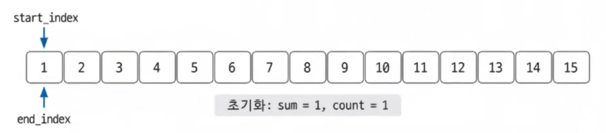
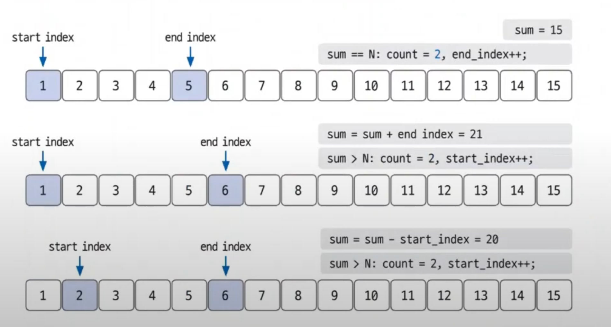

# 투 포인터 예제 - 1

### [문제(백준(2018번 - 수들의 합 5))](https://www.acmicpc.net/problem/2018)

### 문제 분석
- 주어진 시간 제한은 `2`초이고, `N`의 최댓값은 10,000,000으로 매우 크다.
- `O(nlogn)`의 시간 복잡도 알고리즘을 사용하면 시간 초과가 발생하므로 `O(n)`의 시간 복잡도 알고리즘을 사용해야 한다.
- 이런 경우 사용하는 방법이 **투 포인터**이다.
- 시작 인덱스, 종료 인덱스를 투 포인터로 지정한 후 문제를 접근할 수 있다.

### 손으로 풀어보기

1. **입력받은 값에 `N`을 저장한 후 코드에서 사용할 변수를 모두 초기화한다.**
    - 결과 변수 `count`를 1로 초기화하는 이유는 예를 들어 `N`이 15일 때 숫자 15만 뽑는 경우의 수(자기 자신)를 미리 넣고 초기화할 수 있기 때문이다.



2. **투 포인터 이동 원칙을 활용해 배열의 끝까지 탐색하면서 합이 `N`이 될 경우의 수를 구한다.**
   - `sum > N`: `sum = sum - start_index; start_index++;`
   - `sum < N`: `end_index++; sum = sum + end_index++;`
   - `sum == N`: `end_index++; sum = sum + end_index++; count++;`
- `start_index`를 오른쪽으로 한 칸 이동하는 것은 연속된 자연수에서 왼쪽 값을 삭제하는 것과 같다.
- `end_index`를 오른쪽으로 한 칸 이동하는 것은연속된 자연수의 범위를 한 칸 더 확장하는 것과 같다.
- 같을 때는 경우의 수를 증가하고, `end_index`를 오른쪽으로 이동시킨다.

    
3. **2단계를 `end_index`가 `N`이 될 때까지 반복하도, 포인터가 이동할 떄마다 현재의 총합과 `N`을 비교해 값이 같으면 `count`를 증가시키면 된다.**
   - **`start_index`와 `end_index`가 각각 `N`번 반복하므로 시간 복잡도는 `O(2n)`이지만, 상수는 무시하기 때문에 `O(n)`의 시간 복잡도가 걸린다.**



### 슈도코드
```text
n 입력
변수 초기화(count, start_index, end_index, sum = 1)

while end_index != n:
    if sum == n: 경우의 수 증가, end_index 증가, sum값 변경
    elif sum > n: sum값 변경, start_index 증가
    else: end_index 증가, sum값 변경
```

### 코드 구현 - 파이썬
```python
n = int(input())
start_index = 1
end_index = 1
count = 1
sum = 1

while end_index != n:
    if sum == n:
        count += 1
        end_index += 1
        sum += end_index
    elif sum > n:
        sum -= start_index
        start_index += 1
    else:
        end_index += 1
        sum += end_index

print(count)
```
- 구현하는 데 어려움은 없으나 순서에 주의해야 한다.
- `if sum == n:` 일 경우, 범위를 한 칸 확장하고 `sum`값을 변경해야 한다.
- `elif sum > n:` 일 경우, `sum`값을 변경하고 `start_index`를 증가해야 한다.
- `else(sum < n):` 일 경우, 범위를 한 칸 확장하고 `sum`값을 변경해야 한다.

### 코드 구현 - 자바
```java
import java.io.BufferedReader;
import java.io.IOException;
import java.io.InputStreamReader;

public class Main {
    public static void main(String[] args) throws IOException {
        BufferedReader br = new BufferedReader(new InputStreamReader(System.in));
        int n = Integer.parseInt(br.readLine());
        int count = 1;
        int sum = 1;
        int start_index = 1;
        int end_index = 1;

        while (end_index != n) {
            if (sum == n) {
                count++;
                end_index++;
                sum += end_index;
            } else if (sum > n) {
                sum -= start_index;
                start_index++;
            } else {
                end_index++;
                sum += end_index;
            }
        }

        System.out.println(count);
    }
}
```