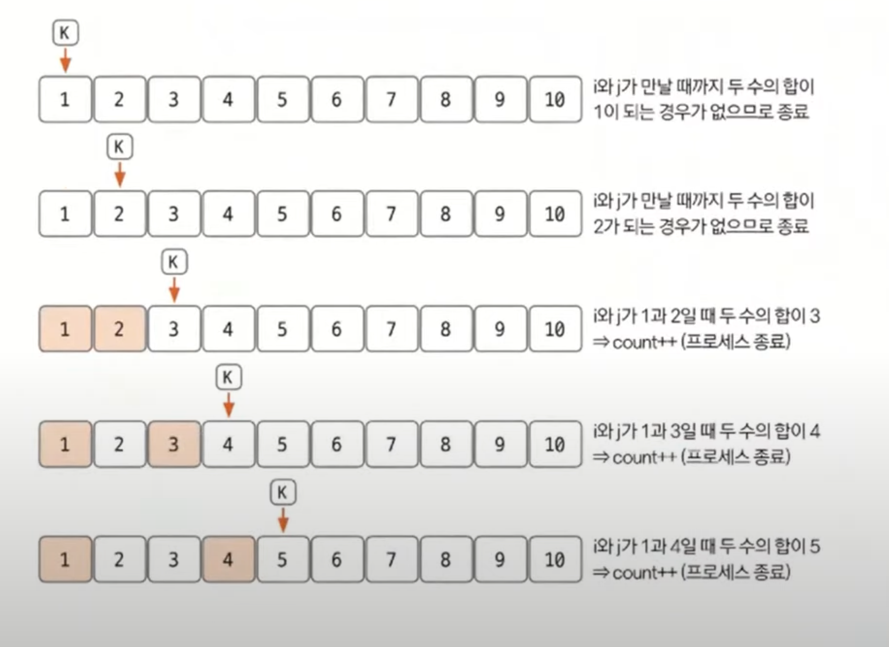

# 투 포인터 예제 - 3

### [문제(백준(1253번 - 좋다))](https://www.acmicpc.net/problem/1253)

### 문제 분석
- `N`의 최댓값이 2,000이라 해도, 좋은 수 하나를 찾는 알고리즘의 시간 복잡도는 `N^2`보다 작아야 한다.
  - 만약 좋은 수 하나를 찾는 데 `N^2`인 알고리즘을 사용하면 최종 시간 복잡도는 `N^3`이 되어 제한 시간(`2초`)안에 문제를 풀 수 없다.
- 따라서 좋은 수 하나를 찾는 알고리즘의 시간 복잡도는 최소 `O(nlogn)`이어야 한다.
  - 정렬(`nlogn`)과 투 포인터(`n`) 알고리즘을 사용하면 된다.
- **단, 정렬된 데이터에서 자기 자신을 좋은 수 만들기에 포함하면 안 된다.**

### 손으로 풀어보기
1. **수를 입력받아 리스트에 저장한 후 정렬한다.**(`nlogn`, 딱 한번)
2. **투 포인터 `i`, `j`를 배열 양쪽 끝에 위치시키고 조건에 적합한 투 포인터 이동 원칙을 활용해 탐색을 수행한다.**
   - 판별의 대상이 되는 수를 `K`라고 가정
   - `A[i] + A[j] > K: j--;`
   - `A[i] + A[j] < K: i++;`
   - `A[i] + A[j] == K: count++;` 프로세스 종료
   - 정렬을 했기 때문에 이 원칙을 따를 수 있다.
3. **2단계를 리스트의 모든 수에 대하여 반복한다. 즉 `K`가 `N`이 될 때까지 반복하여 좋은 수가 몇 개인지 센다.**




### 슈도코드
```text
n(데이터 개수)
result(좋은 수 개수 저장 변수)
a(수 데이터 저장 리스트)
a 정렬

for n번 반복:
    변수 초기화(찾고하 하는 값 find = a[k], 포인터 i, 포인터 j)
    while i < j:
        if a[i] + a[j] == find:
            두 포인터 i, j가 k가 아니면 좋은 수 개수 1 증가 및 while문 종료
            두 포인터 i나 j가 k가 맞으면 포인터 변경 및 계속 수행
        elif a[i] + a[j] < k:
            포인터 i 증가
        else:
            포인터 j 감소

result 출력
```

### 코드 구현 - 파이썬
```python
import sys

input = sys.stdin.readline

n = int(input())
result = 0
a = list(map(int, input().split()))
a.sort()

for k in range(n):
    find = a[k]
    i = 0
    j = n - 1

    while i < j:
        if a[i] + a[j] == find:
            if i != k and j != k:
                result += 1
                break
            elif i == k:
                i += 1
            elif j == k:
                j -= 1
        elif a[i] + a[j] < find:
            i += 1
        else:
            j -= 1

print(result)
```

### 코드 구현 - 자바
```java
import java.io.BufferedReader;
import java.io.IOException;
import java.io.InputStreamReader;
import java.util.Arrays;
import java.util.StringTokenizer;

public class Main {
    public static void main(String[] args) throws IOException {
        BufferedReader br = new BufferedReader(new InputStreamReader(System.in));
        int n = Integer.parseInt(br.readLine());
        int result = 0;
        int[] a = new int[n];
        StringTokenizer st = new StringTokenizer(br.readLine());

        for (int i = 0; i < n; i++) {
            a[i] = Integer.parseInt(st.nextToken());
        }

        Arrays.sort(a);

        for (int k = 0; k < n; k++) {
            int find = a[k];
            int i = 0;
            int j = n - 1;

            while (i < j) {
                if (a[i] + a[j] == find) {
                    if (i != k && j != k) {
                        result++;
                        break;
                    } else if (i == k) {
                        i++;
                    } else {
                        j--;
                    }
                } else if (a[i] + a[j] < find) {
                    i++;
                } else {
                    j--;
                }
            }
        }

        System.out.println(result);
    }
}
```