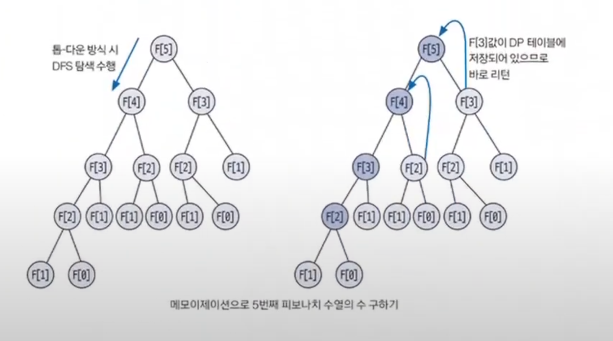

# 동적 계획법

- 동적 계획법(`dynamic programming`)은 복잡한 문제를 여러 개의 간단한 문제로 분리하여 부분의 문제들을 해결함으로써
    최종적으로 복잡한 문제의 답을 구하는 방법을 뜻한다.

## 동적 계획법 핵심 이론

- **동적 계획법의 원리와 구현 방식**
  - 큰 문제를 작은 문제로 나눌 수 있어야 한다.
  - 작은 문제들이 반복돼 나타나고 사용되며 이 작은 문제들의 결괏값은 항상 같아야 한다.
  - 모든 작은 문제들은 한 번만 계산해 `dp` 테이블에 저장하며 추후 재사용할 때는 이 `dp` 테이블을 이용한다. 이를 **메모이제이션(`memoization`) 기법**이라고 한다.
  - 동적 계획법은 톱-다운 방식과 바텀-업 방식으로 구현할 수 있다.
- **동적 계획법의 가장 대표적인 피보나치 수열 공식**
  - `D[N]` = `D[N - 1]` +  `D[N - 2]`
  - N번째 수열 = N - 1번째 수열 + N - 2번째 수열

### 1. 동적 계획법으로 풀 수 있는지 확인
- 6번째 피보나치 수열은 5번째 피보나치 수열과 4번째 피보나치 수열의 합이다.
- 즉, 6번째 피보나치 수열을 구하는 문제는 5번째 피보나치 수열과 4번째 피보나치 수열을 구하는 작은 문제로 나눌 수 있다.
- 그리고 수열의 값은 항상 같기 때문에 동적 계획법으로 풀 수 있다.

### 2. 점화식 세우기
- 점화식을 세울 때는 논리적으로 전체 문제를 나누고, 전체 문제와 부분 문제 간의 인과 관계를 파악할 수 있어야 한다.
- 피보나치 수열의 점화식은 `D[i]` = `D[i - 1] + D[i - 2]`이다.

### 3. 메모이제이션 원리 이해
- **메모이제이션**은 부분 문제를 풀었을 때 이 문제를 `dp`테이블에 저장해 놓고 다음게 같은 문제가 나왔을 때 재계산하지 않고 `dp`테이블의 값을 이용하는 것을 말한다.
- 그림을 보면 2번째와 3번째 피보나치 수열은 맨 왼쪽 탐색 부분에서 최초로 값이 구해지고, 이때 `dp`테이블에 값이 저장된다.
- 나중에 2번째와 3번째 피보나치 수열의 값이 필요할 때 재연산을 이용해 구하지 않고, `dp`테이블에서 바로 값을 추출할 수 있다.
- 이러한 방식을 사용하면 불필요한 연산과 탐색이 줄어들어 시간 복잡도 측면에서 많은 이점을 가질 수 있다.



### 4. 톱-다운 구현 방식 이해
- `톱-다운` 구현 방식은 말 그대로 위에서부터 문제를 파악해 내려오는 방식으로, 주로 재귀 함수 형태로 코드를 구현한다.
- 코드 가독성이 좋고, 이해하기가 편하다는 장점이 있다.

```python
N = int(input())
dp = [-1] * (N + 1)
dp[0] = 0   # 초기화할 수 있는 초깃값
dp[1] = 1   # 초기화할 수 있는 초깃값

def fibo(n):
    if dp[n] != -1: # 기존에 계산한 적이 있는 부분 문제는 재계산하지 않고 바로 리턴
        return dp[n]
    
    # 메모이제이션: 구한 값을 바로 리턴하지 않고 dp 테이블에 저장한 후 리턴하도록 구현
    dp[n] = fibo(n - 1) + fibo(n - 2)
    return dp[n]

fibo(N)
print(dp[N])
```

### 5. 바텀-업 구현 방식 이해
- `바텁-업` 구현 방식은 가장 작은 부분 문제부터 문제를 해결하면서 점점 큰 문제로 확장해 나가는 방식이다.
- 주로 반복문의 형태로 구현한다.
```python
N = int(input())
dp = [-1] * (N + 1)
dp[0] = 0   # 초기화할 수 있는 초깃값
dp[1] = 1   # 초기화할 수 있는 초깃값

for i in range(2, n + 1):
    dp[i] = dp[i - 1] + dp[1 -2]

print(dp[N])
```

- `톱-다운` 방식과 `바텀-업` 방식 중 좀 더 안전한 방식은 `바텀-업` 방식이다.
- `톱-다운` 방식은 재귀 함수의 형태로 구현돼 있기 때문에 재귀의 깊이가 매우 깊어질 경우 런타임 에러 발생 확률이 있다.
- 하지만 실제 코딩 테스트에서 이런 부분까지 고려해야 하는 난이도는 잘 나오지 않고, 오히려 구현한 로직에 버그가 있을 확률이 더 높을 것이다.
- 이 부분을 제외하면 두 방식의 차이점은 없고, 자신에게 좀 더 편한 방식이나 문제에 따라 1개를 선택해서 하면 된다.


### [예제 문제(백준 - 1로 만들기)](https://github.com/genesis12345678/TIL/blob/main/algorithm/dynamic/Example_1.md#%EB%8F%99%EC%A0%81-%EA%B3%84%ED%9A%8D%EB%B2%95-%EC%98%88%EC%A0%9C---1)

### [예제 문제(백준 - 퇴사)](https://github.com/genesis12345678/TIL/blob/main/algorithm/dynamic/Example_2.md#%EB%8F%99%EC%A0%81-%EA%B3%84%ED%9A%8D%EB%B2%95-%EC%98%88%EC%A0%9C---2)

### [예제 문제(백준 - 이친수)](https://github.com/genesis12345678/TIL/blob/main/algorithm/dynamic/Example_3.md#%EB%8F%99%EC%A0%81-%EA%B3%84%ED%9A%8D%EB%B2%95-%EC%98%88%EC%A0%9C---3)

### [예제 문제(백준 - 2 x n 타일링)](https://github.com/genesis12345678/TIL/blob/main/algorithm/dynamic/Examlple_4.md#%EB%8F%99%EC%A0%81-%EA%B3%84%ED%9A%8D%EB%B2%95-%EC%98%88%EC%A0%9C---4)

### [예제 문제(백준 - 쉬운 계단 수)](https://github.com/genesis12345678/TIL/blob/main/algorithm/dynamic/Example_5.md#%EB%8F%99%EC%A0%81-%EA%B3%84%ED%9A%8D%EB%B2%95-%EC%98%88%EC%A0%9C---5)

### [예제 문제(백준 - 연속합 2)](https://github.com/genesis12345678/TIL/blob/main/algorithm/dynamic/Example_6.md#%EB%8F%99%EC%A0%81-%EA%B3%84%ED%9A%8D%EB%B2%95-%EC%98%88%EC%A0%9C---6)

### [예제 문제(백준 - LCS 2)](https://github.com/genesis12345678/TIL/blob/main/algorithm/dynamic/Example_7.md#%EB%8F%99%EC%A0%81-%EA%B3%84%ED%9A%8D%EB%B2%95-%EC%98%88%EC%A0%9C---7)

### [예제 문제(백준 - 가장 큰 정사각형)](https://github.com/genesis12345678/TIL/blob/main/algorithm/dynamic/Example_8.md#%EB%8F%99%EC%A0%81-%EA%B3%84%ED%9A%8D%EB%B2%95-%EC%98%88%EC%A0%9C---8)

### [예제 문제(백준 - 고층 빌딩)](https://github.com/genesis12345678/TIL/blob/main/algorithm/dynamic/Example_9.md#%EB%8F%99%EC%A0%81-%EA%B3%84%ED%9A%8D%EB%B2%95-%EC%98%88%EC%A0%9C---9)

### [예제 문제(백준 - DDR)](https://github.com/genesis12345678/TIL/blob/main/algorithm/dynamic/Example_10.md#%EB%8F%99%EC%A0%81-%EA%B3%84%ED%9A%8D%EB%B2%95-%EC%98%88%EC%A0%9C---10)

### [예제 문제(백준 - 행렬 곱셈 순서)](https://github.com/genesis12345678/TIL/blob/main/algorithm/dynamic/Example_11.md#%EB%8F%99%EC%A0%81-%EA%B3%84%ED%9A%8D%EB%B2%95-%EC%98%88%EC%A0%9C---11)

### [예제 문제(백준 - 외판원 순회)](https://github.com/genesis12345678/TIL/blob/main/algorithm/dynamic/Example_12.md#%EB%8F%99%EC%A0%81-%EA%B3%84%ED%9A%8D%EB%B2%95-%EC%98%88%EC%A0%9C---12)