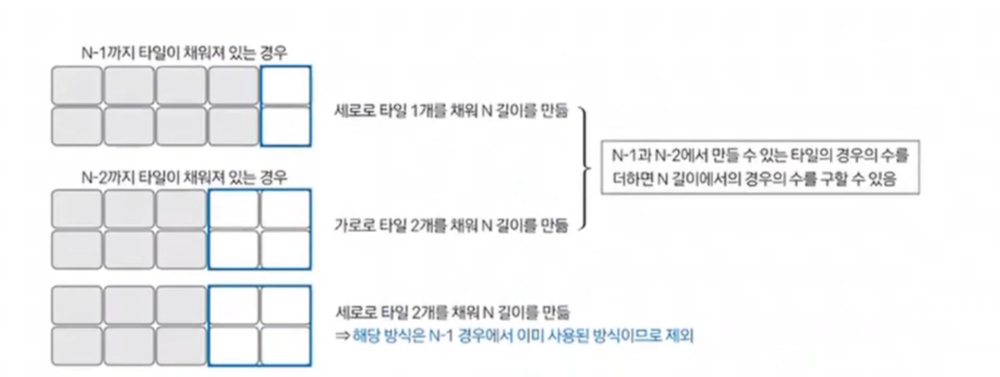
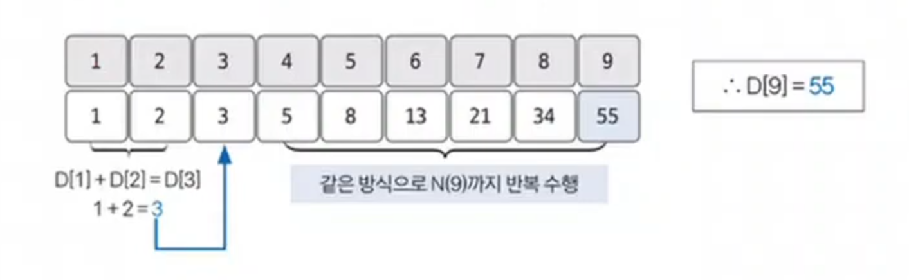

# 동적 계획법 예제 - 4

### [문제(백준(11726번 - 2 x n 타일링))](https://www.acmicpc.net/problem/11726)

### 문제 분석
- 문제의 내용에 따라 `2 X N` 크기의 직사각형을 `1 X 2`(세로), 또는 `2 X 1`(가로) 크기의 타일로 채우는 경우의 수를 구하는 점화식 `dp[N]`을 정의한다.
- **점화식을 정의한 후에는 문제가 단순화되도록 가정하는 것이 중요하다.**
- 1부터 `N - 1` 크기에 직사각형과 관련된 경우의 수를 모두 구해놓았다고 가정하고 문제에 접근해본다.
- 먼제 N보다 작은 길이의 모든 경우의 수가 구해져 있다고 가정했으므로 N 바로 직전에 구해야 하는 `N - 1`, `N - 2`에서 N의 길이를 만들기 위한 경우의 수를 생각해보자.



- `N - 1`까지 타일이 채워져 있는 경우에는 세로로 타일 1개를 채우는 방법밖엔 없다. 따라서 `dp[N] = dp[N - 1]`이다.
- `N - 2`까지 타일이 채워져 있는 경우에는 세로와 가로로 타일을 채울 수 있어 `dp[N]` = `2 * dp[N - 2]`으로 생각할 수 있다.
  - **하지만, 세로로 붙이는 경우의 수는 `N - 1`방식에서 이미 사용된 방식으로 제외해야 한다.**
- 따라서 다음과 같이 점화식을 도출할 수 있다.
  - `dp[N]` = `dp[N - 1] + dp[N - 2]`
### 손으로 풀어보기
1. **점화식의 형태와 의미를 도출한다.**
   - `dp[N]` = 길이 N으로 만들 수 있는 타일의 경우의 수

2. **점화식을 구한다.**
   - `dp[N]` = `dp[N - 1] + dp[N - 2]`
   - `dp[N - 1]`과 `dp[N - 2]`의 경우의 수 합이 `dp[N]`이다.

3. **점화식으로 `dp` 테이블을 채운 후 `dp[N]`의 값을 출력한다. 이때 `dp`테이블을 채울 때마다 10,007로 `%`연산을 진행해 주어야 한다.**



- `dp[1] = 1` 로 초기화할 수 있다. 왜냐하면 `2 X 1`의 직사각형에는 `2 X 1`의 타일만 놓을 수 있다.
- `dp[2] = 2`로 초기화할 수 있다. 왜냐하면 `2 X 2`의 직사각형에는 가로 또는 세로로 놓을 수 있다.


### 슈도코드
```text
N(직사각형 길이)
dp[N]   # 길이가 2 x N인 직사각형에 타일을 붙일 수 있는 경우의 수)
dp[1] = 1
dp[2] = 2

for i 3~N:
    dp[i] = (dp[i - 1] + dp[i - 2]) % 10007
dp[N] 출력
```

### 코드 구현 - 파이썬
```python
import sys

input = sys.stdin.readline
N = int(input())
dp = [0] * 1001

dp[1] = 1
dp[2] = 2

for i in range(3, N + 1):
    dp[i] = (dp[i - 1] + dp[i - 2]) % 10_007

print(dp[N])
```

### 코드 구현 - 자바
```java
import java.io.BufferedReader;
import java.io.IOException;
import java.io.InputStreamReader;

public class Main {

    public static void main(String[] args) throws IOException {
        BufferedReader br = new BufferedReader(new InputStreamReader(System.in));

        int N = Integer.parseInt(br.readLine());
        long[] dp = new long[1001];
        dp[1] = 1;
        dp[2] = 2;

        for (int i = 3; i <= N; i++) {
            dp[i] = (dp[i - 1] + dp[i - 2]) % 10_007;
        }
        System.out.println(dp[N]);

    }
}
```