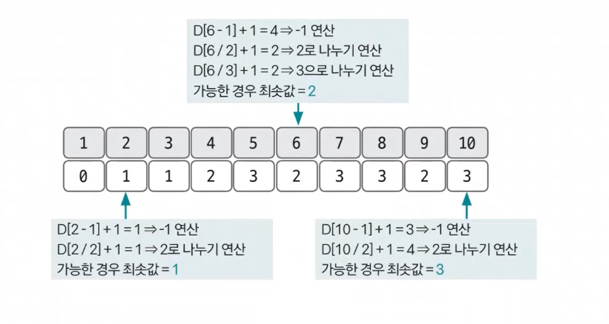

# 동적 계획법 예제 - 1

### [문제(백준(1463번 - 1로 만들기))](https://www.acmicpc.net/problem/1463)

### 문제 분석
- 사용할 수 있는 3가지 연산(`/3`, `/2`, `-1`)을 `바텀-업` 방식으로 구현할 수 있는지를 연습해볼 수 있는 문제다.
- 주어진 조건을 점화식으로 변형해 코드화 해본다.

### 손으로 풀어보기
1. **점화식의 형태와 의미를 도출한다.**
   - `dp[i]` = `i`에서 1로 만드는 데 걸리는 최소 연산 횟수
   - 문제 요구사항을 그대로 dp 테이블에 적용

2. **점화식을 구한다.**
   - `dp[i]` = `dp[i - 1] + 1` => 1을 빼는 연산
   - `if(i % 2 == 0) dp[i]` = `min(dp[i], dp[i / 2] + 1)` => 2로 나누는 연산
   - `if(i % 3 == 0) dp[i]` = `min(dp[i], dp[i / 3] + 1)` => 3으로 나누는 연산
   - `+ 1`의 의미는 각 `i`에서 1로 만들 수 있는 최소 연산 횟수에 현재 연산 한 번을 더한 것을 의미한다. 
    
3. **점화식을 이용해 `dp`테이블을 채운다.**



4. **dp[N]을 출력한다.**

### 슈도코드
```text
N(구하려고 하는 수)
dp(연산 횟수 최솟값을 저장하는 dp 테이블)
dp[1] = 0  # 1이 1이 될 때까지 연산이 불필요하므로 0으로 초기화 가능

for i 2~N:
    dp[i] = dp[i - 1] + 1
    if 2의 배수:
        dp[i / 2] + 1이 dp[i] 보다 작으면 변경
    if 3의 배수:
        dp[i / 3] + 1이 dp[i] 보다 작으면 변경

dp[N] 출력
```

### 코드 구현 - 파이썬
```python
import sys

input = sys.stdin.readline

N = int(input())
dp = [0] * (N + 1)
dp[1] = 0  # 굳이 초기화할 필요는 없지만 명시적으로 표시

for i in range(2, N + 1):
    dp[i] = dp[i - 1] + 1

    if i % 2 == 0:
        dp[i] = min(dp[i], dp[i // 2] + 1)
    if i % 3 == 0:
        dp[i] = min(dp[i], dp[i // 3] + 1)

print(dp[N])
```

### 코드 구현 - 자바
```java
import java.io.BufferedReader;
import java.io.IOException;
import java.io.InputStreamReader;

public class Main {

    public static void main(String[] args) throws IOException {
        BufferedReader br = new BufferedReader(new InputStreamReader(System.in));

        int N = Integer.parseInt(br.readLine());
        int[] dp = new int[N + 1];
        dp[1] = 0;

        for (int i = 2; i <= N; i++) {
            dp[i] = dp[i - 1] + 1;
            if (i % 2 == 0) {
                dp[i] = Math.min(dp[i], dp[i / 2] + 1);
            }
            if (i % 3 == 0) {
                dp[i] = Math.min(dp[i], dp[i / 3] + 1);
            }
        }
        System.out.println(dp[N]);
    }
}
```