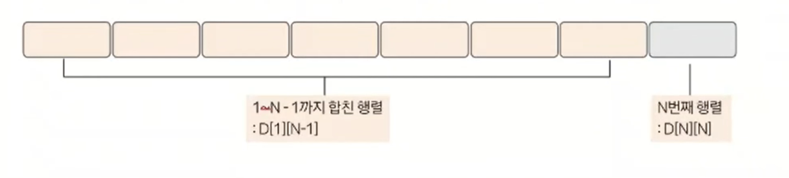
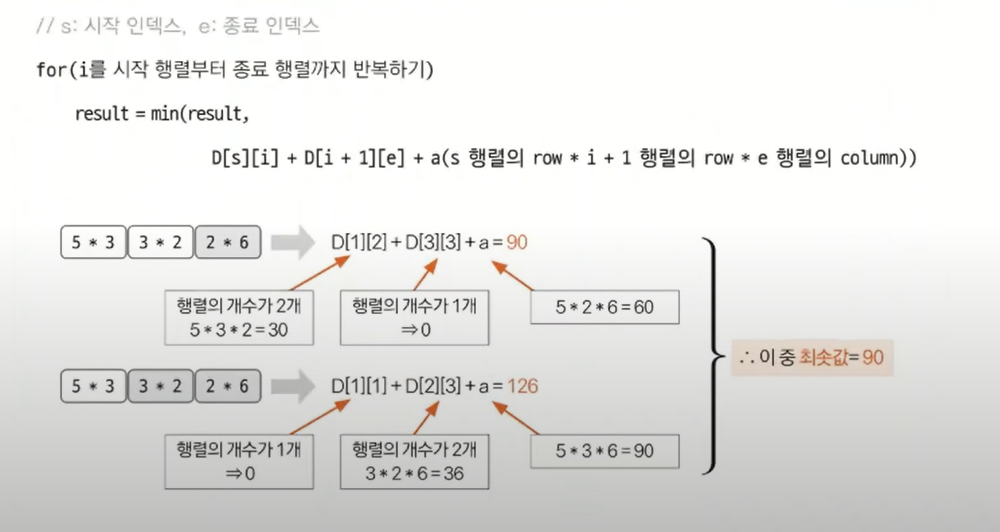

# 동적 계획법 예제 - 11

### [문제(백준(11049번 - 행렬 곱셈 순서))](https://www.acmicpc.net/problem/11049)

### 문제 분석
- 점화식을 구하기 막막할 때는 동적 계획법의 특징을 한 번 생각해보자.
- 부분 문제를 구해 큰 문제를 해결하는 방식이 동적 계획법의 특징 중 하나이다.
- 따라서 부분의 문제가 해결됐다고 가정하고, 점화식을 떠올려 보는 것도 점화식을 세울 수 있는 좋은 방법 중 하나이다.
- 행렬의 `N`이 주어지고, `1 ~ N`개를 모두 곱했을 때 최소 연산 횟수를 구해야 한다.
- 만약 `N`개 이외의 부분 영역, 예를 들어 `1 ~ N - 1`, `2 ~ N`, `3 ~ N - 2` 등 N을 제외한 모든 부분 구역을 1개의 행렬로 만드는 데 필요한 최소 연산 횟수를 알고 있다고 가정해보자.
- 이러한 가정을 바탕으로 `1 ~ N` 구역의 최소 연산 횟수를 구해야 하는데, 먼저 점화식을 정의하면 이렇다.
  - `D[i][j]` = `i ~ j`구간의 행렬을 합치는데 드는 최소 연산 횟수



- `dp[1][N - 1]`, `dp[N][N]`의 값을 안다고 가정했을 때 1개의 행렬로 합치는 데 드는 횟수는 다음과 같다.
  - `dp[1][N - 1]` + `dp[N][N]` + `a`
  - `a`는 두 행렬을 합치는 데 드는 값으로 예를 들어 `2 x 3` 과 `3 x 6`  행렬이 있다면 `2 x 3 x 6 = 36`이다.
- 이러한 아이디어를 바탕으로 그림과 같이 `dp[1][N]` 의 값을 찾는 식을 구할 수 있다.


### 손으로 풀어보기
1. **행렬 구간에 행렬이 1개일 때는 0을 리턴한다. 행렬 구간에 행렬이 2개일 때는 `앞 행렬의 row * 뒤 행렬의 row * 뒤 행렬의 col`값을 리턴한다. 행렬 구간에 행렬이
    3개 이상일 때는 다음 조건식의 결과를 리턴한다.**
   - **행렬 구간에 행렬이 3개 이상일 때 조건식**
   


- 구하려는 영역의 행렬 개수가 3개 이상일 때는 이 영역을 다시 재귀 형식으로 쪼개면서 계산하면 된다.

### 슈도코드
```text
dp[i][j]  # i ~ j번째 행렬까지 최소 연산 횟수를 저장하는 테이블(-1로 초기화)
N(행렬 개수)
M(행렬 리스트)

for n 반복:
    M에 행렬 정보 저장

# s = 시작 행렬 index, e = 종료 행렬 index
solution(s, e):
    result
    
    if 이미 계산한 구간:
        계산된 값 바로 리턴
    if 1개 행렬:
        연산 횟수 0 리턴
    if 2개 행렬:
        2개 행렬 연산값 리턴
    if 행렬이 3개 이상:
        for i s ~ e:    # 재귀 형태
            정답 = min(현재 정답값,
                   solution(s, i) + solution(i + e) + 앞뒤 구간 행렬을 합치기 위한 연산 횟수)

solution(1, N)
정답 출력
```

### 코드 구현 - 파이썬
```python
import sys

input = sys.stdin.readline
N = int(input())
M = []
dp = [[-1 for _ in range(N + 1)] for _ in range(N + 1)]

M.append((0, 0))  # 1번부터 index를 맞추기 위해

for _ in range(N):
    x, y = map(int, input().split())
    M.append((x, y))


def solution(s, e):
    result = sys.maxsize

    if dp[s][e] != -1:  # 메모이제이션
        return dp[s][e]

    if s == e:  # 행렬이 1개
        return 0

    if s + 1 == e:  # 행렬이 2개
        return M[s][0] * M[s][1] * M[e][1]

    # 행렬이 3개 이상
    for i in range(s, e):
        alpha = M[s][0] * M[i][1] * M[e][1]
        result = min(result, alpha + solution(s, i) + solution(i + 1, e))

    dp[s][e] = result
    return dp[s][e]


print(solution(1, N))
```

### 코드 구현 - 자바
```java
import java.io.BufferedReader;
import java.io.IOException;
import java.io.InputStreamReader;
import java.util.Arrays;
import java.util.StringTokenizer;

public class Main {

    static class Matrix {
        int row, col;

        public Matrix(int row, int col) {
            this.row = row;
            this.col = col;
        }
    }

    static Matrix[] M;
    static int[][] dp;

    public static void main(String[] args) throws IOException {
        BufferedReader br = new BufferedReader(new InputStreamReader(System.in));

        int N = Integer.parseInt(br.readLine());
        dp = new int[N + 1][N + 1];
        M = new Matrix[N + 1];

        for (int[] ints : dp) {
            Arrays.fill(ints, -1);
        }

        for (int i = 1; i <= N; i++) {
            StringTokenizer st = new StringTokenizer(br.readLine());
            int row = Integer.parseInt(st.nextToken());
            int col = Integer.parseInt(st.nextToken());

            M[i] = new Matrix(row, col);
        }

        System.out.println(solution(1, N));

    }

    private static int solution(int s, int e) {
        int result = Integer.MAX_VALUE;

        if (dp[s][e] != -1) {
            return dp[s][e];
        }

        if (s == e) {
            return 0;
        }

        if (e - s == 1) {
            return M[s].row * M[s].col * M[e].col;
        }

        for (int i = s; i < e; i++) {
            int alpha = M[s].row * M[i].col * M[e].col;
            result = Math.min(result, alpha + solution(s, i) + solution(i + 1, e));
        }

        return dp[s][e] = result;
    }
}
```