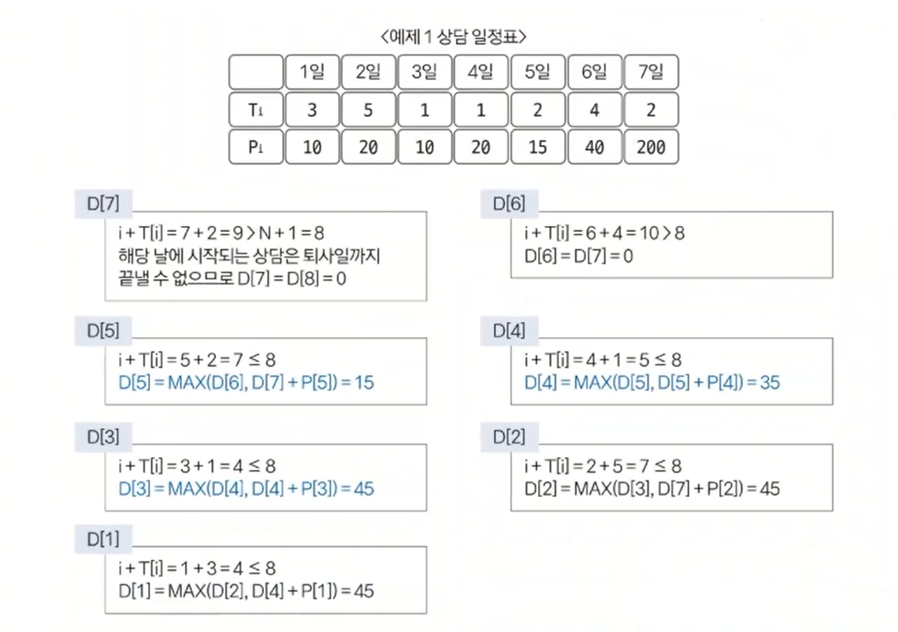
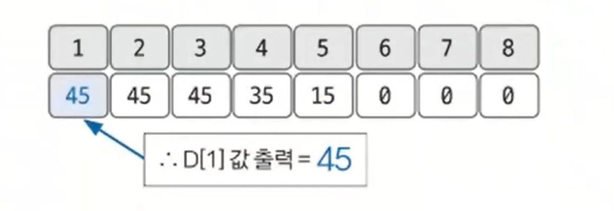

# 동적 계획법 예제 - 2

### [문제(백준(14501번 - 퇴사))](https://www.acmicpc.net/problem/14501)

### 문제 분석
- 동적 계획법에서 점화식은 유일하지 않다. 다양한 아이디어로 적절한 점화식을 찾는 반복적인 훈련이 필요하다.
- 먼저 점화식의 형태를 정의해 보면, 문제의 주요 요소를 날짜 1개 정도라고 판단하고 1차원 형태의 점화식을 세워본다.(`dp[i]`)
- 그 다음에 `dp[i]`에 의미를 정해야 한다.
- `dp[i]`의 의미를 `i`번째 날부터 퇴사일(`N + 1`일)까지 벌 수 있는 최대 수입으로 정의해 문제에 접근해본다.

### 손으로 풀어보기
1. **점화식의 형태와 의미를 도출한다.**
   - `dp[i]` = `i`번째 날부터 퇴사일까지 벌 수 있는 최대 수입

2. **점화식을 구한다.**
   - `dp[i]` = `dp[i + 1]`  
     - 현재 일수에서 `T[i]`(일별 소요 시간)을 더했을 때, 퇴사날(N+1일)을 넘어간다면 현재 일수의 최대 수입은 다음 날의 최대 수입과 같다.
   - `dp[i]` = `max(dp[i + 1], dp[i + T[i]] + P[i])` 
     - `dp[i + 1]` => 일을 건너뛰고 다음 날에서 벌 수 있는 최대 수입
     - `dp[i + T[i]] + P[i]` => 일을 건너뛰지 않고 일 했을 때 흘러간 날짜에서 벌 수 있는 최대 수입(`i + T[i]`)과 현재 날짜에서 일했을 때 받는 금액(`P[i]`)을 더함
     - 이 둘을 비교해서 더 큰 값을 현재 날짜에서 벌 수 있는 최대 수입으로 저장한다.
     - **동적 계획법은 다른 경우의 수가 이미 정해졌다고 가정한 상태로 구현해야 한다.**

3. **점화식을 이용해 dp 테이블을 채운다.**



- N일부터 시작해서 거꾸로 계산한다.

4. **완성된 dp 테이블에서 dp[1] 값을 출력한다.**



- `dp[1]`과 `dp[2]`의 값이 같은 이유
  - 최대 수익을 벌 수 있는 경우의 일수는 `1, 4, 5`일에 일하는 것과 `3, 4, 5`일에 일하는 것 2가지 경우가 있다.
  - 즉, 1일부터 일해서 벌 수 있는 최대 수입과 2일을 건너뛰고 3일부터 일해서 벌 수 있는 최대 수입은 같다.

### 슈도코드
```text
n(남은 일수)
dp테이블(각 i부터 퇴사일까지 벌 수 있는 최대 수입 저장)
T(상담 시간)
P(상담 수입)

for n 반복:
    T와 P 데이터 입력

for i N~1까지:
    if i + T[i] > N + 1:    # i번째 상담을 퇴사일까지 끝낼 수 없으면
        dp[i] = i번째 일은 건너뛰고 다음 날에서 퇴사일까지 벌 수 있는 최대 수입과 같다.
    else:
        dp[i] = max(i+1일에서 퇴사일까지 벌 수 있는 최대 수입,
                    i번째 상담 수입 + i번째 상담이 끝난 다음 날 부터 벌 수 있는 최대 수입)

dp[1] 출력  # 1일부터 퇴사일까지 벌 수 있는 최대 수입
```

### 코드 구현 - 파이썬
```python
import sys

input = sys.stdin.readline
N = int(input())
dp = [0] * (N + 2)

T = [0] * (N + 1)   # 상담 시간
P = [0] * (N + 1)   # 상담 수입

for i in range(1, N + 1):
    T[i], P[i] = map(int, input().split())

for i in range(N, 0, -1):
    if i + T[i] > N + 1:
        dp[i] = dp[i + 1]
    else:
        dp[i] = max(dp[i + 1], dp[i + T[i]] + P[i])

print(dp[1])
```

### 코드 구현 - 자바
```java
import java.io.BufferedReader;
import java.io.IOException;
import java.io.InputStreamReader;
import java.util.StringTokenizer;

public class Main {

    public static void main(String[] args) throws IOException {
        BufferedReader br = new BufferedReader(new InputStreamReader(System.in));

        int N = Integer.parseInt(br.readLine());
        int[] dp = new int[N + 2];
        int[] T = new int[N + 1];
        int[] P = new int[N + 1];

        for (int i = 1; i <= N; i++) {
            StringTokenizer st = new StringTokenizer(br.readLine());
            T[i] = Integer.parseInt(st.nextToken());
            P[i] = Integer.parseInt(st.nextToken());
        }

        for (int i = N; i > 0; i--) {
            if (i + T[i] > N + 1) {
                dp[i] = dp[i + 1];
            } else {
                dp[i] = Math.max(dp[i + 1], dp[i + T[i]] + P[i]);
            }
        }

        System.out.println(dp[1]);
    }
}
```