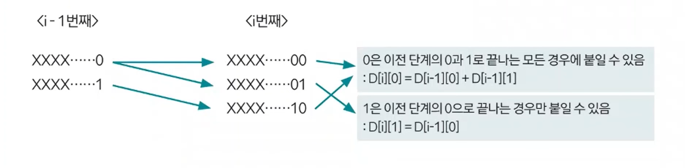
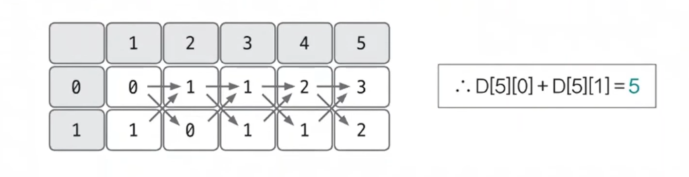

# 동적 계획법 예제 - 3

### [문제(백준(2193번 - 이친수))](https://www.acmicpc.net/problem/2193)

### 문제 분석
- 이친수의 개수와 관련된 요소를 먼저 찾아보면 가장 먼저 자릿수가 중요하다.
- 그리고 0으로 끝나는 이친수와 1로 끝나는 이친수를 구분해서 생각할 수 있다.
- 이 문제에서 점화식은 유일하지 않고 다양하게 나올 수 있다.
- 2차원 배열 점화식(`dp[N][2]`)을 선언하고 문제에 접근해본다.

### 손으로 풀어보기
1. **점화식의 형태와 의미를 도출한다.**
   - `dp[i][0]` = `i` 길이에서 끝이 0으로 끝나는 이친수의 개수
   - `dp[i][1]` = `i` 길이에서 끝이 1로 끝나는 이친수의 개수

2. **점화식을 구한다. 1은 두 번 연속으로 나오지 않는다는 조건이 점화식을 구하는 핵심이다.**



3. **점화식을 이용해 `dp` 테이블을 채운 후 `dp[N][0] + dp[N][1]`의 값을 출력한다.**



### 슈도코드
```text
N(자릿수)

dp테이블
# dp[i][0] = 길이 i에서 0으로 끝나는 이친수 개수
# dp[i][1] = 길이 i에서 1로 끝나는 이친수 개수

dp[1][1] = 1    # 1자리 1, 이친수 조건 성립
dp[1][0] = 0    # 1자리 0, 이친수 조건 미성립(0으로 시작히지 않는다.)

for i 2~N:
    i번째 0으로 끝나는 개수 = i-1에서 0으로 끝나는 개수 + i-1에서 1로 끝나는 개수
    i번째 1로 끝나는 개수 = i-1에서 0으로 끝나는 개수
 
N번째에서 0으로 끝나는 개수 + N번째에서 1로 끝나는 개수 출력
```

### 코드 구현 - 파이썬
```python
import sys

input = sys.stdin.readline
N = int(input())
dp = [[0 for _ in range(2)] for _ in range(N + 1)]

dp[1][1] = 1  # 이친수
dp[1][0] = 0  # 0으로 시작할 수 없음

for i in range(2, N + 1):
    dp[i][0] = dp[i-1][0] + dp[i-1][1]
    dp[i][1] = dp[i-1][0]

print(dp[N][0] + dp[N][1])
```

### 코드 구현 - 자바
```java
import java.io.BufferedReader;
import java.io.IOException;
import java.io.InputStreamReader;

public class Main {

    public static void main(String[] args) throws IOException {
        BufferedReader br = new BufferedReader(new InputStreamReader(System.in));

        int N = Integer.parseInt(br.readLine());
        long[][] dp = new long[N + 1][2];
        dp[1][1] = 1;
        dp[1][0] = 0;

        for (int i = 2; i <= N; i++) {
            dp[i][0] = dp[i - 1][0] + dp[i - 1][1];
            dp[i][1] = dp[i - 1][0];
        }

        System.out.println(dp[N][0] + dp[N][1]);
    }
}
```