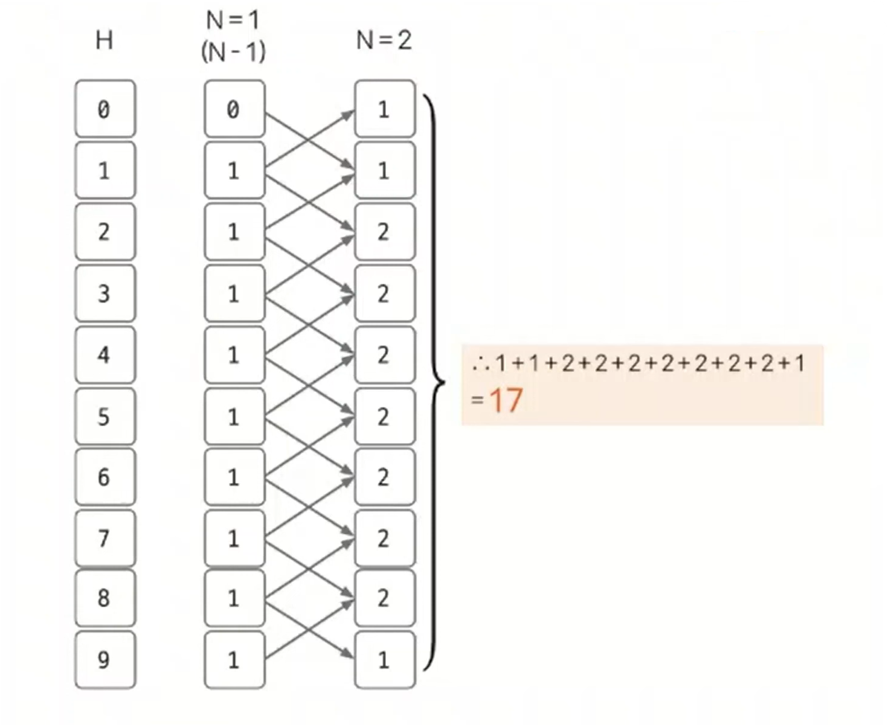

# 동적 계획법 예제 - 5

### [문제(백준(10844번 - 쉬운 계단 수))](https://www.acmicpc.net/problem/10844)

### 문제 분석
- 만약 N번째의 길이에서 5로 끝나는 계단수가 있었을 때 이 계단수의 `N - 1`의 자리에 올 수 있는 5와 1 차이가 나는 4와 6이다.
- 이러한 계단 수의 특성을 이용해 다음과 같이 정의할 수 있다.
  - `D[N][H]` = 길이가 N인 계단에서 H 높이로 종료되는 계단 수를 만들 수 있는 경우의 수

### 손으로 풀어보기
1. **각 자릿수에 0 ~ 9 사이의 값이 들어오므로 높이에 따라 다른 점화식을 도출한다. 먼저 N에서 계단 높이가 0일 때 계단 수가 되려면 `N - 1`에서는 높이가 1이어야만 한다.
    N에서 계단 높이가 9일 때 계단 수가 되려면 `N - 1`에서는 높이가 8이어야만 한다. 나머지는 가운데 계단이므로 `H + 1`, `H - 1` 양쪽에서 계단 수를 만들 수 있다.**
   - **높이에 따른 점화식**
     - `dp[i][H]` = `dp[i - 1][H + 1]` (H = 0)
     - `dp[i][H]` = `dp[i - 1][H - 1]` (H = 9)
     - `dp[i][H]` = `dp[i - 1][H + 1] + dp[i - 1][H - 1]`

2. **dp 테이블의 값을 초기화한다. 각 높이에서 길이가 1인 계단 수는 모두 1가지이므로 1로 초기화한다.(`dp[1][1~9] = 1`) dp 테이블의 값을 채울 때마다 `%` 연산도 수행해 주어야 한다.**

3. **`dp[N][0] ~ dp[N][9]`의 모든 값을 더한 값을 출력한다. 예를 들어 `N = 2`면, 2의 길이에서 0~9로 끝나는 모든 계단 수의 경우의 수를 출력할 수 있다. 이때도 `%` 연산을 수행해야 한다.**



### 슈도코드
```text
N(수의 길이)
dp[N][H]    # 길이가 N일 때 높이 H(0~9)로 끝나는 계단 수의 모든 경우의 수)

for i 1~N:
    dp[1][i] = 1
    # 길이가 1일 때 높이 H로 끝나는 계단 수의 모든 경우의 수는 1개

for i 2~N:
    dp[i][0] = dp[i - 1][1] # N에서 높이가 0이면 N-1에서는 높이가 1이어야만 계단 수 가능
    dp[i][9] = dp[i - 1][8] # N에서 높이가 0이면 N-1에서는 높이가 8이어야만 계단 수 가능
    
    for j 1~8:
        # 높이가 1~8 이면 N-1에서 자신보다 한 단계 위 또는 한 단계 아래 높이에서 올 수 있음 
        dp[i][j] = (dp[i - 1][j - 1] + dp[i - 1][j + 1]) % 1_000_000_000
        
sum

for i 0~9:
    sum에 dp[N][i]의 값을 더함

sum 출력
```


### 코드 구현 - 파이썬
```python
N = int(input())
mod = 1_000_000_000
dp = [[0 for _ in range(10)] for _ in range(N + 1)]

for i in range(1, 10):
    dp[1][i] = 1

for i in range(2, N + 1):
    dp[i][0] = dp[i - 1][1]
    dp[i][9] = dp[i - 1][8]

    for j in range(1, 9):
        dp[i][j] = (dp[i - 1][j - 1] + dp[i - 1][j + 1]) % mod

sum = 0

for i in range(0, 10):
    sum = (sum + dp[N][i]) % mod

print(sum)
```

### 코드 구현 - 자바
```java
import java.io.BufferedReader;
import java.io.IOException;
import java.io.InputStreamReader;

public class Main {

    public static void main(String[] args) throws IOException {
        BufferedReader br = new BufferedReader(new InputStreamReader(System.in));

        int N = Integer.parseInt(br.readLine());
        int mod = 1_000_000_000;
        long[][] dp = new long[N + 1][10];

        for (int i = 1; i < 10; i++) {
            dp[1][i] = 1;
        }

        for (int i = 2; i < N + 1; i++) {
            dp[i][0] = dp[i - 1][1];
            dp[i][9] = dp[i - 1][8];

            for (int j = 1; j < 9; j++) {
                dp[i][j] = (dp[i-1][j-1] + dp[i-1][j+1]) % mod;
            }
        }

        long sum = 0;
        for (int i = 0; i < 10; i++) {
            sum = (sum + dp[N][i]) % mod;
        }
        System.out.println(sum);

    }
}
```