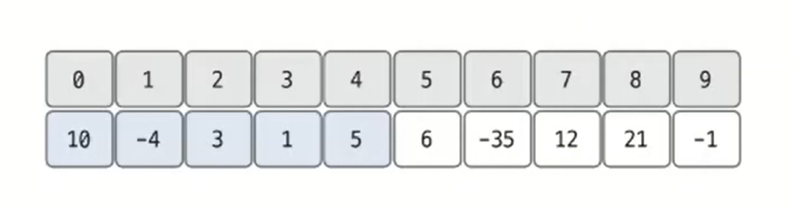
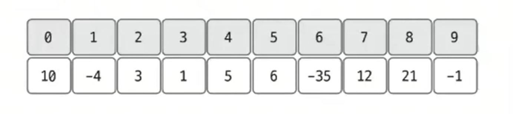
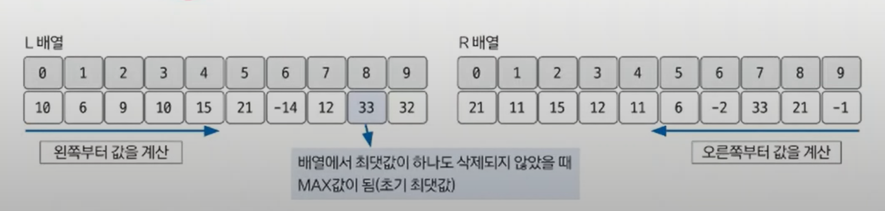
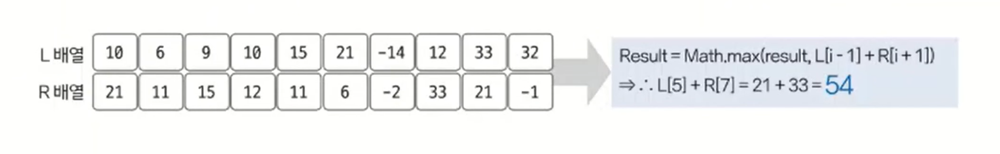

# 동적 계획법 예제 - 6

### [문제(백준(13398번 - 연속합 2))](https://www.acmicpc.net/problem/13398)

### 문제 분석
- 동적 계획법은 큰 문제를 작은 문제로 나눌 수 있고, 이러한 작은 문제들을 해결해 궁극적으로 문제에서 요구하는 큰 문제를 해결한다.
- 문제에서는 수열에서 가장 큰 합을 구하려고 할 때 수열에서 수를 1개 제거할 수 있다고 했다.(제거 여부는 자유) 이에 따라 점화식을 정의해보자.
- **잘못된 점화식 정의**
  - `dp[N]` = 0에서 N까지 길이에서 연속으로 수를 선택하여 구할 수 있는 최대합
- **이 점화식이 잘못된 이유**
  - 큰 문제를 부분 문제로 나눴을 때 부분 문제는 큰 문제를 해결하기 위한 1개의 부분이 돼야 한다는 것에 위배된다.
  - 위 정의에서 N값의 의미가 명확하지 않다.



- 만약 잘못된 점화식의 정의로 `D[3]`을 구하면 값이 10이 된다. 맨 앞의 수 10을 선택한 후 아무것도 선택하지 않는 게 가장 큰 값이기 때문이다.
- 그러면 `D[0]` ~ `D[3]`의 값이 모두 10이라는 것을 알 수 있다.
- 즉, `D[N]`에서 N값이 부분 문제로 나누는 데 정확한 경계가 되지 않게 된다.

**적절한 점화식 정의**
- `dp[N]` = 0부터 N까지 길이에서 **N을 포함하며** 연속으로 수를 선택하여 구할 수 있는 최대합
- 이렇게 정의하면 좀 더 쉽게 부분 문제를 이용해 전체 문제를 해결할 수 있다.
### 손으로 풀어보기
- 1개의 수를 삭제할 수 있기 때문에 왼쪽 방향에서부터 인덱스를 포함한 최대 연속 합을 구하고, 오른쪽 방향에서부터 인덱스를 포함한 최대 연속합을 한 번 더 구한다.
- 양쪽으로 구한 후 `L[N - 1] + R[N + 1]`을 하면 N을 1개 제거한 최댓값을 구하는 효과가 있기 때문이다.

1. **주어진 수열을 저장한다.**



2. **점화식을 이용해 왼쪽, 오른쪽 방향과 관련된 인덱스를 포함한 최대 연속 합 배열을 채운다.**

   - **점화식의 의미**
     - `L[N]` = 왼쪽에서부터 **N을 포함한** 최대 연속 합을 나타낸다. `A[i]`는 i 자리 수열의 수
     - `R[N]` = 오른쪽에서부터 **N을 포함한** 최대 연속 합을 나타낸다.
   - **점화식 정의**
     - `L[i]` = `max(A[i], L[i - 1] + A[i])`
     - `R[i]` = `max(A[i], R[i + 1] + A[i])`
     - 현재 수열의 수를 그냥 그대로 쓰는 것이 최댓값인지, 아니면 이전 최댓값에서 현재 수열의 수를 더한 것이 최댓값인지를 계산한다.



- `L` 리스트에서 구한 최댓값이 우선 수를 1개도 제거하지 않았을 때 임시 최댓값이 된다.

3. **계산된 두 테이블을 이용해 최댓값을 찾는다. `i`번째 수를 삭제했을 때 최댓값은 `L[i - 1] + R[i + 1]`이다. 이 값을 위에서 구한 임시 최댓값과 비교하여 더 큰 값이 정답이 된다.**



### 슈도코드
```text
N(수열 크기)
A(수열 데이터)
L(왼쪽에서 오른쪽으로 index를 포함한 최대 연속 합 테이블)
R(오른쪽에서 왼쪽으로 index를 포함한 최대 연속 합 테이블)

for i 1~N:
    L[i] = max(A[i], L[i - 1] + A[i])
    L 리스트의 최댓값 변수에 저장

for i N~0:
    R[i] = max(A[i], R[i + 1] + A[i])

for i 1~N-1:
    L 리스트의 최댓값과 L[i - 1] + R[i + 1] 값을 비교해서 최댓값 갱신
    
최댓값 출력
```

### 코드 구현 - 파이썬
```python
import sys

input = sys.stdin.readline

N = int(input())
A = list(map(int, input().split()))

L = [0] * N
L[0] = A[0]
result = L[0]

for i in range(1, N):
    L[i] = max(A[i], L[i - 1] + A[i])
    result = max(result, L[i])

R = [0] * N
R[N - 1] = A[N - 1]

for i in range(N - 2, -1, -1):
    R[i] = max(A[i], R[i + 1] + A[i])

for i in range(1, N - 1):
    temp = L[i - 1] + R[i + 1]
    result = max(temp, result)

print(result)
```

### 코드 구현 - 자바
```java
import java.io.BufferedReader;
import java.io.IOException;
import java.io.InputStreamReader;
import java.util.StringTokenizer;

public class Main {

    public static void main(String[] args) throws IOException {
        BufferedReader br = new BufferedReader(new InputStreamReader(System.in));

        int N = Integer.parseInt(br.readLine());

        int[] A = new int[N];
        StringTokenizer st = new StringTokenizer(br.readLine());
        for (int i = 0; i < N; i++) {
            A[i] = Integer.parseInt(st.nextToken());
        }

        int[] L = new int[N];
        L[0] = A[0];
        int result = L[0];
        for (int i = 1; i < N; i++) {
            L[i] = Math.max(A[i], L[i - 1] + A[i]);
            result = Math.max(L[i], result);
        }

        int[] R = new int[N];
        R[N - 1] = A[N - 1];
        for (int i = N - 2; i >= 0; i--) {
            R[i] = Math.max(A[i], R[i + 1] + A[i]);
        }

        for (int i = 1; i < N - 1; i++) {
            int temp = L[i - 1] + R[i + 1];
            result = Math.max(result, temp);
        }

        System.out.println(result);

    }
}
```