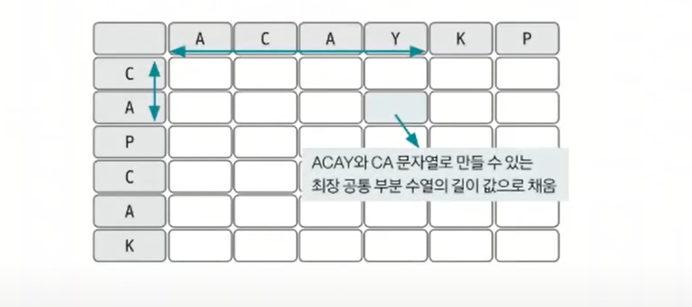
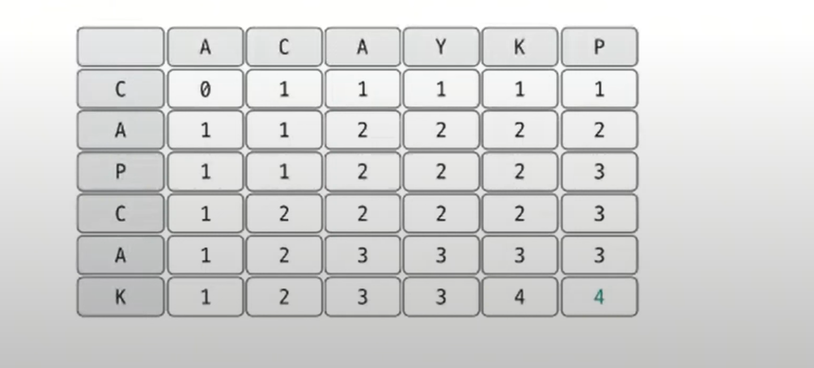
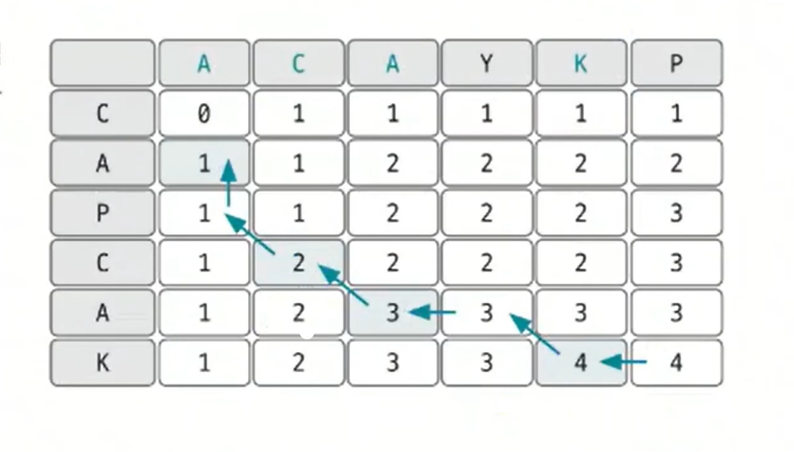

# 동적 계획법 예제 - 7

### [문제(백준(9252번 - LCS 2))](https://www.acmicpc.net/problem/9252)

### 문제 분석
- LCS(`longest common subsequence`)는 문자열을 이용한 대표적인 동적 계획법 문제이다.
- 이러한 종류의 문제를 풀기 위해서는 각 문자열을 축으로 하는 2차원 리스트를 생성해야 한다.



- 이 2차원 리스트 자체가 `dp` 테이블이 된다.

### 손으로 풀어보기
1. **LCS 점화식을 이용해 값을 채운다. 특정 자리가 가리키는 행과 열의 문자열값을 비교해 값이 같으면 테이블의 대각선 왼쪽 위의 값에 1을 더한 값을 저장한다.**
   - `dp[i][j]` = `dp[i - 1][j - 1] + 1`
   - **비교한 값이 다르면 테이블의 왼쪽과 위쪽 값 중 큰 값을 선택해 저장한다.**
   - `dp[i][j]` = `max(dp[i - 1][j], dp[i][j - 1])`

위에서 세운 점화식으로 테이블을 채우면 다음과 같이 나타낼 수 있다.



2. **LCS 정답을 출력한다.**
   - 먼저 마지막부터 탐색을 수행한다.(재귀 형태)
   - 해당 자리에 있는 인덱스 문자열 값을 비교해 값이 같으면 LCS에 해당하는 문자로 기록하고, 왼쪽 대각선 위로 이동한다.
   - 비교한 값이 다르면 테이블의 왼쪽과 위쪽 값 중 큰 값으로 이동한다.



### 슈도코드
```text
A(1번째 문자열)
B(2번째 문자열)
dp(2차원 테이블)
result(LCS 저장 리스트)

for i 1~A 길이:
    for j 1~B 길이:
        A[i]와 B[i]가 같으면 dp[i][j]의 값을 왼쪽 대각선 값 +1 로 저장
        다른 경우에는 왼쪽과 위쪽 값 중 더 큰값으로 dp[i][j]에 저장

dp의 마지막 값 출력(LCS의 길이)

getText(row, col):  # 재귀 형태로
    if A[row]와 B[col]이 같으면: 
        result에 현재 문자열 값 기록하고 대각선 왼쪽 위로 이동
        getText(row -1, col - 1)    # 재귀 호출
    
    else:   # 문자열값이 다르면
        왼쪽 값과 위쪽 값 중 더 큰 값으로 이동
        getText(row - 1, col) 또는 getText(row, col - 1)

getText(A 길이, B 길이)

result 출력
```

### 코드 구현 - 파이썬
```python
import sys

input = sys.stdin.readline
sys.setrecursionlimit(10 ** 6)

A = list(input())
B = list(input())

A.pop()  # "\n" 문자열 제거
B.pop()  # "\n" 문자열 제거

dp = [[0 for _ in range(len(B) + 1)] for _ in range(len(A) + 1)]
result = []

for i in range(1, len(A) + 1):
    for j in range(1, len(B) + 1):
        if A[i - 1] == B[j - 1]:
            dp[i][j] = dp[i - 1][j - 1] + 1
        else:
            dp[i][j] = max(dp[i - 1][j], dp[i][j - 1])

print(dp[len(A)][len(B)])


def getText(row, col):
    if row == 0 or col == 0:
        return

    if A[row - 1] == B[col - 1]:
        result.append(A[row - 1])  # 둘은 같으니 A[row-1]이나 B[col-1]중 아무거나 저장해도 됨
        getText(row - 1, col - 1)
    else:
        if dp[row - 1][col] > dp[row][col - 1]:  # 왼쪽 값이랑 위쪽 값 중 더 큰 값으로 이동
            getText(row - 1, col)
        else:
            getText(row, col - 1)


getText(len(A), len(B))

# for i in range(len(result) - 1, -1, -1):
#     print(result.pop(i), end='')

for _ in range(len(result)):
    print(result.pop(), end='')
```

### 코드 구현 - 자바
```java
import java.io.BufferedReader;
import java.io.IOException;
import java.io.InputStreamReader;
import java.util.Stack;

public class Main {

    static char[] A;
    static char[] B;
    static Stack<Character> result = new Stack<>();
    static int[][] dp;

    public static void main(String[] args) throws IOException {
        BufferedReader br = new BufferedReader(new InputStreamReader(System.in));

        A = br.readLine().toCharArray();
        B = br.readLine().toCharArray();
        int lenA = A.length;
        int lenB = B.length;

        dp = new int[lenA + 1][lenB + 1];

        for (int i = 1; i <= lenA; i++) {
            for (int j = 1; j <= lenB; j++) {
                if (A[i - 1] == B[j - 1]) {
                    dp[i][j] = dp[i - 1][j - 1] + 1;
                } else {
                    dp[i][j] = Math.max(dp[i - 1][j], dp[i][j - 1]);
                }
            }
        }

        System.out.println(dp[lenA][lenB]);

        getText(lenA, lenB);

        StringBuilder sb = new StringBuilder();
        while (!result.isEmpty()) {
            sb.append(result.pop());
        }
        
        System.out.println(sb);
    }

    private static void getText(int row, int col) {
        if (row == 0 || col == 0) {
            return;
        }

        if (A[row - 1] == B[col - 1]) {
            result.push(A[row - 1]);
            getText(row - 1, col - 1);
        } else {
            if (dp[row - 1][col] > dp[row][col - 1]) {
                getText(row - 1, col);
            } else {
                getText(row, col - 1);
            }
        }
    }
}
```