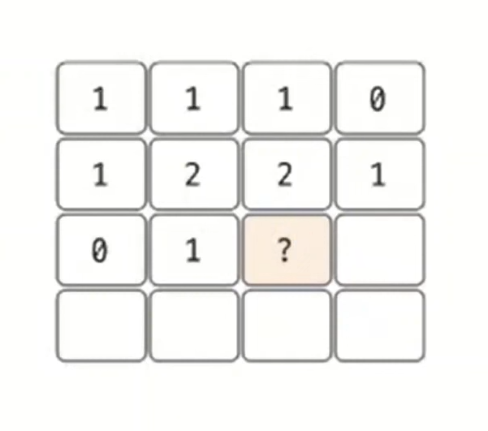
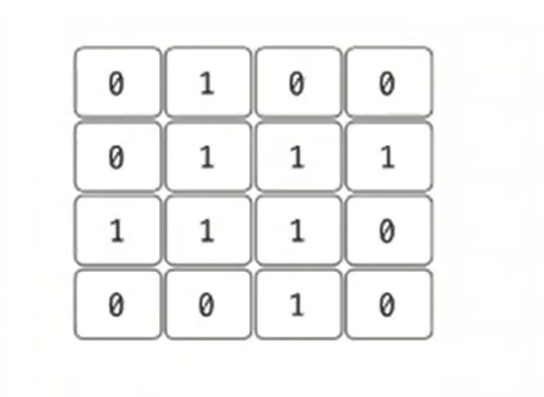

# 동적 계획법 예제 - 8

### [문제(백준(1915번 - 가장 큰 정사각형))](https://www.acmicpc.net/problem/1915)

### 문제 분석
- 가장 큰 정사각형의 넓이를 구하는 것은 가장 큰 정사각형의 한 변의 길이를 구한다는 것과 동일하다.
- 따라서 변의 길이를 `dp[i][j]`로 정의할 수 있다.
- **점화식 정의**
  - `dp[i][j]` = `(i, j)`의 위치를 오른쪽 아래 꼭짓점으로 정하고, 해당 자리에서 그릴 수 있는 가장 큰 정사각형의 한 변의 길이
- 이렇게 정의하면 dp 테이블을 채우는 방식, 즉 점화식 아이디어를 생각할 수 있다.
- 다음 그림에서 물음표 위치의 원래 값이 1일 경우, 이 위치에서 위, 왼쪽, 대각선 왼쪽 위에 있는 값 중 가장 작은 값에 1을 더한 값으로 변경한다.
- 원래 값이 0일 경우는 생각하지 않는다.



### 손으로 풀어보기
1. **dp 테이블의 값을 초기화한다.**



2. **점화식을 이용해 dp 테이블의 값을 새로 채운다.**
   - `dp[i][j]` = `min(dp[i - 1][j - 1], dp[i - 1][j], dp[i][j - 1])` => 현재 자리의 값이 1일 경우
   - `dp[i][j]` = 0 => 현재 자리의 값이 0일 경우


3. **dp 테이블 중 가장 큰 값의 제곱이 최대 정사각형의 넓이이다.**

### 슈도코드
```text
dp[i][j]    # (i, j) 위치에서 왼쪽 위로 만들 수 있는 최대 정사각형 길이 저장)
n(세로)
m(가로)
max(한 변의 최대 길이 저장)

for i n:
    dp 테이블 데이터 저장
    
for i n번:
    for j m번:
        if dp[i][j]의 값이 1이면:
            현재 위치에서 왼쪽, 위쪽 대각선 왼쪽 중 가장 작은 값에 1을 더한 값을 현재 위치에 저장
        
        max 값 갱신

max 제곱 출력
```

### 코드 구현 - 파이썬
```python
import sys

input = sys.stdin.readline
n, m = map(int, input().split())
dp = [[0 for _ in range(1001)] for _ in range(1001)]

for i in range(n):
    data = list(input().strip())  # strip() : 공백 제거
    dp[i] = [int(x) for x in data]

Max = -sys.maxsize

for i in range(n):
    for j in range(m):
        if int(dp[i][j]) == 1 and i > 0 and j > 0:
            dp[i][j] = min(dp[i - 1][j], dp[i][j - 1], dp[i - 1][j - 1]) + 1

        Max = max(Max, dp[i][j])

print(Max * Max)
```

### 코드 구현 - 자바
```java
import java.io.BufferedReader;
import java.io.IOException;
import java.io.InputStreamReader;
import java.util.Stack;
import java.util.StringTokenizer;

public class Main {


    public static void main(String[] args) throws IOException {
        BufferedReader br = new BufferedReader(new InputStreamReader(System.in));

        StringTokenizer st = new StringTokenizer(br.readLine());
        int n = Integer.parseInt(st.nextToken());
        int m = Integer.parseInt(st.nextToken());
        long[][] dp = new long[1001][1001];

        for (int i = 0; i < n; i++) {
            String[] data = br.readLine().split("");
            for (int j = 0; j < m; j++) {
                dp[i][j] = Integer.parseInt(data[j]);
            }
        }

        long max = Integer.MIN_VALUE;
        for (int i = 0; i < n; i++) {
            for (int j = 0; j < m; j++) {
                if (dp[i][j] == 1 && i > 0 && j > 0) {
                    dp[i][j] = Math.min(Math.min(dp[i][j - 1], dp[i - 1][j]), dp[i - 1][j - 1]) + 1;
                }
                max = Math.max(max, dp[i][j]);
            }
        }
        System.out.println(max * max);
    }
}
```